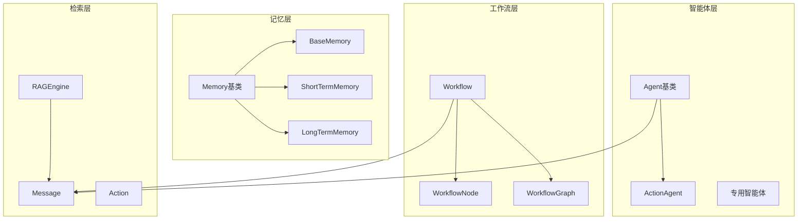

# API参考

<cite>
**本文档中引用的文件**
- [Agent.java](file://evox-agents/src/main/java/io/leavesfly/evox/agents/base/Agent.java)
- [Workflow.java](file://evox-workflow/src/main/java/io/leavesfly/evox/workflow/base/Workflow.java)
- [RAGEngine.java](file://evox-rag/src/main/java/io/leavesfly/evox/rag/RAGEngine.java)
- [Message.java](file://evox-core/src/main/java/io/leavesfly/evox/core/message/Message.java)
- [Memory.java](file://evox-memory/src/main/java/io/leavesfly/evox/memory/base/Memory.java)
- [BaseMemory.java](file://evox-memory/src/main/java/io/leavesfly/evox/memory/base/BaseMemory.java)
- [WorkflowNode.java](file://evox-workflow/src/main/java/io/leavesfly/evox/workflow/base/WorkflowNode.java)
- [Action.java](file://evox-actions/src/main/java/io/leavesfly/evox/actions/base/Action.java)
- [BaseModule.java](file://evox-core/src/main/java/io/leavesfly/evox/core/module/BaseModule.java)
- [MessageType.java](file://evox-core/src/main/java/io/leavesfly/evox/core/message/MessageType.java)
- [ActionAgent.java](file://evox-agents/src/main/java/io/leavesfly/evox/agents/specialized/ActionAgent.java)
- [WorkflowGraph.java](file://evox-workflow/src/main/java/io/leavesfly/evox/workflow/graph/WorkflowGraph.java)
- [ShortTermMemory.java](file://evox-memory/src/main/java/io/leavesfly/evox/memory/shortterm/ShortTermMemory.java)
- [LongTermMemory.java](file://evox-memory/src/main/java/io/leavesfly/evox/memory/longterm/LongTermMemory.java)
</cite>

## 目录
1. [简介](#简介)
2. [核心架构概览](#核心架构概览)
3. [Agent类API](#agent类api)
4. [Workflow类API](#workflow类api)
5. [RAGEngine类API](#rageengine类api)
6. [Message类API](#message类api)
7. [Memory类API](#memory类api)
8. [WorkflowNode类API](#workflownode类api)
9. [Action类API](#action类api)
10. [BaseModule类API](#basemodule类api)
11. [异常处理](#异常处理)
12. [最佳实践](#最佳实践)

## 简介

EvoX是一个强大的AI工作流框架，提供了完整的智能体、工作流、记忆和检索系统。本文档详细介绍了EvoX的核心API，帮助开发者理解和使用框架的各种组件。

## 核心架构概览

EvoX采用模块化设计，主要包含以下核心组件：



**图表来源**
- [Agent.java](file://evox-agents/src/main/java/io/leavesfly/evox/agents/base/Agent.java#L28-L152)
- [Workflow.java](file://evox-workflow/src/main/java/io/leavesfly/evox/workflow/base/Workflow.java#L29-L206)
- [RAGEngine.java](file://evox-rag/src/main/java/io/leavesfly/evox/rag/RAGEngine.java#L30-L269)

## Agent类API

Agent是EvoX中所有智能体的基础抽象类，提供了统一的智能体接口。

### 构造方法

Agent类提供了灵活的构造方式：

| 构造方法 | 描述 | 参数 |
|---------|------|------|
| `Agent()` | 无参构造函数 | 兼容Lombok SuperBuilder和直接实例化 |
| `Agent(name, description, llmConfig)` | 带基本属性的构造函数 | 智能体名称、描述、LLM配置 |

### 核心方法

#### execute方法

```java
public abstract Message execute(String actionName, List<Message> messages)
```

**参数说明：**
- `actionName`: 要执行的动作名称
- `messages`: 输入消息列表

**返回值：**
- 返回执行结果的消息对象

**异常：**
- 抛出具体实现类的特定异常

#### addAction方法

```java
public void addAction(Action action)
```

**参数说明：**
- `action`: 要添加的动作实例

**功能：**
- 将动作添加到智能体的动作列表中
- 自动更新动作映射表
- 支持动态添加动作

#### removeAction方法

```java
public void removeAction(String actionName)
```

**参数说明：**
- `actionName`: 要移除的动作名称

**功能：**
- 从智能体中移除指定动作
- 更新内部动作映射表

#### getAction方法

```java
public Action getAction(String actionName)
```

**参数说明：**
- `actionName`: 动作名称

**返回值：**
- 返回对应的动作实例，如果不存在则返回null

### 属性说明

| 属性名 | 类型 | 描述 |
|--------|------|------|
| `agentId` | String | 智能体唯一标识符（UUID自动生成） |
| `name` | String | 智能体名称 |
| `description` | String | 智能体描述 |
| `llmConfig` | LLMConfig | LLM配置信息 |
| `systemPrompt` | String | 系统提示词 |
| `actions` | List<Action> | 可用动作列表 |
| `isHuman` | boolean | 是否为人类用户 |

**节来源**
- [Agent.java](file://evox-agents/src/main/java/io/leavesfly/evox/agents/base/Agent.java#L28-L152)

## Workflow类API

Workflow类是EvoX工作流系统的核心，负责管理和执行复杂的工作流程。

### 构造方法

```java
public Workflow()
```

**功能：**
- 创建新的工作流实例
- 自动生成唯一的工作流ID
- 初始化默认配置

### 核心方法

#### execute方法

```java
public String execute(Map<String, Object> inputs)
```

**参数说明：**
- `inputs`: 输入参数映射

**返回值：**
- 返回执行结果的字符串表示

**异常：**
- `IllegalStateException`: 工作流图不能为空
- `RuntimeException`: 工作流执行失败

#### executeAsync方法

```java
public Mono<String> executeAsync(Map<String, Object> inputs)
```

**参数说明：**
- `inputs`: 输入参数映射

**返回值：**
- 返回Mono包装的执行结果

**功能：**
- 异步执行工作流
- 支持响应式编程模式

#### getStatus方法

```java
public WorkflowStatus getStatus()
```

**返回值：**
- 返回工作流状态枚举：
  - `PENDING`: 待执行
  - `RUNNING`: 运行中
  - `COMPLETED`: 已完成
  - `FAILED`: 失败

#### getProgress方法

```java
public double getProgress()
```

**返回值：**
- 返回执行进度百分比（0.0-100.0）

#### reset方法

```java
public void reset()
```

**功能：**
- 重置工作流状态
- 用于重新执行工作流

### 内部类和枚举

#### WorkflowStatus枚举

```java
public enum WorkflowStatus {
    PENDING,      // 待执行
    RUNNING,      // 运行中
    COMPLETED,    // 已完成
    FAILED        // 失败
}
```

### 属性说明

| 属性名 | 类型 | 描述 |
|--------|------|------|
| `workflowId` | String | 工作流唯一标识符 |
| `name` | String | 工作流名称 |
| `graph` | WorkflowGraph | 工作流图 |
| `llm` | BaseLLM | LLM模型（可选） |
| `agentManager` | AgentManager | 智能体管理器（可选） |
| `workflowVersion` | Integer | 工作流版本，默认1 |
| `maxExecutionSteps` | int | 最大执行步数，默认100 |

**节来源**
- [Workflow.java](file://evox-workflow/src/main/java/io/leavesfly/evox/workflow/base/Workflow.java#L29-L206)

## RAGEngine类API

RAGEngine是EvoX的检索增强生成系统核心，提供文档索引、检索和管理功能。

### 构造方法

#### 基础构造函数

```java
public RAGEngine(RAGConfig config, EmbeddingService embeddingService, VectorStore vectorStore)
```

#### 完整构造函数

```java
public RAGEngine(RAGConfig config, DocumentReader reader, 
                 EmbeddingService embeddingService, VectorStore vectorStore)
```

**参数说明：**
- `config`: RAG配置
- `reader`: 文档读取器（可选，默认UniversalDocumentReader）
- `embeddingService`: 嵌入服务
- `vectorStore`: 向量存储

### 核心方法

#### indexDocument方法

```java
public int indexDocument(Document document)
```

**参数说明：**
- `document`: 要索引的文档

**返回值：**
- 返回生成的分块数量

**功能：**
- 索引单个文档
- 包含分块、嵌入向量生成、存储到向量数据库的完整流程

#### indexDocuments方法

```java
public int indexDocuments(List<Document> documents)
```

**参数说明：**
- `documents`: 文档列表

**返回值：**
- 返回总分块数量

**功能：**
- 批量索引文档
- 支持错误处理和日志记录

#### retrieve方法

```java
public RetrievalResult retrieve(String queryText)
public RetrievalResult retrieve(String queryText, int topK)
public RetrievalResult retrieve(Query query)
```

**参数说明：**
- `queryText`: 查询文本
- `topK`: 返回结果数量（可选，默认配置值）
- `query`: 查询对象

**返回值：**
- 返回检索结果对象

**功能：**
- 检索相关文档
- 支持多种查询方式

#### deleteDocument方法

```java
public boolean deleteDocument(String documentId)
```

**参数说明：**
- `documentId`: 文档ID

**返回值：**
- 返回删除是否成功

**功能：**
- 删除指定文档

#### clear方法

```java
public void clear()
```

**功能：**
- 清空所有索引数据

#### getIndexedChunkCount方法

```java
public int getIndexedChunkCount()
```

**返回值：**
- 返回已索引的分块数量

#### save/load方法

```java
public void save(String path)
public void load(String path)
```

**参数说明：**
- `path`: 保存/加载路径

**功能：**
- 保存索引到磁盘
- 从磁盘加载索引

### 属性说明

| 属性名 | 类型 | 描述 |
|--------|------|------|
| `config` | RAGConfig | RAG配置 |
| `reader` | DocumentReader | 文档读取器 |
| `chunker` | Chunker | 分块器 |
| `embeddingService` | EmbeddingService | 嵌入服务 |
| `vectorStore` | VectorStore | 向量存储 |
| `retriever` | Retriever | 检索器 |

**节来源**
- [RAGEngine.java](file://evox-rag/src/main/java/io/leavesfly/evox/rag/RAGEngine.java#L30-L269)

## Message类API

Message类用于在智能体、工作流和动作之间传递信息，是EvoX通信系统的核心。

### 构造方法

#### 基础构造函数

```java
public Message()
```

#### Builder模式构造函数

```java
public static Message inputMessage(Object content)
public static Message outputMessage(Object content)
public static Message responseMessage(Object content, String agent, String action)
public static Message errorMessage(String errorMsg)
public static Message systemMessage(String content)
```

### 核心方法

#### 静态工厂方法

| 方法名 | 功能 | 参数 |
|--------|------|------|
| `inputMessage` | 创建输入消息 | content: 消息内容 |
| `outputMessage` | 创建输出消息 | content: 消息内容 |
| `responseMessage` | 创建响应消息 | content, agent, action |
| `errorMessage` | 创建错误消息 | errorMsg: 错误信息 |
| `systemMessage` | 创建系统消息 | content: 消息内容 |

### 属性说明

| 属性名 | 类型 | 描述 |
|--------|------|------|
| `messageId` | String | 消息唯一标识符（UUID自动生成） |
| `content` | Object | 消息内容（支持多种类型） |
| `messageType` | MessageType | 消息类型 |
| `agent` | String | 发送智能体名称 |
| `action` | String | 执行的动作名称 |
| `prompt` | String | 使用的提示词 |
| `timestamp` | Instant | 时间戳 |
| `workflowGoal` | String | 工作流目标 |
| `workflowTask` | String | 工作流任务 |
| `workflowTaskDesc` | String | 任务描述 |
| `nextActions` | List<String> | 下一步动作列表 |

### MessageType枚举

```java
public enum MessageType {
    INPUT,      // 输入消息
    OUTPUT,     // 输出消息
    RESPONSE,   // 响应消息
    ERROR,      // 错误消息
    SYSTEM,     // 系统消息
    UNKNOWN     // 未知类型
}
```

**节来源**
- [Message.java](file://evox-core/src/main/java/io/leavesfly/evox/core/message/Message.java#L24-L136)
- [MessageType.java](file://evox-core/src/main/java/io/leavesfly/evox/core/message/MessageType.java#L9-L40)

## Memory类API

Memory类提供了记忆系统的抽象基类，支持短期和长期记忆的不同实现。

### BaseMemory类API

BaseMemory是基础记忆类，提供消息存储、检索和过滤的核心功能。

#### 构造方法

```java
public BaseMemory()
public BaseMemory(String memoryId, Integer capacity)
```

#### 核心方法

##### addMessage方法

```java
public void addMessage(Message message)
```

**参数说明：**
- `message`: 要添加的消息

**功能：**
- 添加单个消息到记忆
- 自动更新索引
- 支持容量限制

##### addMessages方法

```java
public void addMessages(List<Message> messages)
```

**参数说明：**
- `messages`: 要添加的消息列表

**功能：**
- 批量添加消息

##### removeMessage方法

```java
public void removeMessage(Message message)
```

**参数说明：**
- `message`: 要移除的消息

**功能：**
- 从记忆中移除指定消息
- 同时从索引中移除

##### get方法

```java
public List<Message> get(Integer n)
public List<Message> getAll()
```

**参数说明：**
- `n`: 获取的消息数量限制（null表示全部）

**返回值：**
- 返回消息列表

##### getByAction方法

```java
public List<Message> getByAction(String action, Integer n)
public List<Message> getByActions(List<String> actions, Integer n)
```

**参数说明：**
- `action`: 动作名称
- `actions`: 动作名称列表
- `n`: 获取的数量限制

**返回值：**
- 返回按动作筛选的消息列表

##### getByWorkflowGoal方法

```java
public List<Message> getByWorkflowGoal(String workflowGoal, Integer n)
public List<Message> getByWorkflowGoals(List<String> workflowGoals, Integer n)
```

**参数说明：**
- `workflowGoal`: 工作流目标
- `workflowGoals`: 工作流目标列表
- `n`: 获取的数量限制

**返回值：**
- 返回按工作流目标筛选的消息列表

##### 其他方法

| 方法名 | 功能 | 返回值 |
|--------|------|-------|
| `size()` | 获取消息数量 | int |
| `clear()` | 清空所有消息 | void |
| `getLastMessage()` | 获取最后一条消息 | Message |
| `isEmpty()` | 检查是否为空 | boolean |

### ShortTermMemory类API

ShortTermMemory是短期记忆的具体实现，存储工作流执行过程中的临时消息。

#### 构造方法

```java
public ShortTermMemory()
public ShortTermMemory(int maxMessages)
```

#### 核心方法

##### resize方法

```java
public void resize(int newMaxSize)
```

**参数说明：**
- `newMaxSize`: 新的最大大小

**功能：**
- 调整记忆容量
- 自动移除多余消息

##### getMessagesByAgent方法

```java
public List<Message> getMessagesByAgent(String agentName)
```

**参数说明：**
- `agentName`: 智能体名称

**返回值：**
- 返回按智能体筛选的消息列表

##### getMessagesByAction方法

```java
public List<Message> getMessagesByAction(String actionName)
```

**参数说明：**
- `actionName`: 动作名称

**返回值：**
- 返回按动作筛选的消息列表

### LongTermMemory类API

LongTermMemory是长期记忆的具体实现，使用向量存储持久化保存历史消息。

#### 构造方法

```java
public LongTermMemory(VectorStore vectorStore, EmbeddingService embeddingService)
```

#### 核心方法

##### storeMessage方法

```java
public void storeMessage(Message message)
```

**参数说明：**
- `message`: 要存储的消息

**功能：**
- 将消息存储到长期记忆
- 转换为向量并存储到向量数据库

##### storeMessages方法

```java
public void storeMessages(List<Message> messages)
```

**参数说明：**
- `messages`: 要存储的消息列表

**功能：**
- 批量存储消息

##### searchSimilar方法

```java
public List<Message> searchSimilar(String query, int topK)
```

**参数说明：**
- `query`: 查询文本
- `topK`: 返回结果数量

**返回值：**
- 返回相似消息列表

### 属性说明

| 属性名 | 类型 | 描述 |
|--------|------|------|
| `memoryId` | String | 记忆唯一标识符 |
| `capacity` | Integer | 容量限制（null表示无限制） |
| `maxMessages` | int | 最大消息数量（ShortTermMemory特有） |
| `messages` | List<Message> | 消息列表 |
| `byAction` | Map<String, List<Message>> | 按动作索引的消息 |
| `byWorkflowGoal` | Map<String, List<Message>> | 按工作流目标索引的消息 |

**节来源**
- [Memory.java](file://evox-memory/src/main/java/io/leavesfly/evox/memory/base/Memory.java#L11-L18)
- [BaseMemory.java](file://evox-memory/src/main/java/io/leavesfly/evox/memory/base/BaseMemory.java#L23-L290)
- [ShortTermMemory.java](file://evox-memory/src/main/java/io/leavesfly/evox/memory/shortterm/ShortTermMemory.java#L24-L237)
- [LongTermMemory.java](file://evox-memory/src/main/java/io/leavesfly/evox/memory/longterm/LongTermMemory.java#L21-L155)

## WorkflowNode类API

WorkflowNode代表工作流中的一个任务或步骤，支持多种节点类型和执行策略。

### 构造方法

```java
public WorkflowNode()
```

### 核心方法

#### 状态管理方法

##### markReady方法

```java
public void markReady()
```

**功能：**
- 标记节点为就绪状态

##### markRunning方法

```java
public void markRunning()
```

**功能：**
- 标记节点为运行状态

##### markCompleted方法

```java
public void markCompleted(Object result)
```

**参数说明：**
- `result`: 执行结果

**功能：**
- 标记节点为完成状态

##### markFailed方法

```java
public void markFailed(String errorMessage)
```

**参数说明：**
- `errorMessage`: 错误信息

**功能：**
- 标记节点为失败状态

#### 条件判断方法

| 方法名 | 功能 | 返回值 |
|--------|------|-------|
| `isCompleted()` | 检查是否已完成 | boolean |
| `isFailed()` | 检查是否失败 | boolean |
| `isReady()` | 检查是否可以执行 | boolean |

#### 边管理方法

##### addPredecessor方法

```java
public void addPredecessor(String nodeId)
```

**参数说明：**
- `nodeId`: 前置节点ID

**功能：**
- 添加前置节点

##### addSuccessor方法

```java
public void addSuccessor(String nodeId)
```

**参数说明：**
- `nodeId`: 后继节点ID

**功能：**
- 添加后继节点

### 属性说明

| 属性名 | 类型 | 描述 |
|--------|------|------|
| `nodeId` | String | 节点唯一标识符 |
| `name` | String | 节点名称 |
| `description` | String | 节点描述 |
| `nodeType` | NodeType | 节点类型 |
| `predecessors` | List<String> | 前置节点ID列表 |
| `successors` | List<String> | 后继节点ID列表 |
| `state` | NodeState | 节点状态 |
| `result` | Object | 执行结果 |
| `errorMessage` | String | 错误信息 |

### 枚举类型

#### NodeType枚举

```java
public enum NodeType {
    ACTION,        // 动作节点
    DECISION,      // 决策节点
    PARALLEL,      // 并行节点
    LOOP,          // 循环节点
    SUBWORKFLOW    // 子工作流节点
}
```

#### NodeState枚举

```java
public enum NodeState {
    PENDING,       // 待处理
    READY,         // 就绪
    RUNNING,       // 运行中
    COMPLETED,     // 已完成
    FAILED,        // 失败
    SKIPPED        // 已跳过
}
```

#### ParallelStrategy枚举

```java
public enum ParallelStrategy {
    ALL,           // 等待所有节点完成
    ANY,           // 任意一个节点完成即可
    FIRST          // 第一个完成的节点
}
```

**节来源**
- [WorkflowNode.java](file://evox-workflow/src/main/java/io/leavesfly/evox/workflow/base/WorkflowNode.java#L21-L325)

## Action类API

Action类是所有动作的基础抽象类，定义了动作的基本接口和行为。

### 构造方法

```java
public Action()
```

### 核心方法

#### execute方法

```java
public abstract ActionOutput execute(ActionInput input)
```

**参数说明：**
- `input`: 动作输入参数

**返回值：**
- 返回动作输出结果

**功能：**
- 同步执行动作

#### executeAsync方法

```java
public Mono<ActionOutput> executeAsync(ActionInput input)
```

**参数说明：**
- `input`: 动作输入参数

**返回值：**
- 返回Mono包装的动作输出结果

**功能：**
- 异步执行动作

#### 参数管理方法

##### getInputFields方法

```java
public abstract String[] getInputFields()
```

**返回值：**
- 返回输入字段名称数组

**功能：**
- 获取动作的输入字段列表

##### getOutputFields方法

```java
public abstract String[] getOutputFields()
```

**返回值：**
- 返回输出字段名称数组

**功能：**
- 获取动作的输出字段列表

### 属性说明

| 属性名 | 类型 | 描述 |
|--------|------|------|
| `name` | String | 动作名称 |
| `description` | String | 动作描述 |
| `llm` | BaseLLM | 语言模型实例（transient） |

**节来源**
- [Action.java](file://evox-actions/src/main/java/io/leavesfly/evox/actions/base/Action.java#L23-L72)

## BaseModule类API

BaseModule是所有模块的基础抽象类，提供序列化、持久化等通用能力。

### 构造方法

```java
public BaseModule()
```

### 核心方法

#### 序列化方法

##### toDict方法

```java
public Map<String, Object> toDict()
```

**返回值：**
- 返回模块的Map表示

**功能：**
- 将模块转换为字典格式

##### toJson方法

```java
public String toJson()
```

**返回值：**
- 返回模块的JSON字符串表示

**功能：**
- 将模块转换为JSON格式

##### toPrettyJson方法

```java
public String toPrettyJson()
```

**返回值：**
- 返回格式化的JSON字符串

**功能：**
- 将模块转换为格式化的JSON

#### 反序列化方法

##### fromDict方法

```java
public static <T extends BaseModule> T fromDict(Map<String, Object> data, Class<T> clazz)
```

**参数说明：**
- `data`: 数据Map
- `clazz`: 目标类类型

**返回值：**
- 返回反序列化后的实例

**功能：**
- 从Map创建模块实例

##### fromJson方法

```java
public static <T extends BaseModule> T fromJson(String json, Class<T> clazz)
```

**参数说明：**
- `json`: JSON字符串
- `clazz`: 目标类类型

**返回值：**
- 返回反序列化后的实例

**功能：**
- 从JSON字符串创建模块实例

#### 持久化方法

##### saveModule方法

```java
public void saveModule(Path filePath)
```

**参数说明：**
- `filePath`: 文件路径

**功能：**
- 将模块保存到文件

##### loadModule方法

```java
public static <T extends BaseModule> T loadModule(Path filePath, Class<T> clazz)
```

**参数说明：**
- `filePath`: 文件路径
- `clazz`: 目标类类型

**返回值：**
- 返回加载的模块实例

**功能：**
- 从文件加载模块

#### 其他方法

##### copy方法

```java
public <T extends BaseModule> T copy()
```

**返回值：**
- 返回模块的副本

**功能：**
- 复制当前模块

### 属性说明

| 属性名 | 类型 | 描述 |
|--------|------|------|
| `className` | String | 类名标识 |
| `version` | Integer | 版本号 |

**节来源**
- [BaseModule.java](file://evox-core/src/main/java/io/leavesfly/evox/core/module/BaseModule.java#L28-L196)

## 异常处理

EvoX框架提供了完善的异常处理机制，主要异常类型包括：

### 核心异常类

| 异常类 | 使用场景 | 处理建议 |
|--------|----------|----------|
| `IllegalStateException` | 工作流图验证失败、状态不合法 | 检查工作流配置和状态 |
| `IllegalArgumentException` | 参数无效、节点不存在 | 验证输入参数和节点ID |
| `RuntimeException` | 通用运行时异常 | 检查具体实现逻辑 |
| `JsonProcessingException` | JSON序列化/反序列化失败 | 检查数据格式 |

### 异常处理最佳实践

1. **工作流异常处理**
   ```java
   try {
       workflow.execute(inputs);
   } catch (IllegalStateException e) {
       log.error("工作流配置错误: {}", e.getMessage());
       // 重新配置工作流
   } catch (RuntimeException e) {
       log.error("工作流执行失败: {}", e.getMessage());
       // 重试或回滚
   }
   ```

2. **智能体异常处理**
   ```java
   try {
       Message result = agent.execute(actionName, messages);
   } catch (Exception e) {
       log.error("智能体执行失败: {}", e.getMessage());
       return Message.errorMessage("执行失败: " + e.getMessage());
   }
   ```

3. **记忆系统异常处理**
   ```java
   try {
       memory.addMessage(message);
   } catch (Exception e) {
       log.warn("记忆存储失败，尝试清理空间: {}", e.getMessage());
       // 清理旧消息或调整容量
   }
   ```

## 最佳实践

### 1. 智能体开发最佳实践

- **动作管理**: 使用`addAction`和`removeAction`动态管理动作
- **错误处理**: 在`execute`方法中妥善处理异常
- **性能优化**: 合理设置`maxExecutionSteps`避免无限循环

### 2. 工作流设计最佳实践

- **节点设计**: 每个节点应该有明确的职责和边界
- **状态管理**: 正确使用节点状态管理执行流程
- **错误恢复**: 实现适当的错误处理和恢复机制

### 3. 记忆系统使用最佳实践

- **容量控制**: 合理设置记忆容量，避免内存溢出
- **索引优化**: 利用消息索引提高检索效率
- **持久化**: 定期保存长期记忆到持久化存储

### 4. RAG系统使用最佳实践

- **文档预处理**: 在索引前对文档进行适当的预处理
- **检索优化**: 根据需求调整`topK`和相似度阈值
- **向量存储**: 选择合适的向量存储方案

### 5. 模块化开发最佳实践

- **继承层次**: 合理设计继承层次，避免过度复杂
- **序列化**: 正确处理序列化和反序列化
- **资源管理**: 及时释放不需要的资源

通过遵循这些最佳实践，可以充分发挥EvoX框架的能力，构建高效、可靠的AI应用系统。