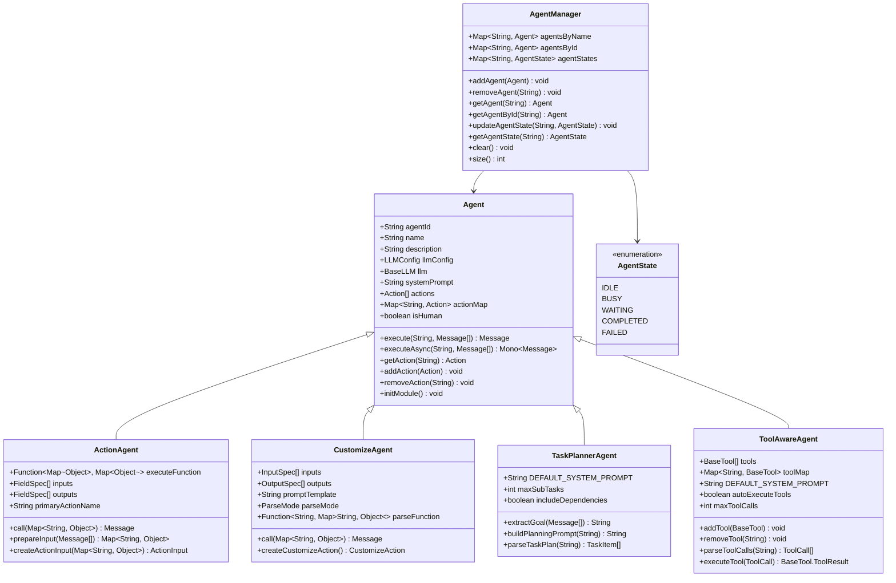
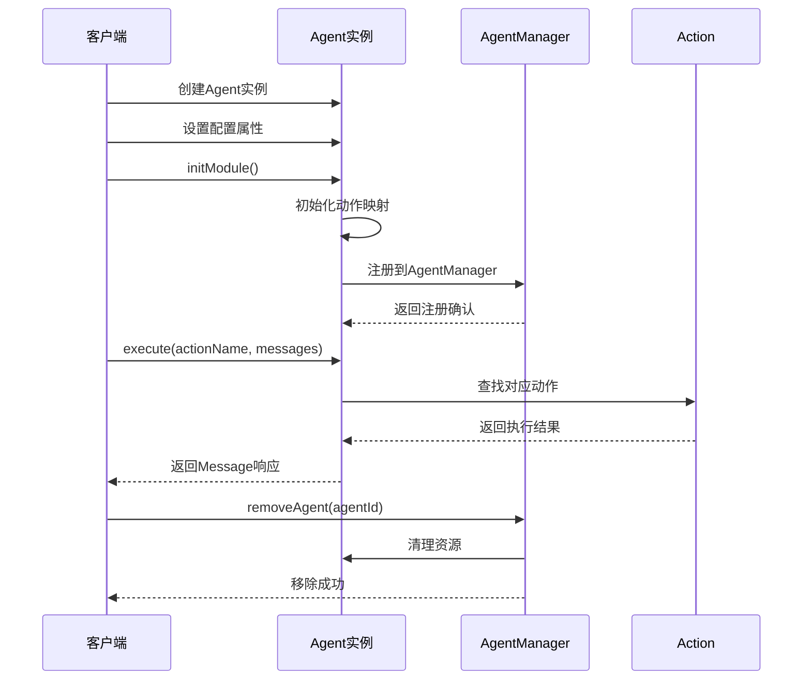
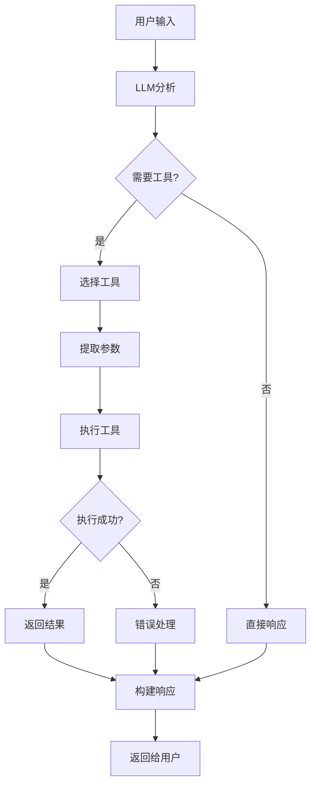
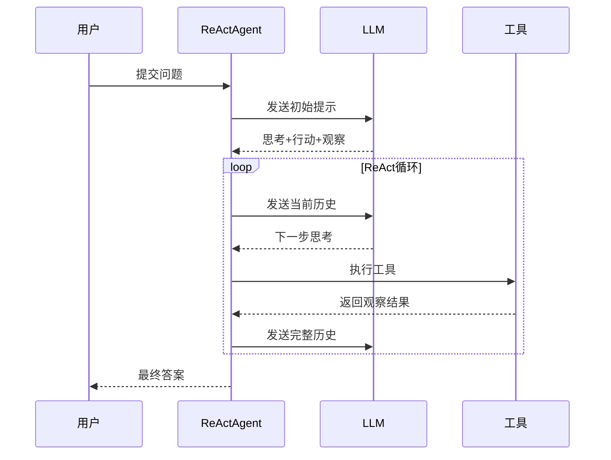
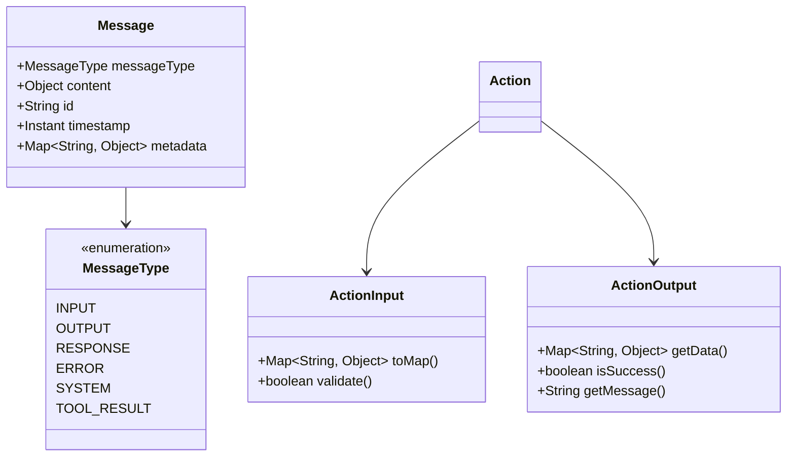

# Agent API 详细文档

<cite>
**本文档引用的文件**
- [Agent.java](file://evox-agents/src/main/java/io/leavesfly/evox/agents/base/Agent.java)
- [ActionAgent.java](file://evox-agents/src/main/java/io/leavesfly/evox/agents/action/ActionAgent.java)
- [CustomizeAgent.java](file://evox-agents/src/main/java/io/leavesfly/evox/agents/customize/CustomizeAgent.java)
- [AgentManager.java](file://evox-agents/src/main/java/io/leavesfly/evox/agents/manager/AgentManager.java)
- [AgentState.java](file://evox-agents/src/main/java/io/leavesfly/evox/agents/manager/AgentState.java)
- [ActionAgentExample.java](file://evox-examples/src/main/java/io/leavesfly/evox/examples/ActionAgentExample.java)
- [CustomizeAgentExample.java](file://evox-examples/src/main/java/io/leavesfly/evox/examples/CustomizeAgentExample.java)
- [SpecializedAgentsExample.java](file://evox-examples/src/main/java/io/leavesfly/evox/examples/SpecializedAgentsExample.java)
- [ToolsExample.java](file://evox-examples/src/main/java/io/leavesfly/evox/examples/ToolsExample.java)
- [ActionAgent.java](file://evox-agents/src/main/java/io/leavesfly/evox/agents/specialized/ActionAgent.java)
- [TaskPlannerAgent.java](file://evox-agents/src/main/java/io/leavesfly/evox/agents/specialized/TaskPlannerAgent.java)
- [ToolAwareAgent.java](file://evox-agents/src/main/java/io/leavesfly/evox/agents/specialized/ToolAwareAgent.java)
- [PlanAgent.java](file://evox-agents/src/main/java/io/leavesfly/evox/agents/plan/PlanAgent.java)
- [ReActAgent.java](file://evox-agents/src/main/java/io/leavesfly/evox/agents/react/ReActAgent.java)
</cite>

## 目录
1. [简介](#简介)
2. [核心架构](#核心架构)
3. [Agent基础类详解](#agent基础类详解)
4. [专用Agent类型](#专用agent类型)
5. [Agent管理器](#agent管理器)
6. [核心方法API](#核心方法api)
7. [Action与Message交互](#action与message交互)
8. [集成模式与最佳实践](#集成模式与最佳实践)
9. [性能优化与并发处理](#性能优化与并发处理)
10. [故障排除指南](#故障排除指南)
11. [总结](#总结)

## 简介

EvoX框架提供了强大的Agent系统，支持多种类型的智能体，从简单的函数执行到复杂的推理行动模式。Agent是整个框架的核心组件，负责协调Action、Message和Workflow之间的交互。

### 主要特性

- **多类型支持**: 支持ActionAgent、CustomizeAgent、TaskPlannerAgent等多种专用Agent
- **异步执行**: 提供同步和异步执行模式
- **工具集成**: 支持与各种工具的无缝集成
- **状态管理**: 完整的Agent生命周期管理
- **扩展性强**: 易于扩展和自定义

## 核心架构



**图表来源**
- [Agent.java](file://evox-agents/src/main/java/io/leavesfly/evox/agents/base/Agent.java#L30-L152)
- [AgentManager.java](file://evox-agents/src/main/java/io/leavesfly/evox/agents/manager/AgentManager.java#L18-L136)
- [ActionAgent.java](file://evox-agents/src/main/java/io/leavesfly/evox/agents/action/ActionAgent.java#L28-L230)
- [CustomizeAgent.java](file://evox-agents/src/main/java/io/leavesfly/evox/agents/customize/CustomizeAgent.java#L31-L331)

## Agent基础类详解

### 核心属性

Agent基础类提供了所有智能体共享的核心功能：

| 属性 | 类型 | 描述 | 默认值 |
|------|------|------|--------|
| agentId | String | 智能体唯一标识符 | 自动生成UUID |
| name | String | 智能体名称 | null |
| description | String | 智能体描述 | null |
| llmConfig | LLMConfig | 大语言模型配置 | null |
| llm | BaseLLM | 大语言模型实例 | null |
| systemPrompt | String | 系统提示词 | null |
| actions | List<Action> | 可用动作列表 | 空列表 |
| actionMap | Map<String, Action> | 动作映射表 | 空映射 |
| isHuman | boolean | 是否为人机交互 | false |

### 生命周期管理



**图表来源**
- [Agent.java](file://evox-agents/src/main/java/io/leavesfly/evox/agents/base/Agent.java#L85-L94)
- [AgentManager.java](file://evox-agents/src/main/java/io/leavesfly/evox/agents/manager/AgentManager.java#L40-L51)

**章节来源**
- [Agent.java](file://evox-agents/src/main/java/io/leavesfly/evox/agents/base/Agent.java#L30-L152)

## 专用Agent类型

### ActionAgent - 函数执行代理

ActionAgent专门用于执行预定义的函数，不依赖LLM，适用于确定性任务和工具封装。

#### 核心特性
- **函数驱动**: 直接执行提供的Function对象
- **参数验证**: 支持输入输出参数的严格验证
- **类型安全**: 支持多种数据类型和验证规则
- **高性能**: 无LLM调用开销

#### 配置示例

```java
// 创建数学运算Agent
ActionAgent mathAgent = new ActionAgent();
mathAgent.setName("MathAgent");
mathAgent.setDescription("Perform mathematical operations");

// 设置执行函数
mathAgent.setExecuteFunction((Map<String, Object> params) -> {
    int a = (int) params.get("a");
    int b = (int) params.get("b");
    Map<String, Object> result = new HashMap<>();
    result.put("result", a + b);
    return result;
});

// 配置参数规格
List<ActionAgent.FieldSpec> inputs = Arrays.asList(
    new ActionAgent.FieldSpec("a", "int", "First number"),
    new ActionAgent.FieldSpec("b", "int", "Second number")
);
mathAgent.setInputs(inputs);
```

**章节来源**
- [ActionAgent.java](file://evox-agents/src/main/java/io/leavesfly/evox/agents/action/ActionAgent.java#L28-L230)
- [ActionAgentExample.java](file://evox-examples/src/main/java/io/leavesfly/evox/examples/ActionAgentExample.java#L46-L68)

### CustomizeAgent - 自定义智能体

CustomizeAgent提供灵活的框架来创建LLM驱动的专用智能体，无需编写自定义代码。

#### 核心特性
- **模板驱动**: 通过提示模板定义行为
- **输入输出规范**: 支持严格的参数定义
- **解析策略**: 支持多种响应解析模式
- **配置友好**: 通过配置即可定制行为

#### 配置选项

| 配置项 | 类型 | 描述 | 默认值 |
|--------|------|------|--------|
| promptTemplate | String | 提示模板 | null |
| parseMode | ParseMode | 解析模式 | JSON |
| parseFunction | Function | 自定义解析函数 | null |
| inputs | List<InputSpec> | 输入字段规格 | 空列表 |
| outputs | List<OutputSpec> | 输出字段规格 | 空列表 |

**章节来源**
- [CustomizeAgent.java](file://evox-agents/src/main/java/io/leavesfly/evox/agents/customize/CustomizeAgent.java#L31-L331)
- [CustomizeAgentExample.java](file://evox-examples/src/main/java/io/leavesfly/evox/examples/CustomizeAgentExample.java#L40-L161)

### TaskPlannerAgent - 任务规划代理

TaskPlannerAgent负责将高层目标分解为可执行的子任务序列。

#### 核心功能
- **目标分解**: 将复杂目标拆分为具体任务
- **依赖管理**: 支持任务间的依赖关系
- **结构化输出**: 生成格式化的任务计划
- **LLM驱动**: 利用LLM进行智能规划

#### 配置参数

| 参数 | 类型 | 描述 | 默认值 |
|------|------|------|--------|
| maxSubTasks | int | 最大子任务数量 | 10 |
| includeDependencies | boolean | 是否包含依赖关系 | true |
| systemPrompt | String | 系统提示词模板 | 内置默认值 |

**章节来源**
- [TaskPlannerAgent.java](file://evox-agents/src/main/java/io/leavesfly/evox/agents/specialized/TaskPlannerAgent.java#L27-L238)

### ToolAwareAgent - 工具感知代理

ToolAwareAgent能够识别和使用工具的智能代理，集成了LLM进行工具选择和参数提取。

#### 核心能力
- **工具选择**: 智能选择合适的工具
- **参数提取**: 从用户输入中提取工具参数
- **自动执行**: 可配置的自动工具执行模式
- **错误处理**: 完善的工具执行错误处理

#### 工具调用流程



**图表来源**
- [ToolAwareAgent.java](file://evox-agents/src/main/java/io/leavesfly/evox/agents/specialized/ToolAwareAgent.java#L98-L161)

**章节来源**
- [ToolAwareAgent.java](file://evox-agents/src/main/java/io/leavesfly/evox/agents/specialized/ToolAwareAgent.java#L30-L299)

### PlanAgent - 任务规划器

PlanAgent实现了专门的任务规划功能，将复杂任务分解为子任务序列。

#### 特殊设计
- **专用Action**: 内置专门的PlanningAction
- **任务解析**: 智能解析LLM生成的任务列表
- **结构化输出**: 生成标准化的任务对象

**章节来源**
- [PlanAgent.java](file://evox-agents/src/main/java/io/leavesfly/evox/agents/plan/PlanAgent.java#L28-L227)

### ReActAgent - 推理行动代理

ReActAgent实现了ReAct (Reasoning + Acting) 模式，通过思考-行动-观察循环来解决问题。

#### 核心机制
- **循环推理**: 思考-行动-观察的迭代过程
- **工具集成**: 支持多种工具的动态使用
- **最大迭代**: 防止无限循环的保护机制
- **状态跟踪**: 完整的执行历史记录

#### ReAct执行流程



**图表来源**
- [ReActAgent.java](file://evox-agents/src/main/java/io/leavesfly/evox/agents/react/ReActAgent.java#L159-L197)

**章节来源**
- [ReActAgent.java](file://evox-agents/src/main/java/io/leavesfly/evox/agents/react/ReActAgent.java#L31-L312)

## Agent管理器

AgentManager负责管理所有智能体的生命周期和状态，提供统一的管理接口。

### 核心功能

#### 智能体管理
- **添加智能体**: `addAgent(Agent agent)`
- **移除智能体**: `removeAgent(String agentId)`
- **获取智能体**: `getAgent(String name)` 和 `getAgentById(String agentId)`
- **批量操作**: `getAllAgents()` 和 `clear()`

#### 状态管理
- **状态更新**: `updateAgentState(String agentId, AgentState state)`
- **状态查询**: `getAgentState(String agentId)`
- **状态枚举**: IDLE、BUSY、WAITING、COMPLETED、FAILED

#### 并发安全
- 使用ConcurrentHashMap确保线程安全
- 支持高并发环境下的智能体管理

**章节来源**
- [AgentManager.java](file://evox-agents/src/main/java/io/leavesfly/evox/agents/manager/AgentManager.java#L18-L136)
- [AgentState.java](file://evox-agents/src/main/java/io/leavesfly/evox/agents/manager/AgentState.java#L8-L34)

## 核心方法API

### execute() 方法

#### 同步执行
```java
public abstract Message execute(String actionName, List<Message> messages)
```

**参数说明**:
- `actionName`: 要执行的动作名称
- `messages`: 输入消息列表

**返回值**: 
- `Message`: 执行结果消息

**异常处理**:
- `IllegalArgumentException`: 动作不存在时抛出
- `RuntimeException`: 执行过程中发生错误时抛出

#### 异步执行
```java
public Mono<Message> executeAsync(String actionName, List<Message> messages)
```

**特点**:
- 基于Reactor的响应式编程
- 支持非阻塞执行
- 适合高并发场景

### addAction() 方法

```java
public void addAction(Action action)
```

**功能**: 向Agent添加新的动作

**参数**:
- `action`: 要添加的动作实例

**注意事项**:
- 动作名称必须唯一
- 自动更新内部动作映射表
- 记录调试日志

### removeAction() 方法

```java
public void removeAction(String actionName)
```

**功能**: 从Agent移除指定动作

**参数**:
- `actionName`: 要移除的动作名称

**行为**:
- 从动作映射表中移除
- 从动作列表中删除
- 更新内部状态

### getAction() 方法

```java
public Action getAction(String actionName)
```

**功能**: 获取指定名称的动作

**参数**:
- `actionName`: 动作名称

**返回值**: 对应的Action实例或null

**章节来源**
- [Agent.java](file://evox-agents/src/main/java/io/leavesfly/evox/agents/base/Agent.java#L103-L150)

## Action与Message交互

### Message类型体系



### 交互模式

#### 1. 请求-响应模式
```java
// 构建请求消息
Message request = Message.builder()
    .messageType(MessageType.INPUT)
    .content(inputData)
    .build();

// 执行Agent
Message response = agent.execute("action_name", Collections.singletonList(request));

// 处理响应
if (response.getMessageType() == MessageType.RESPONSE) {
    Object result = response.getContent();
    // 处理成功结果
} else {
    // 处理错误
}
```

#### 2. 流水线模式
```java
// Agent1执行
Message step1Result = agent1.execute("action1", messages);

// 使用前一阶段结果
Map<String, Object> nextInput = new HashMap<>();
nextInput.put("previous_result", step1Result.getContent());

// Agent2执行
Message step2Result = agent2.execute("action2", 
    Collections.singletonList(Message.builder()
        .messageType(MessageType.INPUT)
        .content(nextInput)
        .build()));
```

**章节来源**
- [Agent.java](file://evox-agents/src/main/java/io/leavesfly/evox/agents/base/Agent.java#L103-L115)

## 集成模式与最佳实践

### 1. 单Agent模式

适用于简单任务的独立执行：

```java
// 创建单一功能Agent
ActionAgent calculator = createCalculatorAgent();
calculator.initModule();

// 直接执行
Map<String, Object> input = Map.of("a", 10, "b", 5, "operation", "add");
Message result = calculator.call(input);
```

### 2. 多Agent协作模式

适用于复杂任务的分工协作：

```java
// 创建规划Agent
TaskPlannerAgent planner = createPlannerAgent();
planner.initModule();

// 创建执行Agent
ActionAgent executor = createActionExecutorAgent();
executor.initModule();

// 协作流程
Message plan = planner.execute("plan", messages);
// 分析计划并分配任务给不同执行者
```

### 3. 工具集成模式

```java
// 创建工具感知Agent
ToolAwareAgent awareAgent = new ToolAwareAgent();
awareAgent.addTool(new SearchTool());
awareAgent.addTool(new CalculatorTool());
awareAgent.addTool(new FileSystemTool());
awareAgent.initModule();

// 使用工具
Message result = awareAgent.execute("tool_aware_action", userMessages);
```

### 4. 状态管理模式

```java
// Agent状态监控
AgentManager manager = new AgentManager();

// 添加Agent并监控状态
manager.addAgent(agent);
manager.updateAgentState(agent.getAgentId(), AgentState.BUSY);

// 状态检查
AgentState currentState = manager.getAgentState(agent.getAgentId());
if (currentState == AgentState.COMPLETED) {
    // 处理完成状态
}
```

### 最佳实践建议

#### 性能优化
- 使用异步执行处理耗时操作
- 合理设置Agent超时时间
- 缓存频繁使用的LLM实例

#### 错误处理
- 实现完善的异常捕获机制
- 提供有意义的错误信息
- 支持重试和降级策略

#### 资源管理
- 及时清理不再使用的Agent
- 监控内存使用情况
- 合理配置线程池大小

**章节来源**
- [SpecializedAgentsExample.java](file://evox-examples/src/main/java/io/leavesfly/evox/examples/SpecializedAgentsExample.java#L46-L231)
- [ToolsExample.java](file://evox-examples/src/main/java/io/leavesfly/evox/examples/ToolsExample.java#L1-L287)

## 性能优化与并发处理

### 异步执行优化

#### Reactor响应式编程
```java
// 异步执行示例
Mono<Message> asyncResult = agent.executeAsync("action_name", messages);

asyncResult
    .doOnSuccess(result -> log.info("执行成功: {}", result.getContent()))
    .doOnError(error -> log.error("执行失败", error))
    .subscribe();
```

#### 批量处理
```java
// 批量异步执行
Flux.fromIterable(tasks)
    .flatMap(task -> agent.executeAsync("process", Collections.singletonList(task)))
    .collectList()
    .subscribe(results -> {
        // 处理所有结果
    });
```

### 并发控制

#### 线程安全保证
- AgentManager使用ConcurrentHashMap
- Agent内部状态使用原子操作
- 动作映射表的线程安全访问

#### 资源池管理
```java
// LLM连接池配置
LLMConfig config = LLMConfig.builder()
    .maxConnections(10)
    .connectionTimeout(Duration.ofSeconds(30))
    .readTimeout(Duration.ofSeconds(60))
    .build();
```

### 性能监控

#### 关键指标
- Agent执行时间
- 动作成功率
- 并发执行数量
- 内存使用情况

#### 监控实现
```java
// 性能监控示例
public class AgentPerformanceMonitor {
    private final MeterRegistry meterRegistry;
    
    public Message monitoredExecute(Agent agent, String actionName, List<Message> messages) {
        Timer.Sample sample = Timer.start(meterRegistry);
        try {
            Message result = agent.execute(actionName, messages);
            sample.stop(Timer.builder("agent.execution")
                .tag("agent", agent.getName())
                .register(meterRegistry));
            return result;
        } catch (Exception e) {
            sample.stop(Timer.builder("agent.execution")
                .tag("agent", agent.getName())
                .tag("status", "failed")
                .register(meterRegistry));
            throw e;
        }
    }
}
```

### 内存优化

#### 对象复用
- 重用Message对象
- 缓存常用的Action实例
- 及时清理临时数据

#### 垃圾回收优化
- 避免创建大量短期对象
- 使用对象池模式
- 监控GC压力

## 故障排除指南

### 常见问题及解决方案

#### 1. Agent初始化失败

**症状**: Agent无法正常启动
**原因**: 
- LLM配置错误
- 必需参数缺失
- 依赖服务不可用

**解决方案**:
```java
// 检查LLM配置
if (agent.getLlmConfig() == null) {
    throw new IllegalStateException("LLM配置不能为空");
}

// 验证必需参数
if (StringUtils.isEmpty(agent.getName())) {
    throw new IllegalArgumentException("Agent名称不能为空");
}

// 测试LLM连接
try {
    agent.getLlm().ping();
} catch (Exception e) {
    log.error("LLM连接失败", e);
}
```

#### 2. 动作执行超时

**症状**: Agent执行长时间无响应
**原因**:
- LLM响应慢
- 动作逻辑复杂
- 网络延迟

**解决方案**:
```java
// 设置超时
agent.getLlmConfig().setTimeout(Duration.ofSeconds(30));

// 使用异步执行
agent.executeAsync(actionName, messages)
    .timeout(Duration.ofSeconds(60))
    .onErrorResume(e -> Mono.just(Message.builder()
        .messageType(MessageType.ERROR)
        .content("执行超时: " + e.getMessage())
        .build()))
    .subscribe(result -> {
        // 处理结果
    });
```

#### 3. 内存泄漏

**症状**: 应用程序内存持续增长
**原因**:
- Agent未正确清理
- 消息对象积累
- 缓存过大

**解决方案**:
```java
// 定期清理Agent
public void cleanupIdleAgents() {
    agentManager.getAllAgents().values().stream()
        .filter(agent -> agent.getAgentId() != null)
        .forEach(agent -> {
            if (shouldCleanup(agent)) {
                agentManager.removeAgent(agent.getAgentId());
            }
        });
}

// 监控内存使用
public void monitorMemoryUsage() {
    Runtime runtime = Runtime.getRuntime();
    long usedMemory = runtime.totalMemory() - runtime.freeMemory();
    if (usedMemory > runtime.maxMemory() * 0.8) {
        log.warn("内存使用率过高: {}%", usedMemory * 100 / runtime.maxMemory());
    }
}
```

#### 4. 并发冲突

**症状**: 多线程环境下出现数据不一致
**原因**:
- 共享状态未同步
- 竞态条件
- 死锁

**解决方案**:
```java
// 使用线程安全的数据结构
private final ConcurrentMap<String, Agent> agents = new ConcurrentHashMap<>();

// 原子操作
private final AtomicLong executionCounter = new AtomicLong(0);

// 同步块
public synchronized void safeOperation() {
    // 线程安全的操作
}
```

### 调试技巧

#### 日志配置
```xml
<!-- logback配置 -->
<logger name="io.leavesfly.evox.agents" level="DEBUG"/>
<logger name="io.leavesfly.evox.actions" level="DEBUG"/>
<logger name="io.leavesfly.evox.models" level="INFO"/>
```

#### 性能分析
```java
// 执行时间测量
long startTime = System.currentTimeMillis();
Message result = agent.execute(actionName, messages);
long duration = System.currentTimeMillis() - startTime;

log.info("Agent执行耗时: {}ms", duration);
if (duration > 5000) {
    log.warn("执行时间过长: {}", duration);
}
```

#### 状态检查
```java
public void debugAgentState(Agent agent) {
    log.debug("Agent: {}, ID: {}", agent.getName(), agent.getAgentId());
    log.debug("动作数量: {}", agent.getActions().size());
    log.debug("是否人类: {}", agent.isHuman());
    log.debug("LLM配置: {}", agent.getLlmConfig() != null);
}
```

## 总结

EvoX的Agent系统提供了强大而灵活的智能体框架，支持从简单的函数执行到复杂的推理行动等多种应用场景。通过合理使用不同的Agent类型、掌握核心API的使用方法、遵循最佳实践和及时处理常见问题，可以构建出高效、可靠的智能应用系统。

### 关键要点

1. **选择合适的Agent类型**: 根据任务需求选择ActionAgent、CustomizeAgent或其他专用Agent
2. **正确配置参数**: 合理设置LLM配置、提示模板和参数规格
3. **实现健壮的错误处理**: 提供完善的异常捕获和恢复机制
4. **优化性能**: 使用异步执行和适当的并发控制
5. **监控和维护**: 建立完善的监控体系和故障排除机制

### 发展方向

随着AI技术的发展，Agent系统将继续演进，可能的方向包括：
- 更智能的工具选择算法
- 更高效的推理机制
- 更丰富的集成能力
- 更好的性能优化

通过深入理解和正确使用EvoX的Agent API，开发者可以构建出功能强大、性能优异的智能应用系统。