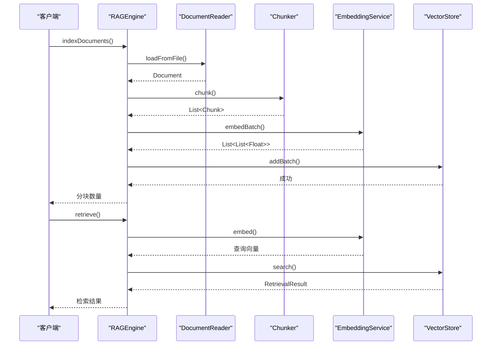
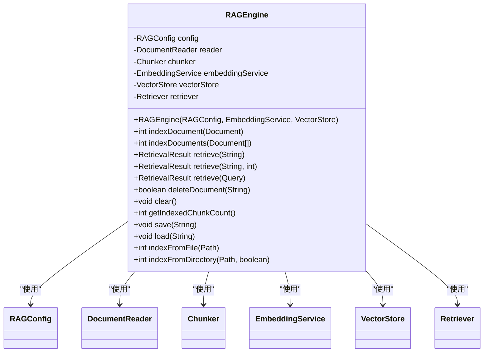
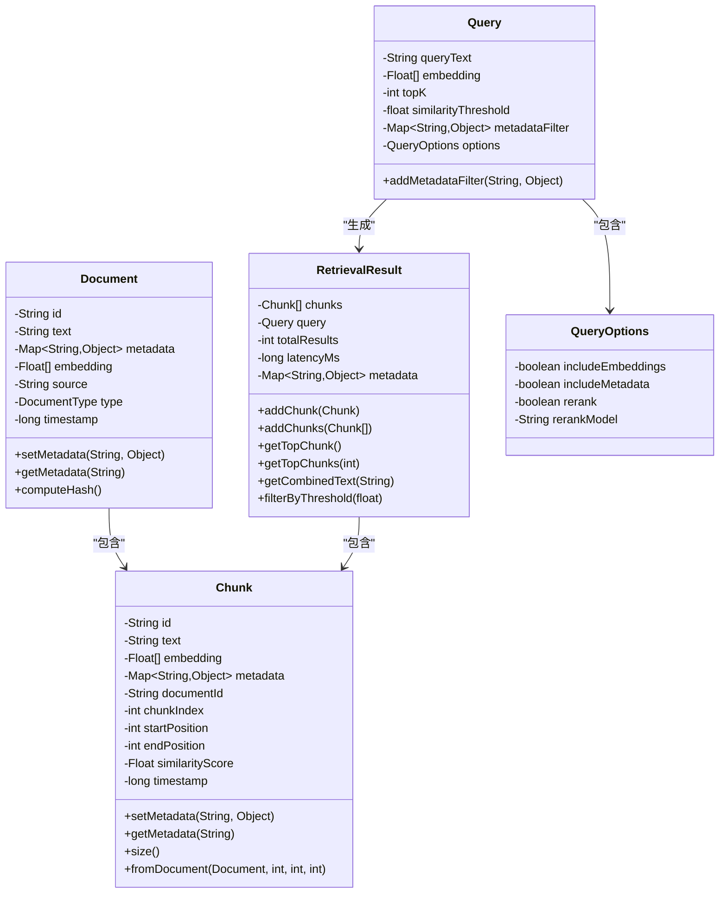
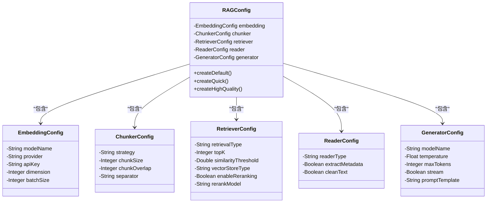
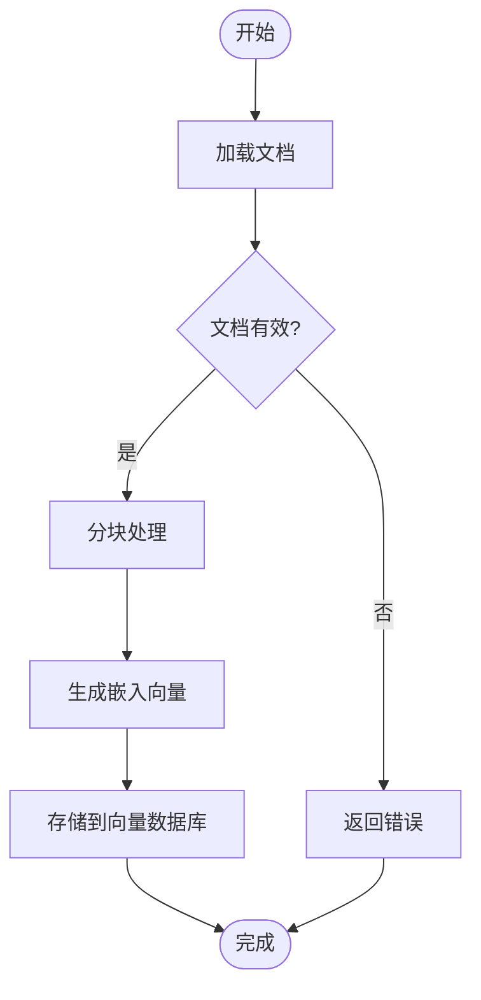
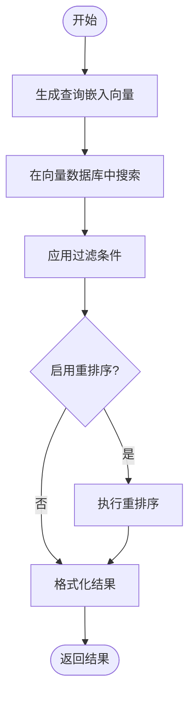
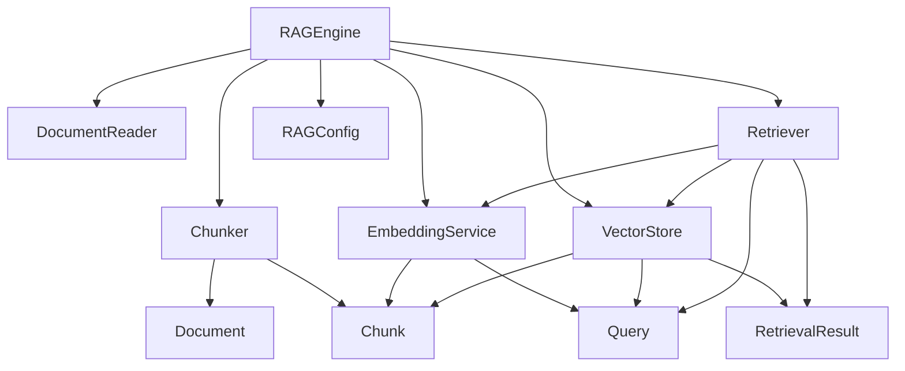

# RAG引擎API

<cite>
**本文档引用的文件**
- [RAGEngine.java](file://evox-rag/src/main/java/io/leavesfly/evox/rag/RAGEngine.java)
- [Document.java](file://evox-rag/src/main/java/io/leavesfly/evox/rag/schema/Document.java)
- [Chunk.java](file://evox-rag/src/main/java/io/leavesfly/evox/rag/schema/Chunk.java)
- [Query.java](file://evox-rag/src/main/java/io/leavesfly/evox/rag/schema/Query.java)
- [RetrievalResult.java](file://evox-rag/src/main/java/io/leavesfly/evox/rag/schema/RetrievalResult.java)
- [RAGConfig.java](file://evox-rag/src/main/java/io/leavesfly/evox/rag/config/RAGConfig.java)
- [Chunker.java](file://evox-rag/src/main/java/io/leavesfly/evox/rag/chunker/Chunker.java)
- [EmbeddingService.java](file://evox-rag/src/main/java/io/leavesfly/evox/rag/embedding/EmbeddingService.java)
- [Retriever.java](file://evox-rag/src/main/java/io/leavesfly/evox/rag/retriever/Retriever.java)
- [VectorStore.java](file://evox-rag/src/main/java/io/leavesfly/evox/rag/vectorstore/VectorStore.java)
- [VectorStoreFactory.java](file://evox-rag/src/main/java/io/leavesfly/evox/rag/vectorstore/VectorStoreFactory.java)
- [FixedSizeChunker.java](file://evox-rag/src/main/java/io/leavesfly/evox/rag/chunker/FixedSizeChunker.java)
- [SpringAIEmbeddingService.java](file://evox-rag/src/main/java/io/leavesfly/evox/rag/embedding/SpringAIEmbeddingService.java)
- [VectorRetriever.java](file://evox-rag/src/main/java/io/leavesfly/evox/rag/retriever/VectorRetriever.java)
- [InMemoryVectorStore.java](file://evox-rag/src/main/java/io/leavesfly/evox/rag/vectorstore/InMemoryVectorStore.java)
- [PersistentVectorStore.java](file://evox-rag/src/main/java/io/leavesfly/evox/rag/vectorstore/PersistentVectorStore.java)
</cite>

## 目录
1. [简介](#简介)
2. [项目结构](#项目结构)
3. [核心组件](#核心组件)
4. [架构概述](#架构概述)
5. [详细组件分析](#详细组件分析)
6. [依赖分析](#依赖分析)
7. [性能考量](#性能考量)
8. [故障排查指南](#故障排查指南)
9. [结论](#结论)

## 简介
RAGEngine是EvoX框架中的检索增强生成（RAG）系统核心组件，提供了一套完整的文档处理、索引和检索解决方案。该系统通过四个主要阶段实现：文档加载（DocumentReader）、文本分块（Chunker）、向量嵌入（EmbeddingService）和语义检索（Retriever）。RAGEngine旨在为AI应用提供高质量的上下文信息，通过将外部知识库与大语言模型相结合，显著提升生成内容的准确性和相关性。

## 项目结构
RAGEngine的代码组织遵循清晰的模块化设计，每个功能组件都有独立的包结构。系统主要分为配置、数据模型、处理组件和存储组件四大类。

```mermaid
graph TB
subgraph "RAGEngine"
RAGEngine[RAGEngine]
Config[config]
Schema[schema]
Chunker[chunker]
Embedding[embedding]
Retriever[retriever]
VectorStore[vectorstore]
Reader[reader]
Postprocessor[postprocessor]
end
RAGEngine --> Config
RAGEngine --> Schema
RAGEngine --> Chunker
RAGEngine --> Embedding
RAGEngine --> Retriever
RAGEngine --> VectorStore
RAGEngine --> Reader
RAGEngine --> Postprocessor
Config --> RAGConfig[RAGConfig]
Schema --> Document[Document]
Schema --> Chunk[Chunk]
Schema --> Query[Query]
Schema --> RetrievalResult[RetrievalResult]
Chunker --> ChunkerInterface[Chunker]
Chunker --> FixedSizeChunker[FixedSizeChunker]
Chunker --> SemanticChunker[SemanticChunker]
Embedding --> EmbeddingService[EmbeddingService]
Retriever --> RetrieverInterface[Retriever]
Retriever --> VectorRetriever[VectorRetriever]
VectorStore --> VectorStoreInterface[VectorStore]
VectorStore --> InMemoryVectorStore[InMemoryVectorStore]
VectorStore --> PersistentVectorStore[PersistentVectorStore]
Reader --> DocumentReader[DocumentReader]
Reader --> UniversalDocumentReader[UniversalDocumentReader]
```

**图示来源**
- [RAGEngine.java](file://evox-rag/src/main/java/io/leavesfly/evox/rag/RAGEngine.java)
- [RAGConfig.java](file://evox-rag/src/main/java/io/leavesfly/evox/rag/config/RAGConfig.java)
- [Document.java](file://evox-rag/src/main/java/io/leavesfly/evox/rag/schema/Document.java)
- [Chunk.java](file://evox-rag/src/main/java/io/leavesfly/evox/rag/schema/Chunk.java)
- [Query.java](file://evox-rag/src/main/java/io/leavesfly/evox/rag/schema/Query.java)
- [RetrievalResult.java](file://evox-rag/src/main/java/io/leavesfly/evox/rag/schema/RetrievalResult.java)

## 核心组件
RAGEngine的核心由四个主要阶段组成：文档加载、文本分块、向量嵌入和语义检索。这些组件协同工作，将原始文档转换为可检索的知识库。系统通过RAGEngine类提供统一的API接口，简化了复杂RAG流程的使用。

**组件来源**
- [RAGEngine.java](file://evox-rag/src/main/java/io/leavesfly/evox/rag/RAGEngine.java)
- [Document.java](file://evox-rag/src/main/java/io/leavesfly/evox/rag/schema/Document.java)
- [Chunk.java](file://evox-rag/src/main/java/io/leavesfly/evox/rag/schema/Chunk.java)
- [Query.java](file://evox-rag/src/main/java/io/leavesfly/evox/rag/schema/Query.java)

## 架构概述
RAGEngine采用分层架构设计，各组件通过清晰的接口进行通信。系统从文档加载开始，经过分块、嵌入生成，最终存储到向量数据库中，形成可检索的知识库。



**图示来源**
- [RAGEngine.java](file://evox-rag/src/main/java/io/leavesfly/evox/rag/RAGEngine.java)
- [DocumentReader.java](file://evox-rag/src/main/java/io/leavesfly/evox/rag/reader/DocumentReader.java)
- [Chunker.java](file://evox-rag/src/main/java/io/leavesfly/evox/rag/chunker/Chunker.java)
- [EmbeddingService.java](file://evox-rag/src/main/java/io/leavesfly/evox/rag/embedding/EmbeddingService.java)
- [VectorStore.java](file://evox-rag/src/main/java/io/leavesfly/evox/rag/vectorstore/VectorStore.java)

## 详细组件分析
### RAGEngine核心分析
RAGEngine是整个RAG系统的控制中心，负责协调各个组件的工作流程。它提供了索引文档、检索信息和管理知识库的核心方法。

#### 核心方法


**图示来源**
- [RAGEngine.java](file://evox-rag/src/main/java/io/leavesfly/evox/rag/RAGEngine.java)

**组件来源**
- [RAGEngine.java](file://evox-rag/src/main/java/io/leavesfly/evox/rag/RAGEngine.java)

### 数据模型分析
RAGEngine使用一系列精心设计的数据模型来表示文档、分块、查询和检索结果。

#### 数据模型关系


**图示来源**
- [Document.java](file://evox-rag/src/main/java/io/leavesfly/evox/rag/schema/Document.java)
- [Chunk.java](file://evox-rag/src/main/java/io/leavesfly/evox/rag/schema/Chunk.java)
- [Query.java](file://evox-rag/src/main/java/io/leavesfly/evox/rag/schema/Query.java)
- [RetrievalResult.java](file://evox-rag/src/main/java/io/leavesfly/evox/rag/schema/RetrievalResult.java)

**组件来源**
- [Document.java](file://evox-rag/src/main/java/io/leavesfly/evox/rag/schema/Document.java)
- [Chunk.java](file://evox-rag/src/main/java/io/leavesfly/evox/rag/schema/Chunk.java)
- [Query.java](file://evox-rag/src/main/java/io/leavesfly/evox/rag/schema/Query.java)
- [RetrievalResult.java](file://evox-rag/src/main/java/io/leavesfly/evox/rag/schema/RetrievalResult.java)

### 配置系统分析
RAGEngine提供灵活的配置系统，允许用户根据具体需求调整各项参数。

#### 配置结构


**图示来源**
- [RAGConfig.java](file://evox-rag/src/main/java/io/leavesfly/evox/rag/config/RAGConfig.java)

**组件来源**
- [RAGConfig.java](file://evox-rag/src/main/java/io/leavesfly/evox/rag/config/RAGConfig.java)

### 处理流程分析
RAGEngine的处理流程分为索引和检索两个主要阶段，每个阶段都有明确的步骤和组件协作。

#### 索引流程


#### 检索流程


**图示来源**
- [RAGEngine.java](file://evox-rag/src/main/java/io/leavesfly/evox/rag/RAGEngine.java)
- [VectorRetriever.java](file://evox-rag/src/main/java/io/leavesfly/evox/rag/retriever/VectorRetriever.java)

**组件来源**
- [RAGEngine.java](file://evox-rag/src/main/java/io/leavesfly/evox/rag/RAGEngine.java)

## 依赖分析
RAGEngine的组件之间存在清晰的依赖关系，形成了一个松耦合但高度协作的系统。



**图示来源**
- [RAGEngine.java](file://evox-rag/src/main/java/io/leavesfly/evox/rag/RAGEngine.java)
- [DocumentReader.java](file://evox-rag/src/main/java/io/leavesfly/evox/rag/reader/DocumentReader.java)
- [Chunker.java](file://evox-rag/src/main/java/io/leavesfly/evox/rag/chunker/Chunker.java)
- [EmbeddingService.java](file://evox-rag/src/main/java/io/leavesfly/evox/rag/embedding/EmbeddingService.java)
- [VectorStore.java](file://evox-rag/src/main/java/io/leavesfly/evox/rag/vectorstore/VectorStore.java)
- [Retriever.java](file://evox-rag/src/main/java/io/leavesfly/evox/rag/retriever/Retriever.java)
- [RAGConfig.java](file://evox-rag/src/main/java/io/leavesfly/evox/rag/config/RAGConfig.java)

**组件来源**
- [RAGEngine.java](file://evox-rag/src/main/java/io/leavesfly/evox/rag/RAGEngine.java)

## 性能考量
RAGEngine在设计时充分考虑了性能因素，提供了多种优化策略和配置选项。

### 索引性能
- **批量处理**：使用`indexDocuments()`方法批量索引文档，减少I/O开销
- **分块策略**：选择合适的分块大小（chunkSize）和重叠（chunkOverlap）以平衡检索精度和索引大小
- **嵌入批处理**：`EmbeddingService`支持批量嵌入生成，显著提高处理效率

### 检索性能
- **向量存储选择**：根据数据规模选择合适的向量存储
- **Top-K优化**：合理设置`topK`参数，避免返回过多结果影响性能
- **相似度阈值**：设置适当的`similarityThreshold`过滤低质量结果

### 内存占用
- **InMemoryVectorStore**：适用于小规模数据集，提供最快的检索速度
- **PersistentVectorStore**：适用于大规模数据集，支持持久化存储
- **配置优化**：通过`RAGConfig`调整各项参数以优化内存使用

**组件来源**
- [RAGEngine.java](file://evox-rag/src/main/java/io/leavesfly/evox/rag/RAGEngine.java)
- [VectorStore.java](file://evox-rag/src/main/java/io/leavesfly/evox/rag/vectorstore/VectorStore.java)
- [RAGConfig.java](file://evox-rag/src/main/java/io/leavesfly/evox/rag/config/RAGConfig.java)

## 故障排查指南
### 检索结果不相关
**可能原因**：
- 分块大小不合适
- 嵌入模型与查询不匹配
- 相似度阈值设置过高

**解决方案**：
1. 调整分块策略：
```java
RAGConfig config = RAGConfig.builder()
    .chunker(RAGConfig.ChunkerConfig.builder()
        .strategy("semantic")  // 改为语义分块
        .chunkSize(512)        // 调整分块大小
        .chunkOverlap(50)      // 调整合并重叠
        .build())
    .build();
```

2. 调整相似度阈值：
```java
RAGConfig config = RAGConfig.builder()
    .retriever(RAGConfig.RetrieverConfig.builder()
        .similarityThreshold(0.5)  // 降低阈值
        .build())
    .build();
```

### 索引失败
**可能原因**：
- 文档格式不支持
- 嵌入服务不可用
- 存储空间不足

**解决方案**：
1. 检查文档格式支持：
```java
// 确保使用支持的文档类型
Document doc = Document.builder()
    .text("文档内容")
    .type(Document.DocumentType.TEXT)  // 或PDF、DOCX等
    .build();
```

2. 验证嵌入服务配置：
```java
RAGConfig config = RAGConfig.builder()
    .embedding(RAGConfig.EmbeddingConfig.builder()
        .provider("openai")  // 确保提供商正确
        .apiKey("your-api-key")  // 确保API密钥有效
        .build())
    .build();
```

### 向量存储切换
RAGEngine支持多种向量存储类型，可以通过`VectorStoreFactory`轻松切换：

```java
// 使用内存向量存储（适合开发和测试）
VectorStore inMemoryStore = VectorStoreFactory.createDefault();

// 使用持久化向量存储（适合生产环境）
VectorStore persistentStore = VectorStoreFactory.createPersistent(1536);

// 创建RAGEngine实例
RAGEngine ragEngine = new RAGEngine(config, embeddingService, persistentStore);
```

**组件来源**
- [RAGEngine.java](file://evox-rag/src/main/java/io/leavesfly/evox/rag/RAGEngine.java)
- [VectorStoreFactory.java](file://evox-rag/src/main/java/io/leavesfly/evox/rag/vectorstore/VectorStoreFactory.java)
- [RAGConfig.java](file://evox-rag/src/main/java/io/leavesfly/evox/rag/config/RAGConfig.java)

## 结论
RAGEngine提供了一个功能完整、易于使用的RAG系统实现。通过清晰的四个阶段（文档加载、文本分块、向量嵌入、语义检索），系统能够有效地将外部知识库与大语言模型相结合。灵活的配置系统和多种向量存储选项使得RAGEngine既适合快速原型开发，也适合生产环境部署。通过合理配置和优化，可以显著提升AI应用的性能和准确性。