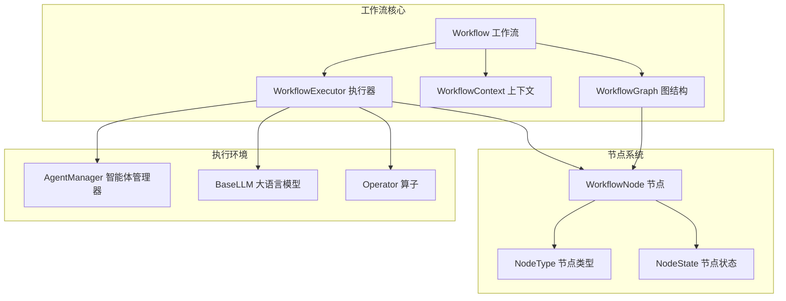
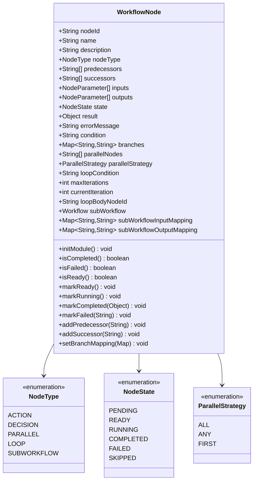
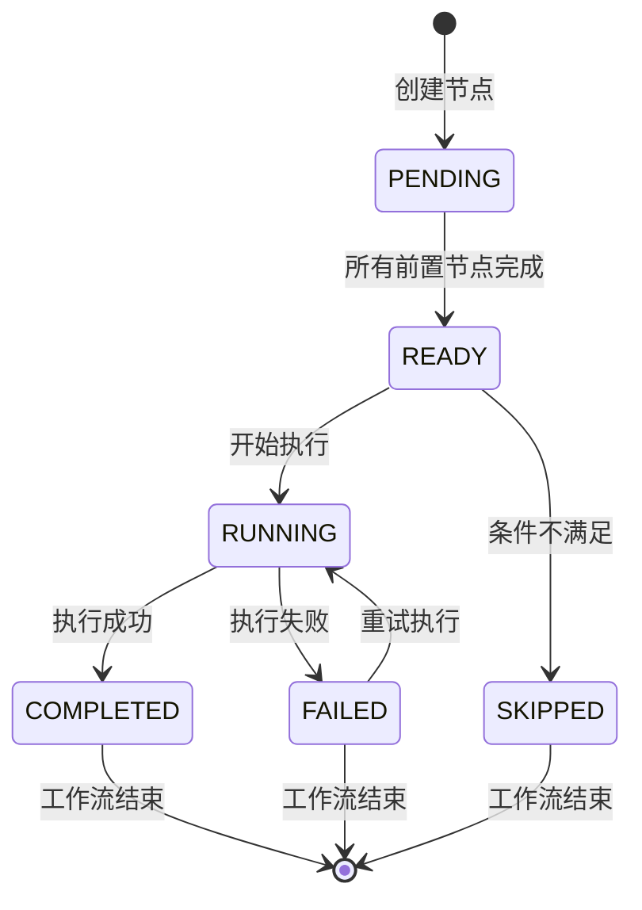
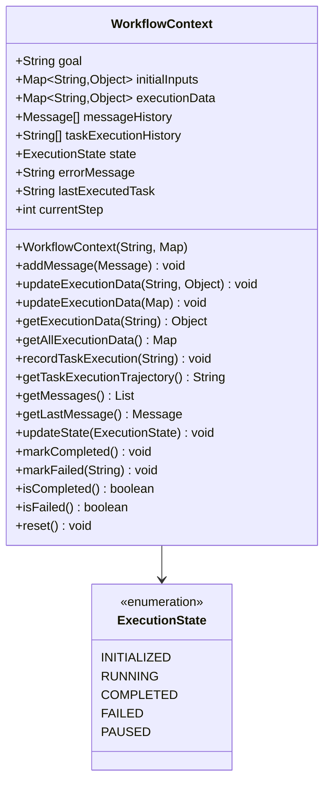
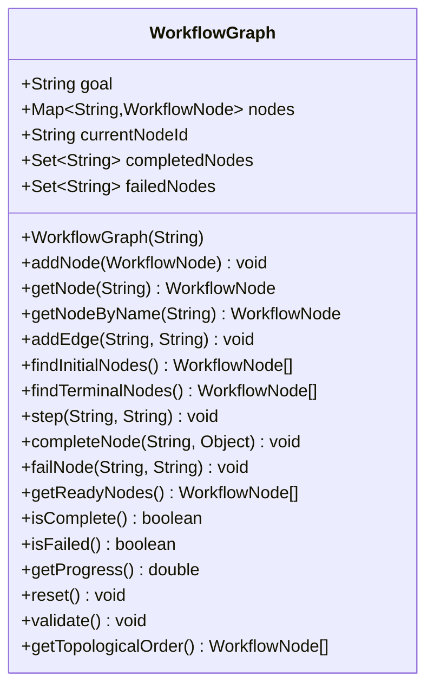
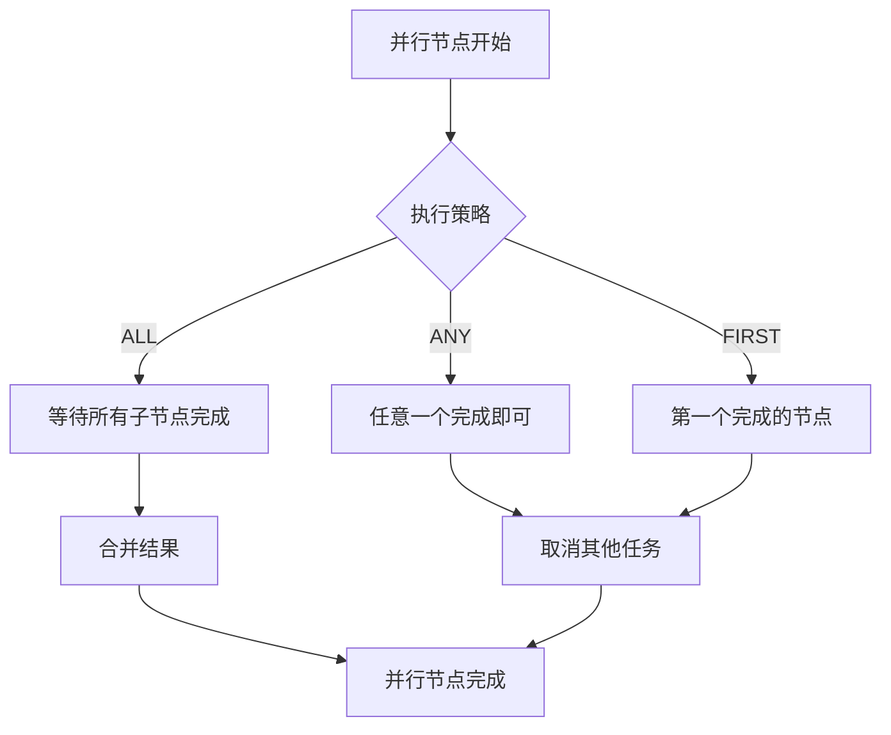
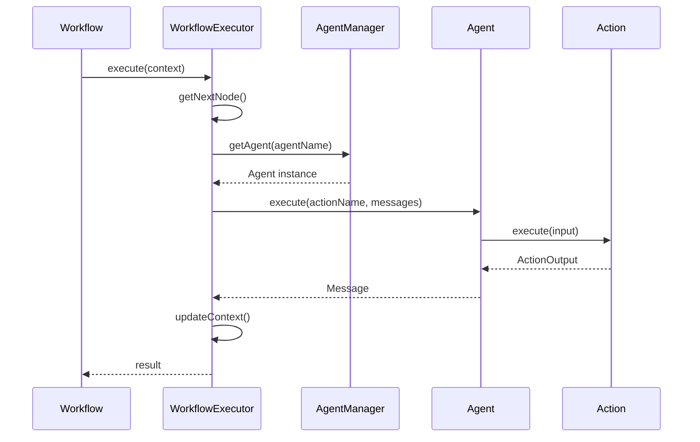
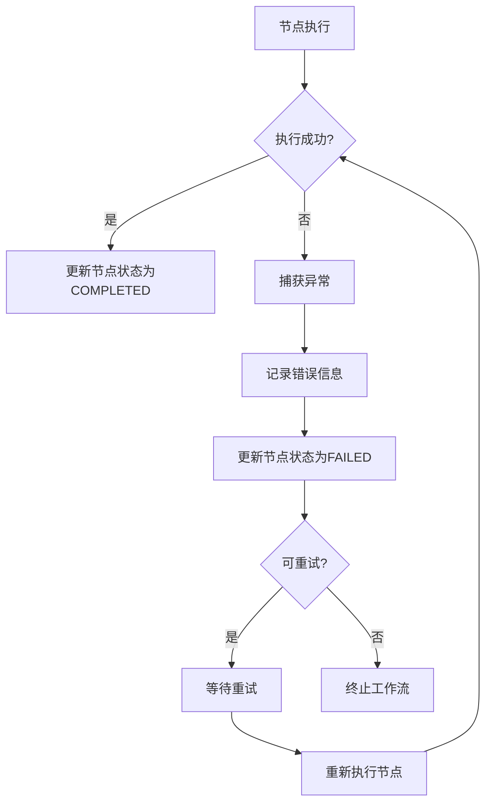
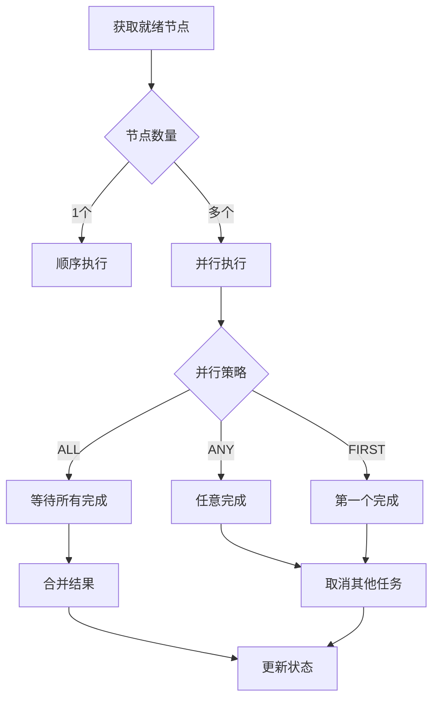

# 工作流API参考文档

<cite>
**本文档中引用的文件**
- [Workflow.java](file://evox-workflow/src/main/java/io/leavesfly/evox/workflow/base/Workflow.java)
- [WorkflowNode.java](file://evox-workflow/src/main/java/io/leavesfly/evox/workflow/base/WorkflowNode.java)
- [WorkflowContext.java](file://evox-workflow/src/main/java/io/leavesfly/evox/workflow/execution/WorkflowContext.java)
- [WorkflowExecutor.java](file://evox-workflow/src/main/java/io/leavesfly/evox/workflow/execution/WorkflowExecutor.java)
- [WorkflowGraph.java](file://evox-workflow/src/main/java/io/leavesfly/evox/workflow/graph/WorkflowGraph.java)
- [Operator.java](file://evox-workflow/src/main/java/io/leavesfly/evox/workflow/operator/Operator.java)
- [AnswerGenerateOperator.java](file://evox-workflow/src/main/java/io/leavesfly/evox/workflow/operator/AnswerGenerateOperator.java)
- [WorkflowDemo.java](file://evox-examples/src/main/java/io/leavesfly/evox/examples/WorkflowDemo.java)
- [SequentialWorkflowExample.java](file://evox-examples/src/main/java/io/leavesfly/evox/examples/SequentialWorkflowExample.java)
</cite>

## 目录
1. [简介](#简介)
2. [核心架构](#核心架构)
3. [Workflow类详解](#workflow类详解)
4. [WorkflowNode节点系统](#workflownode节点系统)
5. [执行上下文管理](#执行上下文管理)
6. [工作流图结构](#工作流图结构)
7. [节点类型与编排](#节点类型与编排)
8. [DSL配置与编程式构建](#dsl配置与编程式构建)
9. [组件集成机制](#组件集成机制)
10. [错误处理与重试策略](#错误处理与重试策略)
11. [性能优化与监控](#性能优化与监控)
12. [最佳实践](#最佳实践)

## 简介

EvoX工作流系统是一个强大的异步工作流引擎，支持复杂的业务流程编排。它提供了灵活的节点类型、智能的执行调度和完善的错误处理机制，能够处理从简单顺序执行到复杂并行、条件分支和循环的各种工作流场景。

## 核心架构

工作流系统采用模块化设计，主要由以下核心组件构成：



**图表来源**
- [Workflow.java](file://evox-workflow/src/main/java/io/leavesfly/evox/workflow/base/Workflow.java#L28-L60)
- [WorkflowGraph.java](file://evox-workflow/src/main/java/io/leavesfly/evox/workflow/graph/WorkflowGraph.java#L18-L51)
- [WorkflowExecutor.java](file://evox-workflow/src/main/java/io/leavesfly/evox/workflow/execution/WorkflowExecutor.java#L25-L34)

## Workflow类详解

### 核心功能概述

Workflow类是整个工作流系统的核心控制器，负责工作流的生命周期管理和执行协调。

### 主要属性与配置

| 属性 | 类型 | 描述 | 默认值 |
|------|------|------|--------|
| workflowId | String | 工作流唯一标识符 | 自动生成UUID |
| name | String | 工作流名称 | null |
| graph | WorkflowGraph | 工作流图结构 | null |
| llm | BaseLLM | 大语言模型（可选） | null |
| agentManager | AgentManager | 智能体管理器 | null |
| executor | WorkflowExecutor | 工作流执行器 | 自动创建 |
| workflowVersion | Integer | 工作流版本号 | 1 |
| maxExecutionSteps | int | 最大执行步数 | 100 |

### 核心方法详解

#### execute() 方法

同步执行工作流的主要入口点。

**方法签名：**
```java
public String execute(Map<String, Object> inputs)
```

**参数说明：**
- `inputs`: 输入参数映射，包含工作流执行所需的所有数据

**行为描述：**
1. 验证工作流图结构
2. 准备输入参数
3. 创建执行上下文
4. 记录输入消息
5. 调用执行器执行工作流
6. 返回执行结果

**异常处理：**
- 抛出RuntimeException包装原始异常
- 记录详细的错误日志

#### executeAsync() 方法

异步执行工作流，返回Mono响应式流。

**方法签名：**
```java
public Mono<String> executeAsync(Map<String, Object> inputs)
```

**特点：**
- 基于Reactor框架的响应式编程
- 支持背压处理
- 提供链式操作能力

#### 状态管理方法

| 方法 | 返回类型 | 描述 |
|------|----------|------|
| getStatus() | WorkflowStatus | 获取工作流当前状态 |
| getProgress() | double | 获取执行进度百分比 |
| reset() | void | 重置工作流状态 |

**状态枚举：**
- `PENDING`: 待执行
- `RUNNING`: 运行中  
- `COMPLETED`: 已完成
- `FAILED`: 失败

**节来源**
- [Workflow.java](file://evox-workflow/src/main/java/io/leavesfly/evox/workflow/base/Workflow.java#L96-L141)
- [Workflow.java](file://evox-workflow/src/main/java/io/leavesfly/evox/workflow/base/Workflow.java#L161-L194)

## WorkflowNode节点系统

### 节点数据结构

WorkflowNode是工作流中的基本执行单元，每个节点代表一个独立的任务或处理步骤。



**图表来源**
- [WorkflowNode.java](file://evox-workflow/src/main/java/io/leavesfly/evox/workflow/base/WorkflowNode.java#L21-L324)

### 节点参数定义

节点参数系统支持灵活的输入输出定义：

| 参数属性 | 类型 | 必需 | 描述 |
|----------|------|------|------|
| name | String | 是 | 参数名称 |
| type | String | 是 | 参数类型 |
| required | boolean | 是 | 是否必需 |
| defaultValue | Object | 否 | 默认值 |
| description | String | 否 | 参数描述 |

### 节点状态流转



**节来源**
- [WorkflowNode.java](file://evox-workflow/src/main/java/io/leavesfly/evox/workflow/base/WorkflowNode.java#L146-L250)

## 执行上下文管理

### WorkflowContext核心功能

WorkflowContext负责管理工作流执行过程中的状态和数据，提供线程安全的数据存储和消息管理。



**图表来源**
- [WorkflowContext.java](file://evox-workflow/src/main/java/io/leavesfly/evox/workflow/execution/WorkflowContext.java#L16-L222)

### 数据管理特性

| 功能 | 方法 | 描述 |
|------|------|------|
| 线程安全 | ConcurrentHashMap | 使用并发集合保证多线程安全 |
| 数据持久化 | executionData | 存储节点执行结果和中间数据 |
| 消息历史 | messageHistory | 记录所有消息交互 |
| 执行轨迹 | taskExecutionHistory | 跟踪任务执行顺序 |
| 状态监控 | state | 实时反映执行状态 |

**节来源**
- [WorkflowContext.java](file://evox-workflow/src/main/java/io/leavesfly/evox/workflow/execution/WorkflowContext.java#L63-L205)

## 工作流图结构

### WorkflowGraph核心职责

WorkflowGraph管理整个工作流的节点关系和执行顺序，提供图结构的验证和遍历功能。



**图表来源**
- [WorkflowGraph.java](file://evox-workflow/src/main/java/io/leavesfly/evox/workflow/graph/WorkflowGraph.java#L18-L325)

### 图结构验证

系统提供完整的图结构验证机制：

| 验证规则 | 描述 | 异常类型 |
|----------|------|----------|
| 初始节点检查 | 必须存在至少一个起始节点 | IllegalStateException |
| 终止节点检查 | 必须存在至少一个终止节点 | IllegalStateException |
| 孤立节点检查 | 不允许存在孤立节点 | IllegalStateException |
| 循环检测 | 检测图中是否存在循环依赖 | IllegalStateException |

**节来源**
- [WorkflowGraph.java](file://evox-workflow/src/main/java/io/leavesfly/evox/workflow/graph/WorkflowGraph.java#L263-L284)

## 节点类型与编排

### 动作节点 (ACTION)

最基础的执行节点，与Agent和Action系统集成。

**特点：**
- 支持与Agent的无缝集成
- 可配置具体的Agent和Action
- 提供异步执行能力

**配置示例：**
```java
// 节点命名格式：agentName.actionName 或 actionName
node.setName("DataProcessor.validate");
```

### 决策节点 (DECISION)

根据条件表达式选择执行路径。

**条件表达式支持：**
- 布尔值：`true`, `false`
- 相等比较：`context.key == "value"`
- 数值比较：`context.count > 5`
- 上下文访问：`context.lastResult.status`

**分支映射：**
```java
Map<String, String> branches = new HashMap<>();
branches.put("true", successNodeId);
branches.put("false", failureNodeId);
branches.put("default", fallbackNodeId);
decisionNode.setBranchMapping(branches);
```

### 并行节点 (PARALLEL)

支持多种并行执行策略。



**图表来源**
- [WorkflowExecutor.java](file://evox-workflow/src/main/java/io/leavesfly/evox/workflow/execution/WorkflowExecutor.java#L516-L631)

### 循环节点 (LOOP)

支持条件控制的循环执行。

**配置参数：**
- `loopCondition`: 循环条件表达式
- `maxIterations`: 最大迭代次数
- `loopBodyNodeId`: 循环体节点ID

### 子工作流节点 (SUBWORKFLOW)

嵌套执行完整的工作流实例。

**输入输出映射：**
```java
// 输入映射：子工作流参数 → 父工作流数据
Map<String, String> inputMapping = new HashMap<>();
inputMapping.put("subParam", "parentData");

// 输出映射：子工作流结果 → 父工作流数据  
Map<String, String> outputMapping = new HashMap<>();
outputMapping.put("parentResult", "subResult");
```

**节来源**
- [WorkflowExecutor.java](file://evox-workflow/src/main/java/io/leavesfly/evox/workflow/execution/WorkflowExecutor.java#L170-L179)
- [WorkflowExecutor.java](file://evox-workflow/src/main/java/io/leavesfly/evox/workflow/execution/WorkflowExecutor.java#L266-L301)

## DSL配置与编程式构建

### 编程式构建示例

以下是创建顺序工作流的完整示例：

```java
// 1. 创建AgentManager和智能体
AgentManager agentManager = new AgentManager();
DataProcessorAgent processor = new DataProcessorAgent();
agentManager.addAgent(processor);

// 2. 创建工作流图
WorkflowGraph graph = new WorkflowGraph("数据处理工作流");

// 3. 创建节点
WorkflowNode validateNode = createNode("validate", "数据验证");
WorkflowNode transformNode = createNode("transform", "数据转换"); 
WorkflowNode summarizeNode = createNode("summarize", "数据汇总");

// 4. 添加节点和连接
graph.addNode(validateNode);
graph.addNode(transformNode);
graph.addNode(summarizeNode);
graph.addEdge(validateNode.getNodeId(), transformNode.getNodeId());
graph.addEdge(transformNode.getNodeId(), summarizeNode.getNodeId());

// 5. 创建工作流
Workflow workflow = new Workflow();
workflow.setName("顺序工作流");
workflow.setGraph(graph);
workflow.setAgentManager(agentManager);
workflow.initModule();

// 6. 执行
Map<String, Object> inputs = Map.of("data", Arrays.asList(1, 2, 3, 4, 5));
String result = workflow.execute(inputs);
```

### DSL配置方式

虽然当前实现主要采用编程式构建，但可以通过工厂模式和Builder模式扩展DSL支持：

```java
public class WorkflowBuilder {
    private Workflow workflow = new Workflow();
    private WorkflowGraph graph = new WorkflowGraph();
    
    public WorkflowBuilder withName(String name) {
        workflow.setName(name);
        return this;
    }
    
    public WorkflowBuilder withAgentManager(AgentManager manager) {
        workflow.setAgentManager(manager);
        return this;
    }
    
    public WorkflowBuilder addNode(String name, NodeType type) {
        WorkflowNode node = new WorkflowNode();
        node.setName(name);
        node.setNodeType(type);
        node.initModule();
        graph.addNode(node);
        return this;
    }
    
    public WorkflowBuilder connect(String from, String to) {
        graph.addEdge(from, to);
        return this;
    }
    
    public Workflow build() {
        workflow.setGraph(graph);
        workflow.initModule();
        return workflow;
    }
}
```

**节来源**
- [WorkflowDemo.java](file://evox-examples/src/main/java/io/leavesfly/evox/examples/WorkflowDemo.java#L47-L105)
- [SequentialWorkflowExample.java](file://evox-examples/src/main/java/io/leavesfly/evox/examples/SequentialWorkflowExample.java#L33-L124)

## 组件集成机制

### 与Agent系统的集成

工作流系统深度集成Agent框架，通过WorkflowExecutor实现智能体的自动调度：



**图表来源**
- [WorkflowExecutor.java](file://evox-workflow/src/main/java/io/leavesfly/evox/workflow/execution/WorkflowExecutor.java#L243-L260)

### 与Action系统的协作

节点执行通过Action接口统一处理：

| 执行阶段 | Action接口方法 | 处理逻辑 |
|----------|----------------|----------|
| 输入准备 | getInputFields() | 获取必需输入字段 |
| 数据转换 | toMap() | 将消息内容转换为Map |
| 执行调用 | execute() | 调用具体动作逻辑 |
| 结果处理 | isSuccess() | 检查执行状态 |
| 输出生成 | getData() | 获取执行结果 |

### 与Memory组件的集成

通过WorkflowContext与Memory系统协作：

```java
// 在节点执行过程中访问记忆数据
Object memoryData = context.getExecutionData("memoryKey");
context.updateExecutionData("newKey", result);

// 记录执行轨迹
context.recordTaskExecution(node.getName());
```

**节来源**
- [WorkflowExecutor.java](file://evox-workflow/src/main/java/io/leavesfly/evox/workflow/execution/WorkflowExecutor.java#L212-L237)
- [WorkflowContext.java](file://evox-workflow/src/main/java/io/leavesfly/evox/workflow/execution/WorkflowContext.java#L87-L113)

## 错误处理与重试策略

### 错误处理层次

工作流系统采用多层次的错误处理机制：



### 节点级别错误处理

每个节点都有独立的错误处理能力：

| 错误类型 | 处理策略 | 影响范围 |
|----------|----------|----------|
| 执行异常 | 标记为FAILED | 仅影响当前节点 |
| 条件评估错误 | 使用默认分支 | 影响决策节点 |
| 并行节点部分失败 | 继续其他节点 | 影响并行策略 |
| 循环条件异常 | 终止循环 | 影响循环执行 |

### 工作流级别恢复

```java
// 工作流重置和重启
workflow.reset(); // 清除所有节点状态
String result = workflow.execute(inputs); // 重新执行

// 检查工作流状态
if (workflow.getStatus() == WorkflowStatus.FAILED) {
    // 分析失败原因
    // 可能需要手动干预或自动修复
}
```

### 超时和限制

| 限制项 | 默认值 | 配置方式 |
|--------|--------|----------|
| 最大执行步数 | 100 | workflow.setMaxExecutionSteps() |
| 循环最大迭代 | 100 | node.setMaxIterations() |
| 并行任务超时 | 无限制 | 可通过外部监控设置 |

**节来源**
- [WorkflowExecutor.java](file://evox-workflow/src/main/java/io/leavesfly/evox/workflow/execution/WorkflowExecutor.java#L55-L89)
- [Workflow.java](file://evox-workflow/src/main/java/io/leavesfly/evox/workflow/base/Workflow.java#L185-L189)

## 性能优化与监控

### 并发控制策略

工作流执行器采用智能的并发控制：



### 资源隔离机制

| 隔离维度 | 实现方式 | 目的 |
|----------|----------|------|
| 线程池 | Reactor Scheduler | 避免线程阻塞 |
| 内存空间 | 独立的executionData | 防止数据污染 |
| 执行上下文 | WorkflowContext隔离 | 保持状态独立 |
| 资源锁 | 节点状态原子更新 | 避免竞态条件 |

### 性能监控指标

```java
// 关键性能指标监控
class WorkflowMetrics {
    // 执行时间统计
    long startTime;
    long endTime;
    
    // 节点执行统计
    int totalNodes;
    int completedNodes;
    int failedNodes;
    
    // 资源使用情况
    long memoryUsage;
    int concurrentThreads;
    
    // 错误率计算
    double failureRate;
}
```

### 优化建议

| 场景 | 优化策略 | 实现方式 |
|------|----------|----------|
| 大数据处理 | 分批处理 | 设置合理的maxIterations |
| 长时间运行 | 增加检查点 | 定期保存执行状态 |
| 高并发场景 | 限制并行度 | 控制同时执行的节点数量 |
| 网络密集型 | 连接池复用 | 配置合适的HTTP客户端 |

**节来源**
- [WorkflowExecutor.java](file://evox-workflow/src/main/java/io/leavesfly/evox/workflow/execution/WorkflowExecutor.java#L119-L118)
- [WorkflowExecutor.java](file://evox-workflow/src/main/java/io/leavesfly/evox/workflow/execution/WorkflowExecutor.java#L558-L631)

## 最佳实践

### 工作流设计原则

1. **单一职责**: 每个节点专注于单一任务
2. **松耦合**: 节点间通过明确的接口通信
3. **可测试性**: 每个节点都可以独立测试
4. **可观测性**: 提供充分的日志和监控信息

### 常见模式

#### 数据流水线模式
```java
// 适用于ETL、数据处理等场景
WorkflowNode extract = createNode("extract", ACTION);
WorkflowNode transform = createNode("transform", ACTION); 
WorkflowNode load = createNode("load", ACTION);

graph.addEdge(extract.getNodeId(), transform.getNodeId());
graph.addEdge(transform.getNodeId(), load.getNodeId());
```

#### 条件路由模式
```java
// 基于数据特征选择不同处理路径
WorkflowNode decision = createNode("decision", DECISION);
decision.setCondition("context.dataSize > 1000");

WorkflowNode heavyProcessing = createNode("heavy", ACTION);
WorkflowNode lightProcessing = createNode("light", ACTION);

Map<String, String> branches = new HashMap<>();
branches.put("true", heavyProcessing.getNodeId());
branches.put("false", lightProcessing.getNodeId());
decision.setBranchMapping(branches);
```

#### 并行处理模式
```java
// 并行处理不同类型的数据
WorkflowNode parallel = createNode("parallel", PARALLEL);
parallel.setParallelStrategy(ALL);

// 添加多个并行子节点
parallel.getParallelNodes().add(subNode1.getNodeId());
parallel.getParallelNodes().add(subNode2.getNodeId());
```

### 调试和诊断

```java
// 启用详细日志
log.setLevel(Level.DEBUG);

// 检查工作流状态
System.out.println("工作流状态: " + workflow.getStatus());
System.out.println("执行进度: " + workflow.getProgress() + "%");
System.out.println("当前节点: " + workflow.getGraph().getCurrentNodeId());

// 查看节点执行历史
for (WorkflowNode node : workflow.getGraph().getNodes().values()) {
    System.out.println(node.getName() + ": " + node.getState());
}
```

### 生产环境部署

1. **监控告警**: 设置关键指标的监控
2. **健康检查**: 定期检查工作流健康状态
3. **备份恢复**: 保存工作流定义和执行状态
4. **版本管理**: 对工作流进行版本控制

**节来源**
- [WorkflowDemo.java](file://evox-examples/src/main/java/io/leavesfly/evox/examples/WorkflowDemo.java#L31-L549)
- [WorkflowBasicTest.java](file://evox-workflow/src/test/java/io/leavesfly/evox/workflow/WorkflowBasicTest.java#L20-L145)