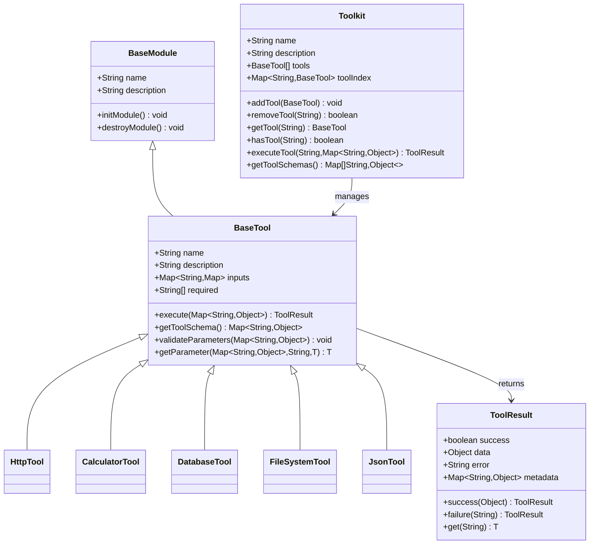
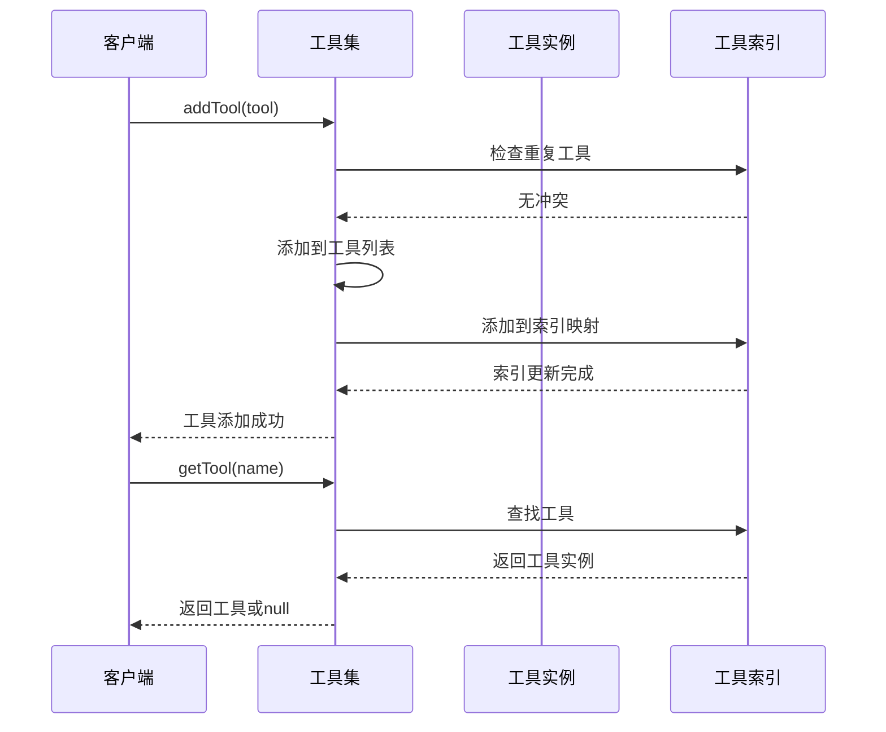

# 工具框架API参考

<cite>
**本文档引用的文件**
- [BaseTool.java](file://evox-tools/src/main/java/io/leavesfly/evox/tools/base/BaseTool.java)
- [Toolkit.java](file://evox-tools/src/main/java/io/leavesfly/evox/tools/base/Toolkit.java)
- [HttpTool.java](file://evox-tools/src/main/java/io/leavesfly/evox/tools/http/HttpTool.java)
- [CalculatorTool.java](file://evox-tools/src/main/java/io/leavesfly/evox/tools/calculator/CalculatorTool.java)
- [DatabaseTool.java](file://evox-tools/src/main/java/io/leavesfly/evox/tools/database/DatabaseTool.java)
- [FileSystemTool.java](file://evox-tools/src/main/java/io/leavesfly/evox/tools/file/FileSystemTool.java)
- [SearchTool.java](file://evox-tools/src/main/java/io/leavesfly/evox/tools/search/SearchTool.java)
- [JsonTool.java](file://evox-tools/src/main/java/io/leavesfly/evox/tools/json/JsonTool.java)
- [ToolsTest.java](file://evox-tools/src/test/java/io/leavesfly/evox/tools/ToolsTest.java)
- [NewToolsTest.java](file://evox-tools/src/test/java/io/leavesfly/evox/tools/NewToolsTest.java)
- [ToolsExample.java](file://evox-examples/src/main/java/io/leavesfly/evox/examples/ToolsExample.java)
- [ComprehensiveChatBot.java](file://evox-examples/src/main/java/io/leavesfly/evox/examples/ComprehensiveChatBot.java)
</cite>

## 目录
1. [简介](#简介)
2. [核心架构](#核心架构)
3. [BaseTool抽象基类](#basetool抽象基类)
4. [Toolkit工具集管理](#toolkit工具集管理)
5. [内置工具详解](#内置工具详解)
6. [自定义工具开发](#自定义工具开发)
7. [安全机制](#安全机制)
8. [性能优化](#性能优化)
9. [最佳实践](#最佳实践)

## 简介

EvoX工具框架是一个功能强大的工具管理系统，提供了统一的工具抽象层和丰富的内置工具集合。该框架支持工具的动态注册、参数验证、结果封装、权限控制和执行监控等功能，为构建智能代理系统提供了坚实的基础。

### 主要特性

- **统一抽象层**：所有工具都继承自BaseTool基类，提供一致的接口规范
- **动态工具集**：Toolkit类支持工具的动态添加、移除和管理
- **类型安全**：完善的参数验证和类型检查机制
- **结果标准化**：统一的ToolResult格式确保结果的一致性
- **扩展性强**：支持自定义工具的轻松集成
- **安全可靠**：内置权限控制和沙箱机制

## 核心架构



**图表来源**
- [BaseTool.java](file://evox-tools/src/main/java/io/leavesfly/evox/tools/base/BaseTool.java#L21-L179)
- [Toolkit.java](file://evox-tools/src/main/java/io/leavesfly/evox/tools/base/Toolkit.java#L20-L207)

## BaseTool抽象基类

BaseTool是所有工具的抽象基类，定义了工具的基本规范和通用功能。

### 核心属性

| 属性 | 类型 | 描述 | 必需 |
|------|------|------|------|
| name | String | 工具唯一标识符 | 是 |
| description | String | 工具功能描述 | 是 |
| inputs | Map<String,Map<String,String>> | 输入参数定义 | 否 |
| required | List<String> | 必需参数列表 | 否 |

### 抽象方法

#### execute(Map<String, Object> parameters)
工具的核心执行方法，必须在子类中实现。

**参数：**
- `parameters`：工具执行所需的参数映射

**返回值：**
- `ToolResult`：包含执行结果的标准格式对象

**实现规范：**
```java
@Override
public ToolResult execute(Map<String, Object> parameters) {
    try {
        // 参数验证
        validateParameters(parameters);
        
        // 参数提取
        String inputParam = getParameter(parameters, "input", "");
        
        // 业务逻辑处理
        Object result = performOperation(inputParam);
        
        // 返回成功结果
        return ToolResult.success(result);
    } catch (Exception e) {
        // 返回错误结果
        return ToolResult.failure("执行失败: " + e.getMessage());
    }
}
```

### 工具Schema生成

#### getToolSchema()
生成符合LLM function calling规范的工具Schema。

**返回格式：**
```json
{
  "type": "function",
  "function": {
    "name": "工具名称",
    "description": "工具描述",
    "parameters": {
      "type": "object",
      "properties": {
        "参数名": {
          "type": "参数类型",
          "description": "参数描述"
        }
      },
      "required": ["必需参数列表"]
    }
  }
}
```

### 辅助方法

#### validateParameters(Map<String, Object> parameters)
验证输入参数的有效性。

**验证规则：**
- 检查必需参数是否存在
- 验证参数值不为空
- 抛出IllegalArgumentException异常

#### getParameter(Map<String, Object> parameters, String key, T defaultValue)
安全地获取参数值，支持类型转换和默认值处理。

**使用示例：**
```java
// 获取字符串参数，提供默认值
String apiKey = getParameter(parameters, "api_key", "");

// 获取整数参数，提供默认值
int timeout = getParameter(parameters, "timeout", 30);

// 获取复杂对象参数
Map<String, String> headers = getParameter(parameters, "headers", new HashMap<>());
```

### ToolResult结果封装

ToolResult是工具执行结果的标准化封装类，提供成功和失败两种状态。

#### 成功结果
```java
// 基本成功结果
ToolResult success(String data)

// 带元数据的成功结果  
ToolResult success(Object data, Map<String, Object> metadata)
```

#### 失败结果
```java
// 基本失败结果
ToolResult failure(String error)

// 带元数据的失败结果
ToolResult failure(String error, Map<String, Object> metadata)
```

**段落来源**
- [BaseTool.java](file://evox-tools/src/main/java/io/leavesfly/evox/tools/base/BaseTool.java#L46-L179)

## Toolkit工具集管理

Toolkit类负责管理多个工具实例，提供统一的工具访问接口和生命周期管理。

### 核心功能

#### 工具注册与管理



**图表来源**
- [Toolkit.java](file://evox-tools/src/main/java/io/leavesfly/evox/tools/base/Toolkit.java#L60-L88)

#### 主要方法

##### addTool(BaseTool tool)
添加工具到工具集，自动建立名称索引。

**特点：**
- 自动检测重复工具名称
- 支持工具替换
- 记录添加日志

##### removeTool(String toolName)
从工具集中移除指定工具。

**返回值：**
- `true`：成功移除
- `false`：工具不存在

##### getTool(String toolName)
获取指定名称的工具实例。

**返回值：**
- 工具实例：如果存在
- `null`：如果不存在

##### hasTool(String toolName)
检查工具是否存在。

##### executeTool(String toolName, Map<String, Object> parameters)
直接执行指定工具。

**错误处理：**
- 工具不存在时返回失败结果
- 工具执行异常时捕获并记录错误

#### 工具信息查询

##### getToolNames()
获取所有工具名称列表。

##### getToolDescriptions()
获取所有工具描述列表。

##### getToolSchemas()
获取所有工具的Schema列表，用于LLM function calling。

##### getStatistics()
获取工具集统计信息：
- 工具集名称
- 工具数量
- 工具名称列表

**段落来源**
- [Toolkit.java](file://evox-tools/src/main/java/io/leavesfly/evox/tools/base/Toolkit.java#L60-L207)

## 内置工具详解

### HTTP请求工具 (HttpTool)

支持HTTP GET、POST、PUT、DELETE等请求操作。

#### 参数规范

| 参数 | 类型 | 必需 | 描述 |
|------|------|------|------|
| method | string | 是 | HTTP方法：GET、POST、PUT、DELETE |
| url | string | 是 | 目标URL |
| headers | object | 否 | HTTP请求头 |
| body | string | 否 | 请求体（POST/PUT时使用） |

#### 使用示例

```java
// 基本GET请求
Map<String, Object> getParams = new HashMap<>();
getParams.put("method", "GET");
getParams.put("url", "https://api.example.com/data");

// 带请求头的POST请求
Map<String, Object> postParams = new HashMap<>();
postParams.put("method", "POST");
postParams.put("url", "https://api.example.com/submit");
postParams.put("body", "{\"key\":\"value\"}");

Map<String, String> headers = new HashMap<>();
headers.put("Content-Type", "application/json");
postParams.put("headers", headers);
```

#### 结果格式

```json
{
  "success": true,
  "data": {
    "body": "响应体内容",
    "status_code": 200
  },
  "metadata": {
    "status_code": 200,
    "headers": {...},
    "url": "https://api.example.com",
    "method": "GET"
  }
}
```

**段落来源**
- [HttpTool.java](file://evox-tools/src/main/java/io/leavesfly/evox/tools/http/HttpTool.java#L82-L201)

### 计算器工具 (CalculatorTool)

提供基础和高级数学运算功能。

#### 支持的操作

| 操作 | 方法 | 描述 |
|------|------|------|
| 基础运算 | add, subtract, multiply, divide | 四则运算 |
| 高级函数 | power, sqrt, log, sin, cos, tan | 数学函数 |
| 统计函数 | mean, max, min | 数组统计 |

#### 表达式计算

支持JavaScript表达式语法：
```java
Map<String, Object> params = new HashMap<>();
params.put("expression", "(10 + 5) * 2 - 8");
// 结果：12
```

#### 安全特性
- 表达式清理，移除危险字符
- 类型安全的参数验证
- 异常捕获和错误处理

**段落来源**
- [CalculatorTool.java](file://evox-tools/src/main/java/io/leavesfly/evox/tools/calculator/CalculatorTool.java#L40-L259)

### 数据库工具 (DatabaseTool)

支持多种关系型数据库的SQL查询操作。

#### 支持的数据库

- PostgreSQL
- MySQL  
- H2内存数据库

#### 参数规范

| 参数 | 类型 | 必需 | 描述 |
|------|------|------|------|
| query | string | 是 | SQL查询语句 |
| parameters | object | 否 | 准备语句参数 |

#### 功能特性

##### 自动查询分类
- SELECT查询：执行查询并返回结果集
- DML操作：执行INSERT、UPDATE、DELETE并返回影响行数
- DDL操作：执行CREATE、DROP、ALTER等

##### 只读模式
```java
databaseTool.setReadOnly(true);
// 只允许SELECT、SHOW、DESCRIBE等查询操作
```

##### 辅助功能
- `listTables()`：列出所有表
- `getTableSchema(tableName)`：获取表结构信息

**段落来源**
- [DatabaseTool.java](file://evox-tools/src/main/java/io/leavesfly/evox/tools/database/DatabaseTool.java#L82-L236)

### 文件系统工具 (FileSystemTool)

提供文件和目录操作功能。

#### 支持的操作

| 操作 | 描述 |
|------|------|
| read | 读取文件内容 |
| write | 写入文件内容 |
| append | 追加文件内容 |
| delete | 删除文件 |
| list | 列出目录内容 |
| exists | 检查文件存在 |
| mkdir | 创建目录 |

#### 安全配置

```java
FileSystemTool fileTool = new FileSystemTool();
fileTool.setAllowAbsolutePaths(false); // 禁止绝对路径
fileTool.setAllowedExtensions(Arrays.asList(".txt", ".json")); // 限制文件类型
```

#### 结果格式
```json
{
  "success": true,
  "data": {
    "content": "文件内容",
    "filePath": "/path/to/file",
    "size": 1024
  }
}
```

**段落来源**
- [FileSystemTool.java](file://evox-tools/src/main/java/io/leavesfly/evox/tools/file/FileSystemTool.java#L49-L237)

### JSON工具 (JsonTool)

提供JSON解析、格式化和查询功能。

#### 支持的操作

| 操作 | 描述 |
|------|------|
| parse | 解析JSON字符串 |
| format | 格式化JSON |
| validate | 验证JSON格式 |
| query | 使用路径查询 |
| extract | 提取字段值 |

#### JSONPath查询支持
```java
// 基本查询
$.users[0].name

// 数组索引
$.items[2]

// 嵌套查询
$.user.profile.email
```

#### 验证结果
```json
{
  "valid": true,
  "message": "JSON is valid"
}
```

**段落来源**
- [JsonTool.java](file://evox-tools/src/main/java/io/leavesfly/evox/tools/json/JsonTool.java#L62-L317)

### 搜索工具 (SearchTool)

提供多种搜索引擎的搜索功能。

#### 支持的引擎

- Wikipedia
- Google Custom Search
- DuckDuckGo

#### 参数配置

| 参数 | 类型 | 默认值 | 描述 |
|------|------|--------|------|
| query | string | - | 搜索关键词 |
| numResults | integer | 5 | 最大结果数量 |

#### 使用示例
```java
// Wikipedia搜索
SearchTool wiki = new SearchTool("wikipedia", 3);
Map<String, Object> params = new HashMap<>();
params.put("query", "人工智能");
params.put("numResults", 2);
```

**段落来源**
- [SearchTool.java](file://evox-tools/src/main/java/io/leavesfly/evox/tools/search/SearchTool.java#L43-L179)

## 自定义工具开发

### 开发步骤

#### 1. 创建工具类

```java
public class CustomTool extends BaseTool {
    
    public CustomTool() {
        // 设置基本信息
        this.name = "custom_tool";
        this.description = "这是一个自定义工具示例";
        
        // 定义输入参数
        this.inputs = new HashMap<>();
        
        Map<String, String> param1 = new HashMap<>();
        param1.put("type", "string");
        param1.put("description", "第一个参数描述");
        this.inputs.put("param1", param1);
        
        this.required = List.of("param1");
    }
    
    @Override
    public ToolResult execute(Map<String, Object> parameters) {
        try {
            // 参数验证
            validateParameters(parameters);
            
            // 参数提取
            String input = getParameter(parameters, "param1", "");
            
            // 业务逻辑
            String result = processInput(input);
            
            // 返回结果
            return ToolResult.success(result);
            
        } catch (Exception e) {
            return ToolResult.failure("执行失败: " + e.getMessage());
        }
    }
    
    private String processInput(String input) {
        // 自定义业务逻辑
        return "处理结果: " + input.toUpperCase();
    }
}
```

#### 2. 注册工具到工具集

```java
Toolkit toolkit = new Toolkit("MyTools", "我的工具集");
CustomTool customTool = new CustomTool();
toolkit.addTool(customTool);
```

#### 3. 使用工具

```java
Map<String, Object> params = new HashMap<>();
params.put("param1", "测试输入");

ToolResult result = toolkit.executeTool("custom_tool", params);
if (result.isSuccess()) {
    System.out.println("结果: " + result.getData());
} else {
    System.out.println("错误: " + result.getError());
}
```

### 最佳实践

#### 参数验证
```java
@Override
public ToolResult execute(Map<String, Object> parameters) {
    // 1. 基础参数验证
    validateParameters(parameters);
    
    // 2. 自定义验证
    String value = getParameter(parameters, "value", "");
    if (value.length() < 5) {
        return ToolResult.failure("值太短，至少需要5个字符");
    }
    
    // 3. 类型验证
    Integer count = getParameter(parameters, "count", 0);
    if (count < 0) {
        return ToolResult.failure("计数值不能为负数");
    }
    
    return ToolResult.success("验证通过");
}
```

#### 错误处理
```java
@Override
public ToolResult execute(Map<String, Object> parameters) {
    try {
        // 可能抛出异常的操作
        riskyOperation();
        
    } catch (ValidationException e) {
        // 参数验证错误
        return ToolResult.failure("参数验证失败: " + e.getMessage());
        
    } catch (SecurityException e) {
        // 权限错误
        return ToolResult.failure("权限不足: " + e.getMessage());
        
    } catch (Exception e) {
        // 未知错误
        log.error("工具执行异常", e);
        return ToolResult.failure("内部错误: " + e.getMessage());
    }
}
```

#### 性能优化
```java
private static final ThreadLocal<SimpleDateFormat> DATE_FORMATTER = 
    ThreadLocal.withInitial(() -> new SimpleDateFormat("yyyy-MM-dd"));
    
@Override
public ToolResult execute(Map<String, Object> parameters) {
    // 缓存昂贵的初始化操作
    if (cachedResource == null) {
        synchronized(this) {
            if (cachedResource == null) {
                cachedResource = expensiveInitialization();
            }
        }
    }
    
    // 使用线程本地变量避免同步开销
    String formattedDate = DATE_FORMATTER.get().format(new Date());
    
    return ToolResult.success(formattedDate);
}
```

**段落来源**
- [BaseTool.java](file://evox-tools/src/main/java/io/leavesfly/evox/tools/base/BaseTool.java#L77-L112)

## 安全机制

### 权限控制

#### 工具级别权限
```java
// 设置工具访问权限
public class PermissionControlledTool extends BaseTool {
    
    private Set<String> allowedRoles;
    
    public PermissionControlledTool(Set<String> allowedRoles) {
        this.allowedRoles = allowedRoles;
    }
    
    @Override
    public ToolResult execute(Map<String, Object> parameters) {
        // 检查角色权限
        String userRole = getCurrentUserRole();
        if (!allowedRoles.contains(userRole)) {
            return ToolResult.failure("角色权限不足");
        }
        
        return performOperation(parameters);
    }
}
```

#### 工具集级别权限
```java
public class SecureToolkit extends Toolkit {
    
    private Map<String, Set<String>> toolPermissions;
    
    public boolean hasPermission(String toolName, String role) {
        Set<String> roles = toolPermissions.get(toolName);
        return roles != null && roles.contains(role);
    }
    
    @Override
    public ToolResult executeTool(String toolName, Map<String, Object> parameters) {
        if (!hasPermission(toolName, getCurrentUserRole())) {
            return ToolResult.failure("工具访问被拒绝");
        }
        
        return super.executeTool(toolName, parameters);
    }
}
```

### 执行沙箱

#### 代码执行沙箱
```java
public class SandboxedCodeTool extends BaseTool {
    
    private ScriptEngine engine;
    private boolean sandboxMode;
    
    public SandboxedCodeTool(boolean sandboxMode) {
        this.sandboxMode = sandboxMode;
        this.engine = new ScriptEngineManager().getEngineByName("javascript");
    }
    
    @Override
    public ToolResult execute(Map<String, Object> parameters) {
        String code = getParameter(parameters, "code", "");
        
        if (sandboxMode) {
            // 检查危险代码
            if (containsDangerousCode(code)) {
                return ToolResult.failure("检测到危险代码");
            }
            
            // 限制资源访问
            restrictScriptEnvironment();
        }
        
        return executeSafely(code);
    }
    
    private boolean containsDangerousCode(String code) {
        String[] dangerousPatterns = {
            "java.lang.System.exit",
            "java.lang.Runtime.getRuntime",
            "java.io.File",
            "java.net.URL"
        };
        
        for (String pattern : dangerousPatterns) {
            if (code.contains(pattern)) {
                return true;
            }
        }
        return false;
    }
}
```

### 调用链追踪

#### 日志记录
```java
@Slf4j
public class TracedTool extends BaseTool {
    
    @Override
    public ToolResult execute(Map<String, Object> parameters) {
        String traceId = UUID.randomUUID().toString();
        
        log.info("开始执行工具 [{}]，跟踪ID: {}", getName(), traceId);
        log.debug("参数: {}", parameters);
        
        long startTime = System.currentTimeMillis();
        ToolResult result;
        
        try {
            result = performOperation(parameters);
            
            long duration = System.currentTimeMillis() - startTime;
            if (result.isSuccess()) {
                log.info("工具执行成功 [{}]，耗时: {}ms", getName(), duration);
            } else {
                log.warn("工具执行失败 [{}]，耗时: {}ms，错误: {}", 
                        getName(), duration, result.getError());
            }
            
            return result;
            
        } catch (Exception e) {
            long duration = System.currentTimeMillis() - startTime;
            log.error("工具执行异常 [{}]，耗时: {}ms", getName(), duration, e);
            return ToolResult.failure("内部错误: " + e.getMessage());
        }
    }
}
```

#### 分布式追踪
```java
public class DistributedTracedTool extends BaseTool {
    
    private Tracer tracer;
    
    @Override
    public ToolResult execute(Map<String, Object> parameters) {
        Span span = tracer.spanBuilder(getName())
            .setAttribute("tool.name", getName())
            .setAttribute("tool.version", getVersion())
            .startSpan();
            
        try (Scope scope = span.makeCurrent()) {
            // 执行工具逻辑
            return performOperation(parameters);
            
        } catch (Exception e) {
            span.recordException(e);
            span.setStatus(StatusCode.ERROR, e.getMessage());
            throw e;
            
        } finally {
            span.end();
        }
    }
}
```

## 性能优化

### 高频调用优化

#### 连接池管理
```java
public class OptimizedHttpTool extends HttpTool {
    
    private static final int MAX_CONNECTIONS = 20;
    private static final int CONNECTION_TIMEOUT = 5000;
    
    public OptimizedHttpTool() {
        // 配置连接池
        PoolingHttpClientConnectionManager connectionManager = 
            new PoolingHttpClientConnectionManager();
        connectionManager.setMaxTotal(MAX_CONNECTIONS);
        connectionManager.setDefaultMaxPerRoute(MAX_CONNECTIONS);
        
        CloseableHttpClient client = HttpClients.custom()
            .setConnectionManager(connectionManager)
            .setConnectionTimeToLive(CONNECTION_TIMEOUT, TimeUnit.MILLISECONDS)
            .build();
            
        this.httpClient = new HttpComponentsClientHttpRequestFactory(client);
    }
}
```

#### 缓存策略
```java
public class CachedDatabaseTool extends DatabaseTool {
    
    private final LoadingCache<String, List<Map<String, Object>>> queryCache;
    private final ScheduledExecutorService cacheCleaner;
    
    public CachedDatabaseTool(String connectionUrl, String username, String password) {
        super(connectionUrl, username, password, "postgresql");
        
        this.queryCache = Caffeine.newBuilder()
            .expireAfterWrite(10, TimeUnit.MINUTES)
            .maximumSize(1000)
            .build(this::executeQueryWithoutCache);
            
        this.cacheCleaner = Executors.newScheduledThreadPool(1);
        scheduleCacheCleanup();
    }
    
    private List<Map<String, Object>> executeQueryWithoutCache(String sql) {
        // 执行原始查询
        return jdbcTemplate.queryForList(sql);
    }
    
    @Override
    public ToolResult execute(Map<String, Object> parameters) {
        String query = getParameter(parameters, "query", "");
        
        // 尝试从缓存获取结果
        try {
            List<Map<String, Object>> cachedResult = queryCache.get(query);
            return ToolResult.success(cachedResult);
        } catch (Exception e) {
            // 缓存未命中，执行查询
            return super.execute(parameters);
        }
    }
    
    private void scheduleCacheCleanup() {
        cacheCleaner.scheduleAtFixedRate(() -> {
            queryCache.cleanUp();
        }, 5, 5, TimeUnit.MINUTES);
    }
}
```

### 内存优化

#### 对象池化
```java
public class PooledJsonTool extends JsonTool {
    
    private final ObjectPool<ObjectMapper> objectMapperPool;
    
    public PooledJsonTool() {
        this.objectMapperPool = new GenericObjectPool<>(new ObjectMapperFactory());
    }
    
    private ObjectMapper borrowObjectMapper() {
        try {
            return objectMapperPool.borrowObject();
        } catch (Exception e) {
            return new ObjectMapper();
        }
    }
    
    private void returnObjectMapper(ObjectMapper mapper) {
        try {
            objectMapperPool.returnObject(mapper);
        } catch (Exception e) {
            // 忽略返回错误
        }
    }
    
    @Override
    public ToolResult execute(Map<String, Object> parameters) {
        ObjectMapper mapper = borrowObjectMapper();
        try {
            return performOperation(parameters, mapper);
        } finally {
            returnObjectMapper(mapper);
        }
    }
}
```

### 并发优化

#### 异步执行
```java
public class AsyncTool extends BaseTool {
    
    private final ExecutorService executor;
    
    public AsyncTool(int threadPoolSize) {
        this.executor = Executors.newFixedThreadPool(threadPoolSize);
    }
    
    @Override
    public ToolResult execute(Map<String, Object> parameters) {
        CompletableFuture<ToolResult> future = CompletableFuture.supplyAsync(() -> {
            return performOperation(parameters);
        }, executor);
        
        try {
            // 设置超时时间
            return future.get(30, TimeUnit.SECONDS);
        } catch (TimeoutException e) {
            future.cancel(true);
            return ToolResult.failure("操作超时");
        } catch (Exception e) {
            return ToolResult.failure("异步执行失败: " + e.getMessage());
        }
    }
}
```

### 监控指标

#### 性能指标收集
```java
public class MonitoredTool extends BaseTool {
    
    private final MeterRegistry meterRegistry;
    private final Timer.Sample executionTimer;
    
    public MonitoredTool(MeterRegistry registry) {
        this.meterRegistry = registry;
        this.executionTimer = Timer.start(registry);
    }
    
    @Override
    public ToolResult execute(Map<String, Object> parameters) {
        Timer.Sample sample = Timer.start(meterRegistry);
        
        try {
            ToolResult result = performOperation(parameters);
            
            // 记录成功指标
            recordSuccessMetrics(result);
            return result;
            
        } catch (Exception e) {
            // 记录失败指标
            recordFailureMetrics(e);
            throw e;
            
        } finally {
            sample.stop(Timer.builder("tool.execution.duration")
                .tag("tool.name", getName())
                .register(meterRegistry));
        }
    }
    
    private void recordSuccessMetrics(ToolResult result) {
        Counter.builder("tool.executions.total")
            .tag("tool.name", getName())
            .tag("status", "success")
            .register(meterRegistry)
            .increment();
    }
    
    private void recordFailureMetrics(Exception e) {
        Counter.builder("tool.executions.total")
            .tag("tool.name", getName())
            .tag("status", "failure")
            .register(meterRegistry)
            .increment();
    }
}
```

## 最佳实践

### 工具设计原则

#### 单一职责原则
```java
// 推荐：专注于单一功能
public class FileUploaderTool extends BaseTool {
    @Override
    public ToolResult execute(Map<String, Object> parameters) {
        // 专门处理文件上传
        return uploadFile(parameters);
    }
}

// 不推荐：功能过于复杂
public class AllInOneTool extends BaseTool {
    @Override
    public ToolResult execute(Map<String, Object> parameters) {
        // 处理上传、下载、压缩等多种功能
        if (isUploadOperation(parameters)) {
            return uploadFile(parameters);
        } else if (isDownloadOperation(parameters)) {
            return downloadFile(parameters);
        }
        // ...
    }
}
```

#### 开放封闭原则
```java
public abstract class ConfigurableTool extends BaseTool {
    
    protected Map<String, Object> config;
    
    public ConfigurableTool(Map<String, Object> config) {
        this.config = config;
        initializeFromConfig(config);
    }
    
    protected abstract void initializeFromConfig(Map<String, Object> config);
    
    protected String getConfig(String key, String defaultValue) {
        return (String) config.getOrDefault(key, defaultValue);
    }
    
    protected Integer getConfig(String key, Integer defaultValue) {
        return (Integer) config.getOrDefault(key, defaultValue);
    }
}
```

### 错误处理策略

#### 分层错误处理
```java
public class RobustTool extends BaseTool {
    
    @Override
    public ToolResult execute(Map<String, Object> parameters) {
        try {
            // 第一层：参数验证
            validateParameters(parameters);
            
            // 第二层：业务逻辑
            return performBusinessLogic(parameters);
            
        } catch (ValidationException e) {
            // 参数验证错误 - 记录详细信息
            log.warn("参数验证失败: {}", e.getMessage(), e);
            return ToolResult.failure("参数错误: " + e.getMessage());
            
        } catch (BusinessException e) {
            // 业务逻辑错误 - 记录上下文
            log.warn("业务逻辑错误 [{}]: {}", getName(), e.getMessage(), e);
            return ToolResult.failure("业务错误: " + e.getMessage());
            
        } catch (InfrastructureException e) {
            // 基础设施错误 - 重试机制
            log.error("基础设施错误 [{}]: {}", getName(), e.getMessage(), e);
            return ToolResult.failure("系统错误，请稍后重试");
            
        } catch (Exception e) {
            // 未知错误 - 记录完整堆栈
            log.error("未知错误 [{}]: {}", getName(), e.getMessage(), e);
            return ToolResult.failure("内部错误: " + e.getMessage());
        }
    }
}
```

### 测试策略

#### 单元测试模板
```java
@Test
void testExecute_ValidParameters() {
    // 准备测试数据
    Map<String, Object> parameters = new HashMap<>();
    parameters.put("input", "test input");
    
    // 执行测试
    ToolResult result = tool.execute(parameters);
    
    // 验证结果
    assertTrue(result.isSuccess());
    assertNotNull(result.getData());
}

@Test
void testExecute_MissingRequiredParameter() {
    // 准备缺少必需参数的数据
    Map<String, Object> parameters = new HashMap<>();
    // 忽略必需参数
    
    // 执行测试
    ToolResult result = tool.execute(parameters);
    
    // 验证结果
    assertFalse(result.isSuccess());
    assertTrue(result.getError().contains("Missing required parameter"));
}

@Test
void testExecute_InvalidParameterFormat() {
    // 准备格式错误的参数
    Map<String, Object> parameters = new HashMap<>();
    parameters.put("input", 123); // 应该是字符串
    
    // 执行测试
    ToolResult result = tool.execute(parameters);
    
    // 验证结果
    assertFalse(result.isSuccess());
    assertTrue(result.getError().contains("Invalid parameter format"));
}
```

#### 集成测试
```java
@Test
void testToolIntegration() {
    // 创建完整的工具链
    Toolkit toolkit = new Toolkit("integration", "集成测试工具集");
    toolkit.addTool(new FileSystemTool());
    toolkit.addTool(new HttpTool());
    
    // 执行端到端测试
    Map<String, Object> fileParams = new HashMap<>();
    fileParams.put("operation", "write");
    fileParams.put("filePath", "/tmp/integration_test.txt");
    fileParams.put("content", "集成测试内容");
    
    ToolResult fileResult = toolkit.executeTool("file_system", fileParams);
    assertTrue(fileResult.isSuccess());
    
    // 验证文件已创建
    Map<String, Object> readParams = new HashMap<>();
    readParams.put("operation", "read");
    readParams.put("filePath", "/tmp/integration_test.txt");
    
    ToolResult readResult = toolkit.executeTool("file_system", readParams);
    assertTrue(readResult.isSuccess());
    
    // 清理测试文件
    Map<String, Object> deleteParams = new HashMap<>();
    deleteParams.put("operation", "delete");
    deleteParams.put("filePath", "/tmp/integration_test.txt");
    
    ToolResult deleteResult = toolkit.executeTool("file_system", deleteParams);
    assertTrue(deleteResult.isSuccess());
}
```

### 文档规范

#### 工具文档模板
```java
/**
 * 文件处理工具
 * <p>
 * 提供文件系统操作功能，包括读取、写入、追加、删除等操作。
 * <p>
 * <strong>使用场景：</strong>
 * - 日志文件管理
 * - 配置文件读写
 * - 数据文件处理
 * <p>
 * <strong>安全考虑：</strong>
 * - 限制文件扩展名
 * - 禁止绝对路径访问
 * - 文件大小限制
 * <p>
 * <strong>示例：</strong>
 * <pre>
 * // 写入文件
 * Map&lt;String, Object&gt; params = new HashMap&lt;&gt;();
 * params.put("operation", "write");
 * params.put("filePath", "/tmp/data.txt");
 * params.put("content", "Hello World");
 * ToolResult result = tool.execute(params);
 * </pre>
 * 
 * @since 1.0.0
 * @author EvoX Team
 */
public class FileSystemTool extends BaseTool {
    // 实现...
}
```

**段落来源**
- [ToolsTest.java](file://evox-tools/src/test/java/io/leavesfly/evox/tools/ToolsTest.java#L65-L379)
- [NewToolsTest.java](file://evox-tools/src/test/java/io/leavesfly/evox/tools/NewToolsTest.java#L28-L379)