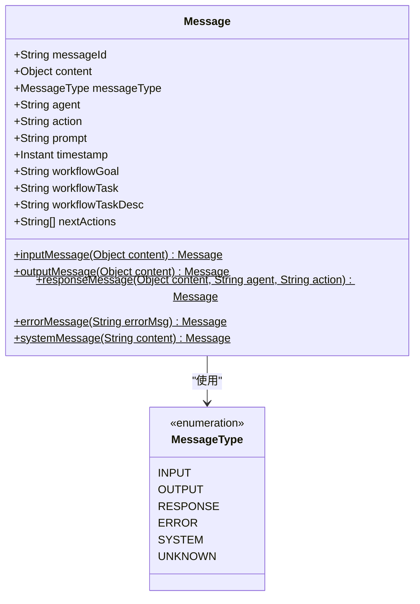
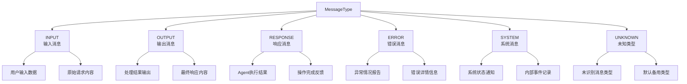
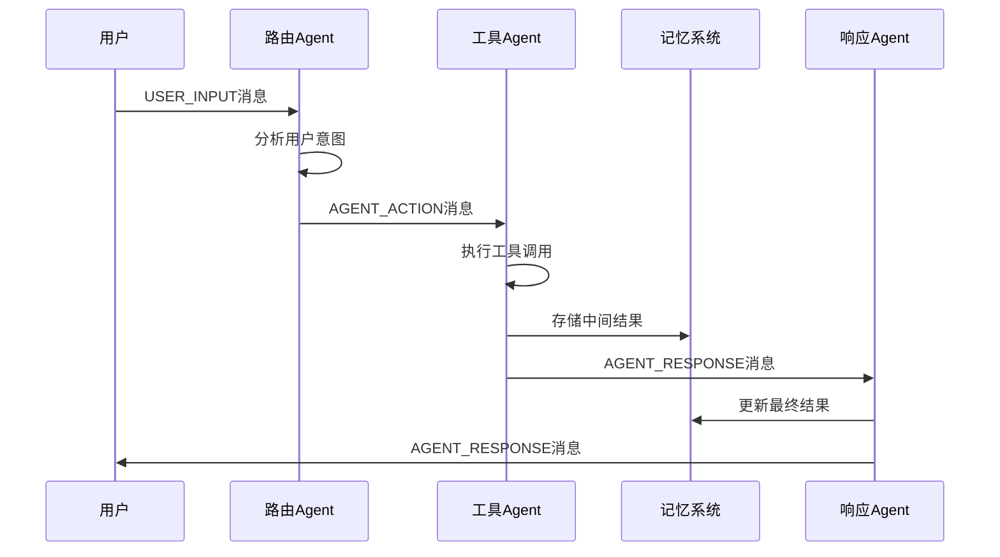
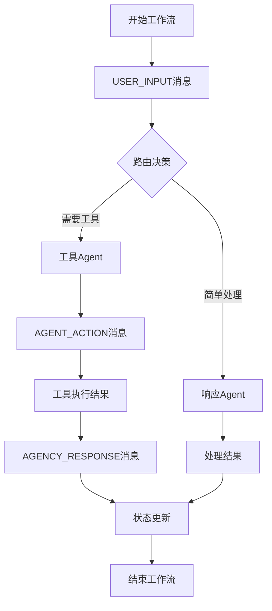

# Message类及其相关类型API文档

<cite>
**本文档中引用的文件**
- [Message.java](file://evox-core/src/main/java/io/leavesfly/evox/core/message/Message.java)
- [MessageType.java](file://evox-core/src/main/java/io/leavesfly/evox/core/message/MessageType.java)
- [MessageTest.java](file://evox-core/src/test/java/io/leavesfly/evox/core/message/MessageTest.java)
- [MessageBenchmark.java](file://evox-benchmark/src/main/java/io/leavesfly/evox/benchmark/MessageBenchmark.java)
- [ComprehensiveChatBot.java](file://evox-examples/src/main/java/io/leavesfly/evox/examples/ComprehensiveChatBot.java)
- [MemoryManager.java](file://evox-memory/src/main/java/io/leavesfly/evox/memory/manager/MemoryManager.java)
</cite>

## 目录
1. [简介](#简介)
2. [Message类概述](#message类概述)
3. [核心字段结构](#核心字段结构)
4. [MessageType枚举](#messagetype枚举)
5. [消息类型详解](#消息类型详解)
6. [消息创建工厂方法](#消息创建工厂方法)
7. [序列化与JSON处理](#序列化与json处理)
8. [在系统中的核心作用](#在系统中的核心作用)
9. [性能考虑与优化](#性能考虑与优化)
10. [常见问题与解决方案](#常见问题与解决方案)
11. [最佳实践](#最佳实践)
12. [总结](#总结)

## 简介

Message类是EvoX智能体系统的核心通信组件，负责在Agent、Workflow和Action之间传递信息。它提供了统一的消息格式，支持多种消息类型，并通过Jackson进行高效的JSON序列化和反序列化。

## Message类概述

Message类采用Lombok注解简化开发，提供了完整的Builder模式支持，确保线程安全和不可变性。



**图表来源**
- [Message.java](file://evox-core/src/main/java/io/leavesfly/evox/core/message/Message.java#L19-L136)
- [MessageType.java](file://evox-core/src/main/java/io/leavesfly/evox/core/message/MessageType.java#L9-L40)

**节来源**
- [Message.java](file://evox-core/src/main/java/io/leavesfly/evox/core/message/Message.java#L1-L136)
- [MessageType.java](file://evox-core/src/main/java/io/leavesfly/evox/core/message/MessageType.java#L1-L40)

## 核心字段结构

### 基础字段

| 字段名 | 类型 | 默认值 | 约束 | 描述 |
|--------|------|--------|------|------|
| messageId | String | UUID.randomUUID() | 唯一标识 | 消息的唯一标识符，自动生成 |
| content | Object | null | 可变类型 | 消息内容，支持任意对象类型 |
| messageType | MessageType | MessageType.UNKNOWN | 枚举类型 | 消息类型标识 |
| timestamp | Instant | Instant.now() | 时间戳 | 消息创建时间，默认当前时间 |

### 上下文字段

| 字段名 | 类型 | 约束 | 描述 |
|--------|------|------|------|
| agent | String | 可选 | 发送消息的Agent名称 |
| action | String | 可选 | 执行的操作名称 |
| prompt | String | 可选 | 使用的提示词模板 |
| workflowGoal | String | 可选 | 工作流目标描述 |
| workflowTask | String | 可选 | 当前工作流任务 |
| workflowTaskDesc | String | 可选 | 任务详细描述 |
| nextActions | List<String> | 可选 | 下一步动作列表 |

**节来源**
- [Message.java](file://evox-core/src/main/java/io/leavesfly/evox/core/message/Message.java#L25-L83)

## MessageType枚举

MessageType枚举定义了系统中所有可能的消息类型，每种类型都有特定的用途和处理逻辑。



**图表来源**
- [MessageType.java](file://evox-core/src/main/java/io/leavesfly/evox/core/message/MessageType.java#L9-L40)

**节来源**
- [MessageType.java](file://evox-core/src/main/java/io/leavesfly/evox/core/message/MessageType.java#L1-L40)

## 消息类型详解

### USER_INPUT (INPUT)
**用途**: 表示来自用户的原始输入数据
**特点**: 
- 通常作为消息链的起点
- 包含用户直接提供的内容
- 可能需要进一步解析和验证

**典型应用场景**:
- 用户聊天输入
- 表单提交数据
- 文件上传内容

### AGENT_RESPONSE (OUTPUT)
**用途**: 表示Agent处理后的输出结果
**特点**:
- 经过业务逻辑处理的内容
- 准备发送给下一个组件或用户
- 可能包含格式化后的数据

**典型应用场景**:
- AI生成的回答
- 数据处理结果
- 决策建议输出

### AGENT_ACTION (RESPONSE)
**用途**: 表示Agent执行具体操作后的响应
**特点**:
- 包含执行上下文信息
- 关联特定的Agent和操作
- 用于跟踪执行过程

**典型应用场景**:
- 工具调用结果
- 数据库操作反馈
- API调用响应

### SYSTEM_EVENT (SYSTEM)
**用途**: 表示系统内部事件或状态变更
**特点**:
- 系统级别的通知
- 不直接面向用户
- 用于监控和调试

**典型应用场景**:
- 系统启动完成
- 内存使用警告
- 性能指标更新

### ERROR
**用途**: 表示错误或异常情况
**特点**:
- 包含错误详情
- 用于错误处理和恢复
- 可能触发降级策略

**典型应用场景**:
- 网络连接失败
- 数据格式错误
- 权限不足

### UNKNOWN
**用途**: 未知或未识别的消息类型
**特点**:
- 作为默认备用类型
- 用于兼容性和向后兼容
- 可能需要特殊处理

**节来源**
- [MessageType.java](file://evox-core/src/main/java/io/leavesfly/evox/core/message/MessageType.java#L10-L39)

## 消息创建工厂方法

Message类提供了多个静态工厂方法，简化不同类型消息的创建过程。

### 输入消息创建

```java
// 创建用户输入消息
Message inputMsg = Message.inputMessage("用户提问内容");

// 创建时自动设置类型为INPUT
// 自动生成messageId和timestamp
```

### 输出消息创建

```java
// 创建处理结果输出
Message outputMsg = Message.outputMessage(processedResult);

// 设置类型为OUTPUT
// 保留原始输入的上下文信息
```

### 响应消息创建

```java
// 创建Agent执行响应
Message responseMsg = Message.responseMessage(
    "处理结果", 
    "AgentName", 
    "ActionName"
);

// 包含执行上下文信息
// 便于追踪和调试
```

### 错误消息创建

```java
// 创建错误报告
Message errorMsg = Message.errorMessage("具体错误描述");

// 统一错误处理格式
// 便于错误收集和分析
```

### 系统消息创建

```java
// 创建系统通知
Message systemMsg = Message.systemMessage("系统状态更新");

// 用于内部监控和日志记录
```

**节来源**
- [Message.java](file://evox-core/src/main/java/io/leavesfly/evox/core/message/Message.java#L87-L134)

## 序列化与JSON处理

### Jackson注解配置

Message类使用Jackson进行JSON序列化，通过以下注解优化处理：

- `@JsonInclude(JsonInclude.Include.NON_NULL)`: 忽略null值字段
- `@Builder`: 支持Builder模式构建
- `@Data`: 自动生成getter/setter等方法
- `@NoArgsConstructor/@AllArgsConstructor`: 提供构造函数

### JSON序列化示例

```json
{
  "messageId": "550e8400-e29b-41d4-a716-446655440000",
  "content": "用户提问的具体内容",
  "messageType": "INPUT",
  "timestamp": "2024-01-15T10:30:00Z",
  "agent": null,
  "action": null,
  "prompt": null,
  "workflowGoal": null,
  "workflowTask": null,
  "workflowTaskDesc": null,
  "nextActions": null
}
```

### 反序列化注意事项

1. **类型安全**: Jackson会根据字段类型自动转换，但要注意类型兼容性
2. **日期格式**: Instant类型使用ISO-8601格式
3. **空值处理**: null值字段会被忽略，确保客户端正确处理缺失字段
4. **版本兼容**: 新增字段不会影响旧版本客户端的反序列化

### 性能优化

- 使用Jackson的流式API处理大型消息
- 启用适当的缓存机制
- 避免频繁的对象创建

**节来源**
- [Message.java](file://evox-core/src/main/java/io/leavesfly/evox/core/message/Message.java#L3-L24)

## 在系统中的核心作用

### Agent通信桥梁

Message类在智能体系统中充当通信桥梁，连接不同的Agent组件：



**图表来源**
- [ComprehensiveChatBot.java](file://evox-examples/src/main/java/io/leavesfly/evox/examples/ComprehensiveChatBot.java#L140-L160)

### Workflow状态传递

在工作流中，Message类用于传递状态信息和控制流：



### 日志记录与监控

Message类在系统监控中发挥重要作用：

- **审计跟踪**: 记录所有关键操作和决策
- **性能监控**: 跟踪消息处理时间和频率
- **错误诊断**: 提供详细的错误上下文信息
- **行为分析**: 分析用户交互模式和系统行为

**节来源**
- [ComprehensiveChatBot.java](file://evox-examples/src/main/java/io/leavesfly/evox/examples/ComprehensiveChatBot.java#L140-L160)
- [MemoryManager.java](file://evox-memory/src/main/java/io/leavesfly/evox/memory/manager/MemoryManager.java#L73-L84)

## 性能考虑与优化

### 消息大小限制

为了确保系统性能，建议实施以下消息大小限制：

| 消息类型 | 推荐最大大小 | 压缩策略 | 备注 |
|----------|--------------|----------|------|
| USER_INPUT | 64KB | gzip压缩 | 用户输入内容 |
| AGENT_RESPONSE | 1MB | gzip压缩 | 处理结果输出 |
| AGENT_ACTION | 128KB | gzip压缩 | 执行上下文 |
| SYSTEM_EVENT | 32KB | 文本压缩 | 系统通知 |
| ERROR | 64KB | 文本压缩 | 错误详情 |

### 压缩策略

```java
// 压缩大消息内容
public byte[] compressContent(Object content) {
    // 实现gzip压缩逻辑
    // 返回压缩后的字节数组
}

// 解压缩消息内容
public Object decompressContent(byte[] compressedData) {
    // 实现解压缩逻辑
    // 返回原始对象
}
```

### 内存管理

Message类的内存使用优化：

- **对象池**: 复用Message实例减少GC压力
- **延迟加载**: 按需加载消息内容
- **弱引用**: 对于临时消息使用弱引用
- **定期清理**: 清理过期的消息引用

### 并发处理

- **不可变设计**: 确保线程安全
- **无锁设计**: 避免不必要的同步开销
- **批量处理**: 批量操作提高吞吐量

**节来源**
- [MessageBenchmark.java](file://evox-benchmark/src/main/java/io/leavesfly/evox/benchmark/MessageBenchmark.java#L61-L67)

## 常见问题与解决方案

### 消息过大问题

**问题描述**: 消息内容过大导致性能下降或传输失败

**解决方案**:
1. **内容分片**: 将大内容分割成多个小消息
2. **外部存储**: 将大内容存储在外部系统，消息中只保留引用
3. **压缩传输**: 使用gzip等压缩算法减小传输体积
4. **流式处理**: 采用流式处理避免全量加载

### 编码错误

**问题描述**: JSON序列化/反序列化过程中出现编码问题

**解决方案**:
1. **字符集统一**: 使用UTF-8编码
2. **特殊字符转义**: 正确处理特殊字符
3. **长度限制**: 限制字符串长度避免溢出
4. **类型检查**: 确保对象类型兼容

### 类型不匹配

**问题描述**: 消息类型与预期不符导致处理错误

**解决方案**:
1. **类型验证**: 在接收端验证消息类型
2. **版本控制**: 使用版本号区分不同格式
3. **默认处理**: 为未知类型提供默认处理逻辑
4. **错误报告**: 详细记录类型不匹配信息

### 性能瓶颈

**问题描述**: 消息处理成为系统瓶颈

**解决方案**:
1. **异步处理**: 使用异步消息队列
2. **批量操作**: 批量处理减少开销
3. **缓存机制**: 缓存常用消息内容
4. **负载均衡**: 分散消息处理负载

### 内存泄漏

**问题描述**: 消息引用导致内存无法释放

**解决方案**:
1. **及时清理**: 处理完成后清理消息引用
2. **弱引用**: 对于非关键消息使用弱引用
3. **定期回收**: 定期回收过期消息
4. **监控告警**: 监控内存使用情况

## 最佳实践

### 消息设计原则

1. **单一职责**: 每个消息只携带一种类型的信息
2. **最小化**: 只包含必要的字段，避免冗余
3. **一致性**: 保持消息结构的一致性
4. **可扩展**: 设计时考虑未来扩展需求

### 使用模式

```java
// 推荐：使用Builder模式创建复杂消息
Message message = Message.builder()
    .content(userInput)
    .messageType(MessageType.INPUT)
    .agent("UserAgent")
    .workflowGoal("处理用户查询")
    .build();

// 推荐：使用工厂方法创建标准消息
Message response = Message.responseMessage(
    result, 
    "ProcessingAgent", 
    "DataProcessor"
);

// 推荐：合理使用上下文字段
Message error = Message.errorMessage("数据库连接失败")
    .withAgent("DatabaseAgent")
    .withAction("Connect");
```

### 错误处理

```java
// 推荐：统一的错误消息格式
try {
    // 消息处理逻辑
} catch (Exception e) {
    Message error = Message.builder()
        .messageType(MessageType.ERROR)
        .content(e.getMessage())
        .agent(currentAgent)
        .action(currentAction)
        .build();
    // 错误处理逻辑
}
```

### 性能优化

```java
// 推荐：批量处理消息
List<Message> batch = messages.stream()
    .filter(msg -> msg.getMessageType() == MessageType.INPUT)
    .collect(Collectors.toList());

// 推荐：使用对象池
MessagePool pool = new MessagePool();
Message pooledMessage = pool.borrowMessage();
// 使用后归还
pool.returnMessage(pooledMessage);
```

### 监控和调试

```java
// 推荐：添加监控标签
Message monitoredMessage = Message.builder()
    .content(data)
    .messageType(MessageType.OUTPUT)
    .customTags(Map.of(
        "processingTime", "150ms",
        "memoryUsed", "2.3MB"
    ))
    .build();
```

## 总结

Message类及其相关类型构成了EvoX智能体系统的核心通信基础设施。通过精心设计的字段结构、丰富的消息类型和高效的序列化机制，它实现了：

1. **统一的通信协议**: 为系统各组件提供一致的消息格式
2. **灵活的类型系统**: 支持多种消息类型的语义区分
3. **高效的序列化**: 通过Jackson实现高性能的JSON处理
4. **完善的生命周期管理**: 支持消息的创建、传播、存储和清理
5. **强大的扩展能力**: 易于适应新的业务需求和技术演进

在实际应用中，开发者应该遵循最佳实践，注意性能优化和错误处理，确保系统的稳定性和可维护性。随着系统的不断发展，Message类将继续演进，为智能体系统的通信需求提供更加完善的支持。