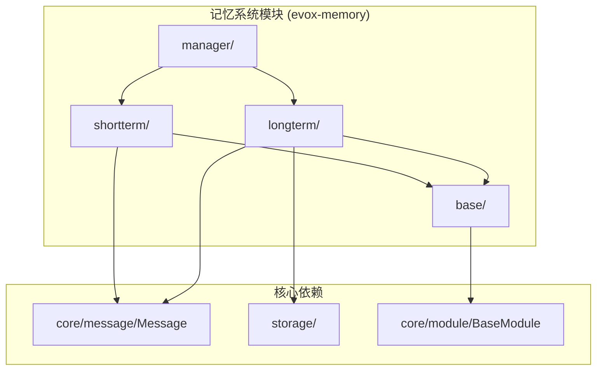
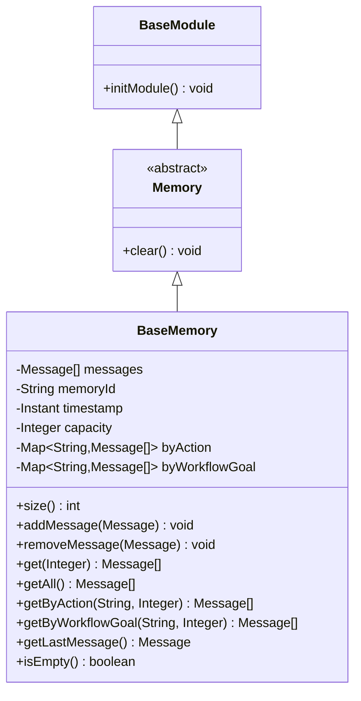
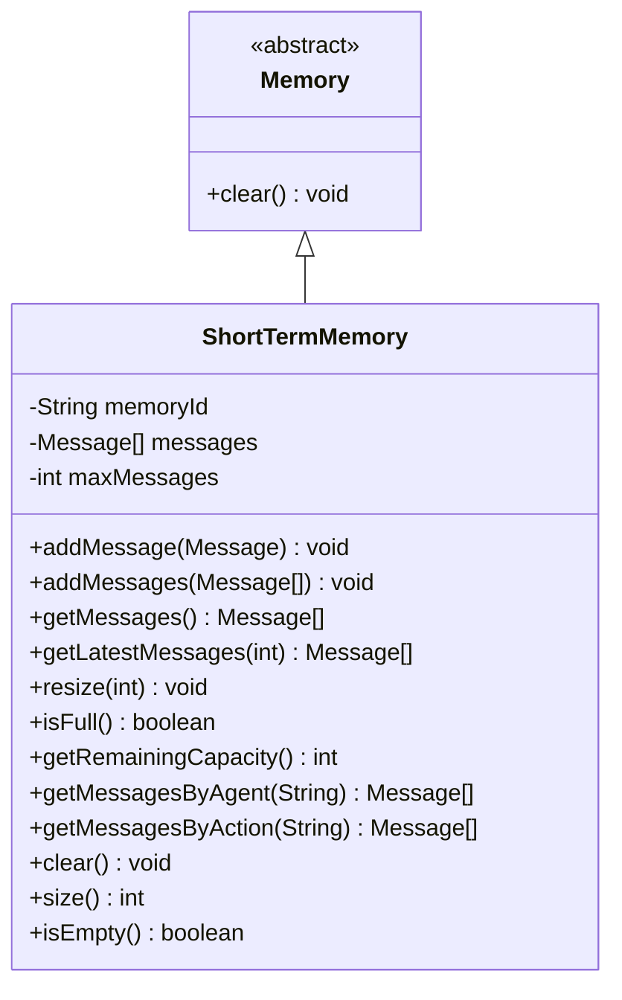
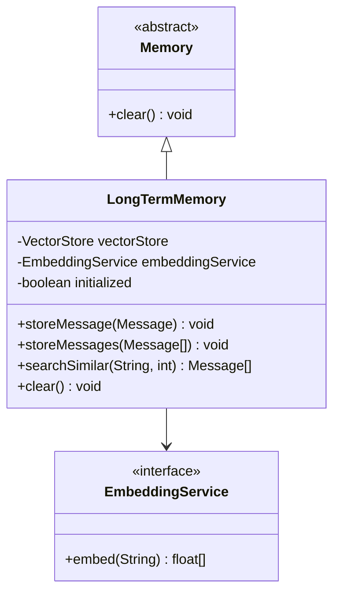
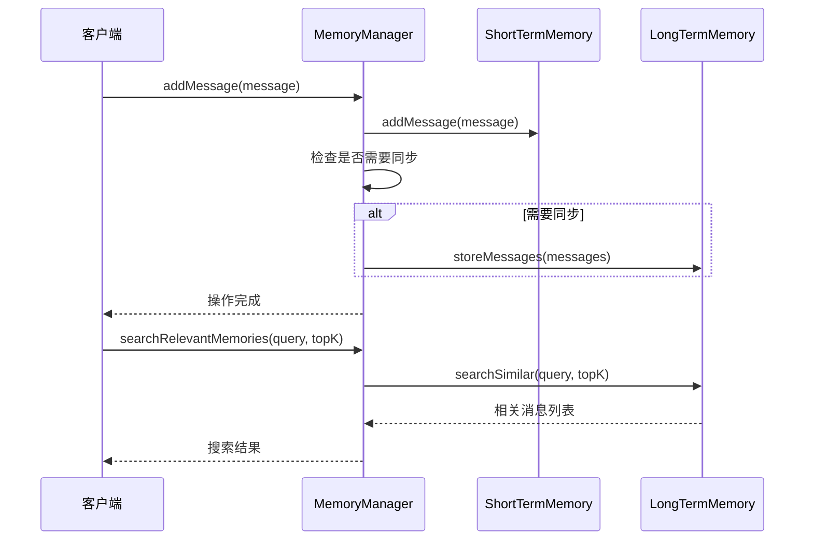
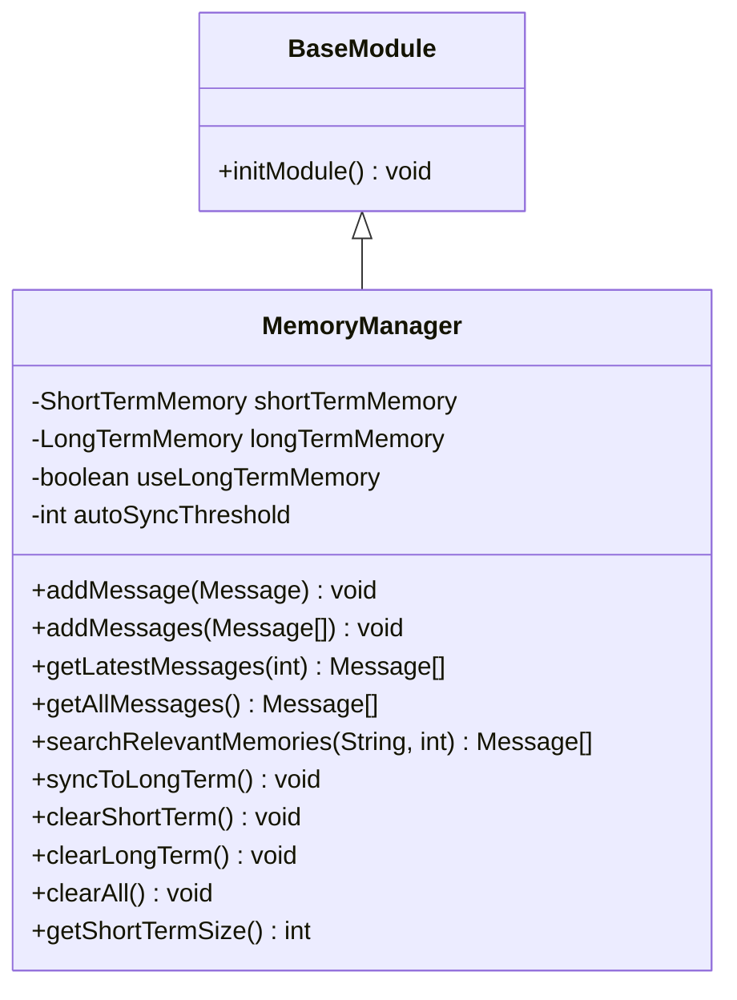

# 记忆系统API

<cite>
**本文档中引用的文件**
- [Memory.java](file://evox-memory/src/main/java/io/leavesfly/evox/memory/base/Memory.java)
- [BaseMemory.java](file://evox-memory/src/main/java/io/leavesfly/evox/memory/base/BaseMemory.java)
- [ShortTermMemory.java](file://evox-memory/src/main/java/io/leavesfly/evox/memory/shortterm/ShortTermMemory.java)
- [LongTermMemory.java](file://evox-memory/src/main/java/io/leavesfly/evox/memory/longterm/LongTermMemory.java)
- [MemoryManager.java](file://evox-memory/src/main/java/io/leavesfly/evox/memory/manager/MemoryManager.java)
- [MemoryTest.java](file://evox-memory/src/test/java/io/leavesfly/evox/memory/MemoryTest.java)
- [MemoryAgentExample.java](file://evox-examples/src/main/java/io/leavesfly/evox/examples/MemoryAgentExample.java)
- [Message.java](file://evox-core/src/main/java/io/leavesfly/evox/core/message/Message.java)
</cite>

## 目录
1. [简介](#简介)
2. [项目结构](#项目结构)
3. [核心接口与抽象类](#核心接口与抽象类)
4. [记忆实现类](#记忆实现类)
5. [记忆管理器](#记忆管理器)
6. [配置选项](#配置选项)
7. [使用场景与最佳实践](#使用场景与最佳实践)
8. [性能优化](#性能优化)
9. [故障排除](#故障排除)
10. [总结](#总结)

## 简介

EvoX记忆系统是一个多层次的记忆架构，提供了短期记忆和长期记忆的统一管理。该系统设计用于支持智能体在复杂工作流中的记忆需求，包括对话历史、任务状态、知识存储等功能。

### 主要特性

- **分层记忆架构**：短期记忆（会话级缓存）和长期记忆（持久化存储）
- **统一管理接口**：MemoryManager提供统一的多级记忆调度机制
- **灵活配置**：支持TTL设置、容量限制、序列化策略
- **高性能并发**：基于ConcurrentHashMap和线程安全的数据结构
- **智能同步**：自动在短期记忆和长期记忆之间同步数据

## 项目结构



**图表来源**
- [Memory.java](file://evox-memory/src/main/java/io/leavesfly/evox/memory/base/Memory.java#L1-L18)
- [BaseMemory.java](file://evox-memory/src/main/java/io/leavesfly/evox/memory/base/BaseMemory.java#L1-L50)
- [ShortTermMemory.java](file://evox-memory/src/main/java/io/leavesfly/evox/memory/shortterm/ShortTermMemory.java#L1-L50)
- [LongTermMemory.java](file://evox-memory/src/main/java/io/leavesfly/evox/memory/longterm/LongTermMemory.java#L1-L50)

**章节来源**
- [Memory.java](file://evox-memory/src/main/java/io/leavesfly/evox/memory/base/Memory.java#L1-L18)
- [BaseMemory.java](file://evox-memory/src/main/java/io/leavesfly/evox/memory/base/BaseMemory.java#L1-L290)

## 核心接口与抽象类

### Memory基类

Memory是所有记忆实现的基础抽象类，继承自BaseModule，提供最基本的清空操作。



**图表来源**
- [Memory.java](file://evox-memory/src/main/java/io/leavesfly/evox/memory/base/Memory.java#L11-L17)
- [BaseMemory.java](file://evox-memory/src/main/java/io/leavesfly/evox/memory/base/BaseMemory.java#L23-L72)

### BaseMemory核心功能

BaseMemory提供了消息存储、检索和过滤的核心功能，是短期记忆和长期记忆的基础实现。

#### 核心操作方法

| 方法名 | 参数 | 返回值 | 描述 |
|--------|------|--------|------|
| `addMessage(Message)` | message | void | 添加单个消息到记忆 |
| `addMessages(List<Message>)` | messages | void | 批量添加消息 |
| `removeMessage(Message)` | message | void | 从记忆中移除指定消息 |
| `get(Integer)` | n | List<Message> | 获取最近的n条消息 |
| `getAll()` | 无 | List<Message> | 获取所有消息 |
| `getByAction(String, Integer)` | action, n | List<Message> | 根据动作获取消息 |
| `getByWorkflowGoal(String, Integer)` | goal, n | List<Message> | 根据工作流目标获取消息 |
| `getLastMessage()` | 无 | Message | 获取最后一条消息 |
| `clear()` | 无 | void | 清空所有消息 |

#### 高级功能

- **容量管理**：支持设置最大容量，超出时自动移除最旧的消息
- **索引系统**：按动作和工作流目标建立索引，支持快速检索
- **去重机制**：防止重复添加相同内容的消息
- **线程安全**：使用同步集合确保并发安全

**章节来源**
- [BaseMemory.java](file://evox-memory/src/main/java/io/leavesfly/evox/memory/base/BaseMemory.java#L94-L288)

## 记忆实现类

### ShortTermMemory（短期记忆）

短期记忆实现类，专门用于存储工作流执行过程中的临时消息，具有滑动窗口特性。



**图表来源**
- [ShortTermMemory.java](file://evox-memory/src/main/java/io/leavesfly/evox/memory/shortterm/ShortTermMemory.java#L24-L237)

#### 设计特点

1. **滑动窗口机制**：当消息数量超过最大限制时，自动移除最旧的消息
2. **固定容量**：通过`maxMessages`参数设置固定的最大消息数量
3. **高效检索**：提供按智能体、动作过滤消息的功能
4. **实时同步**：支持动态调整容量大小

#### 配置参数

| 参数 | 类型 | 默认值 | 描述 |
|------|------|--------|------|
| `maxMessages` | int | 0（无限制） | 最大消息数量限制 |
| `memoryId` | String | 自动生成 | 记忆唯一标识符 |

#### 使用场景

- **会话级缓存**：保存用户对话的临时历史
- **工作流状态**：跟踪当前工作流的执行步骤
- **临时数据存储**：保存中间计算结果和临时变量

**章节来源**
- [ShortTermMemory.java](file://evox-memory/src/main/java/io/leavesfly/evox/memory/shortterm/ShortTermMemory.java#L44-L237)

### LongTermMemory（长期记忆）

长期记忆实现类，使用向量存储持久化保存历史消息，支持语义搜索和相似性检索。



**图表来源**
- [LongTermMemory.java](file://evox-memory/src/main/java/io/leavesfly/evox/memory/longterm/LongTermMemory.java#L21-L155)

#### 技术架构

1. **向量存储**：使用向量数据库（如FAISS、Chroma、Qdrant）存储消息的向量表示
2. **嵌入服务**：将消息内容转换为高维向量表示
3. **语义搜索**：基于向量相似度进行语义匹配
4. **元数据管理**：保存消息的完整元数据用于重建

#### 核心功能

| 方法名 | 参数 | 返回值 | 描述 |
|--------|------|--------|------|
| `storeMessage(Message)` | message | void | 存储单个消息到长期记忆 |
| `storeMessages(List<Message>)` | messages | void | 批量存储消息 |
| `searchSimilar(String, int)` | query, topK | List<Message> | 搜索相似消息 |
| `clear()` | 无 | void | 清空长期记忆 |

#### 嵌入服务接口

```java
public interface EmbeddingService {
    float[] embed(String text);
}
```

该接口允许不同的嵌入模型（如OpenAI、Sentence-BERT等）集成到长期记忆系统中。

**章节来源**
- [LongTermMemory.java](file://evox-memory/src/main/java/io/leavesfly/evox/memory/longterm/LongTermMemory.java#L55-L155)

## 记忆管理器

MemoryManager是记忆系统的统一调度中心，负责协调短期记忆和长期记忆的操作。



**图表来源**
- [MemoryManager.java](file://evox-memory/src/main/java/io/leavesfly/evox/memory/manager/MemoryManager.java#L73-L124)

### 核心配置

| 配置项 | 类型 | 默认值 | 描述 |
|--------|------|--------|------|
| `useLongTermMemory` | boolean | false | 是否启用长期记忆 |
| `autoSyncThreshold` | int | 100 | 自动同步阈值 |
| `shortTermMemory` | ShortTermMemory | 新实例 | 短期记忆实例 |
| `longTermMemory` | LongTermMemory | null | 长期记忆实例 |

### 自动同步机制

MemoryManager实现了智能的自动同步机制：

1. **阈值检查**：当短期记忆中的消息数量达到`autoSyncThreshold`时触发同步
2. **批量同步**：一次性将短期记忆的所有消息同步到长期记忆
3. **条件判断**：只有在启用长期记忆且长期记忆可用时才执行同步

### 统一操作接口



**图表来源**
- [MemoryManager.java](file://evox-memory/src/main/java/io/leavesfly/evox/memory/manager/MemoryManager.java#L23-L189)

**章节来源**
- [MemoryManager.java](file://evox-memory/src/main/java/io/leavesfly/evox/memory/manager/MemoryManager.java#L45-L189)

## 配置选项

### TTL（生存时间）设置

虽然当前实现没有直接的TTL机制，但可以通过以下方式实现：

```java
// 在BaseMemory中实现TTL清理
public class TTLBaseMemory extends BaseMemory {
    private Duration ttl = Duration.ofHours(24); // 24小时TTL
    
    @Override
    public void addMessage(Message message) {
        // 检查消息是否过期
        if (Duration.between(message.getTimestamp(), Instant.now()) > ttl) {
            return; // 忽略过期消息
        }
        super.addMessage(message);
    }
}
```

### 容量限制配置

```java
// 短期记忆容量配置
ShortTermMemory shortTerm = new ShortTermMemory(1000); // 最大1000条消息

// 基础记忆容量配置
BaseMemory baseMemory = new BaseMemory();
baseMemory.setCapacity(500); // 最大500条消息
```

### 序列化策略

系统默认使用Java序列化，对于长期记忆，建议使用高效的序列化格式：

```java
// JSON序列化配置
ObjectMapper objectMapper = new ObjectMapper();
objectMapper.registerModule(new JavaTimeModule());

// 自定义序列化器
public class MessageSerializer {
    public String serialize(Message message) {
        return objectMapper.writeValueAsString(message);
    }
    
    public Message deserialize(String json) throws IOException {
        return objectMapper.readValue(json, Message.class);
    }
}
```

### 并发配置

```java
// 线程安全配置
public class ThreadSafeMemory extends BaseMemory {
    @Override
    public void initModule() {
        super.initModule();
        // 使用线程安全的集合
        this.messages = Collections.synchronizedList(new ArrayList<>());
        this.byAction = new ConcurrentHashMap<>();
        this.byWorkflowGoal = new ConcurrentHashMap<>();
    }
}
```

## 使用场景与最佳实践

### Agent使用场景

#### 1. 对话系统

```java
// 配置对话记忆
MemoryManager dialogMemory = new MemoryManager(
    new ShortTermMemory(50), // 保存最近50条对话
    new LongTermMemory(vectorStore, embeddingService)
);

// 添加对话历史
Message userMsg = Message.inputMessage("你好，我想了解机器学习");
dialogMemory.addMessage(userMsg);

// 获取上下文相关的记忆
List<Message> context = dialogMemory.getLatestMessages(10);
```

#### 2. 任务执行

```java
// 任务执行记忆
MemoryManager taskMemory = new MemoryManager(
    new ShortTermMemory(200), // 保存任务执行过程
    null // 不启用长期记忆
);

// 记录任务步骤
taskMemory.addMessage(Message.systemMessage("开始数据预处理"));

// 检查任务状态
if (taskMemory.getShortTermSize() > 150) {
    // 可能需要清理或保存中间状态
}
```

#### 3. 知识库检索

```java
// 知识库记忆
MemoryManager knowledgeMemory = new MemoryManager(
    new ShortTermMemory(100),
    new LongTermMemory(knowledgeVectorStore, embeddingService)
);

// 搜索相关知识
List<Message> relatedKnowledge = knowledgeMemory.searchRelevantMemories(
    "机器学习算法选择", 5
);
```

### 生命周期管理

#### 1. 初始化阶段

```java
public class MemoryLifecycle {
    private MemoryManager memoryManager;
    
    public void initialize() {
        // 配置短期记忆
        ShortTermMemory shortTerm = new ShortTermMemory(200);
        
        // 配置长期记忆（可选）
        LongTermMemory longTerm = null;
        if (enableLongTerm) {
            longTerm = new LongTermMemory(vectorStore, embeddingService);
        }
        
        // 创建记忆管理器
        memoryManager = new MemoryManager(shortTerm, longTerm);
        memoryManager.initModule();
    }
}
```

#### 2. 运行时管理

```java
public class RuntimeMemoryManager {
    private MemoryManager memoryManager;
    private ScheduledExecutorService scheduler;
    
    public void startCleanupScheduler() {
        scheduler.scheduleAtFixedRate(() -> {
            // 清理过期记忆
            cleanupExpiredMemory();
            
            // 同步短期到长期
            if (memoryManager.getShortTermSize() > 100) {
                memoryManager.syncToLongTerm();
            }
        }, 0, 5, TimeUnit.MINUTES);
    }
}
```

#### 3. 销毁阶段

```java
public void shutdown() {
    // 清空所有记忆
    memoryManager.clearAll();
    
    // 关闭资源
    if (scheduler != null) {
        scheduler.shutdown();
    }
}
```

### 高并发读写最佳实践

#### 1. 读写分离

```java
// 读取操作（无锁）
public List<Message> getRecentMessages(int count) {
    // 使用不可变视图避免并发修改异常
    return Collections.unmodifiableList(
        memoryManager.getLatestMessages(count)
    );
}

// 写入操作（加锁）
private final Object writeLock = new Object();

public void addMessageSafely(Message message) {
    synchronized (writeLock) {
        memoryManager.addMessage(message);
    }
}
```

#### 2. 批量操作优化

```java
// 批量添加消息
public void batchAddMessages(List<Message> messages) {
    // 分批处理避免长时间锁定
    int batchSize = 100;
    for (int i = 0; i < messages.size(); i += batchSize) {
        List<Message> batch = messages.subList(i, 
            Math.min(i + batchSize, messages.size()));
        memoryManager.addMessages(batch);
    }
}
```

#### 3. 异步处理

```java
// 异步消息存储
public CompletableFuture<Void> asyncAddMessage(Message message) {
    return CompletableFuture.runAsync(() -> {
        memoryManager.addMessage(message);
    });
}
```

## 性能优化

### 内存使用优化

#### 1. 消息压缩

```java
public class CompressedMemory extends BaseMemory {
    private final int compressionRatio = 10;
    
    @Override
    public void addMessage(Message message) {
        // 压缩消息内容
        if (message.getContent() instanceof String) {
            String content = (String) message.getContent();
            if (content.length() > 1000) {
                // 仅保存摘要
                message.setContent(content.substring(0, 500) + "...[压缩]");
            }
        }
        super.addMessage(message);
    }
}
```

#### 2. 懒加载机制

```java
public class LazyMemory extends BaseMemory {
    private volatile boolean loaded = false;
    
    @Override
    public List<Message> getAll() {
        if (!loaded) {
            synchronized (this) {
                if (!loaded) {
                    // 从持久化存储加载
                    loadFromStorage();
                    loaded = true;
                }
            }
        }
        return super.getAll();
    }
}
```

### 查询性能优化

#### 1. 索引优化

```java
public class IndexedMemory extends BaseMemory {
    // 多级索引
    private final Map<String, Set<String>> agentIndex = new ConcurrentHashMap<>();
    private final Map<String, Set<String>> dateIndex = new ConcurrentHashMap<>();
    
    @Override
    public void addMessage(Message message) {
        super.addMessage(message);
        
        // 更新多级索引
        if (message.getAgent() != null) {
            agentIndex.computeIfAbsent(message.getAgent(), k -> new HashSet<>())
                     .add(message.getMessageId());
        }
        
        String dateKey = message.getTimestamp().toLocalDate().toString();
        dateIndex.computeIfAbsent(dateKey, k -> new HashSet<>())
                 .add(message.getMessageId());
    }
}
```

#### 2. 缓存策略

```java
public class CachedMemory extends BaseMemory {
    private final LoadingCache<String, List<Message>> cache;
    
    public CachedMemory() {
        this.cache = Caffeine.newBuilder()
            .expireAfterWrite(10, TimeUnit.MINUTES)
            .maximumSize(1000)
            .build(this::loadFromDatabase);
    }
    
    public List<Message> getCachedMessages(String key) {
        return cache.get(key);
    }
}
```

### 并发性能优化

#### 1. 分段锁

```java
public class PartitionedMemory extends BaseMemory {
    private final ConcurrentHashMap<String, List<Message>> partitions;
    private final int partitionCount = 16;
    
    @Override
    public void addMessage(Message message) {
        // 基于消息ID分区
        int partition = Math.abs(message.getMessageId().hashCode()) % partitionCount;
        String partitionKey = "partition_" + partition;
        
        partitions.computeIfAbsent(partitionKey, k -> new ArrayList<>())
                 .add(message);
    }
}
```

#### 2. 读写分离锁

```java
public class RWLockMemory extends BaseMemory {
    private final ReadWriteLock lock = new ReentrantReadWriteLock();
    
    @Override
    public void addMessage(Message message) {
        lock.writeLock().lock();
        try {
            super.addMessage(message);
        } finally {
            lock.writeLock().unlock();
        }
    }
    
    @Override
    public List<Message> get(Integer n) {
        lock.readLock().lock();
        try {
            return super.get(n);
        } finally {
            lock.readLock().unlock();
        }
    }
}
```

## 故障排除

### 常见问题与解决方案

#### 1. 内存溢出

**问题症状**：
- OutOfMemoryError异常
- 系统响应缓慢
- JVM频繁GC

**解决方案**：

```java
// 设置合理的容量限制
ShortTermMemory memory = new ShortTermMemory(10000); // 控制在10000条以内

// 实现定期清理
public void cleanupOldMessages() {
    // 清理超过7天的消息
    Instant cutoff = Instant.now().minus(Duration.ofDays(7));
    
    memoryManager.getAllMessages().removeIf(message -> 
        message.getTimestamp().isBefore(cutoff)
    );
}
```

#### 2. 性能下降

**诊断步骤**：

```java
// 监控内存使用情况
public class MemoryMonitor {
    public void monitor() {
        Runtime runtime = Runtime.getRuntime();
        long totalMemory = runtime.totalMemory();
        long freeMemory = runtime.freeMemory();
        long usedMemory = totalMemory - freeMemory;
        
        log.info("Memory usage: {} MB / {} MB",
            usedMemory / 1024 / 1024,
            totalMemory / 1024 / 1024);
    }
}
```

**优化措施**：

```java
// 使用弱引用减少内存压力
public class WeakReferenceMemory extends BaseMemory {
    private final Map<String, WeakReference<Message>> weakReferences;
    
    @Override
    public void addMessage(Message message) {
        weakReferences.put(message.getMessageId(), 
            new WeakReference<>(message));
    }
}
```

#### 3. 数据一致性问题

**问题症状**：
- 消息丢失
- 数据不一致
- 同步失败

**解决方案**：

```java
// 实现事务性操作
public class TransactionalMemory extends BaseMemory {
    private final BlockingQueue<Transaction> transactionQueue;
    
    public void executeTransaction(Transaction transaction) {
        transactionQueue.offer(transaction);
        
        // 异步执行事务
        executor.submit(() -> {
            try {
                transaction.execute();
                transaction.commit();
            } catch (Exception e) {
                transaction.rollback();
            }
        });
    }
}
```

#### 4. 并发冲突

**问题症状**：
- ConcurrentModificationException
- 数据竞争
- 死锁

**解决方案**：

```java
// 使用原子操作
public class AtomicMemory extends BaseMemory {
    private final AtomicInteger messageCount = new AtomicInteger(0);
    
    @Override
    public void addMessage(Message message) {
        // 原子性检查和添加
        if (messageCount.incrementAndGet() > getMaxCapacity()) {
            messageCount.decrementAndGet();
            return;
        }
        
        super.addMessage(message);
    }
}
```

### 监控与调试

#### 1. 日志配置

```xml
<!-- logback.xml -->
<configuration>
    <logger name="io.leavesfly.evox.memory" level="DEBUG"/>
    
    <appender name="MEMORY_FILE" class="ch.qos.logback.core.rolling.RollingFileAppender">
        <file>logs/memory.log</file>
        <rollingPolicy class="ch.qos.logback.core.rolling.TimeBasedRollingPolicy">
            <fileNamePattern>logs/memory.%d{yyyy-MM-dd}.log</fileNamePattern>
            <maxHistory>30</maxHistory>
        </rollingPolicy>
        <encoder>
            <pattern>%d{HH:mm:ss.SSS} [%thread] %-5level %logger{36} - %msg%n</pattern>
        </encoder>
    </appender>
</configuration>
```

#### 2. 性能指标收集

```java
public class MemoryMetrics {
    private final MeterRegistry meterRegistry;
    private final Counter addCounter;
    private final Timer getTimer;
    
    public MemoryMetrics(MeterRegistry registry) {
        this.meterRegistry = registry;
        this.addCounter = Counter.builder("memory.add.count")
            .register(registry);
        this.getTimer = Timer.builder("memory.get.duration")
            .register(registry);
    }
    
    public void recordAddOperation(Runnable operation) {
        addCounter.increment();
        operation.run();
    }
    
    public <T> T recordGetOperation(Supplier<T> operation) {
        return getTimer.record(operation);
    }
}
```

## 总结

EvoX记忆系统提供了一个完整、灵活且高性能的记忆管理解决方案。通过分层架构设计，系统能够满足从简单的会话缓存到复杂的知识管理的各种需求。

### 核心优势

1. **模块化设计**：清晰的接口分离，易于扩展和维护
2. **高性能并发**：基于现代并发工具的线程安全实现
3. **灵活配置**：支持多种配置选项和定制化需求
4. **智能同步**：自动化的短期到长期记忆同步机制
5. **语义搜索**：基于向量的语义相似性检索

### 适用场景

- **对话系统**：保存用户交互历史，提供上下文感知的回复
- **工作流管理**：跟踪任务执行状态和中间结果
- **知识管理**：构建智能知识库，支持语义检索
- **数据分析**：保存分析过程和结果，支持历史对比

### 发展方向

1. **分布式部署**：支持集群环境下的记忆共享
2. **增量学习**：结合机器学习模型实现智能记忆更新
3. **隐私保护**：集成数据脱敏和访问控制机制
4. **多模态支持**：扩展对图像、音频等非文本数据的记忆

通过合理配置和使用最佳实践，EvoX记忆系统能够为各种智能应用提供强大而可靠的记忆能力支撑。