# 使用示例

<cite>
**本文档引用的文件**
- [SimpleChatBot.java](file://evox-examples/src/main/java/io/leavesfly/evox/examples/SimpleChatBot.java)
- [ComprehensiveChatBot.java](file://evox-examples/src/main/java/io/leavesfly/evox/examples/ComprehensiveChatBot.java)
- [MemoryAgentExample.java](file://evox-examples/src/main/java/io/leavesfly/evox/examples/MemoryAgentExample.java)
- [ToolsExample.java](file://evox-examples/src/main/java/io/leavesfly/evox/examples/ToolsExample.java)
- [SequentialWorkflowExample.java](file://evox-examples/src/main/java/io/leavesfly/evox/examples/SequentialWorkflowExample.java)
- [WorkflowDemo.java](file://evox-examples/src/main/java/io/leavesfly/evox/examples/WorkflowDemo.java)
- [BenchmarkExample.java](file://evox-examples/src/main/java/io/leavesfly/evox/examples/BenchmarkExample.java)
- [MultiModelExample.java](file://evox-examples/src/main/java/io/leavesfly/evox/examples/MultiModelExample.java)
- [run-examples.sh](file://evox-examples/run-examples.sh)
- [pom.xml](file://evox-examples/pom.xml)
- [README.md](file://evox-examples/README.md)
</cite>

## 目录
1. [简介](#简介)
2. [项目结构概览](#项目结构概览)
3. [基础聊天机器人示例](#基础聊天机器人示例)
4. [带记忆的对话示例](#带记忆的对话示例)
5. [工具使用示例](#工具使用示例)
6. [工作流编排示例](#工作流编排示例)
7. [综合聊天机器人示例](#综合聊天机器人示例)
8. [多模型适配示例](#多模型适配示例)
9. [性能基准测试示例](#性能基准测试示例)
10. [运行示例的方法](#运行示例的方法)
11. [最佳实践和架构设计](#最佳实践和架构设计)
12. [总结](#总结)

## 简介

EvoX 是一个强大的 AI 框架，提供了完整的智能体开发工具链。本指南展示了如何使用 EvoX 构建各种类型的 AI 应用程序，从简单的聊天机器人到复杂的多智能体协作系统。

EvoX 的核心优势：
- **模块化架构**：清晰分离的组件设计
- **灵活的智能体系统**：支持多种智能体类型
- **丰富的工具生态**：内置多种实用工具
- **强大的工作流编排**：支持复杂业务流程
- **多模型支持**：兼容多种 LLM 提供商

## 项目结构概览

EvoX 采用模块化设计，主要包含以下核心模块：

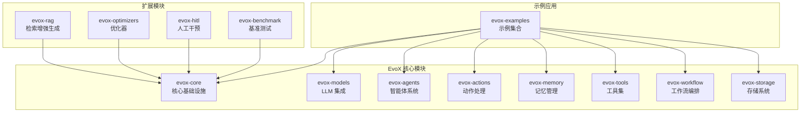

**图表来源**
- [pom.xml](file://evox-examples/pom.xml#L20-L88)

## 基础聊天机器人示例

### 示例概述

SimpleChatBot 展示了 EvoX 框架的基础使用方法，包括智能体、记忆和工具的基本集成。

### 架构设计

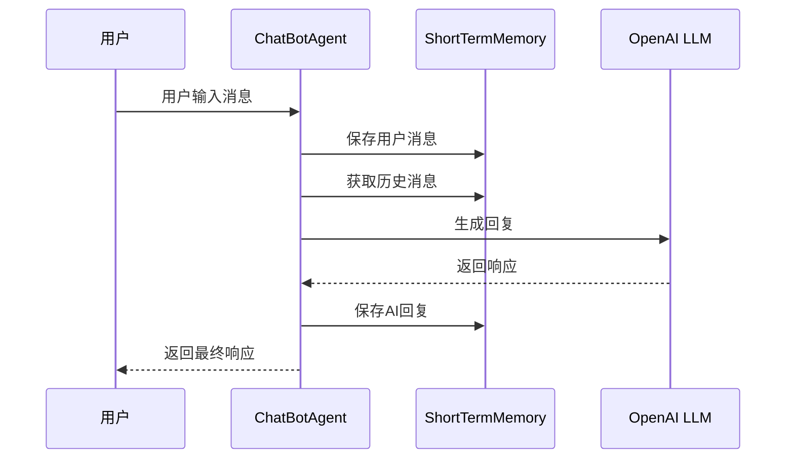

**图表来源**
- [SimpleChatBot.java](file://evox-examples/src/main/java/io/leavesfly/evox/examples/SimpleChatBot.java#L70-L92)

### 核心组件

#### 1. ChatBotAgent 智能体

智能体是 EvoX 的核心组件，负责协调其他组件的工作：

```java
// 创建智能体实例
ChatBotAgent agent = new ChatBotAgent(llm);

// 添加聊天动作
addAction(new ChatAction(llm));

// 执行对话
Message response = agent.execute("chat", history);
```

#### 2. ShortTermMemory 短期记忆

短期记忆管理对话历史，支持滑动窗口机制：

```java
// 创建记忆实例
ShortTermMemory memory = new ShortTermMemory(10);

// 添加消息
memory.addMessage(userMessage);

// 获取最新消息
List<Message> history = memory.getLatestMessages(5);
```

#### 3. ChatAction 动作处理

动作定义了智能体的具体行为：

```java
@Override
public ActionOutput execute(ActionInput input) {
    ChatActionInput chatInput = (ChatActionInput) input;
    List<Message> messages = chatInput.getMessages();
    
    // 构建提示词
    String prompt = buildPrompt(messages);
    
    // 调用 LLM 生成回复
    String response = llm.generate(prompt);
    
    return SimpleActionOutput.success(response);
}
```

### 运行示例

```bash
# 运行基础聊天机器人
mvn exec:java -pl evox-examples \
  -Dexec.mainClass="io.leavesfly.evox.examples.SimpleChatBot"
```

**章节来源**
- [SimpleChatBot.java](file://evox-examples/src/main/java/io/leavesfly/evox/examples/SimpleChatBot.java#L35-L157)

## 带记忆的对话示例

### 示例概述

MemoryAgentExample 展示了如何创建具有长期记忆能力的智能体，支持添加、检索、更新和删除记忆。

### 待实现的功能

当前 Memory 模块处于开发阶段，计划支持以下功能：

| 功能类别 | 实现状态 | 描述 |
|---------|---------|------|
| 短期记忆 | ✅ 完成 | 临时保存对话历史 |
| 长期记忆 | 🚧 开发中 | 持久化存储重要信息 |
| 工作记忆 | 🚧 开发中 | 当前任务相关记忆 |
| 向量数据库 | 🚧 开发中 | FAISS, Chroma, Qdrant |
| 关系数据库 | 🚧 开发中 | PostgreSQL, SQLite |
| 内存存储 | ✅ 完成 | InMemory 存储 |

### 预期架构

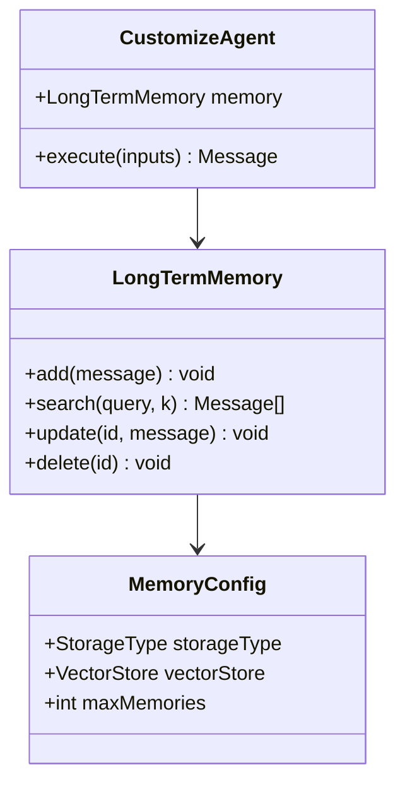

**图表来源**
- [MemoryAgentExample.java](file://evox-examples/src/main/java/io/leavesfly/evox/examples/MemoryAgentExample.java#L48-L94)

**章节来源**
- [MemoryAgentExample.java](file://evox-examples/src/main/java/io/leavesfly/evox/examples/MemoryAgentExample.java#L16-L95)

## 工具使用示例

### 示例概述

ToolsExample 展示了 EvoX 内置的各种工具的使用方法，包括计算器、HTTP 客户端、文件系统、搜索引擎和浏览器工具。

### 工具分类和功能

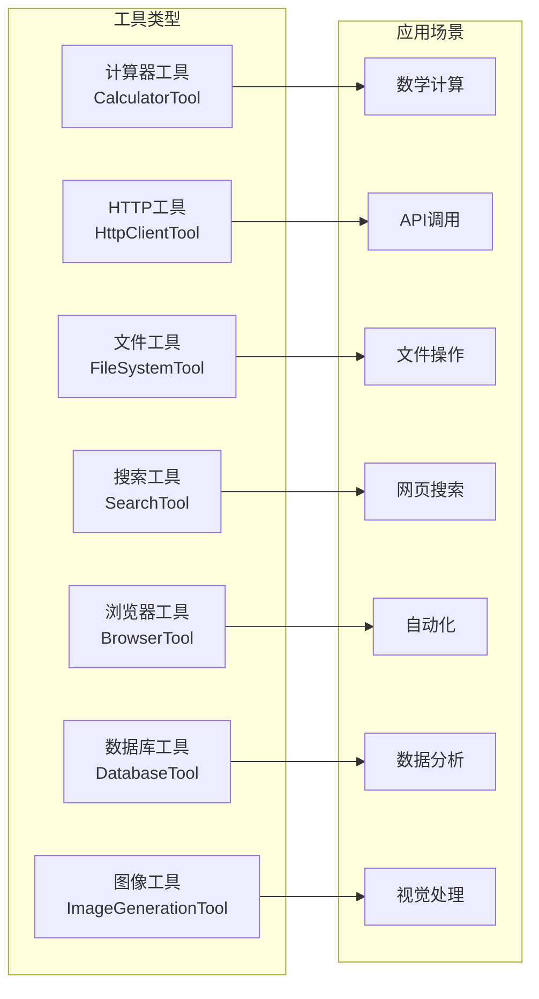

**图表来源**
- [ToolsExample.java](file://evox-examples/src/main/java/io/leavesfly/evox/examples/ToolsExample.java#L25-L39)

### 核心工具使用示例

#### 1. 计算器工具

```java
CalculatorTool calculator = new CalculatorTool();

// 基础运算
var result1 = calculator.add(10, 5);        // 10 + 5 = 15
var result2 = calculator.multiply(7, 8);    // 7 * 8 = 56
var result3 = calculator.divide(100, 4);    // 100 / 4 = 25

// 高级数学函数
var result4 = calculator.power(2, 10);      // 2^10 = 1024
var result5 = calculator.sqrt(144);         // √144 = 12
var result6 = calculator.sin(30);           // sin(30°) ≈ 0.5

// 表达式计算
Map<String, Object> params = new HashMap<>();
params.put("expression", "(10 + 5) * 2 - 8");
var result7 = calculator.execute(params);
```

#### 2. HTTP 客户端工具

```java
HttpClientTool httpClient = new HttpClientTool();

// GET 请求
Map<String, Object> getParams = new HashMap<>();
getParams.put("method", "GET");
getParams.put("url", "https://api.github.com/repos/octocat/Hello-World");

// POST 请求
Map<String, Object> postParams = new HashMap<>();
postParams.put("method", "POST");
postParams.put("url", "https://httpbin.org/post");
postParams.put("body", "{\"key\":\"value\"}");

Map<String, String> headers = new HashMap<>();
headers.put("Content-Type", "application/json");
postParams.put("headers", headers);
```

#### 3. 文件系统工具

```java
FileSystemTool fileTool = new FileSystemTool();

// 检查文件存在
Map<String, Object> params1 = new HashMap<>();
params1.put("operation", "exists");
params1.put("filePath", "/tmp/test.txt");

// 写入文件
Map<String, Object> params2 = new HashMap<>();
params2.put("operation", "write");
params2.put("filePath", "/tmp/evox_test.txt");
params2.put("content", "Hello from EvoX!");

// 读取文件
Map<String, Object> params3 = new HashMap<>();
params3.put("operation", "read");
params3.put("filePath", "/tmp/evox_test.txt");

// 列出目录
Map<String, Object> params4 = new HashMap<>();
params4.put("operation", "list");
params4.put("directory", "/tmp");

// 删除文件
Map<String, Object> params5 = new HashMap<>();
params5.put("operation", "delete");
params5.put("filePath", "/tmp/evox_test.txt");
```

#### 4. 搜索工具

```java
// Wikipedia 搜索
SearchTool wikiSearch = new SearchTool("wikipedia", 3);
Map<String, Object> params1 = new HashMap<>();
params1.put("query", "artificial intelligence");
params1.put("numResults", 2);

// Google 搜索配置
SearchTool googleSearch = new SearchTool("google", 5);

// DuckDuckGo 搜索配置
SearchTool ddgSearch = new SearchTool("duckduckgo", 10);
```

#### 5. 浏览器工具

```java
BrowserTool browser = new BrowserTool();

// 导航
Map<String, Object> params1 = new HashMap<>();
params1.put("action", "navigate");
params1.put("url", "https://www.example.com");

// 点击元素
Map<String, Object> params2 = new HashMap<>();
params2.put("action", "click");
params2.put("selector", "#submit-button");

// 输入文本
Map<String, Object> params3 = new HashMap<>();
params3.put("action", "type");
params3.put("selector", "#search-input");
params3.put("text", "EvoX Framework");

// 截图
Map<String, Object> params4 = new HashMap<>();
params4.put("action", "screenshot");
params4.put("path", "/tmp/screenshot.png");
```

### 工具组合使用

```java
// 研究助理的典型工作流程
SearchTool search = new SearchTool("google", 5);
BrowserTool browser = new BrowserTool();
FileSystemTool file = new FileSystemTool();
CalculatorTool calc = new CalculatorTool();
HttpClientTool http = new HttpClientTool();

// 1. 搜索主题
var searchResults = search.execute(Map.of("query", "AI trends 2024"));

// 2. 访问第一个结果
String url = extractFirstUrl(searchResults);
var pageContent = browser.execute(Map.of("action", "navigate", "url", url));

// 3. 保存内容
file.execute(Map.of("operation", "write", "filePath", "/tmp/research.txt", 
                   "content", pageContent));

// 4. 统计分析
var stats = calc.mean(extractNumbers(pageContent));

// 5. 发送报告
http.execute(Map.of("method", "POST", "url", "https://api.example.com/report",
                   "body", createReport(stats)));
```

**章节来源**
- [ToolsExample.java](file://evox-examples/src/main/java/io/leavesfly/evox/examples/ToolsExample.java#L22-L287)

## 工作流编排示例

### 示例概述

EvoX 提供了强大而灵活的工作流编排系统，支持顺序、决策、并行和循环等多种控制流模式。

### 工作流类型

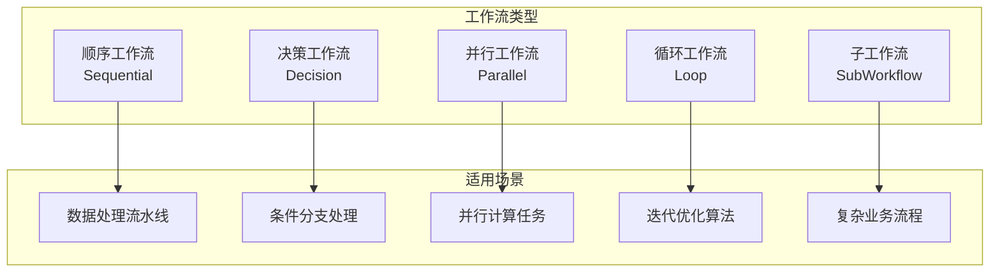

**图表来源**
- [WorkflowDemo.java](file://evox-examples/src/main/java/io/leavesfly/evox/examples/WorkflowDemo.java#L42-L549)

### 1. 顺序工作流示例

顺序工作流是最基础的工作流类型，按照预定义的顺序执行各个节点。

#### 架构设计

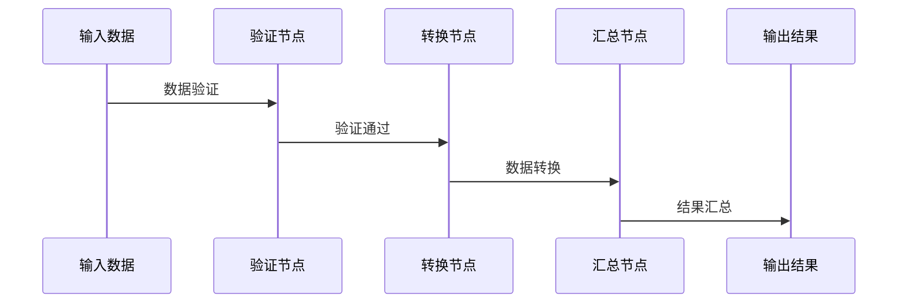

**图表来源**
- [SequentialWorkflowExample.java](file://evox-examples/src/main/java/io/leavesfly/evox/examples/SequentialWorkflowExample.java#L87-L106)

#### 实现要点

```java
// 创建工作流图
WorkflowGraph graph = new WorkflowGraph("顺序数据处理工作流");

// 创建节点
WorkflowNode validateNode = new WorkflowNode();
validateNode.setName("DataProcessor.validate");
validateNode.setNodeType(WorkflowNode.NodeType.ACTION);

WorkflowNode transformNode = new WorkflowNode();
transformNode.setName("DataProcessor.transform");
transformNode.setNodeType(WorkflowNode.NodeType.ACTION);

WorkflowNode summarizeNode = new WorkflowNode();
summarizeNode.setName("DataProcessor.summarize");
summarizeNode.setNodeType(WorkflowNode.NodeType.ACTION);

// 构建连接关系
graph.addNode(validateNode);
graph.addNode(transformNode);
graph.addNode(summarizeNode);
graph.addEdge(validateNode.getNodeId(), transformNode.getNodeId());
graph.addEdge(transformNode.getNodeId(), summarizeNode.getNodeId());
```

### 2. 决策工作流示例

决策工作流根据条件选择不同的执行路径。

#### 架构设计

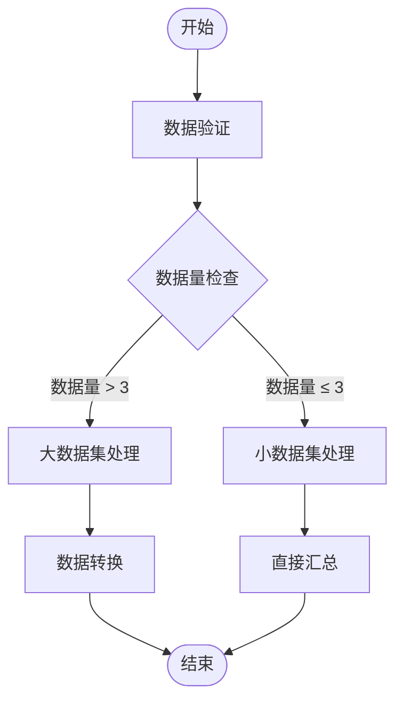

**图表来源**
- [WorkflowDemo.java](file://evox-examples/src/main/java/io/leavesfly/evox/examples/WorkflowDemo.java#L112-L166)

#### 实现要点

```java
// 创建决策节点
WorkflowNode decisionNode = new WorkflowNode();
decisionNode.setName("decision");
decisionNode.setNodeType(WorkflowNode.NodeType.DECISION);
decisionNode.setCondition("context.dataSize > 3");

// 设置分支映射
Map<String, String> branches = new HashMap<>();
branches.put("true", transformNode.getNodeId());
branches.put("false", summarizeNode.getNodeId());
decisionNode.setBranchMapping(branches);
```

### 3. 并行工作流示例

并行工作流允许同时执行多个独立的任务。

#### 架构设计

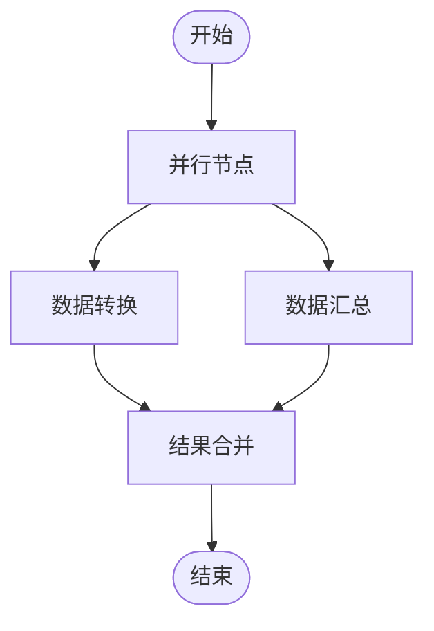

**图表来源**
- [WorkflowDemo.java](file://evox-examples/src/main/java/io/leavesfly/evox/examples/WorkflowDemo.java#L198-L263)

#### 实现要点

```java
// 创建并行节点
WorkflowNode parallelNode = new WorkflowNode();
parallelNode.setName("parallel");
parallelNode.setNodeType(WorkflowNode.NodeType.PARALLEL);
parallelNode.setParallelStrategy(WorkflowNode.ParallelStrategy.ALL);

// 添加并行子节点
graph.addNode(transformNode);
graph.addNode(summarizeNode);
graph.addEdge(parallelNode.getNodeId(), transformNode.getNodeId());
graph.addEdge(parallelNode.getNodeId(), summarizeNode.getNodeId());
```

### 4. 循环工作流示例

循环工作流支持重复执行某个任务直到满足特定条件。

#### 架构设计

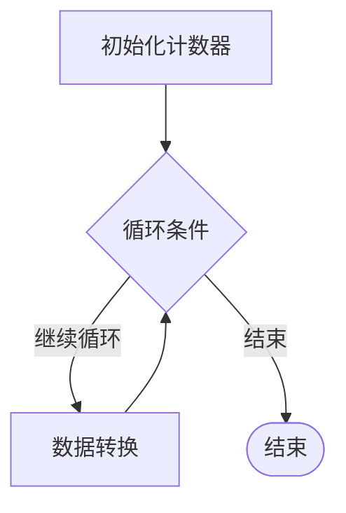

**图表来源**
- [WorkflowDemo.java](file://evox-examples/src/main/java/io/leavesfly/evox/examples/WorkflowDemo.java#L268-L324)

#### 实现要点

```java
// 创建循环节点
WorkflowNode loopNode = new WorkflowNode();
loopNode.setName("loop");
loopNode.setNodeType(WorkflowNode.NodeType.LOOP);
loopNode.setMaxIterations(5);

// 设置循环体
graph.addEdge(initNode.getNodeId(), loopNode.getNodeId());
graph.addEdge(loopNode.getNodeId(), transformNode.getNodeId());
```

### 5. 自定义数据处理 Agent

工作流中的每个节点通常对应一个专门的 Agent：

```java
@Data
@EqualsAndHashCode(callSuper = true)
static class DataProcessorAgent extends Agent {
    
    public DataProcessorAgent() {
        // 添加三个数据处理动作
        addAction(new ValidateAction());
        addAction(new TransformAction());
        addAction(new SummarizeAction());
    }
    
    @Override
    public Message execute(String actionName, List<Message> messages) {
        Action action = getAction(actionName);
        // 执行动作逻辑...
    }
}
```

**章节来源**
- [WorkflowDemo.java](file://evox-examples/src/main/java/io/leavesfly/evox/examples/WorkflowDemo.java#L42-L549)
- [SequentialWorkflowExample.java](file://evox-examples/src/main/java/io/leavesfly/evox/examples/SequentialWorkflowExample.java#L25-L125)

## 综合聊天机器人示例

### 示例概述

ComprehensiveChatBot 展示了 EvoX 的高级功能，包括多智能体协作、智能路由、工具使用和记忆管理。

### 架构设计

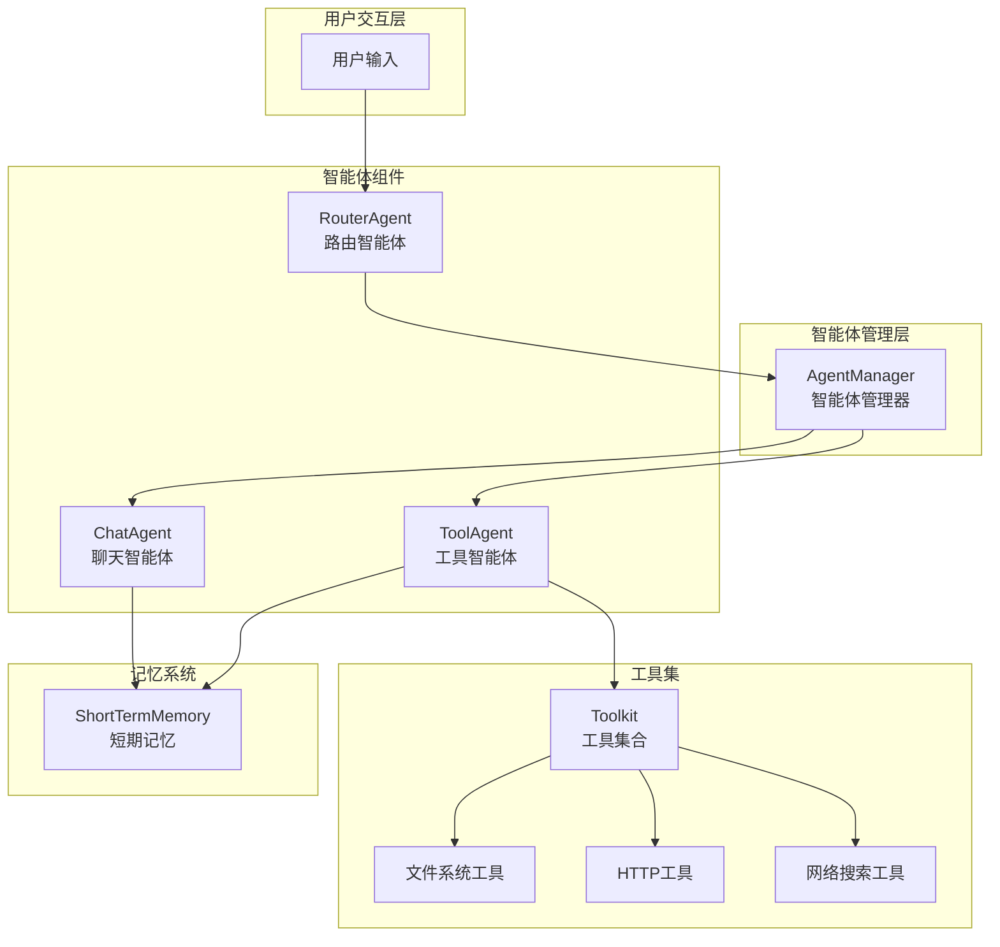

**图表来源**
- [ComprehensiveChatBot.java](file://evox-examples/src/main/java/io/leavesfly/evox/examples/ComprehensiveChatBot.java#L28-L81)

### 核心组件详解

#### 1. AgentManager 智能体管理器

```java
// 创建智能体管理器
AgentManager agentManager = new AgentManager();

// 注册智能体
agentManager.addAgent(routerAgent);
agentManager.addAgent(toolAgent);
agentManager.addAgent(chatAgent);
```

#### 2. RouterAgent 路由智能体

路由智能体负责分析用户输入并决定使用哪个智能体处理：

```java
static class RouteAction extends Action {
    @Override
    public ActionOutput execute(ActionInput input) {
        List<Message> messages = (List<Message>) input.toMap().get("messages");
        String userInput = messages.get(messages.size() - 1).getContent().toString().toLowerCase();
        
        // 判断是否需要工具
        boolean needTool = userInput.contains("搜索") || 
                         userInput.contains("读取") || 
                         userInput.contains("文件") ||
                         userInput.contains("天气");
        
        String selectedAgent = needTool ? "ToolAgent" : "ChatAgent";
        return SimpleActionOutput.success("选择: " + selectedAgent);
    }
}
```

#### 3. ToolAgent 工具智能体

工具智能体处理需要外部工具的请求：

```java
static class ToolProcessAction extends Action {
    private final Toolkit toolkit;
    
    @Override
    public ActionOutput execute(ActionInput input) {
        List<Message> messages = (List<Message>) input.toMap().get("messages");
        String userInput = messages.get(messages.size() - 1).getContent().toString();
        
        // 简单模拟工具调用
        String response = "工具处理结果: " + userInput;
        return SimpleActionOutput.success(response);
    }
}
```

#### 4. 多智能体协作流程

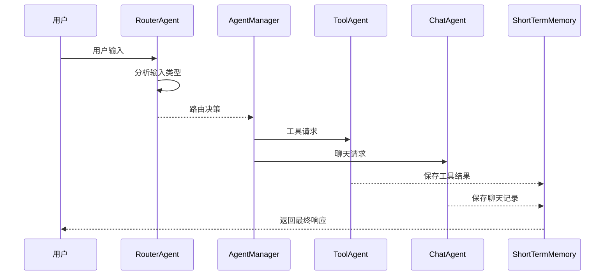

**图表来源**
- [ComprehensiveChatBot.java](file://evox-examples/src/main/java/io/leavesfly/evox/examples/ComprehensiveChatBot.java#L143-L161)

### 对话演示流程

```java
// 运行对话演示
String[] userInputs = {
    "你好！",                    // 简单问候
    "搜索 Java 最新版本",        // 需要工具的请求
    "读取文件 /tmp/test.txt",   // 文件操作
    "今天天气怎么样？",         // 需要工具的请求
    "谢谢！"                    // 结束语
};

for (String userInput : userInputs) {
    // 创建用户消息
    Message userMessage = Message.builder()
            .content(userInput)
            .messageType(MessageType.INPUT)
            .build();
    memory.addMessage(userMessage);
    
    // Step 1: 路由Agent分析
    Message routeResult = routerAgent.execute("route", Collections.singletonList(userMessage));
    String selectedAgent = extractSelectedAgent(routeResult.getContent().toString());
    
    // Step 2: 执行选定的Agent
    Agent selectedAgentInstance = agentManager.getAgent(selectedAgent);
    List<Message> context = memory.getLatestMessages(5);
    Message response = selectedAgentInstance.execute("process", context);
    
    // 保存回复到记忆
    memory.addMessage(response);
}
```

**章节来源**
- [ComprehensiveChatBot.java](file://evox-examples/src/main/java/io/leavesfly/evox/examples/ComprehensiveChatBot.java#L26-L413)

## 多模型适配示例

### 示例概述

MultiModelExample 展示了 EvoX 如何支持多种 LLM 提供商，包括阿里云通义千问和 LiteLLM 通用适配器。

### 支持的模型提供商

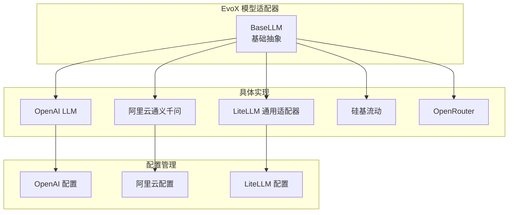

**图表来源**
- [MultiModelExample.java](file://evox-examples/src/main/java/io/leavesfly/evox/examples/MultiModelExample.java#L25-L170)

### 阿里云通义千问配置

```java
// 创建阿里云模型配置
AliyunLLMConfig config = AliyunLLMConfig.builder()
        .apiKey("your-dashscope-api-key")  // 实际使用时需要替换为真实 API Key
        .model("qwen-turbo")
        .temperature(0.7f)
        .topP(0.9f)
        .maxTokens(1500)
        .enableSearch(false)
        .repetitionPenalty(1.0f)
        .build();

// 创建阿里云 LLM 实例
BaseLLM aliyunLLM = new AliyunLLM(config);
```

### LiteLLM 通用适配器配置

```java
// 配置1：使用 OpenAI 兼容接口
LiteLLMConfig openaiConfig = LiteLLMConfig.builder()
        .apiKey("your-openai-api-key")
        .model("gpt-3.5-turbo")
        .baseUrl("https://api.openai.com/v1")
        .temperature(0.8f)
        .maxTokens(2000)
        .build();

// 配置2：使用本地模型
LiteLLMConfig localConfig = LiteLLMConfig.builder()
        .model("local-llama2")
        .baseUrl("http://localhost:8080")
        .isLocal(true)
        .temperature(0.7f)
        .build();

// 配置3：使用 Azure OpenAI
LiteLLMConfig azureConfig = LiteLLMConfig.builder()
        .model("gpt-4")
        .azureEndpoint("https://your-resource.openai.azure.com")
        .azureKey("your-azure-key")
        .apiVersion("2023-05-15")
        .temperature(0.7f)
        .build();
```

### 配置对比表

| 配置项 | 阿里云通义千问 | LiteLLM OpenAI | LiteLLM 本地 |
|-------|---------------|---------------|-------------|
| 模型名称 | qwen-turbo | gpt-3.5-turbo | local-llama2 |
| API 密钥 | dashscope-api-key | openai-api-key | 无需密钥 |
| 基础 URL | 默认 | https://api.openai.com/v1 | http://localhost:8080 |
| 温度参数 | 0.7 | 0.8 | 0.7 |
| 最大 Token | 1500 | 2000 | 可配置 |
| 本地模型 | ❌ | ❌ | ✅ |
| Azure 支持 | ❌ | ✅ | ❌ |
| 搜索功能 | ✅ | ❌ | ❌ |

### 使用示例

```java
// 创建测试消息
List<Message> messages = List.of(
    Message.builder()
        .messageType(MessageType.SYSTEM)
        .content("You are a helpful assistant.")
        .build(),
    Message.builder()
        .messageType(MessageType.INPUT)
        .content("你好，请介绍一下你自己。")
        .build()
);

// 使用阿里云模型
BaseLLM aliyunLLM = new AliyunLLM(aliyunConfig);
String response1 = aliyunLLM.generate(messages);

// 使用 OpenAI 兼容模型
BaseLLM openaiLLM = new LiteLLM(openaiConfig);
String response2 = openaiLLM.generate(messages);

// 使用本地模型
BaseLLM localLLM = new LiteLLM(localConfig);
String response3 = localLLM.generate(messages);
```

**章节来源**
- [MultiModelExample.java](file://evox-examples/src/main/java/io/leavesfly/evox/examples/MultiModelExample.java#L25-L170)

## 性能基准测试示例

### 示例概述

BenchmarkExample 展示了如何使用 EvoX 的基准测试功能来评估模型性能，包括数学问题解决和代码生成能力。

### 支持的基准测试

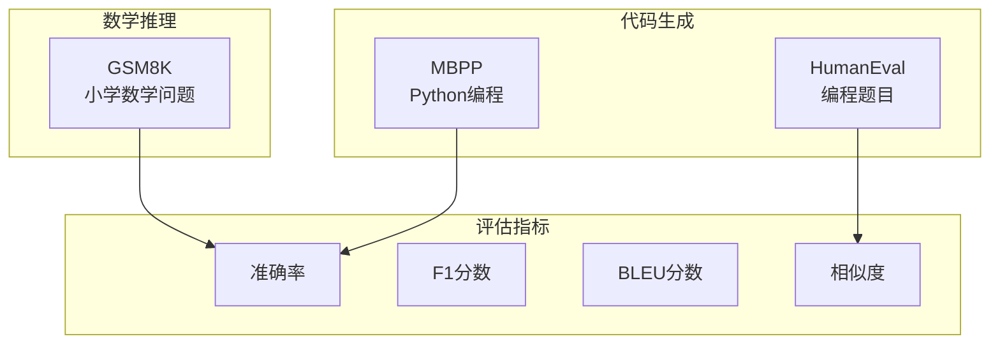

**图表来源**
- [BenchmarkExample.java](file://evox-examples/src/main/java/io/leavesfly/evox/examples/BenchmarkExample.java#L16-L165)

### GSM8K 数学问题评估

GSM8K 是一个专门针对小学数学问题的基准测试：

```java
// 创建GSM8K benchmark实例
String dataPath = "data/gsm8k/test.jsonl";
GSM8K gsm8k = new GSM8K(dataPath);

// 加载数据
log.info("加载GSM8K数据: {}", dataPath);
// gsm8k.loadData(); // 实际使用时需要取消注释

// 模拟评估过程
String question = "Janet的鸭子每天产16个蛋。她每天早上吃3个鸡蛋做早餐，" +
                 "为朋友烤松饼用4个，然后把剩下的鸡蛋以每颗$2的价格卖给" +
                 "农贸市场。她每天在农贸市场赚多少钱？";

String groundTruth = "18";
String prediction = "Janet每天产16个蛋，吃掉3个，用掉4个，所以剩下16-3-4=9个蛋。" +
                  "她以每颗$2的价格卖出，所以9*2=18美元。#### 18";

// 评估单个样本
var metrics = gsm8k.evaluate(prediction, groundTruth);
log.info("评估结果: {}", metrics);
```

### HumanEval 代码生成评估

HumanEval 是一个编程能力评估基准：

```java
// 创建HumanEval benchmark实例
String dataPath = "data/humaneval/test.jsonl";
HumanEval humanEval = new HumanEval(dataPath);

// 模拟代码评估
String prompt = "def has_close_elements(numbers, threshold):\n" +
               "    \"\"\"检查给定数字列表中，是否有任何两个数字之间的距离小于给定阈值。\"\"\"\n";

String canonicalSolution = "    for idx, elem in enumerate(numbers):\n" +
                         "        for idx2, elem2 in enumerate(numbers):\n" +
                         "            if idx != idx2:\n" +
                         "                distance = abs(elem - elem2)\n" +
                         "                if distance < threshold:\n" +
                         "                    return True\n" +
                         "    return False\n";

String generatedCode = "    for i in range(len(numbers)):\n" +
                     "        for j in range(i+1, len(numbers)):\n" +
                     "            if abs(numbers[i] - numbers[j]) < threshold:\n" +
                     "                return True\n" +
                     "    return False\n";

// 评估代码相似度
var metrics = humanEval.evaluate(generatedCode, canonicalSolution);
log.info("代码评估指标: {}", metrics);
log.info("相似度分数: {}", metrics.get("accuracy"));
```

### 批量评估示例

```java
// 批量评估示例
List<String> predictions = new ArrayList<>();
for (GSM8K.GSM8KExample example : gsm8k.getTestData()) {
    String prediction = yourModel.predict(example.getQuestion());
    predictions.add(prediction);
}

// 计算整体指标
Map<String, Double> metrics = gsm8k.evaluate(predictions);
log.info("整体准确率: {}", metrics.get("accuracy"));
```

### 自定义评估指标

```java
// 扩展基准测试类添加自定义指标
public class CustomBenchmark extends MessageBenchmark {
    @Override
    protected Map<String, Double> evaluateSingle(String prediction, String groundTruth) {
        Map<String, Double> metrics = new HashMap<>();
        
        // 计算精确匹配
        metrics.put("exact_match", prediction.equals(groundTruth) ? 1.0 : 0.0);
        
        // 计算F1分数
        metrics.put("f1_score", calculateF1(prediction, groundTruth));
        
        // 计算BLEU分数
        metrics.put("bleu_score", calculateBLEU(prediction, groundTruth));
        
        return metrics;
    }
}
```

**章节来源**
- [BenchmarkExample.java](file://evox-examples/src/main/java/io/leavesfly/evox/examples/BenchmarkExample.java#L16-L165)

## 运行示例的方法

### 环境要求

在运行示例之前，请确保满足以下要求：

| 组件 | 版本要求 | 说明 |
|------|---------|------|
| Java | JDK 17 或更高 | EvoX 需要 Java 17+ |
| Maven | 3.6+ | 用于构建和运行示例 |
| OpenAI API Key | 可选 | 用于 LLM 调用 |
| 网络连接 | 必需 | 下载依赖和调用 API |

### 编译和安装

```bash
# 进入项目根目录
cd evox

# 编译并安装所有模块
mvn clean install -DskipTests
```

### 运行单个示例

```bash
# 运行 SimpleChatBot
mvn exec:java -pl evox-examples \
  -Dexec.mainClass="io.leavesfly.evox.examples.SimpleChatBot"

# 运行 ComprehensiveChatBot  
mvn exec:java -pl evox-examples \
  -Dexec.mainClass="io.leavesfly.evox.examples.ComprehensiveChatBot"

# 运行 ToolsExample
mvn exec:java -pl evox-examples \
  -Dexec.mainClass="io.leavesfly.evox.examples.ToolsExample"

# 运行 WorkflowDemo
mvn exec:java -pl evox-examples \
  -Dexec.mainClass="io.leavesfly.evox.examples.WorkflowDemo"
```

### 使用脚本运行

EvoX 提供了便捷的运行脚本：

```bash
# 进入示例目录
cd evox-examples

# 运行交互式脚本
./run-examples.sh

# 或者直接指定示例
mvn exec:java -pl evox-examples \
  -Dexec.mainClass="io.leavesfly.evox.examples.MultiModelExample"
```

### 常见运行问题

#### 1. 编译失败

```bash
# 检查 Java 版本
java -version  # 应该是 17 或更高

# 检查 Maven 版本
mvn -version   # 应该是 3.6+

# 清理后重新编译
mvn clean install -U -DskipTests
```

#### 2. OpenAI API 调用失败

```bash
# 检查 API Key 是否正确
export OPENAI_API_KEY="your-api-key"

# 检查网络连接
curl -H "Authorization: Bearer $OPENAI_API_KEY" \
     https://api.openai.com/v1/models

# 设置代理（如果需要）
export HTTP_PROXY=http://your-proxy:port
export HTTPS_PROXY=http://your-proxy:port
```

#### 3. 找不到类或依赖

```bash
# 确保先安装了所有依赖模块
cd evox
mvn clean install -DskipTests

# 然后再运行示例
mvn exec:java -pl evox-examples -Dexec.mainClass="..."
```

**章节来源**
- [run-examples.sh](file://evox-examples/run-examples.sh#L1-L96)
- [README.md](file://evox-examples/README.md#L16-L30)

## 最佳实践和架构设计

### 1. 模块化设计原则

EvoX 遵循模块化设计原则，每个组件都有明确的职责：

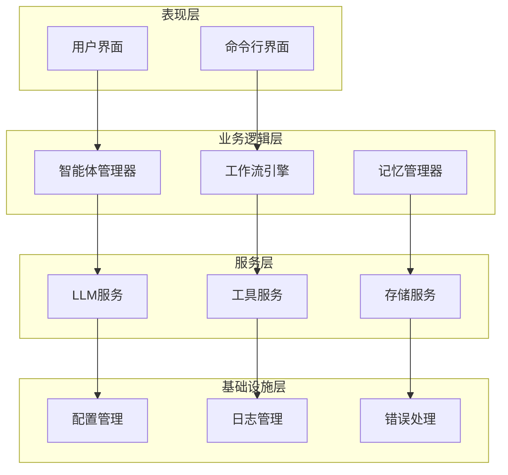

### 2. 智能体设计模式

#### 单一职责原则

每个智能体应该专注于特定的任务领域：

```java
// 数据分析智能体
public class DataAnalysisAgent extends Agent {
    public DataAnalysisAgent() {
        addAction(new DataValidationAction());
        addAction(new StatisticalAnalysisAction());
        addAction(new ReportGenerationAction());
    }
}

// 文档处理智能体  
public class DocumentProcessingAgent extends Agent {
    public DocumentProcessingAgent() {
        addAction(new OCRAction());
        addAction(new TextExtractionAction());
        addAction(new FormatConversionAction());
    }
}
```

#### 组合模式

通过组合多个智能体来完成复杂任务：

```java
// 研究助理智能体
public class ResearchAssistantAgent extends Agent {
    private final SearchAgent searchAgent;
    private final DocumentAgent documentAgent;
    private final AnalysisAgent analysisAgent;
    
    public ResearchAssistantAgent() {
        searchAgent = new SearchAgent();
        documentAgent = new DocumentAgent();
        analysisAgent = new AnalysisAgent();
        
        addAction(new ResearchCoordinatorAction());
    }
}
```

### 3. 工具集成策略

#### 工具封装原则

```java
// 统一的工具接口
public interface BaseTool {
    String getName();
    String getDescription();
    Map<String, Object> execute(Map<String, Object> parameters);
}

// 具体工具实现
public class FileSystemTool implements BaseTool {
    @Override
    public String getName() { return "filesystem"; }
    
    @Override
    public String getDescription() { return "文件系统操作工具"; }
    
    @Override
    public Map<String, Object> execute(Map<String, Object> parameters) {
        // 实现文件操作逻辑
    }
}
```

#### 工具链模式

```java
// 工具链管理
public class ToolChain {
    private final List<BaseTool> tools;
    
    public ToolChain() {
        this.tools = new ArrayList<>();
    }
    
    public void addTool(BaseTool tool) {
        tools.add(tool);
    }
    
    public Map<String, Object> executeChain(Map<String, Object> input) {
        Map<String, Object> result = input;
        for (BaseTool tool : tools) {
            result = tool.execute(result);
        }
        return result;
    }
}
```

### 4. 工作流设计模式

#### 控制流模式

```java
// 顺序执行
public class SequentialWorkflow {
    private final List<WorkflowNode> nodes;
    
    public String execute(Map<String, Object> input) {
        String result = "";
        for (WorkflowNode node : nodes) {
            result = node.process(result);
        }
        return result;
    }
}

// 并行执行
public class ParallelWorkflow {
    private final List<WorkflowNode> nodes;
    
    public Map<String, String> execute(Map<String, Object> input) {
        ExecutorService executor = Executors.newFixedThreadPool(nodes.size());
        List<Future<Map.Entry<String, String>>> futures = new ArrayList<>();
        
        for (WorkflowNode node : nodes) {
            futures.add(executor.submit(() -> {
                String output = node.process(input);
                return new AbstractMap.SimpleEntry<>(node.getId(), output);
            }));
        }
        
        Map<String, String> results = new HashMap<>();
        for (Future<Map.Entry<String, String>> future : futures) {
            Map.Entry<String, String> entry = future.get();
            results.put(entry.getKey(), entry.getValue());
        }
        
        return results;
    }
}
```

#### 错误处理模式

```java
// 工作流错误处理
public class RobustWorkflow {
    private final WorkflowNode[] nodes;
    private final ErrorHandler errorHandler;
    
    public String executeWithRetry(Map<String, Object> input, int maxRetries) {
        for (int attempt = 0; attempt < maxRetries; attempt++) {
            try {
                return execute(input);
            } catch (Exception e) {
                if (attempt == maxRetries - 1) {
                    throw e;
                }
                errorHandler.handle(e, attempt + 1);
                Thread.sleep(1000 * (attempt + 1)); // 指数退避
            }
        }
        return null;
    }
}
```

### 5. 记忆系统设计

#### 多层次记忆架构

```java
// 记忆层次结构
public class MemoryHierarchy {
    private final ShortTermMemory shortTermMemory;
    private final WorkingMemory workingMemory;
    private final LongTermMemory longTermMemory;
    
    public MemoryHierarchy() {
        this.shortTermMemory = new ShortTermMemory(20);
        this.workingMemory = new WorkingMemory();
        this.longTermMemory = new LongTermMemory(createConfig());
    }
    
    public void addMessage(Message message, MemoryLevel level) {
        switch (level) {
            case SHORT_TERM:
                shortTermMemory.add(message);
                break;
            case WORKING:
                workingMemory.add(message);
                break;
            case LONG_TERM:
                longTermMemory.add(message);
                break;
        }
    }
}
```

#### 记忆检索策略

```java
// 智能记忆检索
public class SmartMemoryRetrieval {
    private final MemoryManager memoryManager;
    private final EmbeddingService embeddingService;
    
    public List<Message> retrieveRelevantMessages(String query, int topK) {
        // 生成查询嵌入
        List<Float> queryEmbedding = embeddingService.embed(query);
        
        // 向量检索
        List<Message> vectorResults = memoryManager.vectorSearch(queryEmbedding, topK);
        
        // 关键词检索
        List<Message> keywordResults = memoryManager.keywordSearch(query, topK);
        
        // 结果融合
        return fuseResults(vectorResults, keywordResults, topK);
    }
}
```

### 6. 性能优化策略

#### 异步处理

```java
// 异步智能体执行
public class AsyncAgent {
    private final ExecutorService executor;
    
    public CompletableFuture<Message> executeAsync(String actionName, List<Message> messages) {
        return CompletableFuture.supplyAsync(() -> {
            return agent.execute(actionName, messages);
        }, executor);
    }
}
```

#### 缓存策略

```java
// 智能缓存
public class IntelligentCache {
    private final Map<String, Object> cache;
    private final CacheConfig config;
    
    public Object getOrCompute(String key, Supplier<Object> computation) {
        if (cache.containsKey(key) && !isExpired(key)) {
            return cache.get(key);
        }
        
        Object result = computation.get();
        cache.put(key, result);
        return result;
    }
}
```

## 总结

EvoX 框架提供了完整而强大的 AI 应用开发工具链，通过本指南展示的各种示例，我们可以看到：

### 核心优势

1. **模块化架构**：清晰分离的关注点使得系统易于维护和扩展
2. **灵活的智能体系统**：支持单一职责和组合模式的智能体设计
3. **丰富的工具生态**：内置多种实用工具，支持自定义扩展
4. **强大的工作流编排**：支持复杂业务流程的可视化设计
5. **多模型支持**：统一接口支持多种 LLM 提供商

### 应用场景

- **简单聊天机器人**：适合快速原型开发和基础对话场景
- **综合智能助手**：支持多智能体协作和复杂任务处理
- **企业级应用**：结合工作流编排和工具集成的复杂业务系统
- **研究和实验**：支持多种模型和评估基准的实验平台

### 开发建议

1. **从简单开始**：先从 SimpleChatBot 开始，逐步增加复杂性
2. **模块化设计**：遵循单一职责原则，合理划分组件边界
3. **工具集成**：充分利用内置工具，必要时扩展自定义工具
4. **工作流编排**：对于复杂业务流程，优先考虑工作流设计
5. **性能优化**：在高并发场景下考虑异步处理和缓存策略

### 未来发展方向

- **记忆系统的完善**：长期记忆、工作记忆等功能的进一步开发
- **更多工具支持**：数据库、图像处理、语音识别等工具的集成
- **可视化编辑器**：拖拽式的工作流设计界面
- **云端部署**：容器化和微服务化的部署方案

通过掌握这些示例和最佳实践，开发者可以快速上手 EvoX 框架，构建出功能强大、架构优雅的 AI 应用程序。