# 工作流编排示例

<cite>
**本文档引用的文件**
- [WorkflowDemo.java](file://evox-examples/src/main/java/io/leavesfly/evox/examples/WorkflowDemo.java)
- [SequentialWorkflowExample.java](file://evox-examples/src/main/java/io/leavesfly/evox/examples/SequentialWorkflowExample.java)
- [Workflow.java](file://evox-workflow/src/main/java/io/leavesfly/evox/workflow/base/Workflow.java)
- [WorkflowNode.java](file://evox-workflow/src/main/java/io/leavesfly/evox/workflow/base/WorkflowNode.java)
- [WorkflowGraph.java](file://evox-workflow/src/main/java/io/leavesfly/evox/workflow/graph/WorkflowGraph.java)
- [WorkflowContext.java](file://evox-workflow/src/main/java/io/leavesfly/evox/workflow/execution/WorkflowContext.java)
- [WorkflowExecutor.java](file://evox-workflow/src/main/java/io/leavesfly/evox/workflow/execution/WorkflowExecutor.java)
- [Operator.java](file://evox-workflow/src/main/java/io/leavesfly/evox/workflow/operator/Operator.java)
</cite>

## 目录
1. [简介](#简介)
2. [项目结构概览](#项目结构概览)
3. [核心组件架构](#核心组件架构)
4. [WorkflowDemo示例详解](#workflowdemo示例详解)
5. [SequentialWorkflowExample示例详解](#sequentialworkflowexample示例详解)
6. [工作流引擎核心概念](#工作流引擎核心概念)
7. [复杂工作流拓扑结构](#复杂工作流拓扑结构)
8. [数据传递机制与状态管理](#数据传递机制与状态管理)
9. [错误处理策略](#错误处理策略)
10. [性能优化与可观测性](#性能优化与可观测性)
11. [最佳实践与总结](#最佳实践与总结)

## 简介

EvoX工作流引擎是一个功能强大的异步工作流编排框架，支持复杂的业务流程自动化。本文档深入解析了两个核心示例：WorkflowDemo和SequentialWorkflowExample，展示了如何利用EvoX构建和执行各种类型的工作流。

工作流引擎的核心特性包括：
- **多节点类型支持**：支持动作节点(ACTION)、决策节点(DECISION)、并行节点(PARALLEL)、循环节点(LOOP)和子工作流节点(SUBWORKFLOW)
- **灵活的拓扑结构**：支持线性、分支、并行和嵌套的工作流设计
- **强大的状态管理**：完整的节点状态跟踪和工作流进度监控
- **异步执行能力**：基于Reactor的响应式编程模型
- **丰富的可观测性**：内置的日志追踪和性能监控

## 项目结构概览

EvoX工作流引擎采用模块化架构设计，主要包含以下核心模块：

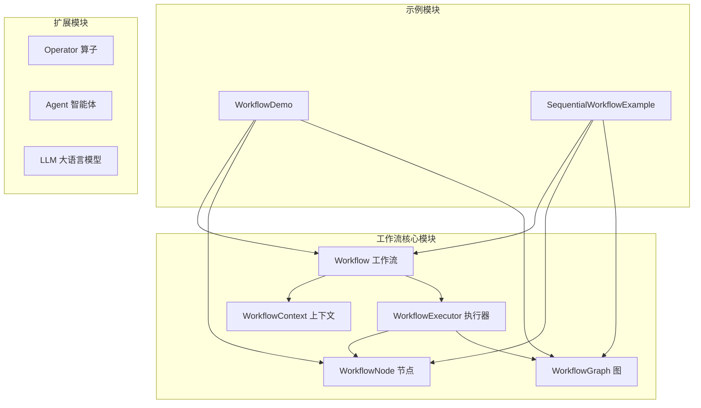
```mermaid
graph TB
subgraph "工作流核心模块"
WF[Workflow 工作流]
WGN[WorkflowNode 节点]
WG[WorkflowGraph 图]
WC[WorkflowContext 上下文]
WE[WorkflowExecutor 执行器]
end
subgraph "示例模块"
WD[WorkflowDemo]
SW[SequentialWorkflowExample]
end
subgraph "扩展模块"
OP[Operator 算子]
AG[Agent 智能体]
LL[LLM 大语言模型]
end
WD --> WF
WD --> WGN
WD --> WG
SW --> WF
SW --> WGN
SW --> WG
WF --> WC
WF --> WE
WE --> WGN
WE --> WG
```

**图表来源**
- [Workflow.java](file://evox-workflow/src/main/java/io/leavesfly/evox/workflow/base/Workflow.java#L1-L50)
- [WorkflowNode.java](file://evox-workflow/src/main/java/io/leavesfly/evox/workflow/base/WorkflowNode.java#L1-L50)
- [WorkflowGraph.java](file://evox-workflow/src/main/java/io/leavesfly/evox/workflow/graph/WorkflowGraph.java#L1-L50)

## 核心组件架构

### 工作流生命周期

工作流引擎遵循严格的生命周期管理模式：

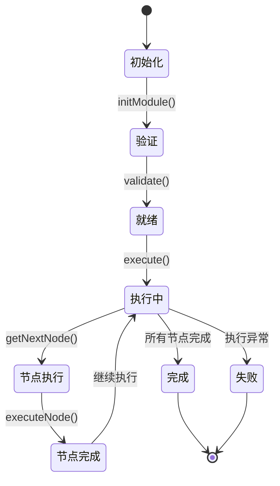
```mermaid
stateDiagram-v2
[*] --> 初始化
初始化 --> 验证 : initModule()
验证 --> 就绪 : validate()
就绪 --> 执行中 : execute()
执行中 --> 节点执行 : getNextNode()
节点执行 --> 节点完成 : executeNode()
节点完成 --> 执行中 : 继续执行
执行中 --> 完成 : 所有节点完成
执行中 --> 失败 : 执行异常
完成 --> [*]
失败 --> [*]
```

**图表来源**
- [Workflow.java](file://evox-workflow/src/main/java/io/leavesfly/evox/workflow/base/Workflow.java#L72-L88)
- [WorkflowExecutor.java](file://evox-workflow/src/main/java/io/leavesfly/evox/workflow/execution/WorkflowExecutor.java#L54-L89)

### 节点状态流转

每个工作流节点都有明确的状态定义和流转规则：

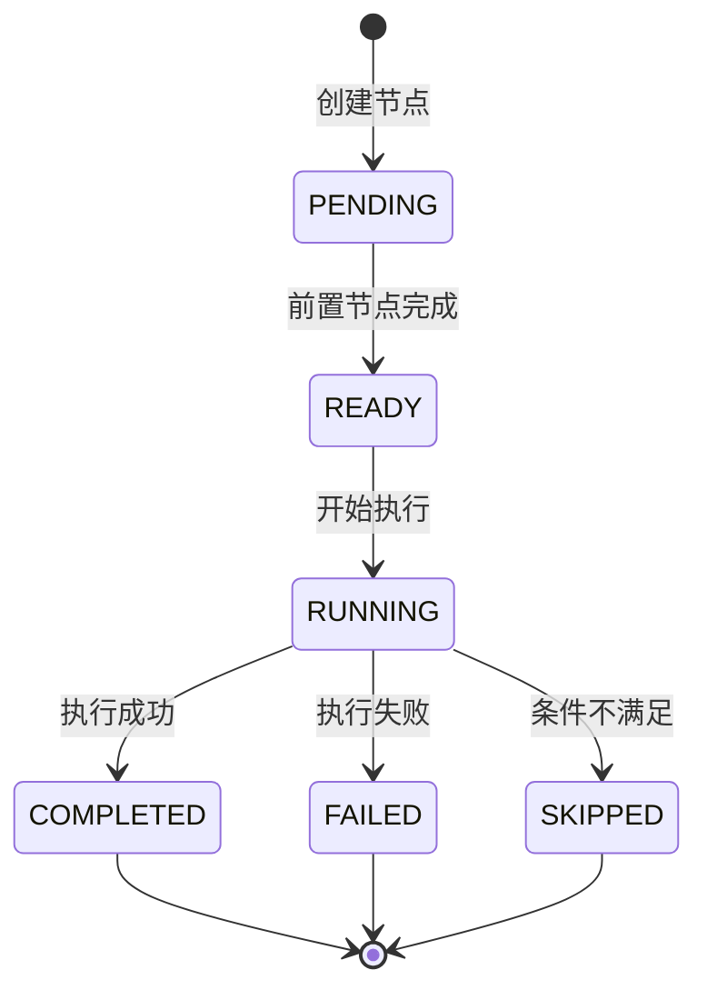
```mermaid
stateDiagram-v2
[*] --> PENDING : 创建节点
PENDING --> READY : 前置节点完成
READY --> RUNNING : 开始执行
RUNNING --> COMPLETED : 执行成功
RUNNING --> FAILED : 执行失败
RUNNING --> SKIPPED : 条件不满足
COMPLETED --> [*]
FAILED --> [*]
SKIPPED --> [*]
```

**图表来源**
- [WorkflowNode.java](file://evox-workflow/src/main/java/io/leavesfly/evox/workflow/base/WorkflowNode.java#L271-L284)

## WorkflowDemo示例详解

WorkflowDemo展示了EvoX工作流引擎的各种节点类型的使用方法，是理解复杂工作流设计的最佳实践。

### 顺序工作流示例

顺序工作流是最基础的工作流类型，按照预定义的顺序依次执行各个节点：

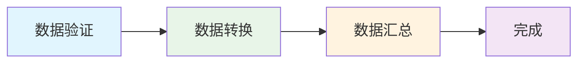
```mermaid
flowchart LR
A[数据验证] --> B[数据转换]
B --> C[数据汇总]
C --> D[完成]
style A fill:#e1f5fe
style B fill:#e8f5e8
style C fill:#fff3e0
style D fill:#f3e5f5
```

**图表来源**
- [WorkflowDemo.java](file://evox-examples/src/main/java/io/leavesfly/evox/examples/WorkflowDemo.java#L58-L87)

关键实现要点：
- **节点链式连接**：通过`addEdge()`方法建立节点间的依赖关系
- **智能体集成**：将数据处理动作封装到DataProcessorAgent中
- **输入输出传递**：通过Map结构在节点间传递数据

### 决策工作流示例

决策工作流根据条件动态选择执行路径：

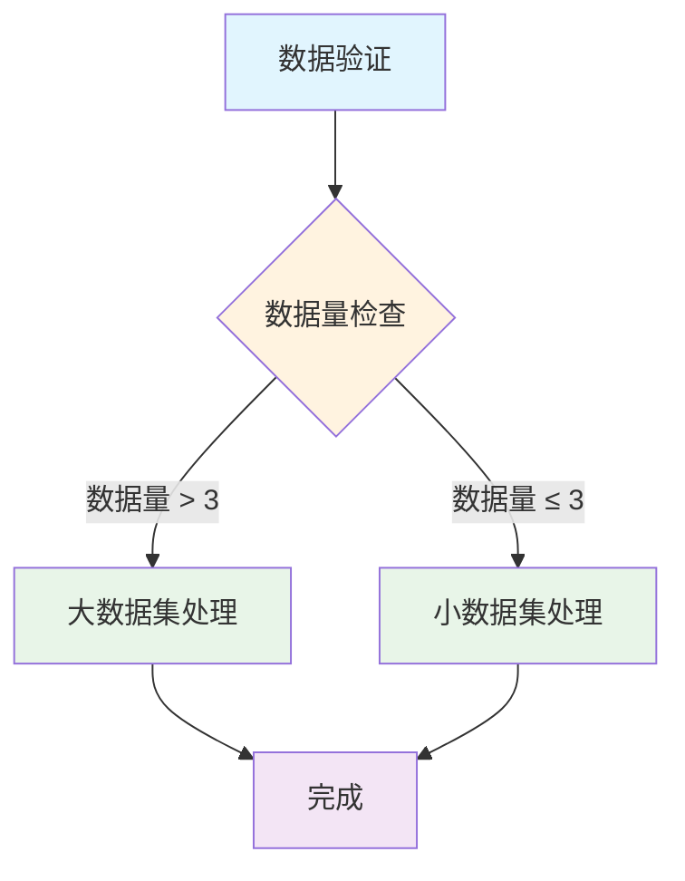
```mermaid
flowchart TD
A[数据验证] --> B{数据量检查}
B --> |数据量 > 3| C[大数据集处理]
B --> |数据量 ≤ 3| D[小数据集处理]
C --> E[完成]
D --> E
style A fill:#e1f5fe
style B fill:#fff3e0
style C fill:#e8f5e8
style D fill:#e8f5e8
style E fill:#f3e5f5
```

**图表来源**
- [WorkflowDemo.java](file://evox-examples/src/main/java/io/leavesfly/evox/examples/WorkflowDemo.java#L122-L166)

决策节点的核心配置：
- **条件表达式**：支持简单的布尔表达式如`context.dataSize > 3`
- **分支映射**：通过`setBranchMapping()`方法定义条件到节点的映射关系
- **动态路由**：根据运行时数据自动选择执行路径

### 并行工作流示例

并行工作流允许同时执行多个独立的任务：

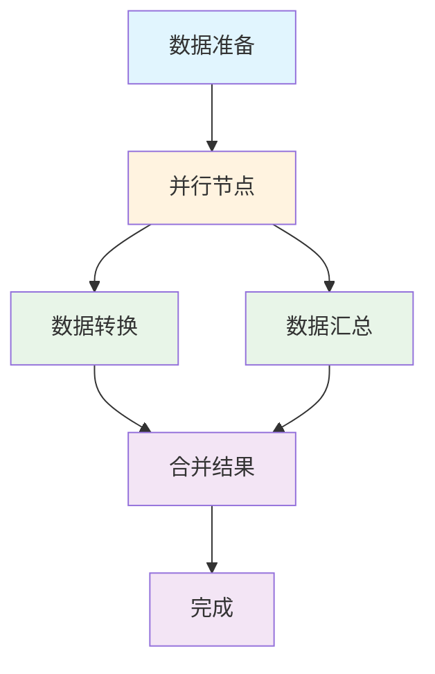
```mermaid
flowchart TD
A[数据准备] --> B[并行节点]
B --> C[数据转换]
B --> D[数据汇总]
C --> E[合并结果]
D --> E
E --> F[完成]
style A fill:#e1f5fe
style B fill:#fff3e0
style C fill:#e8f5e8
style D fill:#e8f5e8
style E fill:#f3e5f5
style F fill:#f3e5f5
```

**图表来源**
- [WorkflowDemo.java](file://evox-examples/src/main/java/io/leavesfly/evox/examples/WorkflowDemo.java#L208-L248)

并行执行策略：
- **ALL策略**：等待所有子节点完成后再继续
- **ANY策略**：任意一个子节点完成即可
- **FIRST策略**：第一个完成的节点结果被采用

### 循环工作流示例

循环工作流支持重复执行特定逻辑：

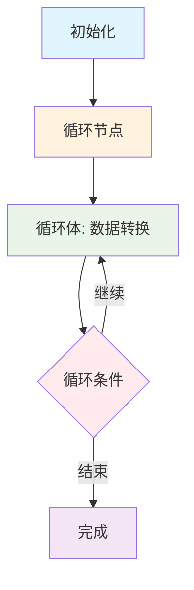
```mermaid
flowchart TD
A[初始化] --> B[循环节点]
B --> C[循环体: 数据转换]
C --> D{循环条件}
D --> |继续| C
D --> |结束| E[完成]
style A fill:#e1f5fe
style B fill:#fff3e0
style C fill:#e8f5e8
style D fill:#ffebee
style E fill:#f3e5f5
```

**图表来源**
- [WorkflowDemo.java](file://evox-examples/src/main/java/io/leavesfly/evox/examples/WorkflowDemo.java#L278-L309)

循环节点配置要点：
- **最大迭代次数**：防止无限循环的安全机制
- **循环条件**：支持复杂的条件表达式
- **状态维护**：自动维护当前迭代计数

**章节来源**
- [WorkflowDemo.java](file://evox-examples/src/main/java/io/leavesfly/evox/examples/WorkflowDemo.java#L41-L549)

## SequentialWorkflowExample示例详解

SequentialWorkflowExample展示了如何构建简单的两步工作流，是理解基本工作流模式的入门示例。

### 基础工作流架构

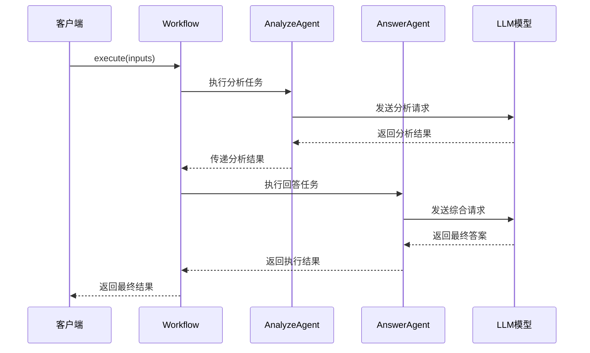
```mermaid
sequenceDiagram
participant Client as 客户端
participant WF as Workflow
participant AG1 as AnalyzeAgent
participant AG2 as AnswerAgent
participant LLM as LLM模型
Client->>WF : execute(inputs)
WF->>AG1 : 执行分析任务
AG1->>LLM : 发送分析请求
LLM-->>AG1 : 返回分析结果
AG1-->>WF : 传递分析结果
WF->>AG2 : 执行回答任务
AG2->>LLM : 发送综合请求
LLM-->>AG2 : 返回最终答案
AG2-->>WF : 返回执行结果
WF-->>Client : 返回最终结果
```

**图表来源**
- [SequentialWorkflowExample.java](file://evox-examples/src/main/java/io/leavesfly/evox/examples/SequentialWorkflowExample.java#L87-L124)

### 智能体配置与集成

示例中展示了如何配置和使用智能体：

| 智能体类型 | 功能描述 | 输入参数 | 输出参数 |
|-----------|----------|----------|----------|
| AnalyzeAgent | 问题分析 | question | analysis |
| AnswerAgent | 综合回答 | question, analysis | answer |

### 工作流执行流程

1. **初始化阶段**：配置LLM参数和智能体规格
2. **节点创建**：定义分析和回答两个工作流节点
3. **图构建**：建立节点间的执行顺序
4. **工作流组装**：将图、智能体管理器和LLM集成
5. **执行阶段**：传入输入数据并获取结果

**章节来源**
- [SequentialWorkflowExample.java](file://evox-examples/src/main/java/io/leavesfly/evox/examples/SequentialWorkflowExample.java#L25-L125)

## 工作流引擎核心概念

### WorkflowNode - 工作流节点

WorkflowNode是工作流的基本执行单元，支持多种节点类型：

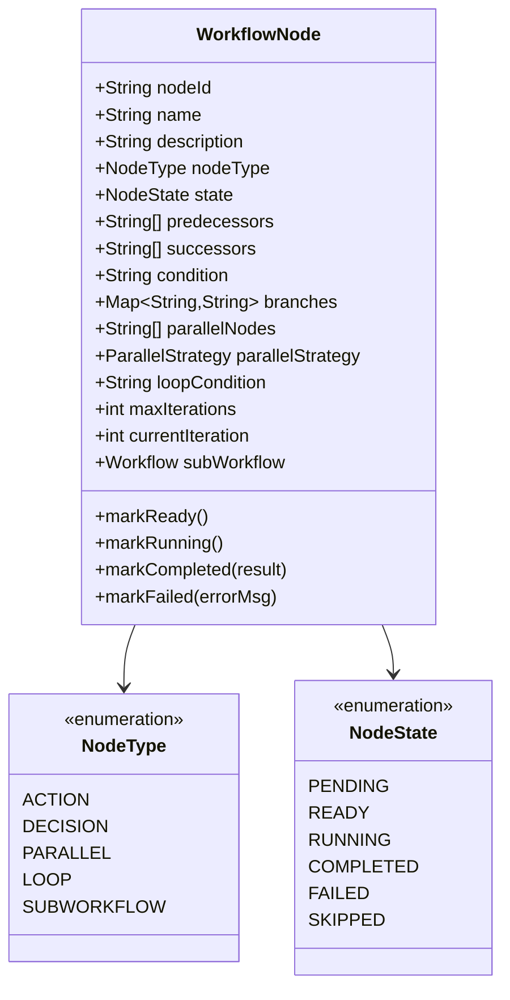
```mermaid
classDiagram
class WorkflowNode {
+String nodeId
+String name
+String description
+NodeType nodeType
+NodeState state
+String[] predecessors
+String[] successors
+String condition
+Map~String,String~ branches
+String[] parallelNodes
+ParallelStrategy parallelStrategy
+String loopCondition
+int maxIterations
+int currentIteration
+Workflow subWorkflow
+markReady()
+markRunning()
+markCompleted(result)
+markFailed(errorMsg)
}
class NodeType {
<<enumeration>>
ACTION
DECISION
PARALLEL
LOOP
SUBWORKFLOW
}
class NodeState {
<<enumeration>>
PENDING
READY
RUNNING
COMPLETED
FAILED
SKIPPED
}
WorkflowNode --> NodeType
WorkflowNode --> NodeState
```

**图表来源**
- [WorkflowNode.java](file://evox-workflow/src/main/java/io/leavesfly/evox/workflow/base/WorkflowNode.java#L21-L325)

### WorkflowGraph - 工作流图

WorkflowGraph管理整个工作流的拓扑结构和节点关系：

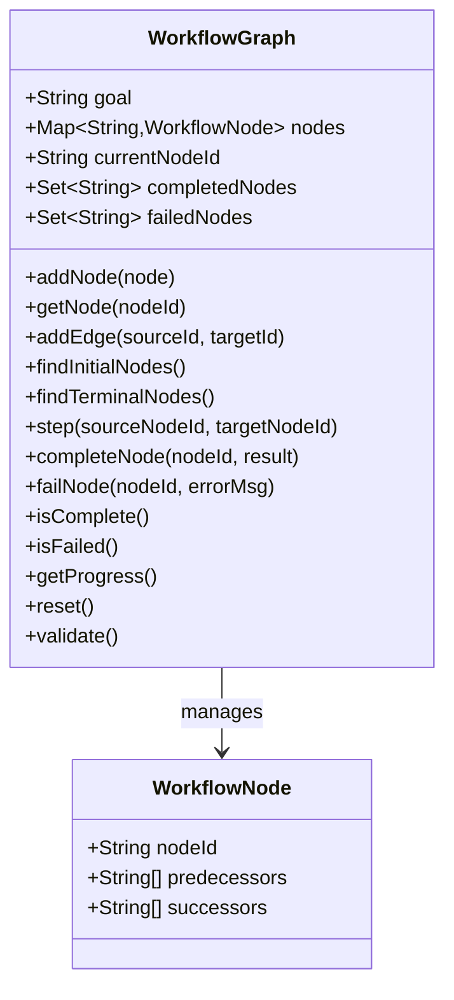
```mermaid
classDiagram
class WorkflowGraph {
+String goal
+Map~String,WorkflowNode~ nodes
+String currentNodeId
+Set~String~ completedNodes
+Set~String~ failedNodes
+addNode(node)
+getNode(nodeId)
+addEdge(sourceId, targetId)
+findInitialNodes()
+findTerminalNodes()
+step(sourceNodeId, targetNodeId)
+completeNode(nodeId, result)
+failNode(nodeId, errorMsg)
+isComplete()
+isFailed()
+getProgress()
+reset()
+validate()
}
class WorkflowNode {
+String nodeId
+String[] predecessors
+String[] successors
}
WorkflowGraph --> WorkflowNode : manages
```

**图表来源**
- [WorkflowGraph.java](file://evox-workflow/src/main/java/io/leavesfly/evox/workflow/graph/WorkflowGraph.java#L18-L326)

### WorkflowContext - 执行上下文

WorkflowContext负责维护工作流执行过程中的状态和数据：

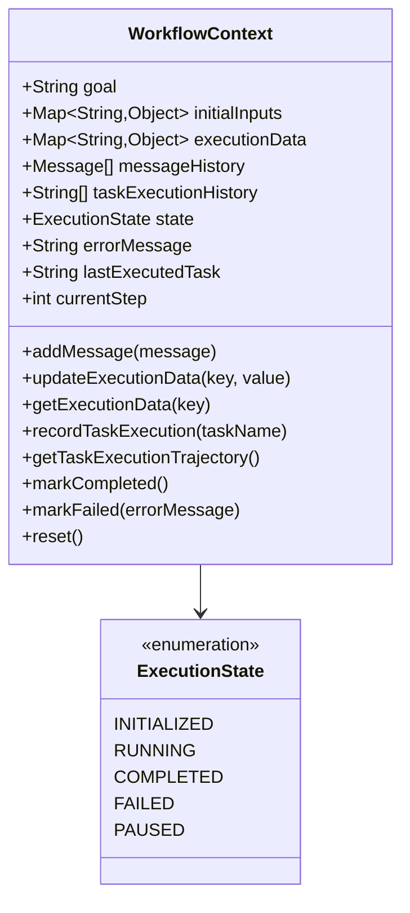
```mermaid
classDiagram
class WorkflowContext {
+String goal
+Map~String,Object~ initialInputs
+Map~String,Object~ executionData
+Message[] messageHistory
+String[] taskExecutionHistory
+ExecutionState state
+String errorMessage
+String lastExecutedTask
+int currentStep
+addMessage(message)
+updateExecutionData(key, value)
+getExecutionData(key)
+recordTaskExecution(taskName)
+getTaskExecutionTrajectory()
+markCompleted()
+markFailed(errorMessage)
+reset()
}
class ExecutionState {
<<enumeration>>
INITIALIZED
RUNNING
COMPLETED
FAILED
PAUSED
}
WorkflowContext --> ExecutionState
```

**图表来源**
- [WorkflowContext.java](file://evox-workflow/src/main/java/io/leavesfly/evox/workflow/execution/WorkflowContext.java#L15-L223)

**章节来源**
- [WorkflowNode.java](file://evox-workflow/src/main/java/io/leavesfly/evox/workflow/base/WorkflowNode.java#L1-L325)
- [WorkflowGraph.java](file://evox-workflow/src/main/java/io/leavesfly/evox/workflow/graph/WorkflowGraph.java#L1-L326)
- [WorkflowContext.java](file://evox-workflow/src/main/java/io/leavesfly/evox/workflow/execution/WorkflowContext.java#L1-L223)

## 复杂工作流拓扑结构

### 条件分支设计

EvoX支持复杂的条件分支逻辑，可以根据运行时数据动态选择执行路径：

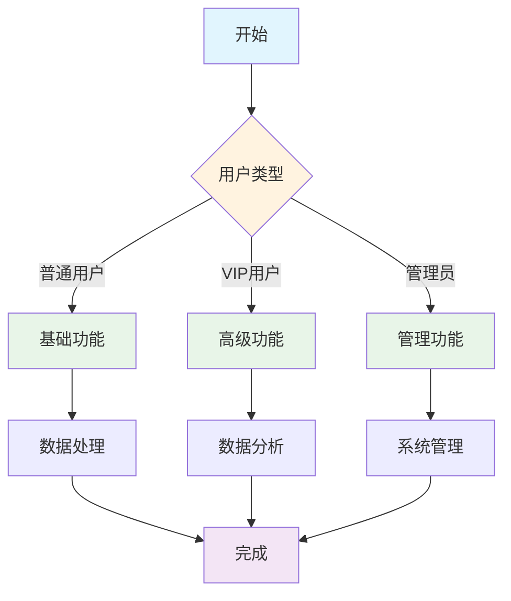
```mermaid
flowchart TD
A[开始] --> B{用户类型}
B --> |普通用户| C[基础功能]
B --> |VIP用户| D[高级功能]
B --> |管理员| E[管理功能]
C --> F[数据处理]
D --> G[数据分析]
E --> H[系统管理]
F --> I[完成]
G --> I
H --> I
style A fill:#e1f5fe
style B fill:#fff3e0
style C fill:#e8f5e8
style D fill:#e8f5e8
style E fill:#e8f5e8
style I fill:#f3e5f5
```

### 并行执行策略

支持三种并行执行策略，适应不同的并发需求：

| 策略类型 | 描述 | 适用场景 | 性能特点 |
|---------|------|----------|----------|
| ALL | 等待所有子节点完成 | 结果聚合 | 高可靠性 |
| ANY | 任意一个完成即可 | 快速响应 | 低延迟 |
| FIRST | 第一个完成的节点 | 资源优化 | 最快响应 |

### 循环节点应用场景

循环节点适用于需要重复执行的场景：

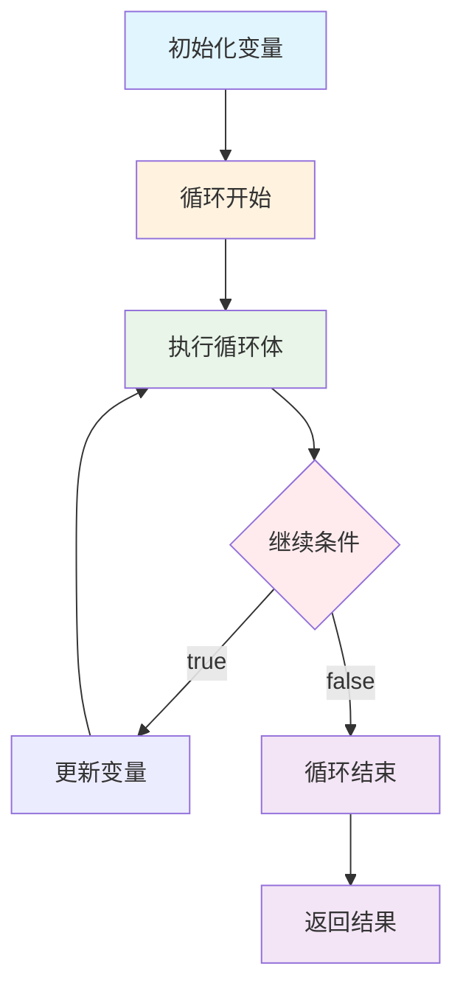
```mermaid
flowchart TD
A[初始化变量] --> B[循环开始]
B --> C[执行循环体]
C --> D{继续条件}
D --> |true| E[更新变量]
D --> |false| F[循环结束]
E --> C
F --> G[返回结果]
style A fill:#e1f5fe
style B fill:#fff3e0
style C fill:#e8f5e8
style D fill:#ffebee
style F fill:#f3e5f5
style G fill:#f3e5f5
```

### 子工作流调用

支持工作流的嵌套和复用：

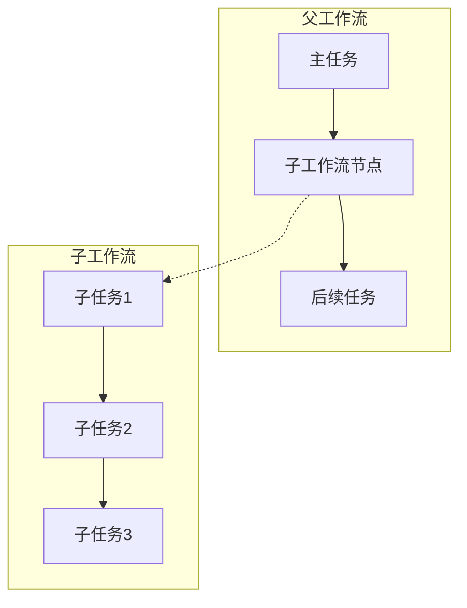
```mermaid
graph TB
subgraph "父工作流"
A[主任务] --> B[子工作流节点]
B --> C[后续任务]
end
subgraph "子工作流"
D[子任务1] --> E[子任务2]
E --> F[子任务3]
end
B -.-> D
```

## 数据传递机制与状态管理

### 上下文数据流动

工作流执行过程中，数据通过多个层次进行传递和管理：

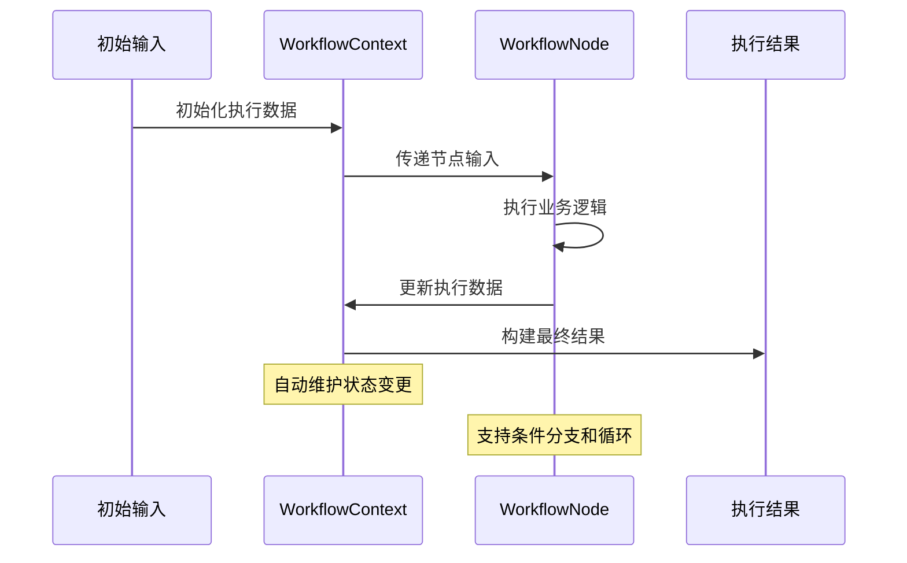
```mermaid
sequenceDiagram
participant Input as 初始输入
participant Context as WorkflowContext
participant Node as WorkflowNode
participant Output as 执行结果
Input->>Context : 初始化执行数据
Context->>Node : 传递节点输入
Node->>Node : 执行业务逻辑
Node->>Context : 更新执行数据
Context->>Output : 构建最终结果
Note over Context : 自动维护状态变更
Note over Node : 支持条件分支和循环
```

### 状态同步机制

工作流引擎实现了完整的状态同步机制：

| 状态类型 | 触发条件 | 同步策略 | 性能影响 |
|---------|----------|----------|----------|
| 节点状态 | 执行前后 | 即时更新 | 低 |
| 执行数据 | 每次更新 | 增量同步 | 中 |
| 消息历史 | 消息产生 | 异步追加 | 低 |
| 执行轨迹 | 任务完成 | 顺序记录 | 低 |

### 数据隔离与共享

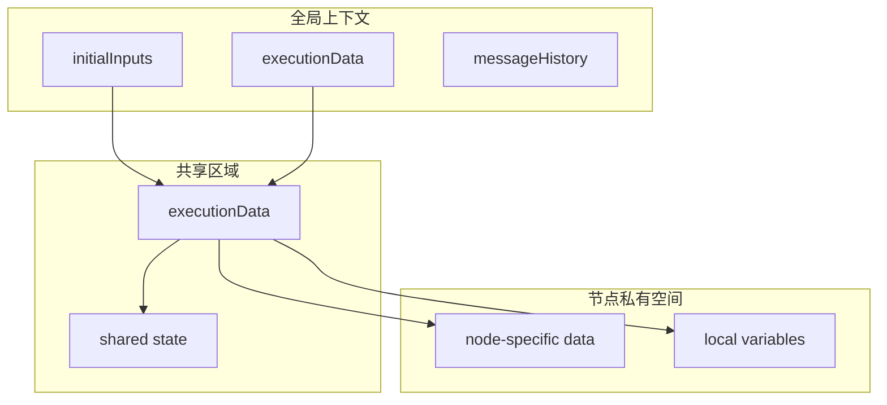
```mermaid
graph TB
subgraph "全局上下文"
A[initialInputs]
B[executionData]
C[messageHistory]
end
subgraph "节点私有空间"
D[node-specific data]
E[local variables]
end
subgraph "共享区域"
F[executionData]
G[shared state]
end
A --> F
B --> F
F --> D
F --> E
F --> G
```

**章节来源**
- [WorkflowContext.java](file://evox-workflow/src/main/java/io/leavesfly/evox/workflow/execution/WorkflowContext.java#L63-L205)

## 错误处理策略

### 分层错误处理

EvoX实现了多层次的错误处理机制：

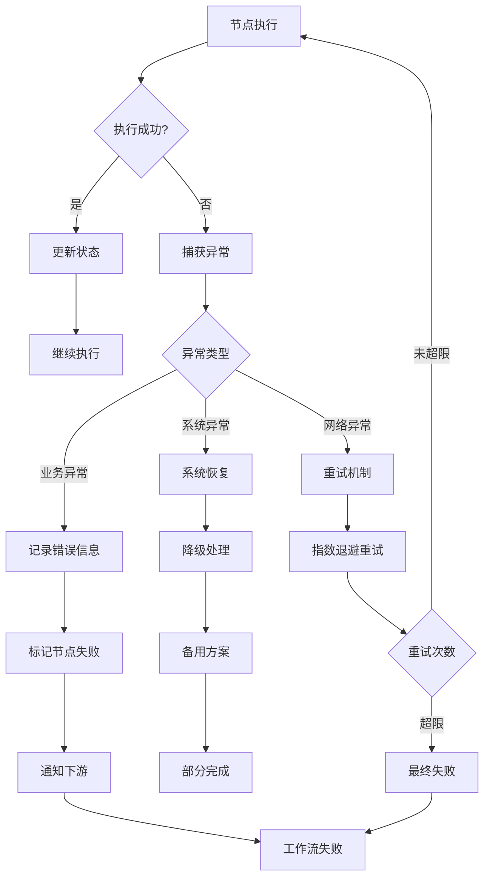
```mermaid
flowchart TD
A[节点执行] --> B{执行成功?}
B --> |是| C[更新状态]
B --> |否| D[捕获异常]
D --> E{异常类型}
E --> |业务异常| F[记录错误信息]
E --> |系统异常| G[系统恢复]
E --> |网络异常| H[重试机制]
F --> I[标记节点失败]
G --> J[降级处理]
H --> K[指数退避重试]
I --> L[通知下游]
J --> M[备用方案]
K --> N{重试次数}
N --> |未超限| A
N --> |超限| O[最终失败]
C --> P[继续执行]
L --> Q[工作流失败]
M --> R[部分完成]
O --> Q
```

### 错误恢复策略

| 错误类型 | 恢复策略 | 重试机制 | 降级方案 |
|---------|----------|----------|----------|
| 网络超时 | 指数退避重试 | 最多重试3次 | 缓存数据 |
| 业务逻辑错误 | 记录并跳过 | 不重试 | 默认值 |
| 系统资源不足 | 等待资源释放 | 定时检查 | 限流处理 |
| 数据格式错误 | 数据清洗 | 不重试 | 格式转换 |

### 异常传播机制

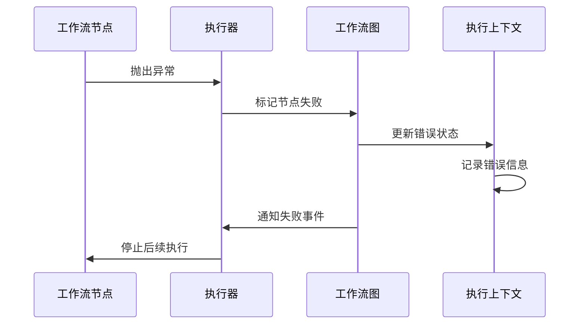
```mermaid
sequenceDiagram
participant Node as 工作流节点
participant Executor as 执行器
participant Graph as 工作流图
participant Context as 执行上下文
Node->>Executor : 抛出异常
Executor->>Graph : 标记节点失败
Graph->>Context : 更新错误状态
Context->>Context : 记录错误信息
Graph->>Executor : 通知失败事件
Executor->>Node : 停止后续执行
```

**章节来源**
- [WorkflowExecutor.java](file://evox-workflow/src/main/java/io/leavesfly/evox/workflow/execution/WorkflowExecutor.java#L54-L89)

## 性能优化与可观测性

### 性能监控指标

EvoX提供了全面的性能监控体系：

| 指标类别 | 具体指标 | 监控方法 | 优化建议 |
|---------|----------|----------|----------|
| 执行性能 | 节点执行时间 | 时间戳记录 | 异步执行优化 |
| 资源使用 | 内存占用 | JVM监控 | 对象池化 |
| 并发性能 | 同时执行节点数 | 并发计数 | 资源限制 |
| 网络性能 | API调用延迟 | 请求追踪 | 连接池优化 |

### 可观测性架构

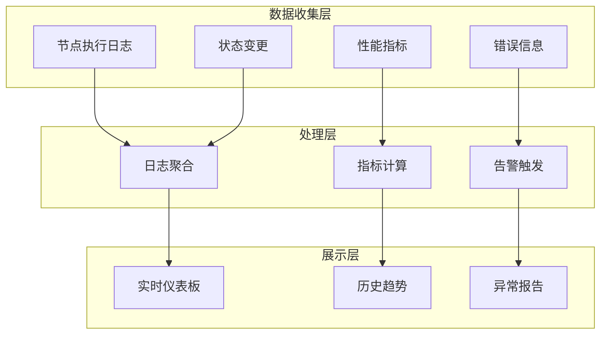
```mermaid
graph TB
subgraph "数据收集层"
A[节点执行日志]
B[性能指标]
C[错误信息]
D[状态变更]
end
subgraph "处理层"
E[日志聚合]
F[指标计算]
G[告警触发]
end
subgraph "展示层"
H[实时仪表板]
I[历史趋势]
J[异常报告]
end
A --> E
B --> F
C --> G
D --> E
E --> H
F --> I
G --> J
```

### 超时控制机制

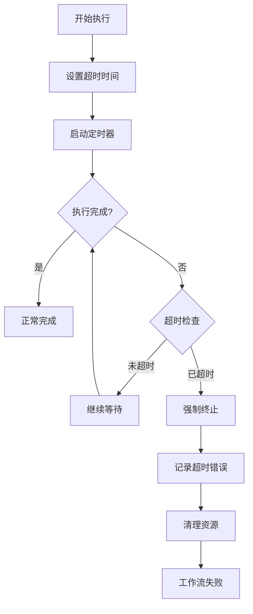
```mermaid
flowchart TD
A[开始执行] --> B[设置超时时间]
B --> C[启动定时器]
C --> D{执行完成?}
D --> |是| E[正常完成]
D --> |否| F{超时检查}
F --> |未超时| G[继续等待]
F --> |已超时| H[强制终止]
G --> D
H --> I[记录超时错误]
I --> J[清理资源]
J --> K[工作流失败]
```

### 日志追踪策略

EvoX实现了结构化的日志追踪系统：

```mermaid
sequenceDiagram
participant WF as 工作流
participant NC as 节点执行
participant LG as 日志系统
participant MS as 消息系统
WF->>LG : 记录工作流开始
WF->>MS : 发送开始消息
NC->>LG : 记录节点执行
NC->>MS : 发送执行消息
NC->>LG : 记录执行结果
NC->>MS : 发送结果消息
WF->>LG : 记录工作流完成
WF->>MS : 发送完成消息
```

**章节来源**
- [WorkflowExecutor.java](file://evox-workflow/src/main/java/io/leavesfly/evox/workflow/execution/WorkflowExecutor.java#L36-L49)

## 最佳实践与总结

### 设计原则

1. **单一职责**：每个节点专注于单一功能
2. **松耦合**：节点间通过标准化接口通信
3. **高内聚**：相关功能在同一工作流中组织
4. **可测试性**：支持单元测试和集成测试
5. **可观测性**：完整的执行跟踪和监控

### 性能优化建议

1. **合理使用并行**：根据任务性质选择合适的并行策略
2. **避免深度嵌套**：限制子工作流的嵌套层级
3. **资源池化**：对频繁使用的资源实施池化管理
4. **异步执行**：充分利用异步编程模型
5. **缓存策略**：对重复计算结果实施缓存

### 故障排除指南

| 问题类型 | 症状表现 | 排查方法 | 解决方案 |
|---------|----------|----------|----------|
| 死锁 | 工作流卡住不动 | 检查节点依赖关系 | 重构拓扑结构 |
| 内存泄漏 | 内存持续增长 | 分析对象引用链 | 释放不需要的对象 |
| 性能瓶颈 | 执行时间过长 | 分析节点耗时 | 优化算法或并行化 |
| 数据丢失 | 结果不一致 | 检查数据传递路径 | 增强数据校验 |

### 扩展性考虑

1. **插件化架构**：支持自定义节点类型
2. **配置驱动**：通过配置文件定义工作流
3. **版本管理**：支持工作流版本控制
4. **热部署**：支持运行时更新工作流定义
5. **集群支持**：支持分布式执行环境

通过深入理解和应用这些概念和实践，开发者可以构建出高效、可靠且易于维护的工作流系统，充分发挥EvoX工作流引擎的强大功能。