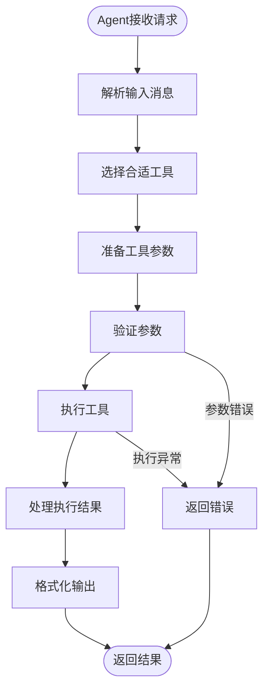

# 工具集成应用

<cite>
**本文档引用的文件**
- [ToolsExample.java](file://evox-examples/src/main/java/io/leavesfly/evox/examples/ToolsExample.java)
- [BaseTool.java](file://evox-tools/src/main/java/io/leavesfly/evox/tools/base/BaseTool.java)
- [Toolkit.java](file://evox-tools/src/main/java/io/leavesfly/evox/tools/base/Toolkit.java)
- [CalculatorTool.java](file://evox-tools/src/main/java/io/leavesfly/evox/tools/calculator/CalculatorTool.java)
- [FileSystemTool.java](file://evox-tools/src/main/java/io/leavesfly/evox/tools/file/FileSystemTool.java)
- [DatabaseTool.java](file://evox-tools/src/main/java/io/leavesfly/evox/tools/database/DatabaseTool.java)
- [WebSearchTool.java](file://evox-tools/src/main/java/io/leavesfly/evox/tools/search/WebSearchTool.java)
- [ToolsTest.java](file://evox-tools/src/test/java/io/leavesfly/evox/tools/ToolsTest.java)
- [BaseModule.java](file://evox-core/src/main/java/io/leavesfly/evox/core/module/BaseModule.java)
</cite>

## 目录
1. [简介](#简介)
2. [工具系统架构](#工具系统架构)
3. [核心工具详解](#核心工具详解)
4. [工具集管理](#工具集管理)
5. [工具注册与调用](#工具注册与调用)
6. [安全性控制](#安全性控制)
7. [参数解析与验证](#参数解析与验证)
8. [Agent决策链执行](#agent决策链执行)
9. [自定义工具开发](#自定义工具开发)
10. [性能监控与最佳实践](#性能监控与最佳实践)
11. [故障排除指南](#故障排除指南)
12. [总结](#总结)

## 简介

EvoX框架提供了一套完整的工具集成系统，支持多种类型的工具（计算器、文件系统、数据库、网络搜索等）的注册、管理和调用。该系统采用模块化设计，提供了强大的安全性控制、参数验证和性能监控功能。

本文档将详细介绍如何在EvoX中使用ToolsExample示例，展示各类工具的实现原理和最佳实践。

## 工具系统架构

### 系统架构概览


**图表来源**
- [ToolsExample.java](file://evox-examples/src/main/java/io/leavesfly/evox/examples/ToolsExample.java#L1-L287)
- [Toolkit.java](file://evox-tools/src/main/java/io/leavesfly/evox/tools/base/Toolkit.java#L1-L207)

### 核心组件关系


**图表来源**
- [BaseModule.java](file://evox-core/src/main/java/io/leavesfly/evox/core/module/BaseModule.java#L1-L196)
- [BaseTool.java](file://evox-tools/src/main/java/io/leavesfly/evox/tools/base/BaseTool.java#L1-L179)
- [Toolkit.java](file://evox-tools/src/main/java/io/leavesfly/evox/tools/base/Toolkit.java#L1-L207)

**章节来源**
- [BaseModule.java](file://evox-core/src/main/java/io/leavesfly/evox/core/module/BaseModule.java#L1-L196)
- [BaseTool.java](file://evox-tools/src/main/java/io/leavesfly/evox/tools/base/BaseTool.java#L1-L179)
- [Toolkit.java](file://evox-tools/src/main/java/io/leavesfly/evox/tools/base/Toolkit.java#L1-L207)

## 核心工具详解

### 计算器工具（CalculatorTool）

计算器工具提供了丰富的数学计算功能，支持基础运算、高级数学函数和统计分析。

#### 主要功能特性

| 功能类别 | 方法 | 描述 | 参数类型 |
|---------|------|------|----------|
| 基础运算 | add(double, double) | 加法运算 | double, double |
| 基础运算 | subtract(double, double) | 减法运算 | double, double |
| 基础运算 | multiply(double, double) | 乘法运算 | double, double |
| 基础运算 | divide(double, double) | 除法运算 | double, double |
| 高级数学 | power(double, double) | 幂运算 | double, double |
| 高级数学 | sqrt(double) | 平方根运算 | double |
| 高级数学 | sin(double) | 正弦运算 | double (角度) |
| 高级数学 | cos(double) | 余弦运算 | double (角度) |
| 高级数学 | tan(double) | 正切运算 | double (角度) |
| 统计函数 | mean(double[]) | 平均值计算 | double[] |
| 统计函数 | max(double[]) | 最大值计算 | double[] |
| 统计函数 | min(double[]) | 最小值计算 | double[] |

#### 表达式计算功能

计算器工具支持复杂的数学表达式计算，使用JavaScript引擎执行：


**图表来源**
- [CalculatorTool.java](file://evox-tools/src/main/java/io/leavesfly/evox/tools/calculator/CalculatorTool.java#L40-L68)

**章节来源**
- [CalculatorTool.java](file://evox-tools/src/main/java/io/leavesfly/evox/tools/calculator/CalculatorTool.java#L1-L259)

### 文件系统工具（FileSystemTool）

文件系统工具提供了全面的文件和目录操作功能，具有严格的安全控制机制。

#### 安全控制机制

| 控制项 | 默认值 | 描述 |
|--------|--------|------|
| 绝对路径支持 | true | 是否允许绝对路径操作 |
| 允许的文件扩展名 | .txt, .md, .json, .xml, .csv, .log, .java, .py | 受限的文件类型 |
| 工作目录 | System.getProperty("user.dir") | 默认工作目录 |
| 操作权限 | 读写删除列表 | 支持的操作类型 |

#### 支持的操作类型


**图表来源**
- [FileSystemTool.java](file://evox-tools/src/main/java/io/leavesfly/evox/tools/file/FileSystemTool.java#L49-L75)

**章节来源**
- [FileSystemTool.java](file://evox-tools/src/main/java/io/leavesfly/evox/tools/file/FileSystemTool.java#L1-L237)

### 数据库工具（DatabaseTool）

数据库工具支持多种数据库类型，提供SQL查询和操作功能。

#### 支持的数据库类型

| 数据库类型 | 驱动类 | 连接URL示例 |
|-----------|--------|-------------|
| PostgreSQL | org.postgresql.Driver | jdbc:postgresql://localhost:5432/dbname |
| MySQL | com.mysql.cj.jdbc.Driver | jdbc:mysql://localhost:3306/dbname |
| H2 | org.h2.Driver | jdbc:h2:~/dbname |

#### 查询类型识别


**图表来源**
- [DatabaseTool.java](file://evox-tools/src/main/java/io/leavesfly/evox/tools/database/DatabaseTool.java#L112-L123)

**章节来源**
- [DatabaseTool.java](file://evox-tools/src/main/java/io/leavesfly/evox/tools/database/DatabaseTool.java#L1-L236)

### 网络搜索工具（WebSearchTool）

网络搜索工具提供基础的网页搜索功能，支持内容提取。

#### 搜索流程


**图表来源**
- [WebSearchTool.java](file://evox-tools/src/main/java/io/leavesfly/evox/tools/search/WebSearchTool.java#L82-L126)

**章节来源**
- [WebSearchTool.java](file://evox-tools/src/main/java/io/leavesfly/evox/tools/search/WebSearchTool.java#L1-L262)

## 工具集管理

### Toolkit核心功能

Toolkit是工具集管理器，负责工具的注册、查找和执行。

#### 工具管理功能

| 功能 | 方法 | 描述 |
|------|------|------|
| 添加工具 | addTool(BaseTool) | 向工具集中添加新工具 |
| 移除工具 | removeTool(String) | 从工具集中移除指定工具 |
| 查找工具 | getTool(String) | 根据名称获取工具实例 |
| 执行工具 | executeTool(String, Map) | 执行指定工具并传递参数 |
| 工具列表 | getTools() | 获取所有工具列表 |
| 工具统计 | getStatistics() | 获取工具集统计信息 |

#### 工具索引机制


**图表来源**
- [Toolkit.java](file://evox-tools/src/main/java/io/leavesfly/evox/tools/base/Toolkit.java#L40-L47)

**章节来源**
- [Toolkit.java](file://evox-tools/src/main/java/io/leavesfly/evox/tools/base/Toolkit.java#L1-L207)

## 工具注册与调用

### 注册流程


**图表来源**
- [Toolkit.java](file://evox-tools/src/main/java/io/leavesfly/evox/tools/base/Toolkit.java#L60-L74)

### 调用示例

以下展示了ToolsExample中各种工具的典型调用模式：

#### 计算器工具调用

计算器工具支持两种调用方式：
1. **直接方法调用**：使用预定义的方法（add、multiply、divide等）
2. **表达式调用**：使用execute方法执行复杂表达式

#### 文件系统工具调用

文件系统工具通过operation参数指定操作类型：

| 操作类型 | 参数 | 描述 |
|----------|------|------|
| read | filePath | 读取文件内容 |
| write | filePath, content | 写入文件内容 |
| append | filePath, content | 追加文件内容 |
| delete | filePath | 删除文件 |
| list | directory | 列出目录内容 |
| exists | filePath | 检查文件存在 |
| mkdir | directory | 创建目录 |

**章节来源**
- [ToolsExample.java](file://evox-examples/src/main/java/io/leavesfly/evox/examples/ToolsExample.java#L44-L286)

## 安全性控制

### 参数验证机制

BaseTool提供了完善的参数验证功能：


**图表来源**
- [BaseTool.java](file://evox-tools/src/main/java/io/leavesfly/evox/tools/base/BaseTool.java#L82-L90)

### 安全控制措施

#### 文件系统安全

1. **路径验证**：防止路径遍历攻击
2. **扩展名限制**：限制可操作的文件类型
3. **工作目录限制**：默认限制在工作目录内

#### 数据库安全

1. **只读模式**：可配置只读模式防止意外修改
2. **查询类型检查**：区分SELECT和其他操作
3. **参数化查询**：防止SQL注入

#### 计算器安全

1. **表达式清理**：移除危险字符
2. **JavaScript沙箱**：使用受限的JavaScript引擎

**章节来源**
- [BaseTool.java](file://evox-tools/src/main/java/io/leavesfly/evox/tools/base/BaseTool.java#L77-L112)
- [FileSystemTool.java](file://evox-tools/src/main/java/io/leavesfly/evox/tools/file/FileSystemTool.java#L219-L230)

## 参数解析与验证

### 参数定义规范

每个工具都定义了详细的参数规范：


**图表来源**
- [BaseTool.java](file://evox-tools/src/main/java/io/leavesfly/evox/tools/base/BaseTool.java#L36-L42)

### 异常处理机制


**图表来源**
- [BaseTool.java](file://evox-tools/src/main/java/io/leavesfly/evox/tools/base/BaseTool.java#L82-L90)

**章节来源**
- [BaseTool.java](file://evox-tools/src/main/java/io/leavesfly/evox/tools/base/BaseTool.java#L77-L112)

## Agent决策链执行

### 执行流程



**图表来源**
- [ToolsExample.java](file://evox-examples/src/main/java/io/leavesfly/evox/examples/ToolsExample.java#L248-L286)

### 结果格式化

工具执行结果通过ToolResult类统一管理：

| 属性 | 类型 | 描述 |
|------|------|------|
| success | boolean | 执行是否成功 |
| data | Object | 执行结果数据 |
| error | String | 错误信息（失败时） |
| metadata | Map | 元数据信息 |

**章节来源**
- [BaseTool.java](file://evox-tools/src/main/java/io/leavesfly/evox/tools/base/BaseTool.java#L116-L178)

## 自定义工具开发

### 开发步骤

1. **继承BaseTool类**
2. **定义工具属性**
3. **实现execute方法**
4. **定义参数规范**
5. **添加安全控制**

### 自定义工具模板

```java
public class CustomTool extends BaseTool {
    
    public CustomTool() {
        this.name = "custom_tool";
        this.description = "自定义工具描述";
        
        // 定义输入参数
        this.inputs = new HashMap<>();
        Map<String, String> param1 = new HashMap<>();
        param1.put("type", "string");
        param1.put("description", "参数1描述");
        this.inputs.put("param1", param1);
        
        this.required = List.of("param1");
    }
    
    @Override
    public ToolResult execute(Map<String, Object> parameters) {
        try {
            // 参数验证
            validateParameters(parameters);
            
            // 获取参数
            String param1 = getParameter(parameters, "param1", "");
            
            // 执行业务逻辑
            Object result = performCustomLogic(param1);
            
            // 返回成功结果
            return ToolResult.success(result);
            
        } catch (Exception e) {
            // 返回错误结果
            return ToolResult.failure("执行失败: " + e.getMessage());
        }
    }
    
    private Object performCustomLogic(String param1) {
        // 自定义业务逻辑
        return "处理结果";
    }
}
```

### 扩展最佳实践

1. **遵循命名规范**：使用有意义的工具名称
2. **完善文档**：提供清晰的描述和参数说明
3. **添加测试**：编写单元测试确保功能正确
4. **安全考虑**：实现必要的安全控制
5. **性能优化**：考虑并发安全和资源管理

**章节来源**
- [BaseTool.java](file://evox-tools/src/main/java/io/leavesfly/evox/tools/base/BaseTool.java#L1-L179)

## 性能监控与最佳实践

### 性能监控指标

| 指标类型 | 监控内容 | 实现方式 |
|----------|----------|----------|
| 执行时间 | 工具执行耗时 | 日志记录 |
| 成功率 | 工具调用成功率 | 统计成功/失败次数 |
| 资源使用 | 内存/CPU使用情况 | JVM监控 |
| 并发性能 | 并发执行能力 | 线程池监控 |

### 最佳实践指南

#### 工具设计原则

1. **单一职责**：每个工具专注于特定功能
2. **幂等性**：相同输入产生相同输出
3. **错误隔离**：工具失败不影响其他工具
4. **资源管理**：及时释放资源

#### 性能优化策略


#### 错误处理最佳实践

1. **分级错误处理**：区分可恢复和不可恢复错误
2. **详细日志记录**：记录足够的调试信息
3. **优雅降级**：部分功能失败时保持系统可用
4. **超时控制**：设置合理的执行超时时间

**章节来源**
- [Toolkit.java](file://evox-tools/src/main/java/io/leavesfly/evox/tools/base/Toolkit.java#L190-L200)

## 故障排除指南

### 常见问题及解决方案

#### 工具注册问题

| 问题 | 原因 | 解决方案 |
|------|------|----------|
| 工具未找到 | 工具未正确注册 | 检查addTool调用 |
| 名称冲突 | 工具名称重复 | 使用唯一名称或替换工具 |
| 参数验证失败 | 参数格式错误 | 检查参数类型和必需性 |

#### 执行异常处理


#### 调试技巧

1. **启用详细日志**：设置适当的日志级别
2. **参数验证**：检查输入参数的完整性和正确性
3. **状态检查**：验证工具和依赖服务的状态
4. **性能分析**：监控执行时间和资源使用

**章节来源**
- [ToolsTest.java](file://evox-tools/src/test/java/io/leavesfly/evox/tools/ToolsTest.java#L1-L379)

## 总结

EvoX的工具集成系统提供了强大而灵活的工具管理能力，通过以下关键特性实现了高效的工具使用：

### 核心优势

1. **模块化设计**：BaseTool和Toolkit提供了清晰的架构分层
2. **安全性保障**：多层次的安全控制机制
3. **易于扩展**：标准化的工具开发接口
4. **性能优化**：并发安全和资源管理
5. **监控友好**：完善的日志和统计功能

### 应用场景

- **智能助手**：结合Agent系统提供多工具协作能力
- **自动化流程**：在工作流中集成各种工具
- **数据分析**：数据库和文件系统工具的数据处理
- **网络爬虫**：搜索引擎和浏览器工具的信息收集

### 发展方向

1. **工具生态**：持续扩展工具种类和功能
2. **性能优化**：进一步提升并发处理能力
3. **安全增强**：加强权限控制和审计功能
4. **监控完善**：提供更详细的性能和使用统计

通过ToolsExample示例的学习和实践，开发者可以充分利用EvoX框架的强大工具能力，构建功能丰富、安全可靠的智能应用系统。