# 带记忆的对话系统

<cite>
**本文档中引用的文件**
- [MemoryAgentExample.java](file://evox-examples/src/main/java/io/leavesfly/evox/examples/MemoryAgentExample.java)
- [MemoryManager.java](file://evox-memory/src/main/java/io/leavesfly/evox/memory/manager/MemoryManager.java)
- [ShortTermMemory.java](file://evox-memory/src/main/java/io/leavesfly/evox/memory/shortterm/ShortTermMemory.java)
- [LongTermMemory.java](file://evox-memory/src/main/java/io/leavesfly/evox/memory/longterm/LongTermMemory.java)
- [InMemoryLongTermMemory.java](file://evox-memory/src/main/java/io/leavesfly/evox/memory/longterm/InMemoryLongTermMemory.java)
- [BaseMemory.java](file://evox-memory/src/main/java/io/leavesfly/evox/memory/base/BaseMemory.java)
- [Memory.java](file://evox-memory/src/main/java/io/leavesfly/evox/memory/base/Memory.java)
- [StorageConfig.java](file://evox-core/src/main/java/io/leavesfly/evox/config/StorageConfig.java)
- [InMemoryVectorStore.java](file://evox-storage/src/main/java/io/leavesfly/evox/storage/vector/InMemoryVectorStore.java)
</cite>

## 目录
1. [简介](#简介)
2. [项目结构](#项目结构)
3. [核心组件](#核心组件)
4. [架构概览](#架构概览)
5. [详细组件分析](#详细组件分析)
6. [记忆存储生命周期](#记忆存储生命周期)
7. [多轮对话中的记忆检索](#多轮对话中的记忆检索)
8. [存储后端配置](#存储后端配置)
9. [性能优化策略](#性能优化策略)
10. [常见问题解决方案](#常见问题解决方案)
11. [总结](#总结)

## 简介

EvoX是一个强大的AI代理框架，其记忆系统是核心功能之一。该系统通过短期记忆和长期记忆的组合，为智能体提供了类似人类的记忆能力，使其能够在多轮对话中保持上下文连续性，并从历史交互中学习。

记忆系统的主要特点包括：
- **双层记忆架构**：短期记忆用于工作流程中的临时存储，长期记忆用于持久化的历史信息
- **灵活的存储后端**：支持内存、数据库和向量数据库等多种存储方式
- **智能记忆管理**：自动同步、去重和容量控制机制
- **语义检索能力**：基于向量相似性的智能记忆搜索

## 项目结构

EvoX的记忆系统采用模块化设计，主要分布在以下模块中：

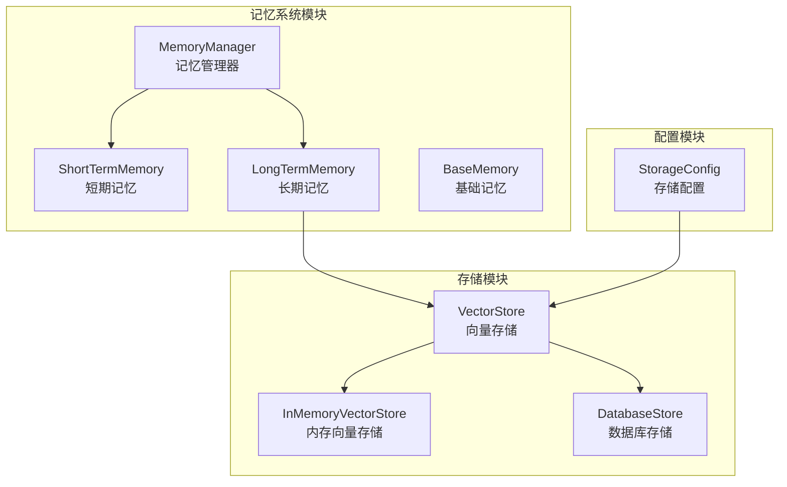

**图表来源**
- [MemoryManager.java](file://evox-memory/src/main/java/io/leavesfly/evox/memory/manager/MemoryManager.java#L1-L189)
- [ShortTermMemory.java](file://evox-memory/src/main/java/io/leavesfly/evox/memory/shortterm/ShortTermMemory.java#L1-L237)
- [LongTermMemory.java](file://evox-memory/src/main/java/io/leavesfly/evox/memory/longterm/LongTermMemory.java#L1-L155)

## 核心组件

### MemoryManager - 记忆管理器

MemoryManager是记忆系统的核心协调器，负责统一管理短期记忆和长期记忆的生命周期。

**主要功能**：
- 协调短期记忆和长期记忆的交互
- 自动同步机制（当短期记忆达到阈值时自动同步到长期记忆）
- 记忆检索和过滤
- 容量管理和去重控制

### ShortTermMemory - 短期记忆

短期记忆实现滑动窗口机制，用于存储工作流程执行过程中的临时消息。

**关键特性**：
- 固定大小的滑动窗口
- FIFO（先进先出）淘汰策略
- 支持动态调整大小
- 按智能体和动作过滤消息

### LongTermMemory - 长期记忆

长期记忆使用向量存储技术，支持语义相似性检索。

**核心能力**：
- 基于向量嵌入的记忆存储
- 语义相似性搜索
- 元数据索引和过滤
- 多种存储后端支持

**章节来源**
- [MemoryManager.java](file://evox-memory/src/main/java/io/leavesfly/evox/memory/manager/MemoryManager.java#L20-L189)
- [ShortTermMemory.java](file://evox-memory/src/main/java/io/leavesfly/evox/memory/shortterm/ShortTermMemory.java#L15-L237)
- [LongTermMemory.java](file://evox-memory/src/main/java/io/leavesfly/evox/memory/longterm/LongTermMemory.java#L12-L155)

## 架构概览

EvoX记忆系统采用分层架构设计，确保了良好的可扩展性和维护性：

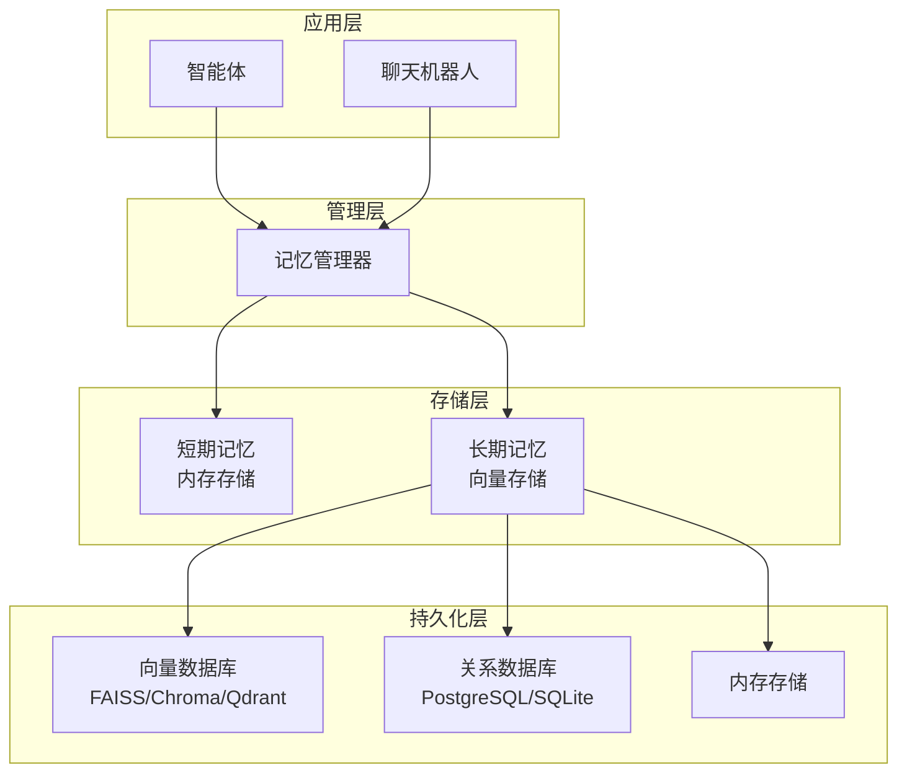

**图表来源**
- [MemoryManager.java](file://evox-memory/src/main/java/io/leavesfly/evox/memory/manager/MemoryManager.java#L45-L189)
- [StorageConfig.java](file://evox-core/src/main/java/io/leavesfly/evox/config/StorageConfig.java#L1-L250)

## 详细组件分析

### MemoryManager详细分析

MemoryManager作为记忆系统的中央控制器，实现了智能的记忆管理策略：

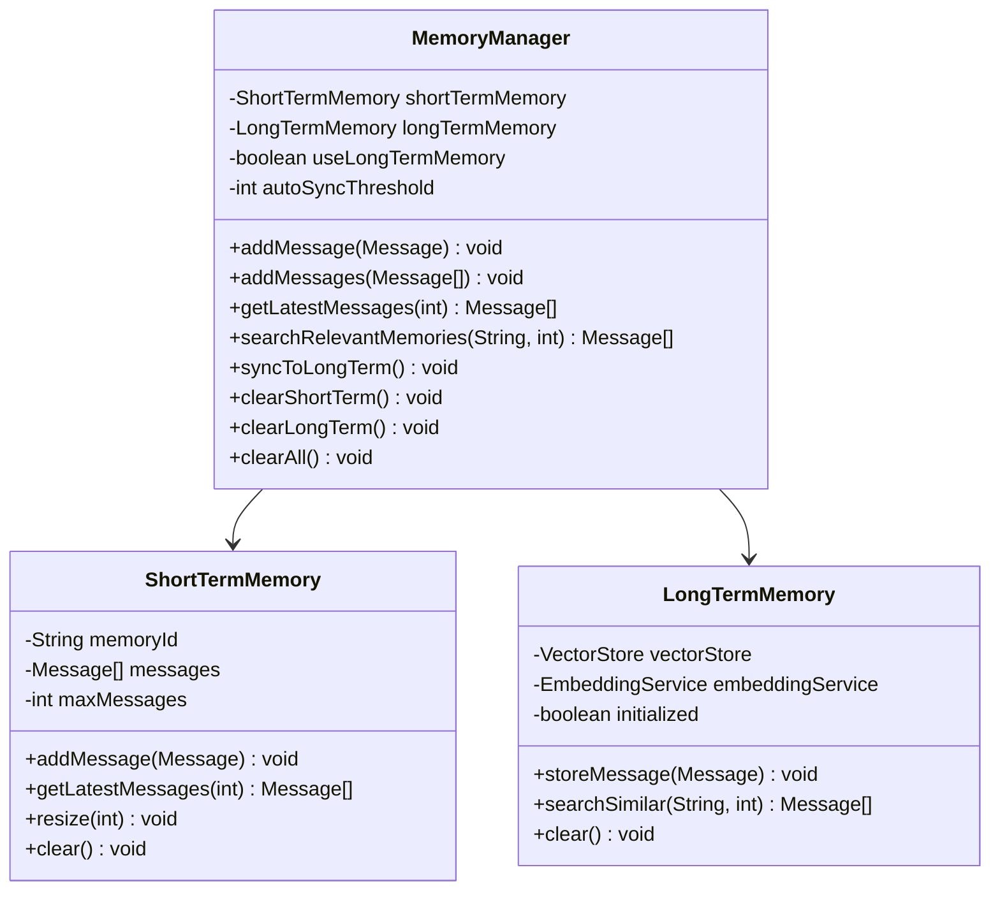

**图表来源**
- [MemoryManager.java](file://evox-memory/src/main/java/io/leavesfly/evox/memory/manager/MemoryManager.java#L24-L57)
- [ShortTermMemory.java](file://evox-memory/src/main/java/io/leavesfly/evox/memory/shortterm/ShortTermMemory.java#L24-L58)
- [LongTermMemory.java](file://evox-memory/src/main/java/io/leavesfly/evox/memory/longterm/LongTermMemory.java#L21-L41)

#### 自动同步机制

MemoryManager实现了智能的自动同步机制，当短期记忆达到预设阈值时，会自动将消息同步到长期记忆：

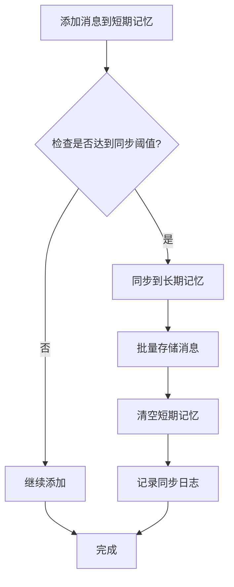

**图表来源**
- [MemoryManager.java](file://evox-memory/src/main/java/io/leavesfly/evox/memory/manager/MemoryManager.java#L71-L84)

### ShortTermMemory详细分析

短期记忆采用滑动窗口算法，确保内存使用的可控性：

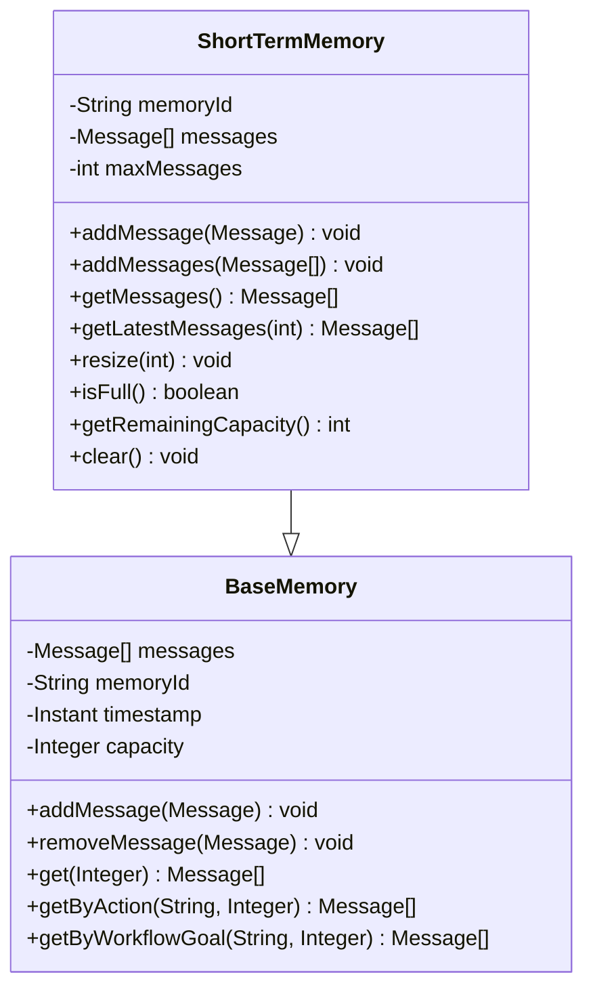

**图表来源**
- [ShortTermMemory.java](file://evox-memory/src/main/java/io/leavesfly/evox/memory/shortterm/ShortTermMemory.java#L24-L237)
- [BaseMemory.java](file://evox-memory/src/main/java/io/leavesfly/evox/memory/base/BaseMemory.java#L23-L290)

#### 滑动窗口算法实现

短期记忆的滑动窗口机制确保了内存使用的线性增长：

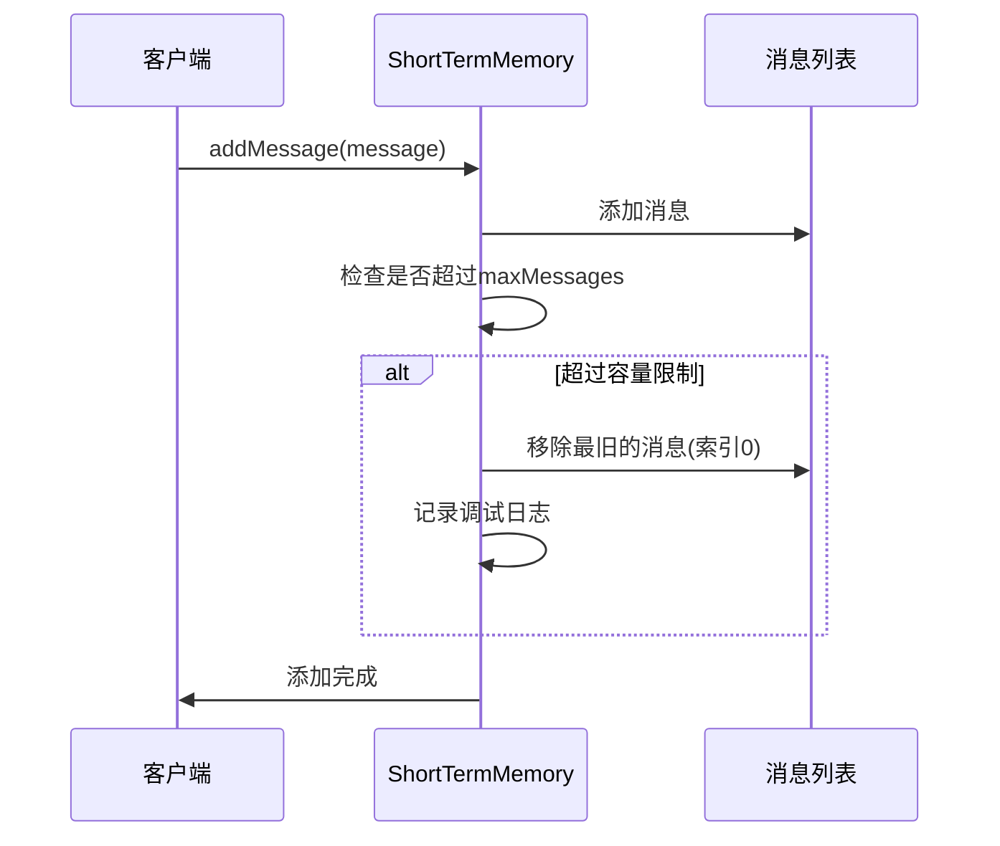

**图表来源**
- [ShortTermMemory.java](file://evox-memory/src/main/java/io/leavesfly/evox/memory/shortterm/ShortTermMemory.java#L63-L74)

### LongTermMemory详细分析

长期记忆是记忆系统中最复杂的组件，它结合了向量存储和语义检索技术：

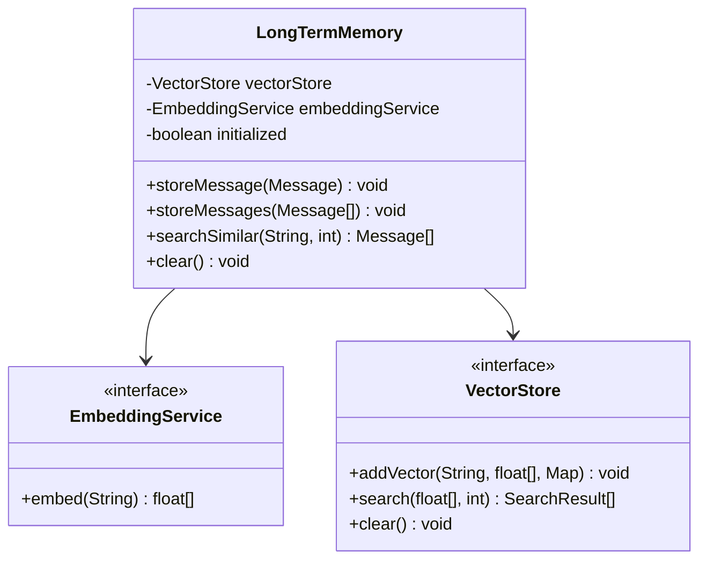

**图表来源**
- [LongTermMemory.java](file://evox-memory/src/main/java/io/leavesfly/evox/memory/longterm/LongTermMemory.java#L21-L155)

#### 向量存储和语义检索流程

长期记忆的语义检索过程涉及多个步骤：

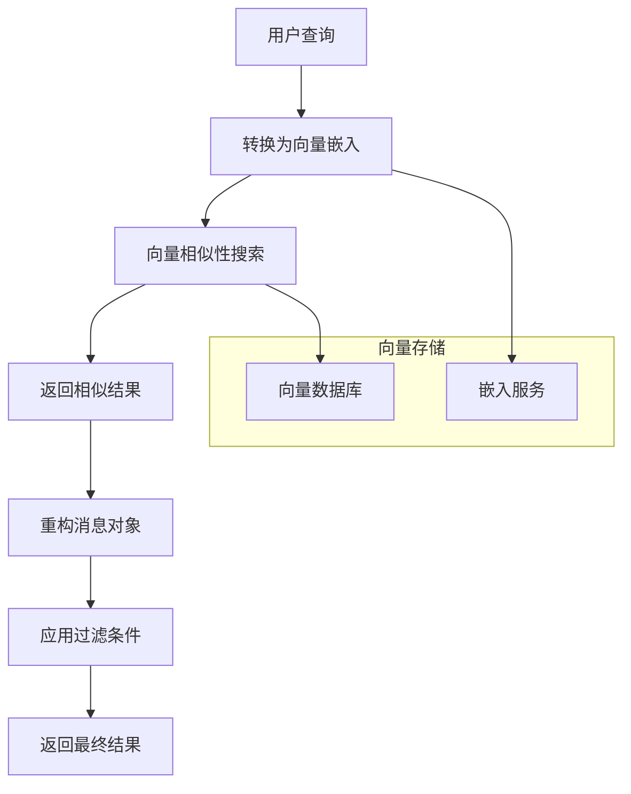

**图表来源**
- [LongTermMemory.java](file://evox-memory/src/main/java/io/leavesfly/evox/memory/longterm/LongTermMemory.java#L95-L120)

**章节来源**
- [MemoryManager.java](file://evox-memory/src/main/java/io/leavesfly/evox/memory/manager/MemoryManager.java#L71-L140)
- [ShortTermMemory.java](file://evox-memory/src/main/java/io/leavesfly/evox/memory/shortterm/ShortTermMemory.java#L63-L178)
- [LongTermMemory.java](file://evox-memory/src/main/java/io/leavesfly/evox/memory/longterm/LongTermMemory.java#L55-L120)

## 记忆存储生命周期

记忆的生命周期管理是确保系统高效运行的关键。EvoX采用了多层次的生命周期管理策略：

### 生命周期阶段

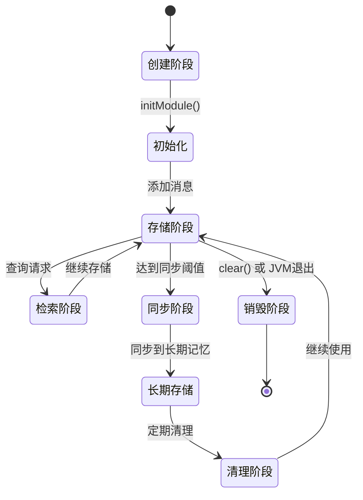

### 容量管理策略

系统实现了多种容量管理策略来防止内存溢出：

| 组件 | 管理策略 | 触发条件 | 处理方式 |
|------|----------|----------|----------|
| 短期记忆 | 滑动窗口 | 达到最大容量 | 移除最旧消息 |
| 长期记忆 | 向量存储 | 存储空间不足 | 基于LRU的清理策略 |
| 整体系统 | 自动同步 | 短期记忆满阈值 | 同步到长期存储 |

**章节来源**
- [MemoryManager.java](file://evox-memory/src/main/java/io/leavesfly/evox/memory/manager/MemoryManager.java#L141-L147)
- [ShortTermMemory.java](file://evox-memory/src/main/java/io/leavesfly/evox/memory/shortterm/ShortTermMemory.java#L166-L178)

## 多轮对话中的记忆检索

在多轮对话场景中，记忆系统需要智能地检索和注入上下文信息：

### 上下文注入流程

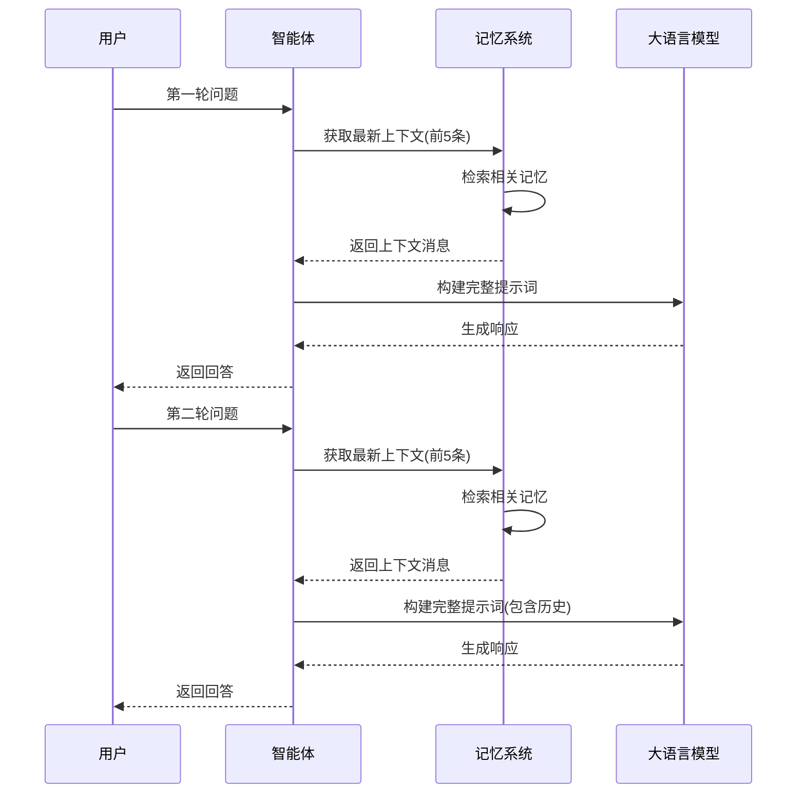

### 记忆检索策略

记忆检索采用多层级策略，确保相关性和效率：

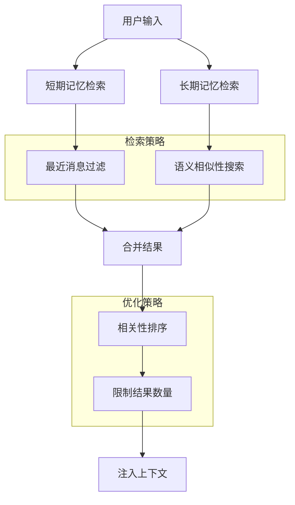

**章节来源**
- [MemoryManager.java](file://evox-memory/src/main/java/io/leavesfly/evox/memory/manager/MemoryManager.java#L101-L124)

## 存储后端配置

EvoX支持多种存储后端，每种都有其特定的适用场景：

### 向量存储配置

| 存储类型 | 优势 | 适用场景 | 配置要点 |
|----------|------|----------|----------|
| FAISS | 高性能、本地部署 | 开发测试、小规模应用 | 本地索引文件、维度设置 |
| Chroma | 易用性强、云原生 | 中等规模、快速部署 | 服务器地址、集合命名 |
| Qdrant | 分布式、高可用 | 大规模、生产环境 | 集群配置、API密钥 |

### 数据库存储配置

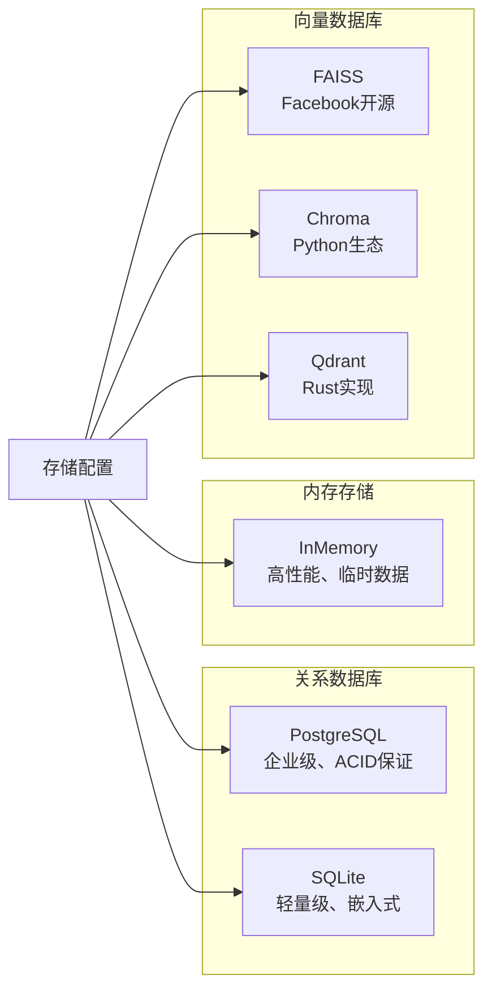

**图表来源**
- [StorageConfig.java](file://evox-core/src/main/java/io/leavesfly/evox/config/StorageConfig.java#L59-L248)

### 存储配置示例

以下是不同存储后端的配置示例：

#### FAISS配置
```java
// FAISS向量存储配置
VectorStoreConfig faissConfig = StorageConfig.createFAISSConfig(
    "./data/faiss_index.bin",  // 索引文件路径
    1536                       // 向量维度
);
```

#### Chroma配置
```java
// Chroma向量存储配置
VectorStoreConfig chromaConfig = StorageConfig.createChromaConfig(
    "http://localhost:8000",    // 服务器地址
    "memory_collection",        // 集合名称
    1536                       // 向量维度
);
```

#### PostgreSQL配置
```java
// PostgreSQL数据库配置
DatabaseConfig postgresConfig = StorageConfig.createPostgreSQLConfig(
    "localhost",               // 主机
    5432,                      // 端口
    "memory_db",               // 数据库名
    "username",                // 用户名
    "password"                 // 密码
);
```

**章节来源**
- [StorageConfig.java](file://evox-core/src/main/java/io/leavesfly/evox/config/StorageConfig.java#L174-L248)
- [InMemoryVectorStore.java](file://evox-storage/src/main/java/io/leavesfly/evox/storage/vector/InMemoryVectorStore.java#L16-L61)

## 性能优化策略

为了确保记忆系统的高性能运行，EvoX实现了多种优化策略：

### 内存优化

1. **智能缓存策略**
   - 短期记忆采用固定大小的滑动窗口
   - 长期记忆使用LRU（最近最少使用）清理策略
   - 支持动态调整内存分配

2. **并发优化**
   - 使用ConcurrentHashMap确保线程安全
   - 异步处理大规模记忆操作
   - 批量操作减少锁竞争

### 检索优化

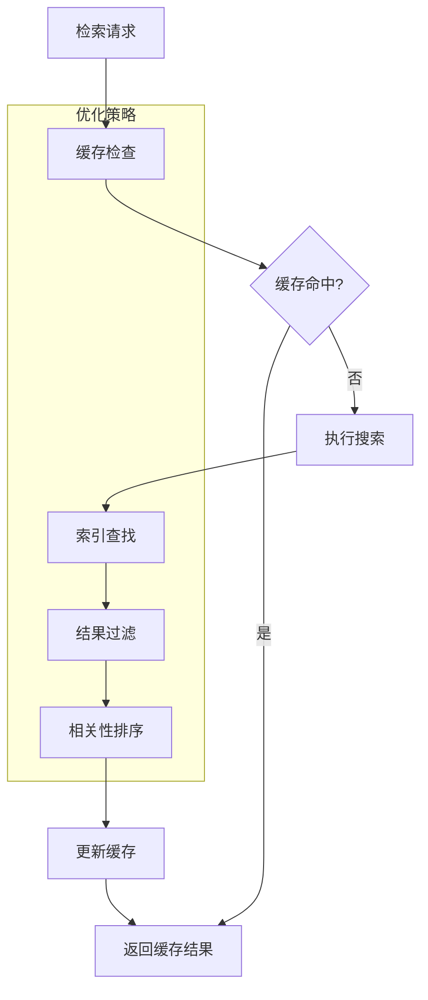

### 上下文长度优化

为了避免上下文过长导致的性能问题，系统实现了智能的上下文截断策略：

| 场景 | 截断策略 | 示例 |
|------|----------|------|
| 短期记忆 | 固定数量截断 | 最近5条消息 |
| 长期记忆 | 相关性优先 | 最相关10条消息 |
| 整体上下文 | 智能混合 | 70%近期+30%历史 |

## 常见问题解决方案

### 记忆溢出处理

**问题描述**：当记忆数据量过大时可能导致内存溢出

**解决方案**：
1. **自动清理机制**：定期清理过期或低价值的记忆
2. **容量监控**：实时监控内存使用情况
3. **分级存储**：将不常用的数据迁移到长期存储

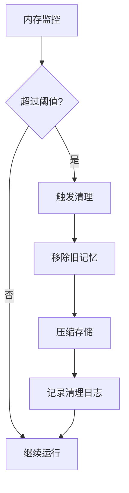

### 上下文长度优化

**问题描述**：对话上下文过长影响模型性能

**解决方案**：
1. **智能截断**：根据消息重要性进行截断
2. **摘要生成**：对长对话生成摘要
3. **分层存储**：将历史摘要存储在长期记忆中

### 记忆去重策略

**问题描述**：重复消息占用不必要的存储空间

**解决方案**：
1. **内容哈希**：使用SHA-256计算消息内容哈希
2. **去重检查**：在添加前检查是否存在相同内容
3. **版本管理**：支持同一主题的不同版本

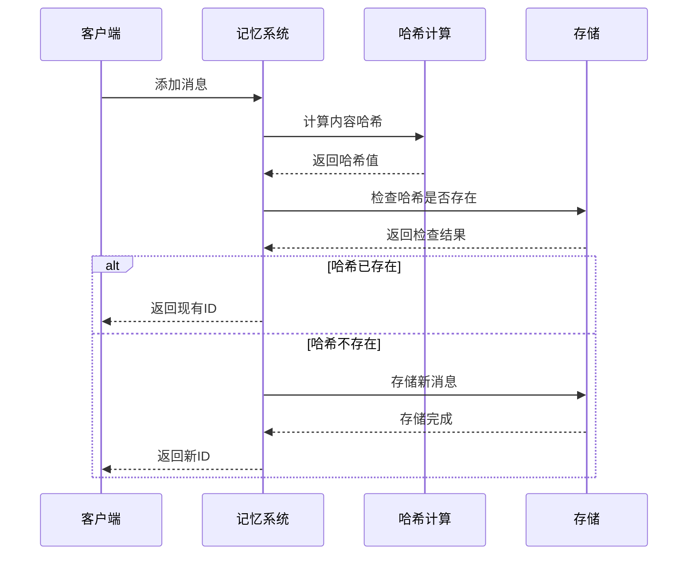

**图表来源**
- [InMemoryLongTermMemory.java](file://evox-memory/src/main/java/io/leavesfly/evox/memory/longterm/InMemoryLongTermMemory.java#L97-L121)

### 性能调优建议

1. **合理设置阈值**：根据应用场景调整自动同步阈值
2. **选择合适的存储后端**：根据数据量和访问模式选择
3. **定期维护**：清理无效和过期的记忆数据
4. **监控指标**：关注内存使用率、检索延迟等关键指标

**章节来源**
- [MemoryManager.java](file://evox-memory/src/main/java/io/leavesfly/evox/memory/manager/MemoryManager.java#L141-L147)
- [ShortTermMemory.java](file://evox-memory/src/main/java/io/leavesfly/evox/memory/shortterm/ShortTermMemory.java#L166-L178)
- [InMemoryLongTermMemory.java](file://evox-memory/src/main/java/io/leavesfly/evox/memory/longterm/InMemoryLongTermMemory.java#L57-L121)

## 总结

EvoX的记忆系统是一个设计精良、功能完备的智能记忆解决方案。它通过短期记忆和长期记忆的协同工作，为AI代理提供了强大的上下文保持能力和历史知识存储功能。

### 主要优势

1. **模块化设计**：清晰的层次结构便于维护和扩展
2. **灵活的存储策略**：支持多种存储后端满足不同需求
3. **智能管理机制**：自动同步、去重和容量控制
4. **高性能检索**：基于向量相似性的语义搜索
5. **易于集成**：简洁的API设计便于与其他组件集成

### 应用前景

EvoX的记忆系统特别适合以下应用场景：
- **客服机器人**：保持对话连续性，提高服务质量
- **教育助手**：跟踪学习进度，提供个性化指导
- **医疗咨询**：记录病史信息，提供准确诊断建议
- **游戏NPC**：增强角色行为的真实性和连贯性

随着AI技术的不断发展，记忆系统将在提升AI代理智能水平方面发挥越来越重要的作用。EvoX的记忆系统为开发者提供了一个强大而灵活的基础平台，有助于构建更加智能和人性化的AI应用。