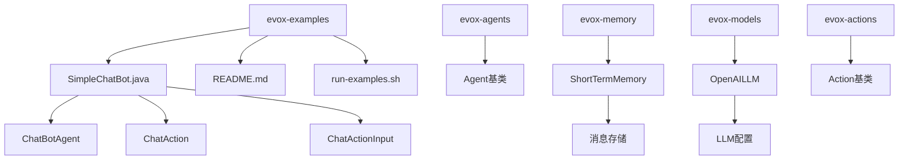
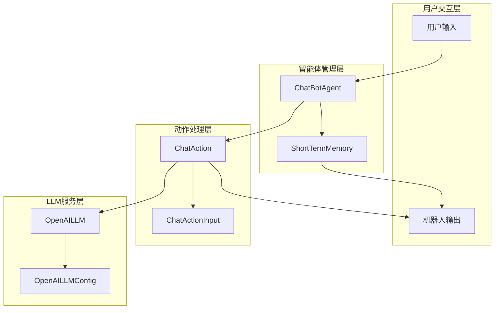
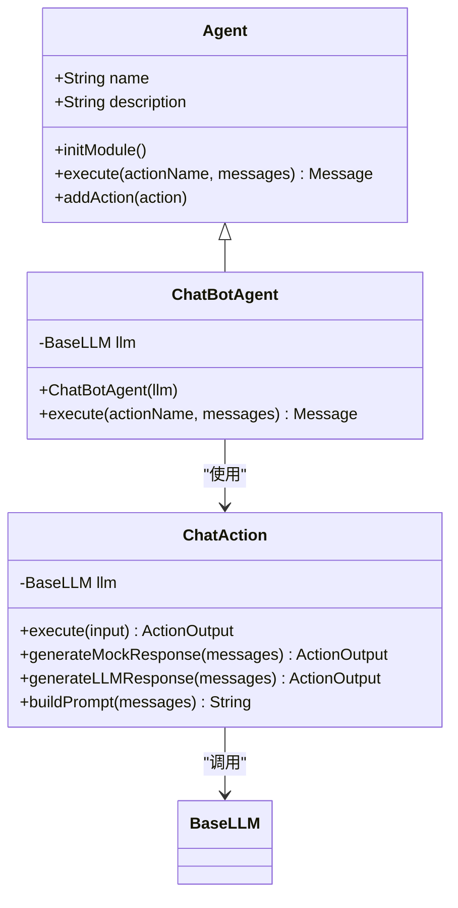
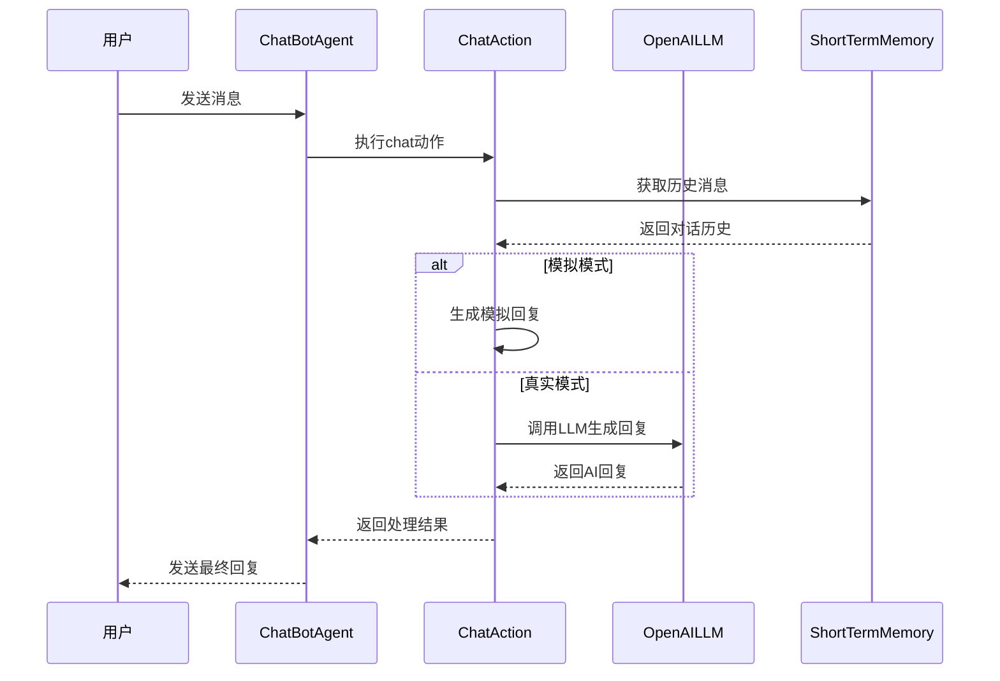
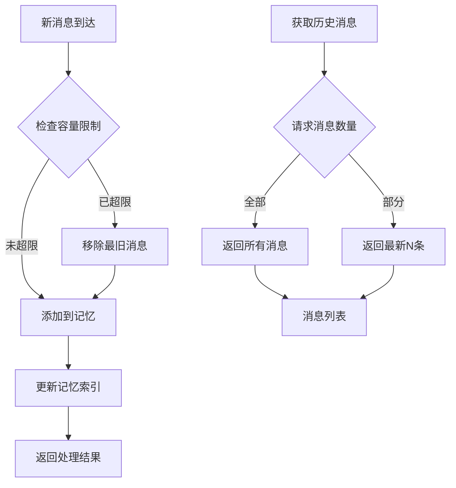
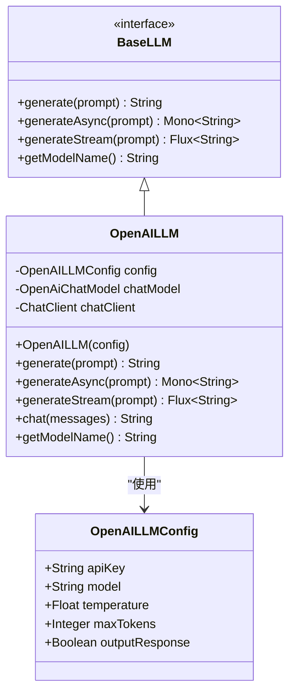
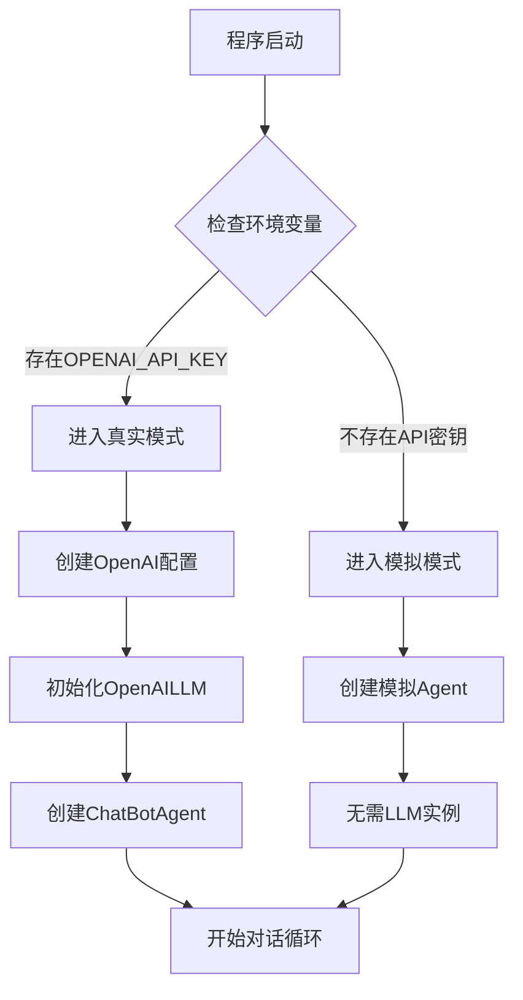
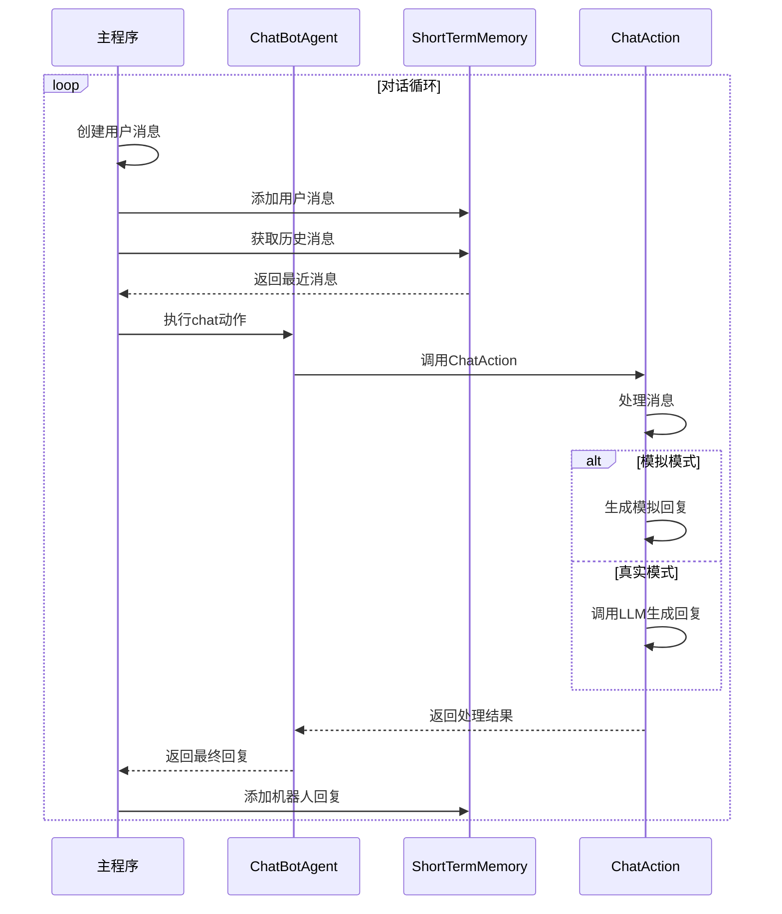

# 简单聊天机器人

<cite>
**本文档中引用的文件**
- [SimpleChatBot.java](file://evox-examples/src/main/java/io/leavesfly/evox/examples/SimpleChatBot.java)
- [README.md](file://evox-examples/README.md)
- [OpenAILLM.java](file://evox-models/src/main/java/io/leavesfly/evox/models/openai/OpenAILLM.java)
- [ShortTermMemory.java](file://evox-memory/src/main/java/io/leavesfly/evox/memory/shortterm/ShortTermMemory.java)
- [Agent.java](file://evox-agents/src/main/java/io/leavesfly/evox/agents/base/Agent.java)
- [Action.java](file://evox-actions/src/main/java/io/leavesfly/evox/actions/base/Action.java)
- [BaseTool.java](file://evox-tools/src/main/java/io/leavesfly/evox/tools/base/BaseTool.java)
- [OpenAILLMConfig.java](file://evox-models/src/main/java/io/leavesfly/evox/models/config/OpenAILLMConfig.java)
</cite>

## 目录
1. [简介](#简介)
2. [项目结构](#项目结构)
3. [核心组件](#核心组件)
4. [架构概览](#架构概览)
5. [详细组件分析](#详细组件分析)
6. [配置与初始化](#配置与初始化)
7. [对话循环实现](#对话循环实现)
8. [扩展与定制](#扩展与定制)
9. [最佳实践](#最佳实践)
10. [故障排除](#故障排除)

## 简介

SimpleChatBot是EvoX框架提供的一个基础聊天机器人示例，展示了如何使用EvoX框架快速构建一个具备基本对话能力的智能聊天系统。该示例涵盖了Agent管理、记忆存储、动作处理和LLM集成等核心功能，为开发者提供了一个清晰的入门模板。

### 主要特性

- **智能Agent管理**：使用自定义Agent处理用户输入和生成响应
- **记忆系统**：集成短期记忆保存对话历史，支持上下文理解
- **LLM集成**：支持OpenAI等主流大语言模型的无缝集成
- **双模式运行**：支持模拟模式（无需API密钥）和真实模式（使用实际LLM）
- **模块化设计**：遵循EvoX框架的模块化架构原则

## 项目结构

SimpleChatBot示例位于`evox-examples`模块中，采用标准的Java项目结构：



**图表来源**
- [SimpleChatBot.java](file://evox-examples/src/main/java/io/leavesfly/evox/examples/SimpleChatBot.java#L1-L50)

**章节来源**
- [SimpleChatBot.java](file://evox-examples/src/main/java/io/leavesfly/evox/examples/SimpleChatBot.java#L1-L335)

## 核心组件

SimpleChatBot示例包含以下核心组件：

### 1. ChatBotAgent
继承自`Agent`基类的自定义智能体，负责协调整个对话流程。

### 2. ChatAction
专门处理聊天对话的动作类，支持模拟回复和真实LLM回复两种模式。

### 3. ShortTermMemory
短期记忆系统，用于保存对话历史和上下文信息。

### 4. OpenAILLM
集成OpenAI LLM的服务，提供智能对话生成能力。

### 5. ChatActionInput
聊天动作的输入参数封装类。

**章节来源**
- [SimpleChatBot.java](file://evox-examples/src/main/java/io/leavesfly/evox/examples/SimpleChatBot.java#L160-L335)

## 架构概览

SimpleChatBot采用分层架构设计，各组件职责明确：



**图表来源**
- [SimpleChatBot.java](file://evox-examples/src/main/java/io/leavesfly/evox/examples/SimpleChatBot.java#L165-L210)
- [OpenAILLM.java](file://evox-models/src/main/java/io/leavesfly/evox/models/openai/OpenAILLM.java#L25-L52)

## 详细组件分析

### ChatBotAgent智能体

ChatBotAgent是SimpleChatBot的核心智能体，继承自EvoX框架的Agent基类：



**图表来源**
- [SimpleChatBot.java](file://evox-examples/src/main/java/io/leavesfly/evox/examples/SimpleChatBot.java#L165-L210)
- [Agent.java](file://evox-agents/src/main/java/io/leavesfly/evox/agents/base/Agent.java#L67-L124)

#### 关键特性

1. **灵活的LLM支持**：可以接受null参数以启用模拟模式
2. **统一的执行接口**：提供标准化的execute方法处理各种动作
3. **异常处理机制**：完善的错误处理和反馈机制

**章节来源**
- [SimpleChatBot.java](file://evox-examples/src/main/java/io/leavesfly/evox/examples/SimpleChatBot.java#L165-L210)

### ChatAction动作处理器

ChatAction是专门处理聊天对话的核心动作类：



**图表来源**
- [SimpleChatBot.java](file://evox-examples/src/main/java/io/leavesfly/evox/examples/SimpleChatBot.java#L216-L310)

#### 双模式处理机制

ChatAction支持两种不同的处理模式：

1. **模拟模式**：当LLM为null时，使用预定义的规则生成回复
2. **真实模式**：使用OpenAI LLM生成智能回复

**章节来源**
- [SimpleChatBot.java](file://evox-examples/src/main/java/io/leavesfly/evox/examples/SimpleChatBot.java#L216-L310)

### ShortTermMemory记忆系统

短期记忆系统负责保存对话历史，支持滑动窗口机制：



**图表来源**
- [ShortTermMemory.java](file://evox-memory/src/main/java/io/leavesfly/evox/memory/shortterm/ShortTermMemory.java#L60-L88)

#### 核心功能

1. **容量控制**：支持固定容量的记忆存储
2. **滑动窗口**：自动移除最旧的消息以保持容量
3. **历史查询**：支持获取最近的N条消息
4. **线程安全**：使用并发安全的数据结构

**章节来源**
- [ShortTermMemory.java](file://evox-memory/src/main/java/io/leavesfly/evox/memory/shortterm/ShortTermMemory.java#L60-L107)

### OpenAILLM集成

OpenAI LLM集成提供了强大的语言模型能力：



**图表来源**
- [OpenAILLM.java](file://evox-models/src/main/java/io/leavesfly/evox/models/openai/OpenAILLM.java#L25-L52)
- [OpenAILLMConfig.java](file://evox-models/src/main/java/io/leavesfly/evox/models/config/OpenAILLMConfig.java#L12-L40)

**章节来源**
- [OpenAILLM.java](file://evox-models/src/main/java/io/leavesfly/evox/models/openai/OpenAILLM.java#L55-L141)
- [OpenAILLMConfig.java](file://evox-models/src/main/java/io/leavesfly/evox/models/config/OpenAILLMConfig.java#L12-L40)

## 配置与初始化

### API密钥检测机制

SimpleChatBot提供了智能的API密钥检测机制：



**图表来源**
- [SimpleChatBot.java](file://evox-examples/src/main/java/io/leavesfly/evox/examples/SimpleChatBot.java#L35-L45)

### 配置参数详解

| 参数 | 类型 | 默认值 | 描述 |
|------|------|--------|------|
| model | String | gpt-3.5-turbo | 使用的OpenAI模型 |
| temperature | Float | 0.7f | 控制回复的创造性 |
| maxTokens | Integer | 150 | 最大生成token数 |
| apiKey | String | - | OpenAI API密钥 |

**章节来源**
- [SimpleChatBot.java](file://evox-examples/src/main/java/io/leavesfly/evox/examples/SimpleChatBot.java#L106-L112)

## 对话循环实现

SimpleChatBot的对话循环遵循标准的请求-响应模式：



**图表来源**
- [SimpleChatBot.java](file://evox-examples/src/main/java/io/leavesfly/evox/examples/SimpleChatBot.java#L69-L92)
- [SimpleChatBot.java](file://evox-examples/src/main/java/io/leavesfly/evox/examples/SimpleChatBot.java#L133-L153)

### 关键实现细节

1. **消息构建**：使用Message.builder()创建标准化消息对象
2. **历史截取**：只获取最近的5条消息作为上下文
3. **错误处理**：完善的异常捕获和错误反馈机制
4. **状态维护**：通过ShortTermMemory维护对话状态

**章节来源**
- [SimpleChatBot.java](file://evox-examples/src/main/java/io/leavesfly/evox/examples/SimpleChatBot.java#L69-L92)
- [SimpleChatBot.java](file://evox-examples/src/main/java/io/leavesfly/evox/examples/SimpleChatBot.java#L133-L153)

## 扩展与定制

### 添加记忆功能

SimpleChatBot已经内置了短期记忆功能，可以通过以下方式扩展：

```java
// 扩展记忆容量
ShortTermMemory memory = new ShortTermMemory(20);

// 启用长期记忆
MemoryManager memoryManager = new MemoryManager(memory, longTermMemory);
```

### 集成工具调用

可以扩展ChatAction以支持工具调用：

```java
// 添加工具支持
public class ToolAwareChatAction extends ChatAction {
    private final Toolkit toolkit;
    
    public ToolAwareChatAction(BaseLLM llm, Toolkit toolkit) {
        super(llm);
        this.toolkit = toolkit;
    }
    
    @Override
    public ActionOutput execute(ActionInput input) {
        // 分析是否需要工具调用
        if (needsToolCall(input)) {
            return handleToolCall(input);
        }
        return super.execute(input);
    }
}
```

### 自定义提示词模板

可以修改buildPrompt方法来自定义提示词：

```java
private String buildPrompt(List<Message> messages) {
    StringBuilder sb = new StringBuilder();
    sb.append("你是一个专业的客服助手。请根据以下对话历史专业地回复用户：\n\n");
    
    // 自定义格式化逻辑
    for (Message msg : messages) {
        String role = msg.getMessageType() == MessageType.INPUT ? "用户" : "客服";
        sb.append(role).append(": ").append(msg.getContent()).append("\n");
    }
    
    sb.append("\n请用专业友好的方式回复用户的最后一条消息。");
    return sb.toString();
}
```

**章节来源**
- [SimpleChatBot.java](file://evox-examples/src/main/java/io/leavesfly/evox/examples/SimpleChatBot.java#L288-L302)

## 最佳实践

### 1. 错误处理策略

```java
try {
    Message response = agent.execute("chat", history);
    // 处理成功响应
} catch (Exception e) {
    log.error("对话处理失败", e);
    return Message.builder()
        .content("抱歉，系统出现了一些问题，请稍后再试")
        .messageType(MessageType.ERROR)
        .build();
}
```

### 2. 性能优化建议

- **消息截断**：只保留最近的N条消息作为上下文
- **异步处理**：对于耗时的操作使用异步执行
- **缓存策略**：对重复的查询结果进行缓存

### 3. 安全性考虑

- **输入验证**：对用户输入进行必要的验证和清理
- **API密钥保护**：避免在日志中记录敏感信息
- **速率限制**：实现适当的请求频率控制

### 4. 可扩展性设计

```java
// 使用工厂模式创建不同类型的Agent
public class AgentFactory {
    public static ChatBotAgent createAgent(boolean useLLM) {
        if (useLLM) {
            return createRealAgent();
        } else {
            return createMockAgent();
        }
    }
}
```

## 故障排除

### 常见问题及解决方案

#### 1. API密钥问题

**问题**：`OPENAI_API_KEY`未设置或无效

**解决方案**：
```bash
# 设置环境变量
export OPENAI_API_KEY="your-api-key-here"

# 或使用模拟模式
mvn exec:java -pl evox-examples \
  -Dexec.mainClass="io.leavesfly.evox.examples.SimpleChatBot"
```

#### 2. 内存溢出

**问题**：对话历史过长导致内存不足

**解决方案**：
```java
// 调整记忆容量
ShortTermMemory memory = new ShortTermMemory(5); // 减少到5条消息
```

#### 3. LLM调用失败

**问题**：网络问题或API限制

**解决方案**：
```java
// 添加重试机制
public ActionOutput generateLLMResponseWithRetry(List<Message> messages) {
    int retryCount = 3;
    while (retryCount > 0) {
        try {
            return generateLLMResponse(messages);
        } catch (Exception e) {
            retryCount--;
            if (retryCount == 0) {
                return SimpleActionOutput.failure("多次尝试失败: " + e.getMessage());
            }
            Thread.sleep(1000); // 等待1秒后重试
        }
    }
    return null;
}
```

#### 4. 性能问题

**问题**：对话响应速度慢

**解决方案**：
- 使用异步执行
- 减少上下文消息数量
- 优化提示词模板

**章节来源**
- [SimpleChatBot.java](file://evox-examples/src/main/java/io/leavesfly/evox/examples/SimpleChatBot.java#L270-L282)

## 总结

SimpleChatBot示例为开发者提供了一个完整的聊天机器人实现模板，展示了EvoX框架的核心功能和最佳实践。通过这个示例，开发者可以：

1. **快速上手**：理解EvoX框架的基本概念和使用方法
2. **模块化设计**：学习如何构建可扩展的智能体系统
3. **LLM集成**：掌握与主流大语言模型的集成方式
4. **记忆管理**：了解对话状态管理和上下文保持
5. **错误处理**：学习健壮的异常处理和恢复机制

这个示例不仅是一个功能完整的聊天机器人，更是开发者进一步扩展和定制的基础平台。通过理解其架构和实现原理，开发者可以轻松地添加新的功能，如工具调用、记忆增强、多模态支持等，构建更加复杂和智能的对话系统。