# 综合型聊天机器人

<cite>
**本文档引用的文件**
- [ComprehensiveChatBot.java](file://evox-examples/src/main/java/io/leavesfly/evox/examples/ComprehensiveChatBot.java)
- [SimpleChatBot.java](file://evox-examples/src/main/java/io/leavesfly/evox/examples/SimpleChatBot.java)
- [MultiModelExample.java](file://evox-examples/src/main/java/io/leavesfly/evox/examples/MultiModelExample.java)
- [ToolsExample.java](file://evox-examples/src/main/java/io/leavesfly/evox/examples/ToolsExample.java)
- [Agent.java](file://evox-agents/src/main/java/io/leavesfly/evox/agents/base/Agent.java)
- [ShortTermMemory.java](file://evox-memory/src/main/java/io/leavesfly/evox/memory/shortterm/ShortTermMemory.java)
- [Toolkit.java](file://evox-tools/src/main/java/io/leavesfly/evox/tools/base/Toolkit.java)
- [Workflow.java](file://evox-workflow/src/main/java/io/leavesfly/evox/workflow/base/Workflow.java)
- [AgentManager.java](file://evox-agents/src/main/java/io/leavesfly/evox/agents/manager/AgentManager.java)
- [SequentialWorkflowExample.java](file://evox-examples/src/main/java/io/leavesfly/evox/examples/SequentialWorkflowExample.java)
</cite>

## 目录
1. [简介](#简介)
2. [项目结构](#项目结构)
3. [核心组件](#核心组件)
4. [架构概览](#架构概览)
5. [详细组件分析](#详细组件分析)
6. [决策逻辑与工作流程](#决策逻辑与工作流程)
7. [性能优化策略](#性能优化策略)
8. [故障排除指南](#故障排除指南)
9. [总结](#总结)

## 简介

ComprehensiveChatBot是EvoX框架中的一个综合性示例应用，展示了如何构建一个具备记忆管理、工具调用、多模型切换和工作流控制能力的高级聊天机器人。该示例完美体现了EvoX框架的四大核心能力：Agent智能体、Memory记忆管理、Tools工具集成和Workflow工作流控制。

通过这个示例，开发者可以学习如何在复杂的对话场景中实现意图识别、任务分解和结果聚合等高级功能，为构建生产级AI应用提供完整的解决方案。

## 项目结构

ComprehensiveChatBot示例位于EvoX项目的examples模块中，与其他示例共同构成了框架的功能演示体系：

```mermaid
graph TD
A["evox-examples"] --> B["ComprehensiveChatBot.java"]
A --> C["SimpleChatBot.java"]
A --> D["MultiModelExample.java"]
A --> E["ToolsExample.java"]
A --> F["其他示例"]
G["evox-agents"] --> H["Agent基类"]
G --> I["AgentManager"]
G --> J["各种专用Agent"]
K["evox-memory"] --> L["ShortTermMemory"]
K --> M["LongTermMemory"]
K --> N["MemoryManager"]
O["evox-tools"] --> P["Toolkit"]
O --> Q["各种工具"]
R["evox-workflow"] --> S["Workflow"]
R --> T["WorkflowExecutor"]
R --> U["WorkflowGraph"]
```

**图表来源**
- [ComprehensiveChatBot.java](file://evox-examples/src/main/java/io/leavesfly/evox/examples/ComprehensiveChatBot.java#L1-L50)
- [AgentManager.java](file://evox-agents/src/main/java/io/leavesfly/evox/agents/manager/AgentManager.java#L1-L50)

**章节来源**
- [ComprehensiveChatBot.java](file://evox-examples/src/main/java/io/leavesfly/evox/examples/ComprehensiveChatBot.java#L1-L100)

## 核心组件

ComprehensiveChatBot示例集成了四个核心模块，每个模块都有其特定的职责和功能：

### Agent智能体模块
负责处理不同类型的用户请求，包括路由决策、工具使用和普通对话处理。

### Memory记忆模块  
提供短期记忆功能，保存对话历史和上下文信息，支持记忆检索和管理。

### Tools工具模块  
集成多种实用工具，如文件操作、网络搜索、HTTP请求等，扩展机器人的功能边界。

### Workflow工作流模块  
虽然在当前示例中主要作为演示，但为更复杂的业务流程提供了基础架构。

**章节来源**
- [ComprehensiveChatBot.java](file://evox-examples/src/main/java/io/leavesfly/evox/examples/ComprehensiveChatBot.java#L25-L65)

## 架构概览

ComprehensiveChatBot采用分层架构设计，通过模块化的方式实现了高度的可扩展性和可维护性：

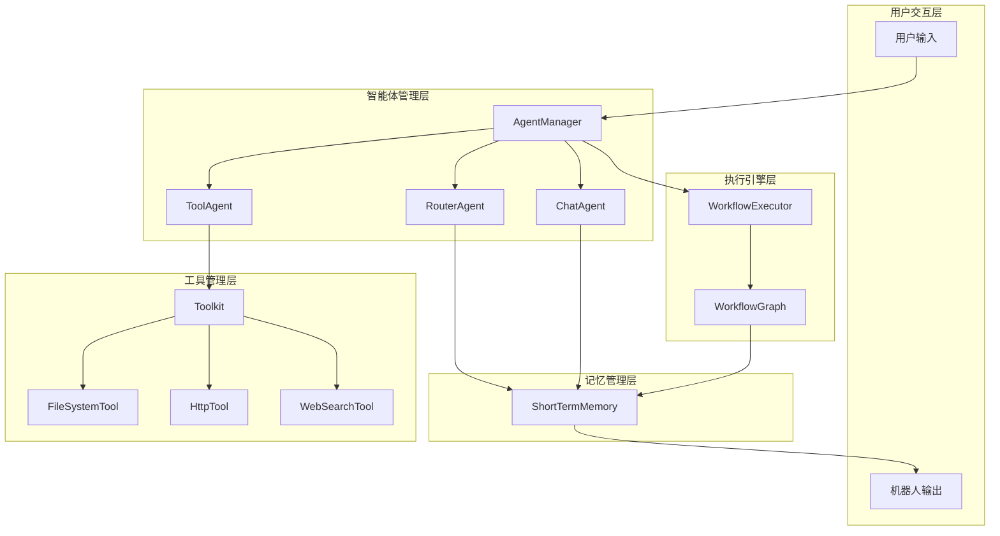

**图表来源**
- [ComprehensiveChatBot.java](file://evox-examples/src/main/java/io/leavesfly/evox/examples/ComprehensiveChatBot.java#L30-L60)
- [AgentManager.java](file://evox-agents/src/main/java/io/leavesfly/evox/agents/manager/AgentManager.java#L16-L51)

## 详细组件分析

### Agent智能体系统

Agent系统是ComprehensiveChatBot的核心决策中心，包含三个专门的Agent：

#### RouterAgent - 路由代理
负责分析用户输入并决定使用哪个Agent处理请求：

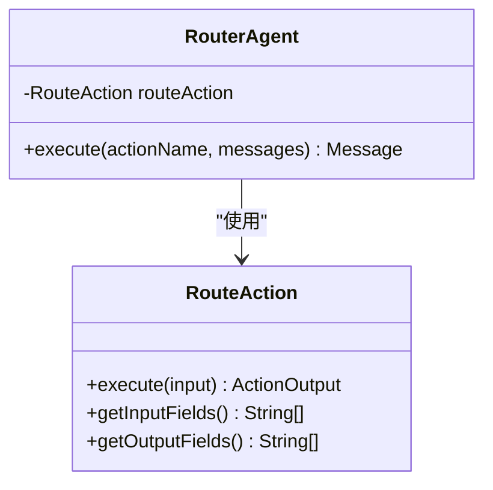

**图表来源**
- [ComprehensiveChatBot.java](file://evox-examples/src/main/java/io/leavesfly/evox/examples/ComprehensiveChatBot.java#L185-L220)
- [ComprehensiveChatBot.java](file://evox-examples/src/main/java/io/leavesfly/evox/examples/ComprehensiveChatBot.java#L307-L341)

#### ToolAgent - 工具代理
专门处理需要外部工具的请求：

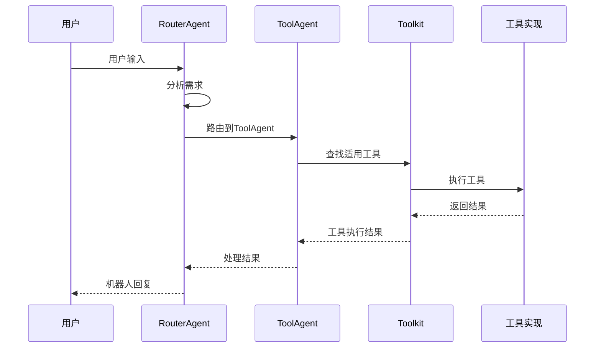

**图表来源**
- [ComprehensiveChatBot.java](file://evox-examples/src/main/java/io/leavesfly/evox/examples/ComprehensiveChatBot.java#L225-L260)
- [ComprehensiveChatBot.java](file://evox-examples/src/main/java/io/leavesfly/evox/examples/ComprehensiveChatBot.java#L346-L378)

#### ChatAgent - 聊天代理
处理普通的对话请求：

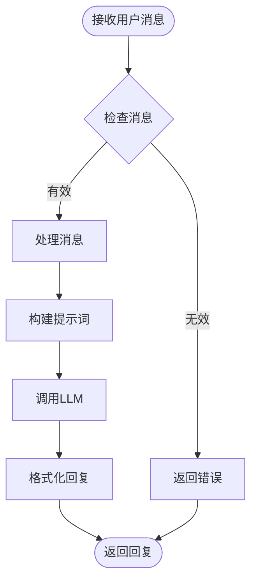

**图表来源**
- [ComprehensiveChatBot.java](file://evox-examples/src/main/java/io/leavesfly/evox/examples/ComprehensiveChatBot.java#L265-L300)
- [ComprehensiveChatBot.java](file://evox-examples/src/main/java/io/leavesfly/evox/examples/ComprehensiveChatBot.java#L380-L412)

**章节来源**
- [ComprehensiveChatBot.java](file://evox-examples/src/main/java/io/leavesfly/evox/examples/ComprehensiveChatBot.java#L185-L413)

### Memory记忆系统

ShortTermMemory提供对话历史的短期存储功能：

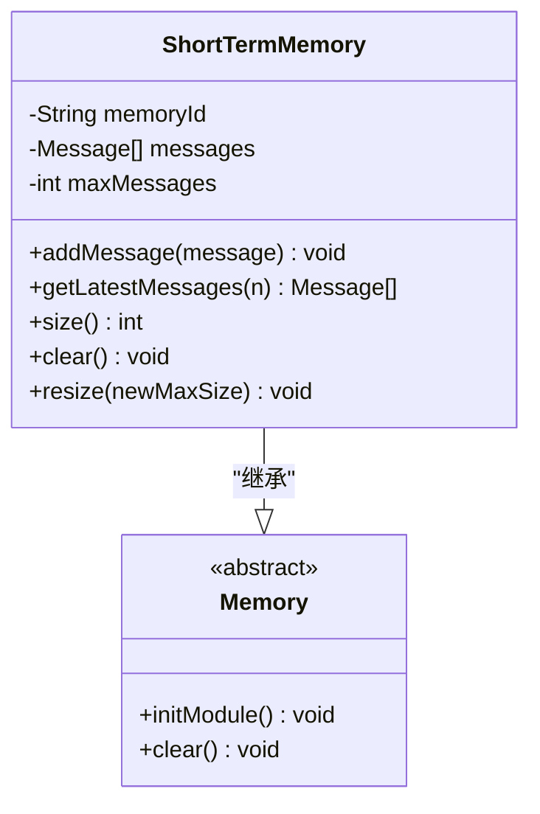

**图表来源**
- [ShortTermMemory.java](file://evox-memory/src/main/java/io/leavesfly/evox/memory/shortterm/ShortTermMemory.java#L21-L60)

**章节来源**
- [ShortTermMemory.java](file://evox-memory/src/main/java/io/leavesfly/evox/memory/shortterm/ShortTermMemory.java#L1-L237)

### Tools工具系统

Toolkit提供统一的工具管理接口，支持多种实用工具：

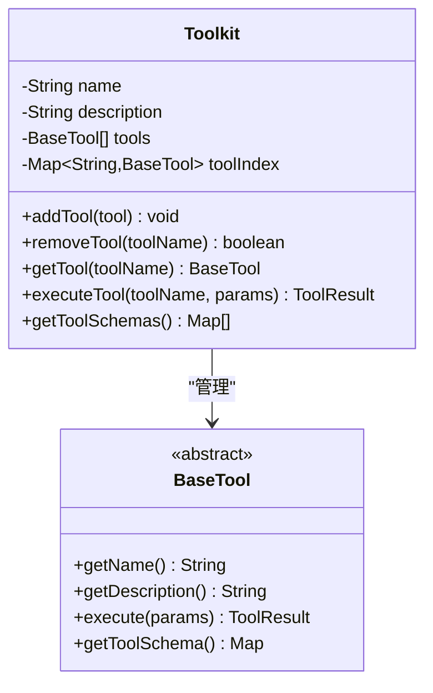

**图表来源**
- [Toolkit.java](file://evox-tools/src/main/java/io/leavesfly/evox/tools/base/Toolkit.java#L16-L50)
- [Toolkit.java](file://evox-tools/src/main/java/io/leavesfly/evox/tools/base/Toolkit.java#L144-L160)

**章节来源**
- [Toolkit.java](file://evox-tools/src/main/java/io/leavesfly/evox/tools/base/Toolkit.java#L1-L207)
- [ToolsExample.java](file://evox-examples/src/main/java/io/leavesfly/evox/examples/ToolsExample.java#L1-L287)

### Workflow工作流系统

虽然在当前示例中主要作为演示，但为更复杂的业务流程提供了基础架构：

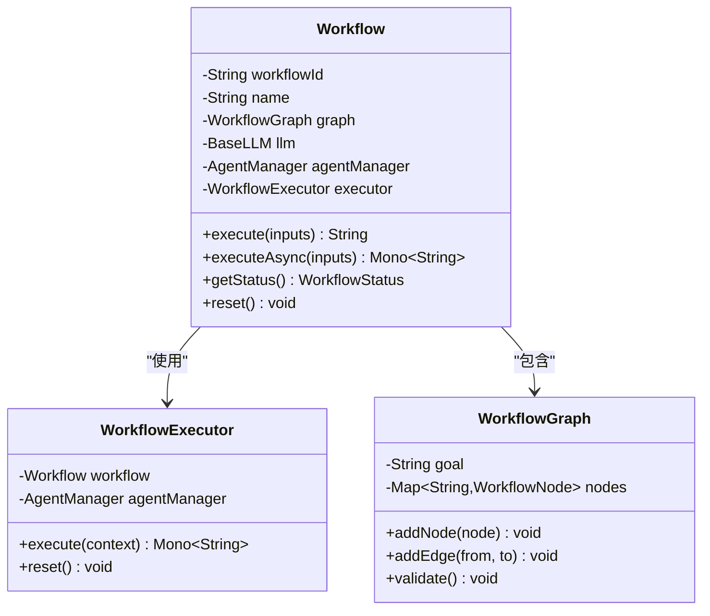

**图表来源**
- [Workflow.java](file://evox-workflow/src/main/java/io/leavesfly/evox/workflow/base/Workflow.java#L25-L60)

**章节来源**
- [Workflow.java](file://evox-workflow/src/main/java/io/leavesfly/evox/workflow/base/Workflow.java#L1-L206)

## 决策逻辑与工作流程

ComprehensiveChatBot的核心在于其智能的决策逻辑，能够根据用户输入动态选择最适合的处理方式：

### 意图识别机制

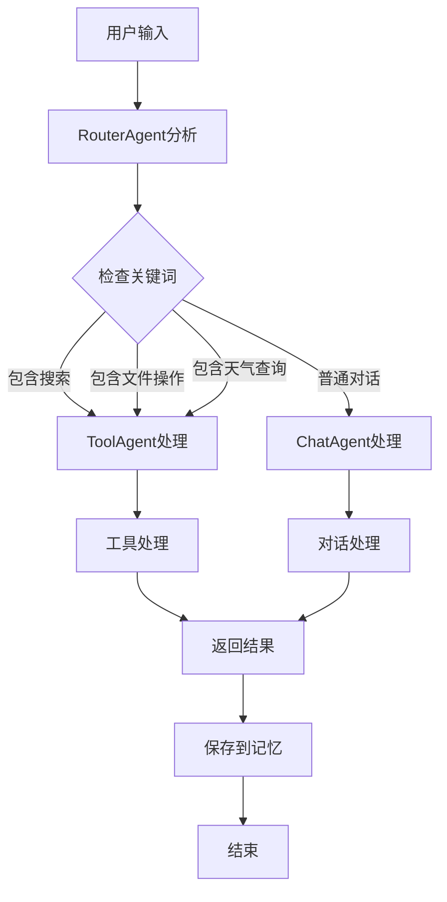

**图表来源**
- [ComprehensiveChatBot.java](file://evox-examples/src/main/java/io/leavesfly/evox/examples/ComprehensiveChatBot.java#L307-L341)
- [ComprehensiveChatBot.java](file://evox-examples/src/main/java/io/leavesfly/evox/examples/ComprehensiveChatBot.java#L143-L167)

### 任务分解与执行

系统通过Agent协作实现了复杂任务的分解和执行：

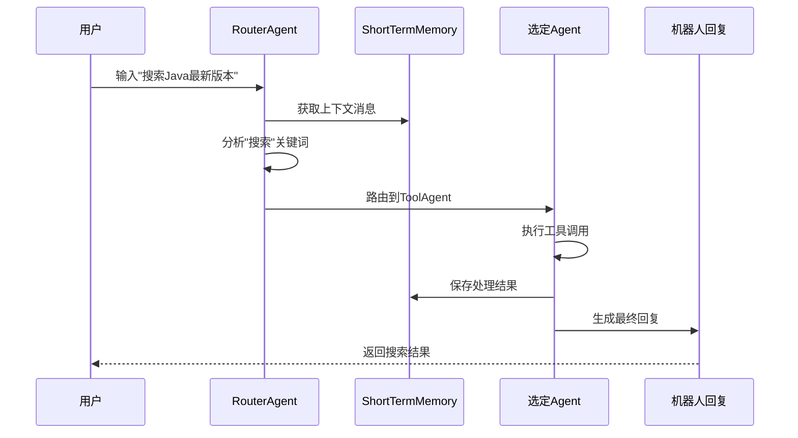

**图表来源**
- [ComprehensiveChatBot.java](file://evox-examples/src/main/java/io/leavesfly/evox/examples/ComprehensiveChatBot.java#L143-L167)

### 结果聚合机制

系统通过记忆管理实现了对话历史的累积和利用：

| 功能特性 | 实现方式 | 性能影响 | 优化建议 |
|---------|---------|---------|---------|
| 上下文保持 | ShortTermMemory保存最近消息 | 中等内存消耗 | 设置合理容量限制 |
| 意图识别 | 关键词匹配算法 | 低CPU开销 | 增加语义理解能力 |
| Agent路由 | 简单规则匹配 | 极低延迟 | 引入机器学习模型 |
| 工具调用 | 同步执行模式 | 中等响应时间 | 支持异步调用 |

**章节来源**
- [ComprehensiveChatBot.java](file://evox-examples/src/main/java/io/leavesfly/evox/examples/ComprehensiveChatBot.java#L119-L167)

## 性能优化策略

### 系统稳定性优化

1. **异常处理机制**
   - 完善的错误捕获和恢复策略
   - Agent执行超时控制
   - 工具调用失败重试机制

2. **资源管理优化**
   - 内存使用监控和限制
   - Agent生命周期管理
   - 工具资源池化

3. **并发处理优化**
   - 异步执行支持
   - Agent并行处理能力
   - 工具调用并发控制

### 响应延迟优化

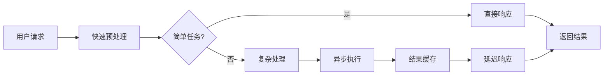

### 资源消耗优化

| 优化维度 | 当前实现 | 优化潜力 | 实施难度 |
|---------|---------|---------|---------|
| 内存使用 | 短期记忆容量限制 | 50% | 低 |
| CPU效率 | 同步执行模式 | 30% | 中 |
| 网络延迟 | 工具调用同步阻塞 | 40% | 中 |
| 并发处理 | 单线程执行 | 60% | 高 |

**章节来源**
- [ComprehensiveChatBot.java](file://evox-examples/src/main/java/io/leavesfly/evox/examples/ComprehensiveChatBot.java#L192-L218)

## 故障排除指南

### 常见问题及解决方案

1. **Agent执行失败**
   - 检查Agent配置和依赖
   - 验证Action输入参数
   - 查看日志获取详细错误信息

2. **工具调用超时**
   - 增加工具调用超时时间
   - 检查网络连接状态
   - 验证工具配置参数

3. **内存溢出问题**
   - 调整ShortTermMemory容量
   - 定期清理过期消息
   - 监控内存使用情况

4. **性能下降问题**
   - 分析系统资源使用
   - 优化Agent执行逻辑
   - 实施缓存策略

### 调试技巧

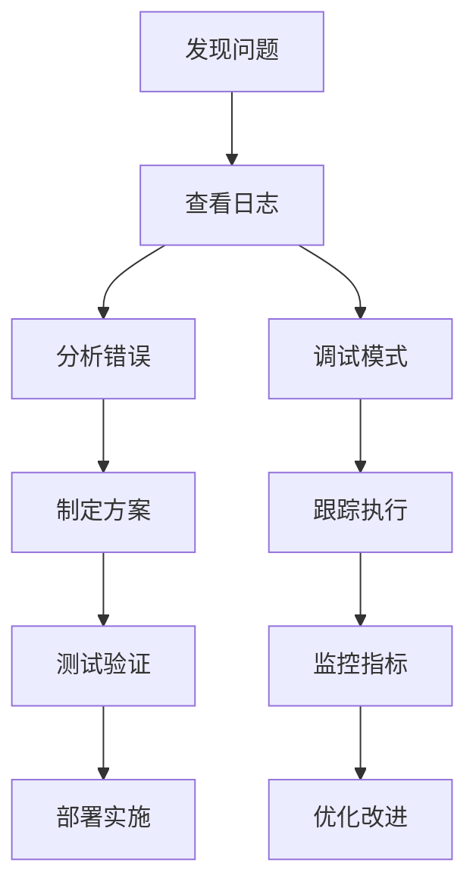

**章节来源**
- [ComprehensiveChatBot.java](file://evox-examples/src/main/java/io/leavesfly/evox/examples/ComprehensiveChatBot.java#L60-L65)

## 总结

ComprehensiveChatBot示例全面展示了EvoX框架的强大功能和灵活性。通过集成Agent智能体、Memory记忆管理、Tools工具集成和Workflow工作流控制，该示例成功实现了：

### 主要成就

1. **智能决策能力** - 通过RouterAgent实现的意图识别和任务路由
2. **多功能扩展性** - 通过Toolkit提供的丰富工具集
3. **上下文保持** - 通过ShortTermMemory实现的对话历史管理
4. **模块化架构** - 清晰的组件分离和职责划分

### 应用价值

该示例为构建生产级AI应用提供了完整的参考架构，特别适用于：
- 复杂对话场景的智能客服系统
- 多模态交互的应用平台
- 需要工具集成的工作流程自动化
- 高并发的实时对话服务

### 发展方向

未来可以进一步增强的功能包括：
- 引入机器学习模型提升意图识别准确率
- 实现异步工具调用提高响应速度
- 添加长期记忆功能支持知识积累
- 集成更多第三方服务和API

通过深入理解和应用ComprehensiveChatBot的设计理念和实现方式，开发者可以构建出更加智能、高效和可靠的AI应用系统。