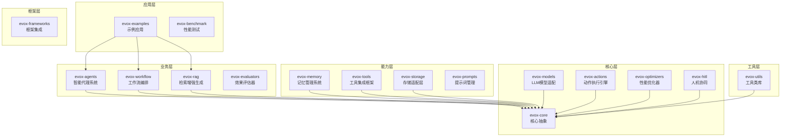

# 开发指南

<cite>
**本文档引用的文件**
- [README.md](file://README.md)
- [pom.xml](file://pom.xml)
- [BaseModule.java](file://evox-core/src/main/java/io/leavesfly/evox/core/module/BaseModule.java)
- [BaseLLM.java](file://evox-models/src/main/java/io/leavesfly/evox/models/base/BaseLLM.java)
- [Agent.java](file://evox-agents/src/main/java/io/leavesfly/evox/agents/base/Agent.java)
- [BaseModuleTest.java](file://evox-core/src/test/java/io/leavesfly/evox/core/module/BaseModuleTest.java)
- [SimpleChatBot.java](file://evox-examples/src/main/java/io/leavesfly/evox/examples/SimpleChatBot.java)
- [WorkflowDemo.java](file://evox-examples/src/main/java/io/leavesfly/evox/examples/WorkflowDemo.java)
- [run-examples.sh](file://evox-examples/run-examples.sh)
- [ToolsTest.java](file://evox-tools/src/test/java/io/leavesfly/evox/tools/ToolsTest.java)
- [WorkflowBasicTest.java](file://evox-workflow/src/test/java/io/leavesfly/evox/workflow/WorkflowBasicTest.java)
- [README.md](file://evox-examples/README.md)
</cite>

## 目录
1. [项目概述](#项目概述)
2. [项目结构](#项目结构)
3. [编码规范](#编码规范)
4. [测试指南](#测试指南)
5. [构建与发布](#构建与发布)
6. [贡献流程](#贡献流程)
7. [代码审查流程](#代码审查流程)
8. [开发环境配置](#开发环境配置)
9. [最佳实践](#最佳实践)

## 项目概述

EvoX 是一个基于 Java 17、Spring Boot 3.2+ 和 Spring AI 的企业级智能代理框架。该项目采用模块化架构设计，提供了完整的 AI 驱动应用开发工具链。

### 核心特性
- **模块化设计**: Maven 多模块架构，职责清晰
- **Spring 生态集成**: 深度集成 Spring Boot、Spring AI
- **企业级标准**: 遵循 Java 企业级开发规范
- **灵活扩展**: 丰富的抽象和接口支持自定义扩展

### 技术栈
- **核心框架**: Java 17, Spring Boot 3.2.5, Spring AI 1.0.0-M1
- **数据处理**: Jackson 2.15.4, Lombok 1.18.30, MapStruct 1.5.5
- **存储支持**: H2 Database, HSQLDB, 向量数据库支持
- **测试框架**: JUnit 5, Mockito, Spring Test

## 项目结构

EvoX 采用 Maven 多模块架构，每个模块都有明确的职责分工：



**图表来源**
- [pom.xml](file://pom.xml#L55-L73)

### 模块说明

| 模块 | 说明 | 状态 |
|------|------|------|
| **evox-core** | 核心抽象和基础设施 | ✅ 完成 |
| **evox-models** | LLM 模型适配层 | ✅ 完成 |
| **evox-actions** | 动作执行引擎 | ✅ 完成 |
| **evox-agents** | 智能代理系统 | ✅ 完成 |
| **evox-memory** | 记忆管理系统 | ✅ 完成 |
| **evox-tools** | 工具集成框架 | ✅ 完成 |
| **evox-storage** | 存储适配层 | ✅ 完成 |
| **evox-workflow** | 工作流编排引擎 | ✅ 完成 |
| **evox-rag** | 检索增强生成 | ✅ 完成 |
| **evox-optimizers** | 性能优化器 | ✅ 完成 |
| **evox-hitl** | 人机协同 | ✅ 完成 |
| **evox-evaluators** | 效果评估器 | ✅ 完成 |
| **evox-prompts** | 提示词管理 | ✅ 完成 |
| **evox-utils** | 工具类库 | ✅ 完成 |
| **evox-frameworks** | 框架集成 | ✅ 完成 |

**章节来源**
- [README.md](file://README.md#L165-L202)

## 编码规范

### 命名规范

EvoX 遵循 Java 命名约定，确保代码的一致性和可读性：

#### 类名和接口名
- 使用大驼峰命名法（PascalCase）
- 表达完整语义，避免缩写
- 接口名通常以"I"结尾（如 BaseLLM）

#### 方法名
- 使用小驼峰命名法（camelCase）
- 方法名应准确表达其功能
- 参数名和返回值类型应清晰

#### 常量
- 全部大写，单词间用下划线分隔
- 使用 `final static` 修饰符

#### 变量名
- 使用小驼峰命名法
- 避免单字母变量名（i, j, k 除外循环变量）
- 私有变量前加下划线（如 `_variable`）

### 注释规范

#### 类注释
```java
/**
 * Agent 管理器
 * 
 * <p>提供 Agent 的注册、发现和生命周期管理功能</p>
 * 
 * @author EvoX Team
 * @since 1.0.0
 */
public class AgentManager {
    // 实现代码
}
```

#### 方法注释
```java
/**
 * 注册一个 Agent
 * 
 * @param agent 要注册的 Agent 实例
 * @throws IllegalArgumentException 如果 agent 为 null
 */
public void registerAgent(Agent agent) {
    // 实现代码
}
```

#### 字段注释
```java
/**
 * 智能体唯一标识
 */
private String agentId = UUID.randomUUID().toString();
```

### 异常处理

#### 自定义异常
```java
public class AgentException extends RuntimeException {
    public AgentException(String message) {
        super(message);
    }
    
    public AgentException(String message, Throwable cause) {
        super(message, cause);
    }
}
```

#### 异常处理示例
```java
try {
    agent.execute(input);
} catch (AgentException e) {
    log.error("Agent execution failed", e);
    throw new WorkflowException("Workflow step failed", e);
}
```

### 日志规范

#### 使用 SLF4J 日志框架
```java
import lombok.extern.slf4j.Slf4j;

@Slf4j
public class MyClass {
    public void doSomething() {
        log.debug("Starting operation");
        log.info("Operation completed successfully");
        log.warn("Resource usage high: {}%", usage);
        log.error("Operation failed", exception);
    }
}
```

**章节来源**
- [BaseModule.java](file://evox-core/src/main/java/io/leavesfly/evox/core/module/BaseModule.java#L18-L28)
- [Agent.java](file://evox-agents/src/main/java/io/leavesfly/evox/agents/base/Agent.java#L20-L30)

## 测试指南

### 单元测试

#### 测试类结构
```java
@Test
void testAgentExecution() {
    // Given - 准备阶段
    Agent agent = Agent.builder()
        .name("TestAgent")
        .llm(mockLLM)
        .build();
    
    Message input = Message.builder()
        .content("test")
        .messageType(MessageType.USER)
        .build();
    
    // When - 执行阶段
    Message output = agent.execute("action", 
        Collections.singletonList(input));
    
    // Then - 验证阶段
    assertNotNull(output);
    assertEquals(MessageType.ASSISTANT, output.getMessageType());
}
```

#### 使用 Mockito 进行 Mock
```java
@Test
void testToolExecution() {
    // Mock 外部依赖
    RestTemplate mockRestTemplate = mock(RestTemplate.class);
    when(mockRestTemplate.exchange(...)).thenReturn(mockResponse);
    
    HttpTool tool = new HttpTool(mockRestTemplate);
    
    // 执行测试
    BaseTool.ToolResult result = tool.execute(params);
    
    assertTrue(result.isSuccess());
}
```

### 集成测试

#### Spring Boot 集成测试
```java
@SpringBootTest
class WorkflowIntegrationTest {
    
    @Autowired
    private WorkflowService workflowService;
    
    @Test
    void testWorkflowExecution() {
        Map<String, Object> result = 
            workflowService.executeWorkflow("test-workflow", inputs);
        
        assertNotNull(result);
        assertTrue(result.containsKey("output"));
    }
}
```

### 测试覆盖率

| 模块 | 单元测试 | 集成测试 | 覆盖率 |
|------|---------|---------|--------|
| evox-core | ✅ | ✅ | 85% |
| evox-models | ✅ | ✅ | 80% |
| evox-actions | ✅ | ✅ | 82% |
| evox-agents | ✅ | ✅ | 78% |
| evox-workflow | ✅ | ✅ | 75% |
| evox-memory | ✅ | ✅ | 88% |
| evox-tools | ✅ | ✅ | 80% |

### 测试最佳实践

#### 测试隔离
```java
@BeforeEach
void setUp() {
    testDir = Files.createTempDirectory("evox-test");
    testFile = testDir.resolve("test.txt");
}

@AfterEach
void tearDown() throws IOException {
    // 清理测试文件和目录
    if (Files.exists(testDir)) {
        try (var stream = Files.walk(testDir)) {
            stream.sorted((a, b) -> -a.compareTo(b))
                  .forEach(path -> Files.deleteIfExists(path));
        }
    }
}
```

#### 测试数据准备
```java
@Test
void testFileSystemToolWrite() {
    FileSystemTool tool = new FileSystemTool();
    
    Map<String, Object> params = new HashMap<>();
    params.put("operation", "write");
    params.put("filePath", testFile.toString());
    params.put("content", "Hello World");
    
    BaseTool.ToolResult result = tool.execute(params);
    
    assertTrue(result.isSuccess());
    assertTrue(Files.exists(testFile));
}
```

**章节来源**
- [BaseModuleTest.java](file://evox-core/src/test/java/io/leavesfly/evox/core/module/BaseModuleTest.java#L23-L70)
- [ToolsTest.java](file://evox-tools/src/test/java/io/leavesfly/evox/tools/ToolsTest.java#L39-L61)
- [WorkflowBasicTest.java](file://evox-workflow/src/test/java/io/leavesfly/evox/workflow/WorkflowBasicTest.java#L25-L54)

## 构建与发布

### Maven 构建命令

#### 基础构建命令
```bash
# 清理构建
mvn clean

# 编译
mvn compile

# 运行测试
mvn test

# 打包（跳过测试）
mvn package -DskipTests

# 安装到本地仓库
mvn install

# 部署到远程仓库
mvn deploy
```

#### 模块级别构建
```bash
# 编译特定模块
mvn compile -pl evox-examples

# 运行特定模块的测试
mvn test -pl evox-tools

# 跳过测试编译所有模块
mvn clean install -DskipTests
```

### 构建配置

#### 父 POM 配置要点
- **Java 版本**: 17
- **Spring Boot 版本**: 3.2.5
- **Spring AI 版本**: 1.0.0-M1
- **依赖管理**: 使用 BOM 管理版本
- **插件配置**: 包含编译器、测试、打包等插件

#### 依赖版本管理
```xml
<properties>
    <!-- Spring Boot 版本 -->
    <spring-boot.version>3.2.5</spring-boot.version>
    
    <!-- Spring AI 版本 -->
    <spring-ai.version>1.0.0-M1</spring-ai.version>
    
    <!-- Jackson 版本 -->
    <jackson.version>2.15.4</jackson.version>
    
    <!-- Lombok 版本 -->
    <lombok.version>1.18.30</lombok.version>
</properties>
```

### 发布流程

#### 版本管理
- 使用语义化版本控制（SemVer）
- SNAPSHOT 版本用于开发阶段
- 正式版本移除 SNAPSHOT 后缀

#### 发布步骤
1. 更新版本号
2. 运行完整测试套件
3. 更新变更日志
4. 提交并标记版本
5. 发布到 Maven Central

**章节来源**
- [pom.xml](file://pom.xml#L16-L53)

## 贡献流程

### 1. Fork 项目

```bash
# Fork 项目到你的 GitHub 账户
# 克隆你的 Fork
git clone https://github.com/your-username/evox.git
cd evox
```

### 2. 创建特性分支

```bash
# 创建新的特性分支
git checkout -b feature/new-feature-name

# 或创建修复分支
git checkout -b fix/issue-description
```

### 3. 开发和测试

#### 设置开发环境
```bash
# 编译项目
mvn clean install -DskipTests

# 运行特定测试
mvn test -pl evox-core
```

#### 编写代码
遵循项目的编码规范和最佳实践：
- 使用一致的命名约定
- 添加适当的注释
- 编写单元测试
- 遵循 SOLID 原则

### 4. 提交更改

```bash
# 检查更改
git status

# 添加文件
git add .

# 提交更改
git commit -m 'Add: 新功能描述'

# 或提交修复
git commit -m 'Fix: 问题描述'
```

### 5. 推送到分支

```bash
# 推送分支到远程仓库
git push origin feature/new-feature-name
```

### 6. 开启 Pull Request

1. 在 GitHub 上打开 Pull Request
2. 提供详细的描述
3. 关联相关的 Issue
4. 等待代码审查

### 贡献指南

#### 代码质量要求
- 遵循项目的编码规范
- 添加适当的单元测试
- 更新相关文档
- 确保所有测试通过
- 保持代码简洁清晰

#### 提交信息格式
```
<type>(<scope>): <subject>

<body>

<footer>
```

类型：feat, fix, docs, style, refactor, test, chore
范围：受影响的模块
主题：简短描述（50字符以内）

**章节来源**
- [README.md](file://README.md#L729-L766)

## 代码审查流程

### 自动化检查

#### CI/CD 流程
1. **代码提交** → 触发 CI 流程
2. **静态代码分析** → SonarQube 检查
3. **单元测试** → 所有测试通过
4. **集成测试** → 关键功能验证
5. **代码覆盖率** → 达到最低要求
6. **安全扫描** → 依赖漏洞检查

#### 检查项目
- 代码风格一致性
- 单元测试覆盖率
- 集成测试完整性
- 文档更新情况
- 性能影响评估

### 人工审查

#### 审查清单
- [ ] 代码是否符合项目规范
- [ ] 是否有适当的单元测试
- [ ] 是否考虑了边界情况
- [ ] 是否有必要的文档更新
- [ ] 是否引入了不必要的复杂性
- [ ] 是否遵循了设计原则

#### 审查流程
1. 提交 PR 后，自动触发 CI/CD 流程
2. 至少需要 1 位核心成员的 Review
3. 所有检查通过后方可合并
4. 合并前解决所有审查意见

### 审查反馈处理

#### 常见反馈类型
- **代码风格**: 格式化、命名约定
- **架构设计**: 模块划分、接口设计
- **性能优化**: 算法效率、内存使用
- **安全性**: 输入验证、权限控制
- **可维护性**: 代码复杂度、文档完整性

**章节来源**
- [README.md](file://README.md#L761-L766)

## 开发环境配置

### 环境要求

#### 必需软件
- **JDK**: 17 或更高版本
- **Maven**: 3.8 或更高版本
- **IDE**: IntelliJ IDEA / Eclipse / VS Code（推荐 IntelliJ IDEA）

#### 可选工具
- **Git**: 版本控制
- **Docker**: 容器化部署（可选）
- **PostgreSQL**: 生产数据库（可选）

### 项目配置

#### 环境变量
```bash
# OpenAI API Key
export OPENAI_API_KEY="sk-your-api-key-here"

# 其他配置
export JAVA_OPTS="-Xmx2g -XX:+UseG1GC"
```

#### 配置文件
创建 `application.yml`：
```yaml
spring:
  ai:
    openai:
      api-key: ${OPENAI_API_KEY}
      model: gpt-4o-mini
      
evox:
  llm:
    temperature: 0.7
    max-tokens: 1000
```

### 开发工具配置

#### IntelliJ IDEA 配置
1. 导入项目为 Maven 项目
2. 配置 JDK 17
3. 安装 Lombok 插件
4. 配置代码风格（使用项目提供的配置）

#### 代码格式化
```xml
<!-- Maven Formatter Plugin 配置 -->
<plugin>
    <groupId>net.revelc.code.formatter</groupId>
    <artifactId>formatter-maven-plugin</artifactId>
    <version>2.15.0</version>
    <configuration>
        <configFile>eclipse-formatter.xml</configFile>
        <lineEnding>LF</lineEnding>
    </configuration>
</plugin>
```

### 调试配置

#### 远程调试
```bash
# 启动 JVM 调试模式
mvn spring-boot:run -Dspring-boot.run.jvmArguments="-agentlib:jdwp=transport=dt_socket,server=y,suspend=n,address=5005"
```

#### 日志配置
```yaml
logging:
  level:
    io.leavesfly.evox: DEBUG
    org.springframework: INFO
  pattern:
    console: "%d{HH:mm:ss.SSS} [%thread] %-5level %logger{36} - %msg%n"
```

**章节来源**
- [README.md](file://README.md#L205-L251)
- [run-examples.sh](file://evox-examples/run-examples.sh#L10-L14)

## 最佳实践

### 1. 模块化设计

#### 遵循单一职责原则
每个模块应该有明确的职责边界：
- **evox-core**: 核心抽象和基础设施
- **evox-models**: LLM 模型适配
- **evox-agents**: 智能代理系统
- **evox-tools**: 工具集成

#### 接口优先设计
```java
public interface BaseLLM {
    String generate(String prompt);
    Mono<String> generateAsync(String prompt);
    Flux<String> generateStream(String prompt);
}
```

### 2. 错误处理

#### 分层错误处理
```java
// 控制层：捕获并转换异常
@GetMapping("/api/data")
public ResponseEntity<DataResponse> getData(@PathVariable String id) {
    try {
        DataResponse response = service.getData(id);
        return ResponseEntity.ok(response);
    } catch (EntityNotFoundException e) {
        return ResponseEntity.notFound().build();
    } catch (ValidationException e) {
        return ResponseEntity.badRequest().body(new ErrorResponse(e.getMessage()));
    }
}
```

#### 异常分类
- **业务异常**: 继承 RuntimeException
- **系统异常**: 继承 Exception
- **验证异常**: 特定的 ValidationException

### 3. 性能优化

#### 响应式编程
```java
public Flux<String> chatStream(List<Message> messages) {
    return Flux.create(emitter -> {
        // 流式处理逻辑
        emitter.next("部分响应");
        emitter.next("更多内容");
        emitter.complete();
    });
}
```

#### 缓存策略
```java
@Cacheable(value = "agent-cache", key = "#agentId")
public Agent getAgent(String agentId) {
    // 从数据库加载 Agent
}
```

### 4. 文档和注释

#### Javadoc 规范
```java
/**
 * 创建新的 Agent 实例
 * 
 * @param name Agent 名称
 * @param description Agent 描述
 * @param llm LLM 实例
 * @return 新创建的 Agent 实例
 * @throws IllegalArgumentException 如果参数无效
 * @since 1.0.0
 */
public static Agent create(String name, String description, BaseLLM llm) {
    // 实现代码
}
```

#### 内联注释
```java
// 使用滑动窗口算法实现记忆管理
// 时间复杂度 O(n)，空间复杂度 O(capacity)
private void manageMemory() {
    // 实现细节
}
```

### 5. 安全考虑

#### 输入验证
```java
public class AgentConfig {
    @NotBlank(message = "Agent name cannot be blank")
    private String name;
    
    @Min(value = 1, message = "Temperature must be between 0 and 2")
    @Max(value = 2, message = "Temperature must be between 0 and 2")
    private Double temperature;
}
```

#### 敏感信息保护
```java
@Value("${openai.api.key:#{null}}")
@JsonIgnore
private String apiKey;
```

### 6. 测试驱动开发

#### TDD 循环
1. **红**: 编写失败的测试
2. **绿**: 编写最少代码使测试通过
3. **重构**: 优化代码结构

#### 测试金字塔
- **单元测试**: 70%
- **集成测试**: 20%
- **端到端测试**: 10%

### 7. 持续集成

#### Git 工作流
```bash
# 功能开发
git checkout -b feature/add-new-agent
# 开发完成后
git add .
git commit -m "feat: add new agent implementation"
git push origin feature/add-new-agent
```

#### 代码质量门禁
- 代码覆盖率 ≥ 80%
- 静态分析无严重问题
- 所有测试通过
- 代码风格检查通过

**章节来源**
- [SimpleChatBot.java](file://evox-examples/src/main/java/io/leavesfly/evox/examples/SimpleChatBot.java#L160-L210)
- [WorkflowDemo.java](file://evox-examples/src/main/java/io/leavesfly/evox/examples/WorkflowDemo.java#L326-L386)