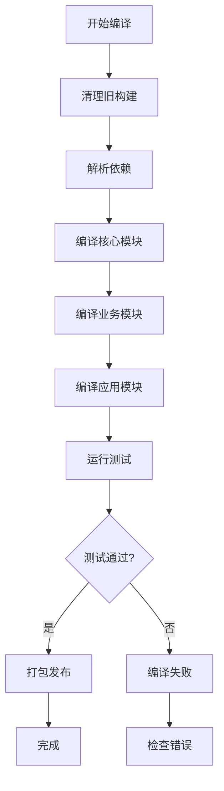
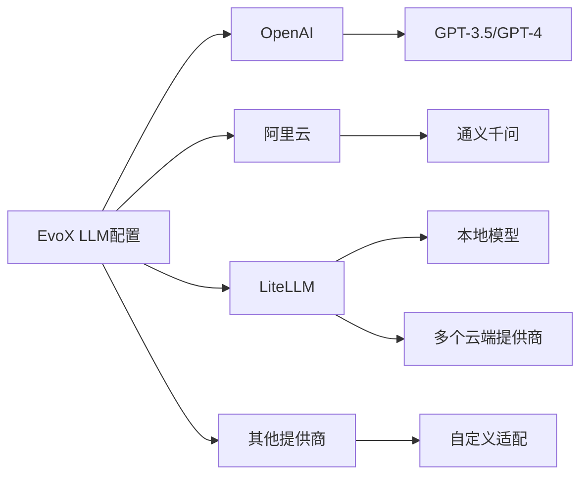
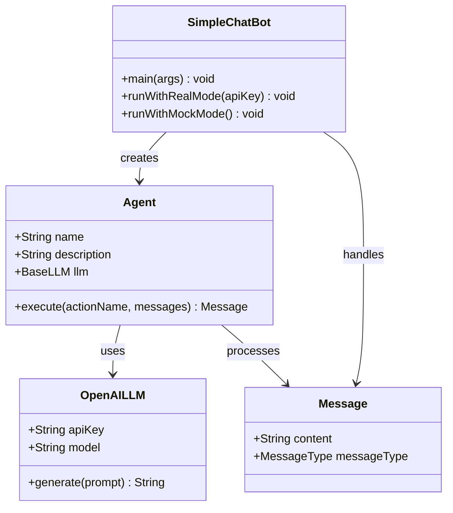
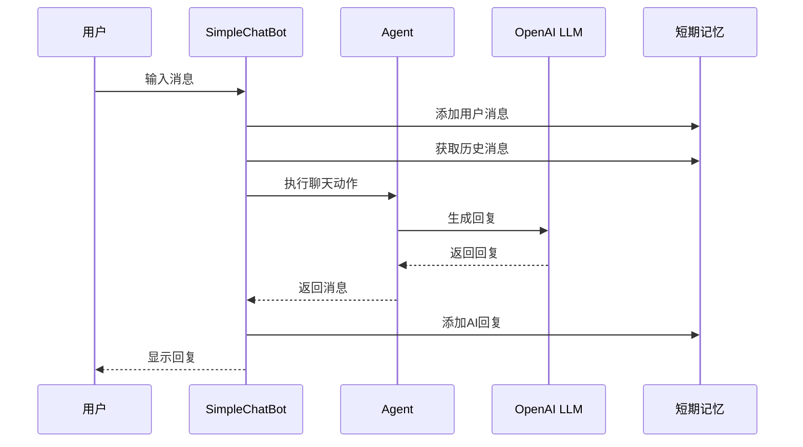
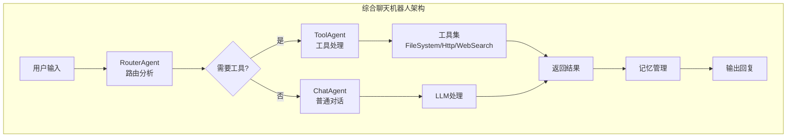
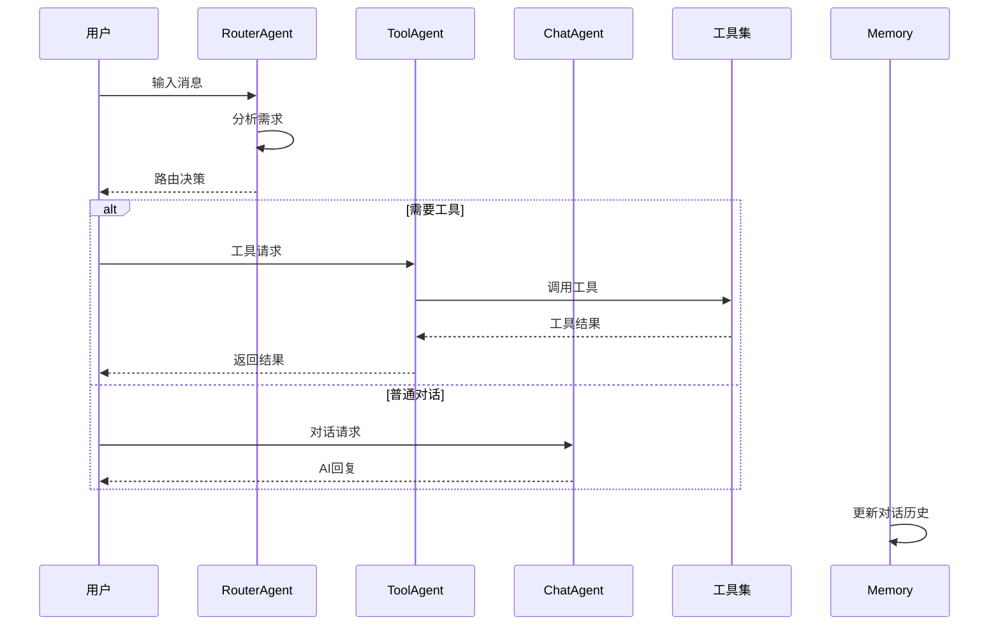
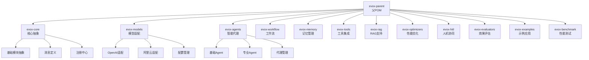
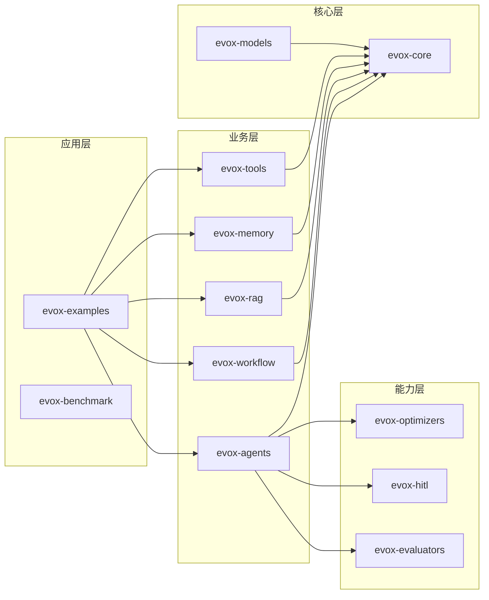

# 快速开始

<cite>
**本文档引用的文件**
- [README.md](file://README.md)
- [pom.xml](file://pom.xml)
- [SimpleChatBot.java](file://evox-examples/src/main/java/io/leavesfly/evox/examples/SimpleChatBot.java)
- [ComprehensiveChatBot.java](file://evox-examples/src/main/java/io/leavesfly/evox/examples/ComprehensiveChatBot.java)
- [run-examples.sh](file://evox-examples/run-examples.sh)
- [LiteLLMConfig.java](file://evox-models/src/main/java/io/leavesfly/evox/models/config/LiteLLMConfig.java)
- [LiteLLM.java](file://evox-models/src/main/java/io/leavesfly/evox/models/litellm/LiteLLM.java)
</cite>

## 目录
1. [项目简介](#项目简介)
2. [环境要求](#环境要求)
3. [安装和编译](#安装和编译)
4. [配置API密钥](#配置api密钥)
5. [第一个聊天机器人](#第一个聊天机器人)
6. [完整示例：综合聊天机器人](#完整示例综合聊天机器人)
7. [项目结构概览](#项目结构概览)
8. [常见问题解答](#常见问题解答)
9. [下一步](#下一步)

## 项目简介

EvoX 是一个基于 Java 17、Spring Boot 3.2+ 和 Spring AI 的企业级智能代理框架。它提供了一套完整的工具和抽象，用于构建复杂的 AI 驱动应用，支持多智能体协同、工作流编排、长短期记忆管理、RAG（检索增强生成）等高级特性。

### 核心特性

- **多模型支持**: 支持 OpenAI、阿里云通义千问、百度文心一言等多种LLM模型
- **智能代理系统**: 提供基础代理和专业代理，支持代理管理和协同
- **记忆管理**: 支持短期和长期记忆，具备智能检索和去重功能
- **工作流编排**: 支持DAG工作流定义、条件分支和循环控制
- **工具集成**: 提供文件操作、HTTP请求、网络搜索等丰富工具
- **RAG支持**: 支持文档处理、向量化和语义检索
- **优化与评估**: 内置性能优化器和效果评估体系

## 环境要求

在开始之前，请确保您的开发环境满足以下要求：

### 必需组件

| 组件 | 版本要求 | 说明 |
|------|----------|------|
| **JDK** | 17 或更高版本 | Java开发工具包 |
| **Maven** | 3.8 或更高版本 | 项目构建和依赖管理工具 |
| **IDE** | 推荐 IntelliJ IDEA / Eclipse / VS Code | 开发环境（可选但推荐） |

### 验证环境

在继续之前，验证您的环境配置：

```bash
# 检查 JDK 版本
java -version

# 检查 Maven 版本
mvn -version
```

**节来源**
- [README.md](file://README.md#L205-L210)
- [pom.xml](file://pom.xml#L17-L21)

## 安装和编译

### 步骤 1：克隆项目

```bash
# 克隆 EvoX 仓库
git clone https://github.com/your-org/evox.git
cd evox
```

### 步骤 2：编译安装

EvoX 使用 Maven 作为构建工具，支持多种编译选项：

```bash
# 跳过测试快速编译（推荐首次使用）
mvn clean install -DskipTests

# 完整编译（包含测试）
mvn clean install

# 仅编译特定模块
mvn clean compile -pl evox-examples
```

### 编译过程详解



**图表来源**
- [pom.xml](file://pom.xml#L1-L50)

### 编译选项说明

| 命令 | 用途 | 说明 |
|------|------|------|
| `mvn clean install` | 完整编译 | 包含测试，适合生产环境 |
| `mvn clean install -DskipTests` | 快速编译 | 跳过测试，适合开发调试 |
| `mvn compile` | 仅编译 | 不运行测试，不打包 |
| `mvn test` | 仅测试 | 运行所有单元测试 |

**节来源**
- [README.md](file://README.md#L211-L228)

## 配置API密钥

EvoX 支持多种配置方式来设置API密钥，您可以根据需求选择最适合的方式。

### 方式一：通过环境变量配置

这是推荐的方式，特别适合生产环境：

```bash
# Linux/macOS
export OPENAI_API_KEY="sk-your-api-key-here"

# Windows (PowerShell)
$env:OPENAI_API_KEY="sk-your-api-key-here"

# Windows (CMD)
set OPENAI_API_KEY=sk-your-api-key-here
```

### 方式二：通过 application.yml 配置

创建 `application.yml` 文件（位于项目根目录或资源目录）：

```yaml
spring:
  ai:
    openai:
      api-key: ${OPENAI_API_KEY}
      model: gpt-4o-mini
      
evox:
  llm:
    temperature: 0.7
    max-tokens: 1000
```

### 支持的模型提供商

EvoX 支持多种LLM提供商，每种都有特定的配置方式：



**图表来源**
- [LiteLLMConfig.java](file://evox-models/src/main/java/io/leavesfly/evox/models/config/LiteLLMConfig.java#L160-L193)

### API密钥配置示例

以下是不同提供商的配置示例：

#### OpenAI 配置
```yaml
spring:
  ai:
    openai:
      api-key: ${OPENAI_API_KEY}
      model: gpt-4o-mini
```

#### 阿里云配置
```yaml
spring:
  ai:
    aliyun:
      api-key: ${ALIBABA_API_KEY}
      model: qwen-plus
```

#### LiteLLM 配置
```yaml
evox:
  llm:
    provider: litellm
    model: gpt-4o-mini
    api-key: ${LITELLM_API_KEY}
    base-url: https://api.litellm.ai/v1
```

**节来源**
- [README.md](file://README.md#L230-L251)
- [LiteLLMConfig.java](file://evox-models/src/main/java/io/leavesfly/evox/models/config/LiteLLMConfig.java#L140-L150)

## 第一个聊天机器人

让我们从一个简单的聊天机器人开始，这是理解EvoX框架的最佳起点。

### 基础架构概览



**图表来源**
- [SimpleChatBot.java](file://evox-examples/src/main/java/io/leavesfly/evox/examples/SimpleChatBot.java#L165-L210)

### 代码实现步骤

#### 第一步：配置 LLM

```java
// 创建 OpenAI LLM 配置
OpenAILLMConfig config = OpenAILLMConfig.builder()
    .apiKey(System.getenv("OPENAI_API_KEY"))
    .model("gpt-3.5-turbo")
    .temperature(0.7f)
    .maxTokens(150)
    .build();

// 创建 LLM 实例
BaseLLM llm = new OpenAILLM(config);
```

#### 第二步：创建 Agent

```java
// 创建聊天机器人 Agent
Agent agent = Agent.builder()
    .name("SimpleChatBot")
    .description("一个简单的聊天机器人示例")
    .llm(llm)
    .build();
```

#### 第三步：发送消息

```java
// 创建用户消息
Message userMessage = Message.builder()
    .content("你好，请介绍一下自己")
    .messageType(MessageType.INPUT)
    .build();

// 执行聊天
Message response = agent.execute("chat", Collections.singletonList(userMessage));
System.out.println("AI: " + response.getContent());
```

### 运行示例

```bash
# 设置 API 密钥
export OPENAI_API_KEY="sk-your-api-key-here"

# 运行简单聊天机器人
mvn exec:java -pl evox-examples \
    -Dexec.mainClass="io.leavesfly.evox.examples.SimpleChatBot"
```

### 代码结构说明



**图表来源**
- [SimpleChatBot.java](file://evox-examples/src/main/java/io/leavesfly/evox/examples/SimpleChatBot.java#L50-L98)

**节来源**
- [SimpleChatBot.java](file://evox-examples/src/main/java/io/leavesfly/evox/examples/SimpleChatBot.java#L35-L157)

## 完整示例：综合聊天机器人

让我们深入探索一个更复杂的示例，展示EvoX的强大功能。

### 多Agent架构



**图表来源**
- [ComprehensiveChatBot.java](file://evox-examples/src/main/java/io/leavesfly/evox/examples/ComprehensiveChatBot.java#L30-L58)

### 核心组件说明

#### 1. AgentManager - 代理管理器

```java
// 创建代理管理器
AgentManager agentManager = new AgentManager();

// 注册多个专业Agent
agentManager.addAgent(createRouterAgent());
agentManager.addAgent(createToolAgent(toolkit));
agentManager.addAgent(createChatAgent());
```

#### 2. 工具集配置

```java
// 创建工具集
Toolkit toolkit = new Toolkit();
toolkit.addTool(new FileSystemTool());
toolkit.addTool(new HttpTool());
toolkit.addTool(new WebSearchTool());
```

#### 3. 多Agent协作流程



**图表来源**
- [ComprehensiveChatBot.java](file://evox-examples/src/main/java/io/leavesfly/evox/examples/ComprehensiveChatBot.java#L120-L167)

### 运行演示

```bash
# 运行综合聊天机器人示例
mvn exec:java -pl evox-examples \
    -Dexec.mainClass="io.leavesfly.evox.examples.ComprehensiveChatBot"
```

### 支持的功能演示

该示例展示了以下核心功能：

| 功能 | 描述 | 实现方式 |
|------|------|----------|
| **多Agent协作** | 路由、工具、聊天三个专业Agent协同工作 | AgentManager统一管理 |
| **智能路由** | 根据用户输入自动选择合适的Agent | RouteAction分析逻辑 |
| **工具集成** | 文件操作、HTTP请求、网络搜索 | Toolkit工具集 |
| **记忆管理** | 保存和检索对话历史 | ShortTermMemory短期记忆 |
| **错误处理** | 完善的异常处理和降级机制 | 模拟模式和真实模式 |

**节来源**
- [ComprehensiveChatBot.java](file://evox-examples/src/main/java/io/leavesfly/evox/examples/ComprehensiveChatBot.java#L25-L167)

## 项目结构概览

EvoX 采用模块化的Maven多模块架构，每个模块都有明确的职责分工。

### 模块组织结构



**图表来源**
- [pom.xml](file://pom.xml#L55-L73)

### 核心模块说明

| 模块 | 职责 | 主要功能 |
|------|------|----------|
| **evox-core** | 核心基础设施 | 基础抽象、消息定义、模块注册 |
| **evox-models** | LLM模型适配 | OpenAI、阿里云等模型集成 |
| **evox-agents** | 智能代理系统 | Agent基类、专业代理、代理管理 |
| **evox-workflow** | 工作流编排 | 图结构工作流、条件分支、循环控制 |
| **evox-memory** | 记忆管理 | 短期记忆、长期记忆、智能检索 |
| **evox-tools** | 工具集成 | 文件操作、HTTP请求、网络搜索 |
| **evox-rag** | 检索增强生成 | 文档处理、向量化、语义检索 |
| **evox-examples** | 示例应用 | 各种功能演示示例 |

### 依赖关系图



**图表来源**
- [pom.xml](file://pom.xml#L114-L189)

**节来源**
- [README.md](file://README.md#L164-L202)

## 常见问题解答

### Q1: 编译时出现依赖冲突怎么办？

**解决方案：**
```bash
# 清理并重新下载依赖
mvn clean dependency:resolve

# 检查依赖树
mvn dependency:tree

# 强制更新依赖
mvn clean install -U
```

### Q2: API密钥配置无效怎么办？

**解决方案：**
1. 检查环境变量是否正确设置
2. 验证 `application.yml` 文件路径和格式
3. 确认API密钥的有效性

```bash
# 检查环境变量
echo $OPENAI_API_KEY

# 验证配置文件
cat application.yml
```

### Q3: 运行示例时出现内存不足？

**解决方案：**
```bash
# 增加JVM堆内存
export MAVEN_OPTS="-Xmx2g -XX:MaxMetaspaceSize=512m"

# 或者修改run-examples.sh中的启动参数
```

### Q4: 如何添加新的LLM模型支持？

**解决方案：**
1. 在 `evox-models` 模块中创建新的模型适配器
2. 实现 `BaseLLM` 接口
3. 添加相应的配置类
4. 在 `ModuleRegistry` 中注册

### Q5: 性能优化建议

**最佳实践：**
- 使用连接池管理数据库连接
- 合理配置缓存策略
- 监控内存使用情况
- 使用异步处理提高并发性能

## 下一步

恭喜！您已经成功完成了EvoX的快速入门。接下来您可以：

### 1. 深入学习核心概念

- **Agent系统**: 学习如何创建和管理智能代理
- **工作流编排**: 掌握复杂业务流程的自动化
- **记忆管理**: 理解对话历史的存储和检索
- **工具集成**: 探索各种实用工具的使用

### 2. 参考官方示例

```bash
# 运行更多示例
./evox-examples/run-examples.sh
```

### 3. 查看完整文档

- **架构设计**: 了解系统的整体设计理念
- **开发指南**: 学习编码规范和最佳实践
- **API参考**: 查阅详细的接口文档

### 4. 社区参与

- **GitHub Issues**: 报告问题和建议功能
- **Pull Requests**: 贡献代码和改进
- **讨论区**: 与其他开发者交流经验

### 5. 生产环境部署

- **容器化**: 使用Docker部署应用
- **监控**: 集成监控和日志系统
- **安全**: 配置API密钥管理和访问控制

通过本快速入门指南，您应该能够：
- 成功编译和运行EvoX项目
- 配置API密钥并创建简单的聊天机器人
- 理解EvoX的核心架构和模块组织
- 运行和理解各种示例应用

现在，是时候开始构建您自己的智能应用了！