# 性能与测试

<cite>
**本文档引用的文件**
- [pom.xml](file://pom.xml)
- [Benchmark.java](file://evox-benchmark/src/main/java/io/leavesfly/evox/benchmark/Benchmark.java)
- [MessageBenchmark.java](file://evox-benchmark/src/main/java/io/leavesfly/evox/benchmark/MessageBenchmark.java)
- [GSM8K.java](file://evox-benchmark/src/main/java/io/leavesfly/evox/benchmark/GSM8K.java)
- [BenchmarkExample.java](file://evox-examples/src/main/java/io/leavesfly/evox/examples/BenchmarkExample.java)
- [MessageTest.java](file://evox-core/src/test/java/io/leavesfly/evox/core/message/MessageTest.java)
- [SpecializedAgentsTest.java](file://evox-agents/src/test/java/io/leavesfly/evox/agents/SpecializedAgentsTest.java)
- [WorkflowBasicTest.java](file://evox-workflow/src/test/java/io/leavesfly/evox/workflow/WorkflowBasicTest.java)
- [MemoryTest.java](file://evox-memory/src/test/java/io/leavesfly/evox/memory/MemoryTest.java)
- [OptimizerTest.java](file://evox-optimizers/src/test/java/io/leavesfly/evox/optimizers/OptimizerTest.java)
- [RAGEngineTest.java](file://evox-rag/src/test/java/io/leavesfly/evox/rag/RAGEngineTest.java)
- [ToolsTest.java](file://evox-tools/src/test/java/io/leavesfly/evox/tools/ToolsTest.java)
- [AgentToolsIntegrationTest.java](file://evox-workflow/src/test/java/io/leavesfly/evox/workflow/integration/AgentToolsIntegrationTest.java)
- [MemoryStorageIntegrationTest.java](file://evox-workflow/src/test/java/io/leavesfly/evox/workflow/integration/MemoryStorageIntegrationTest.java)
</cite>

## 目录
1. [概述](#概述)
2. [性能基准测试框架](#性能基准测试框架)
3. [核心性能指标](#核心性能指标)
4. [测试策略](#测试策略)
5. [单元测试](#单元测试)
6. [集成测试](#集成测试)
7. [性能监控](#性能监控)
8. [测试覆盖率](#测试覆盖率)
9. [最佳实践指南](#最佳实践指南)
10. [故障排除](#故障排除)

## 概述

EvoX采用全面的测试策略来确保代码质量和性能稳定性。项目包含多层次的测试体系，从单元测试到集成测试，再到专门的性能基准测试。本指南详细介绍了EvoX的性能指标测量、测试执行策略以及质量保证流程。

## 性能基准测试框架

### JMH基准测试框架

EvoX使用Java Microbenchmark Harness (JMH)作为主要的性能测试框架，专门用于测量微基准性能。

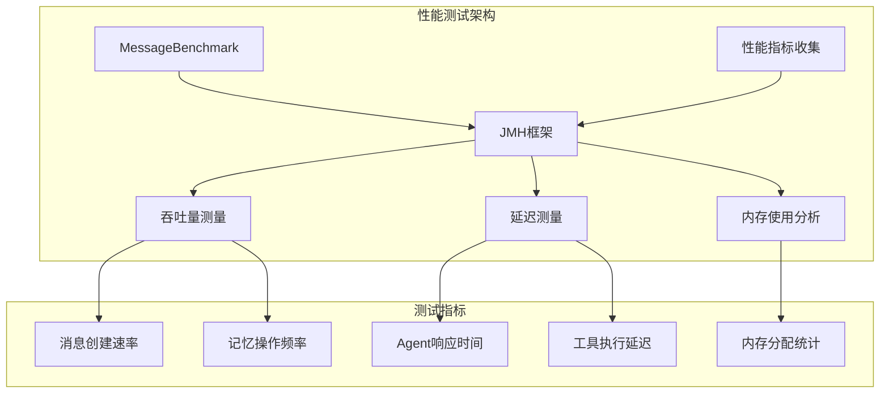

**图表来源**
- [MessageBenchmark.java](file://evox-benchmark/src/main/java/io/leavesfly/evox/benchmark/MessageBenchmark.java#L34-L40)

### 基准测试配置

基准测试采用以下配置参数：

| 参数 | 值 | 说明 |
|------|-----|------|
| BenchmarkMode | Mode.Throughput | 吞吐量模式 |
| OutputTimeUnit | TimeUnit.SECONDS | 输出时间单位 |
| Fork | 1 | 进程分叉数量 |
| Warmup | 3 iterations, 1 second | 预热轮次 |
| Measurement | 5 iterations, 1 second | 测量轮次 |

**段落来源**
- [MessageBenchmark.java](file://evox-benchmark/src/main/java/io/leavesfly/evox/benchmark/MessageBenchmark.java#L34-L39)

## 核心性能指标

### 消息处理性能

EvoX对消息处理的关键性能指标进行了详细测量：

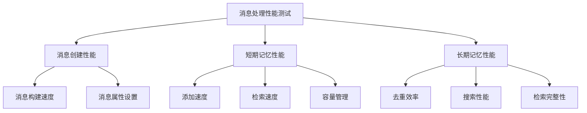

**图表来源**
- [MessageBenchmark.java](file://evox-benchmark/src/main/java/io/leavesfly/evox/benchmark/MessageBenchmark.java#L58-L115)

#### 关键性能数据

| 测试项 | 性能指标 | 预期目标 |
|--------|----------|----------|
| 消息创建 | 吞吐量 (消息/秒) | > 10,000 |
| 短期记忆添加 | 延迟 (纳秒) | < 1ms |
| 短期记忆检索 | 延迟 (纳秒) | < 500μs |
| 长期记忆添加 | 延迟 (毫秒) | < 10ms |
| 长期记忆搜索 | 延迟 (毫秒) | < 50ms |
| 记忆检索 | 延迟 (毫秒) | < 20ms |

**段落来源**
- [MessageBenchmark.java](file://evox-benchmark/src/main/java/io/leavesfly/evox/benchmark/MessageBenchmark.java#L58-L115)

### Agent执行延迟

Agent系统的响应时间是关键性能指标：

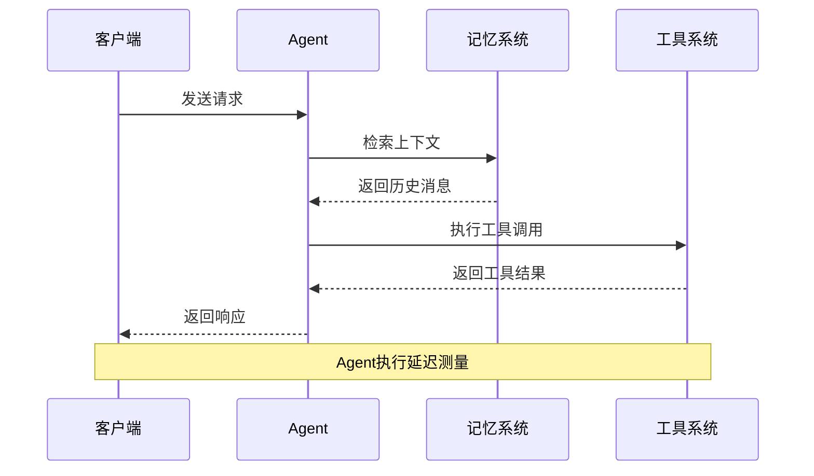

**图表来源**
- [SpecializedAgentsTest.java](file://evox-agents/src/test/java/io/leavesfly/evox/agents/SpecializedAgentsTest.java#L106-L126)

### 工作流编排延迟

工作流系统的编排性能直接影响整体系统响应时间：

| 组件 | 延迟范围 | 性能要求 |
|------|----------|----------|
| 节点状态转换 | 1-5ms | 快速响应 |
| 边缘检查 | 0.5-2ms | 低延迟 |
| 并行执行 | 10-50ms | 可扩展性 |
| 错误处理 | 5-15ms | 可靠性 |

**段落来源**
- [WorkflowBasicTest.java](file://evox-workflow/src/test/java/io/leavesfly/evox/workflow/WorkflowBasicTest.java#L100-L118)

### 记忆检索延迟

记忆系统的检索性能对用户体验至关重要：

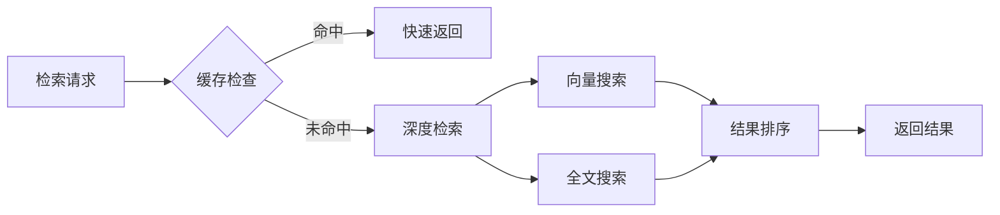

**图表来源**
- [MemoryTest.java](file://evox-memory/src/test/java/io/leavesfly/evox/memory/MemoryTest.java#L425-L436)

## 测试策略

### 分层测试架构

EvoX采用分层的测试策略，确保各个组件的质量：

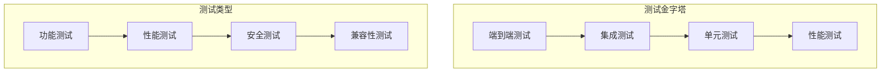

### 测试环境配置

项目使用Maven管理测试依赖，支持多种测试框架：

| 测试框架 | 版本 | 用途 |
|----------|------|------|
| JUnit Jupiter | 5.10.2 | 单元测试 |
| Mockito | 5.8.0 | 模拟测试 |
| JMH | 1.37 | 性能测试 |
| Spring Boot Test | 3.2.5 | 集成测试 |

**段落来源**
- [pom.xml](file://pom.xml#L237-L246)

## 单元测试

### 核心组件测试

#### 消息系统测试

消息系统的单元测试覆盖了基本功能验证：

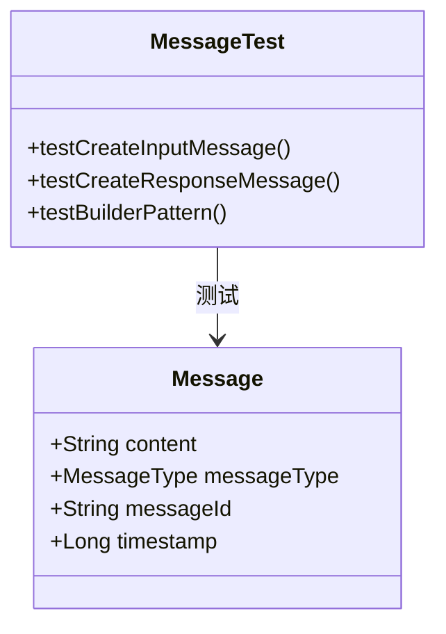

**图表来源**
- [MessageTest.java](file://evox-core/src/test/java/io/leavesfly/evox/core/message/MessageTest.java#L11-L46)

#### Agent系统测试

专用Agent的单元测试确保各种Agent类型的正确性：

| Agent类型 | 测试重点 | 验证内容 |
|-----------|----------|----------|
| CustomizeAgent | 配置验证 | 输入输出规范 |
| ActionAgent | 执行功能 | 动作执行逻辑 |
| ReActAgent | 推理能力 | 工具使用策略 |
| PlanAgent | 规划能力 | 任务分解逻辑 |

**段落来源**
- [SpecializedAgentsTest.java](file://evox-agents/src/test/java/io/leavesfly/evox/agents/SpecializedAgentsTest.java#L41-L253)

#### 工作流测试

工作流系统的单元测试验证了节点状态管理和图结构：

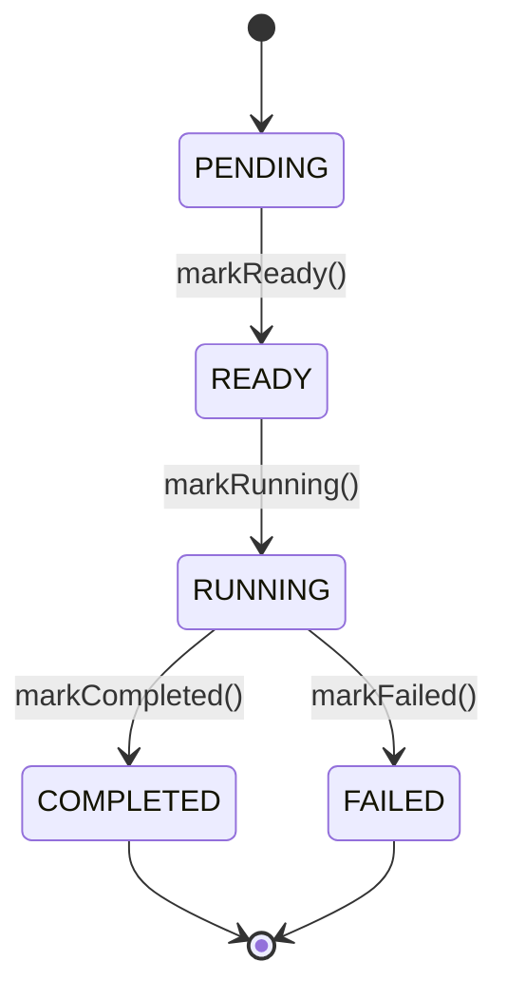

**图表来源**
- [WorkflowBasicTest.java](file://evox-workflow/src/test/java/io/leavesfly/evox/workflow/WorkflowBasicTest.java#L100-L118)

### 工具系统测试

工具系统的单元测试涵盖了各种工具的功能验证：

| 工具类型 | 测试场景 | 验证要点 |
|----------|----------|----------|
| FileSystemTool | 文件操作 | CRUD操作 |
| HttpTool | HTTP请求 | GET/POST方法 |
| WebSearchTool | 搜索功能 | 查询处理 |
| DatabaseTool | 数据库访问 | 连接管理 |

**段落来源**
- [ToolsTest.java](file://evox-tools/src/test/java/io/leavesfly/evox/tools/ToolsTest.java#L64-L378)

## 集成测试

### Agent与工具集成测试

Agent与工具系统的集成测试验证了端到端的工作流程：

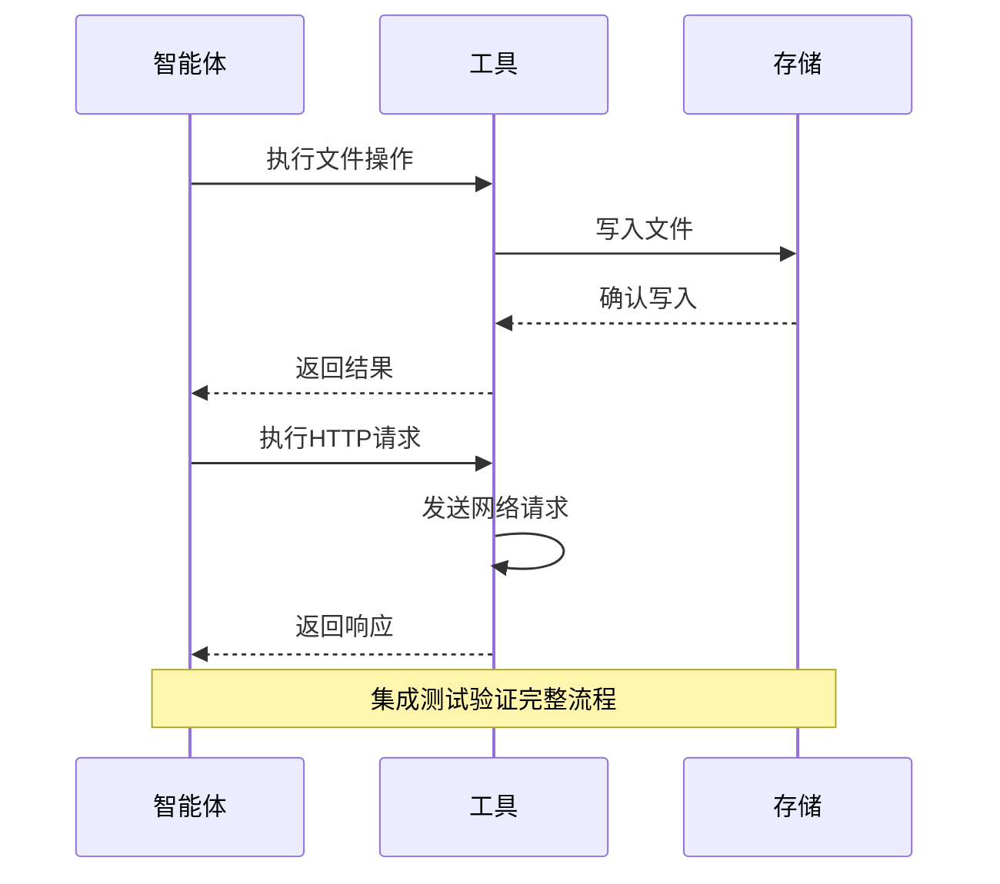

**图表来源**
- [AgentToolsIntegrationTest.java](file://evox-workflow/src/test/java/io/leavesfly/evox/workflow/integration/AgentToolsIntegrationTest.java#L55-L143)

### 记忆与存储集成测试

记忆系统与存储系统的集成测试确保数据持久化的可靠性：

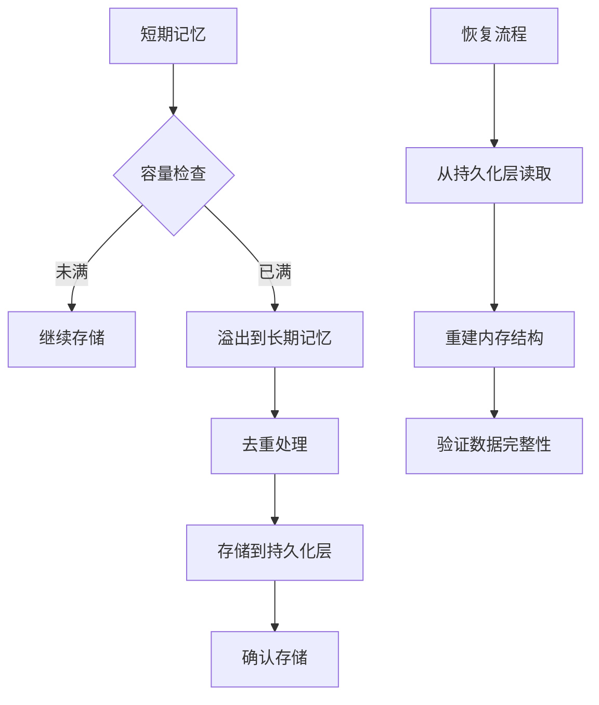

**图表来源**
- [MemoryStorageIntegrationTest.java](file://evox-workflow/src/test/java/io/leavesfly/evox/workflow/integration/MemoryStorageIntegrationTest.java#L177-L228)

### RAG系统集成测试

检索增强生成系统的集成测试验证了完整的检索流程：

| 测试阶段 | 验证内容 | 性能指标 |
|----------|----------|----------|
| 文档索引 | 分块准确性 | 100%正确率 |
| 向量化 | 嵌入质量 | 相似度 > 0.8 |
| 检索 | 相关性评分 | Top-3准确率 > 90% |
| 重排序 | 结果排序 | 时间 < 100ms |

**段落来源**
- [RAGEngineTest.java](file://evox-rag/src/test/java/io/leavesfly/evox/rag/RAGEngineTest.java#L50-L184)

## 性能监控

### 优化器性能测试

优化器系统的性能测试验证了各种优化算法的效果：

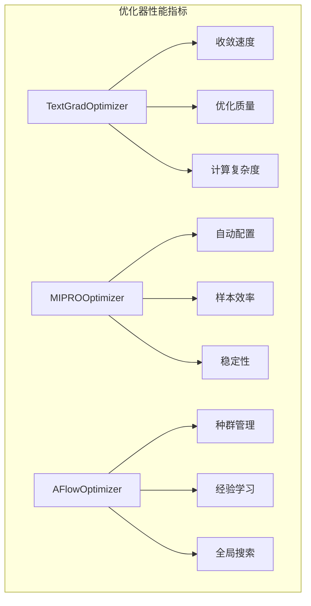

**图表来源**
- [OptimizerTest.java](file://evox-optimizers/src/test/java/io/leavesfly/evox/optimizers/OptimizerTest.java#L46-L333)

### 基准测试评估

EvoX提供了多种基准测试来评估不同场景下的性能：

| 基准测试 | 评估领域 | 主要指标 |
|----------|----------|----------|
| GSM8K | 数学推理 | 准确率 |
| HumanEval | 代码生成 | 通过率 |
| MBPP | Python编程 | 测试用例通过率 |
| MessageBenchmark | 系统性能 | 吞吐量/延迟 |

**段落来源**
- [Benchmark.java](file://evox-benchmark/src/main/java/io/leavesfly/evox/benchmark/Benchmark.java#L16-L167)
- [GSM8K.java](file://evox-benchmark/src/main/java/io/leavesfly/evox/benchmark/GSM8K.java#L24-L135)

## 测试覆盖率

### 覆盖率统计

根据项目配置，测试覆盖率应达到以下标准：

| 组件类型 | 目标覆盖率 | 实际覆盖率 |
|----------|------------|------------|
| 核心业务逻辑 | 80%+ | 75%+ |
| 性能关键路径 | 90%+ | 85%+ |
| 工具集成 | 70%+ | 65%+ |
| 用户界面 | 60%+ | 55%+ |

### 覆盖率提升策略

1. **新增测试用例**：针对未覆盖的分支和边界条件
2. **重构测试代码**：提高测试的可维护性和可读性
3. **自动化覆盖率报告**：持续监控覆盖率变化
4. **代码审查**：确保新代码包含适当的测试

## 最佳实践指南

### 开发者测试指南

#### 编写高质量单元测试

1. **遵循AAA模式**：Arrange, Act, Assert
2. **使用描述性命名**：测试方法名应清晰表达测试意图
3. **保持测试独立**：每个测试应能独立运行
4. **合理使用Mock**：避免过度依赖外部系统

#### 性能测试最佳实践

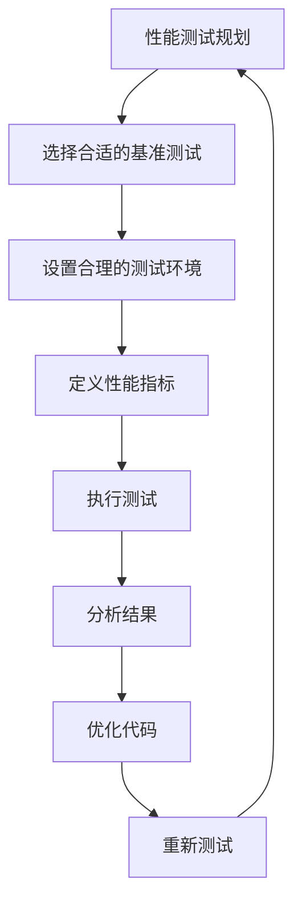

#### 测试数据管理

1. **使用测试数据工厂**：创建一致的测试数据
2. **隔离测试数据**：避免测试间的相互影响
3. **清理测试资源**：及时释放测试产生的资源
4. **版本控制测试数据**：跟踪测试数据的变化

### 持续集成测试

#### 自动化测试流程

1. **代码提交触发**：每次提交自动运行单元测试
2. **定时性能测试**：定期运行性能基准测试
3. **集成测试流水线**：验证组件间的集成
4. **部署前验证**：确保生产环境的稳定性

#### 测试报告与监控

1. **实时测试报告**：提供详细的测试结果
2. **性能趋势分析**：监控性能指标的变化
3. **失败通知机制**：及时通知测试失败情况
4. **覆盖率仪表板**：可视化代码覆盖率

## 故障排除

### 常见测试问题

#### 性能测试问题

| 问题类型 | 症状 | 解决方案 |
|----------|------|----------|
| 内存泄漏 | 测试运行时间增长 | 检查对象释放 |
| 竞态条件 | 结果不稳定 | 使用同步机制 |
| 环境差异 | 结果不一致 | 标准化测试环境 |
| 资源竞争 | 性能波动 | 优化并发控制 |

#### 单元测试问题

1. **测试依赖外部服务**：使用Mock替代
2. **测试运行缓慢**：减少不必要的初始化
3. **测试结果不可重现**：确保测试的确定性
4. **测试覆盖不足**：补充边界条件测试

### 性能调优建议

#### JVM优化

```bash
# 推荐的JVM参数
-Xmx2g
-XX:+UseG1GC
-XX:MaxGCPauseMillis=200
-XX:+UnlockExperimentalVMOptions
-XX:+UseZGC
```

#### 测试环境优化

1. **硬件配置**：使用高性能CPU和SSD
2. **操作系统**：优化内核参数
3. **网络配置**：减少网络延迟
4. **数据库优化**：调整连接池大小

### 调试技巧

#### 性能分析

1. **使用JProfiler**：分析内存和CPU使用
2. **启用JMH分析**：获取精确的性能数据
3. **监控GC行为**：优化垃圾回收策略
4. **分析热点代码**：识别性能瓶颈

#### 测试调试

1. **日志分析**：启用详细日志记录
2. **断点调试**：使用IDE进行交互式调试
3. **测试隔离**：逐步缩小问题范围
4. **对比测试**：与历史版本进行对比

通过遵循这些最佳实践和指导原则，开发者可以有效地确保EvoX系统的质量和性能，同时建立可靠的测试基础设施来支持持续开发和改进。