# 工作流（Workflow）

<cite>
**本文档引用的文件**
- [Workflow.java](file://evox-workflow/src/main/java/io/leavesfly/evox/workflow/base/Workflow.java)
- [WorkflowNode.java](file://evox-workflow/src/main/java/io/leavesfly/evox/workflow/base/WorkflowNode.java)
- [WorkflowGraph.java](file://evox-workflow/src/main/java/io/leavesfly/evox/workflow/graph/WorkflowGraph.java)
- [WorkflowExecutor.java](file://evox-workflow/src/main/java/io/leavesfly/evox/workflow/execution/WorkflowExecutor.java)
- [WorkflowContext.java](file://evox-workflow/src/main/java/io/leavesfly/evox/workflow/execution/WorkflowContext.java)
- [Operator.java](file://evox-workflow/src/main/java/io/leavesfly/evox/workflow/operator/Operator.java)
- [AnswerGenerateOperator.java](file://evox-workflow/src/main/java/io/leavesfly/evox/workflow/operator/AnswerGenerateOperator.java)
- [CustomOperator.java](file://evox-workflow/src/main/java/io/leavesfly/evox/workflow/operator/CustomOperator.java)
- [ScEnsembleOperator.java](file://evox-workflow/src/main/java/io/leavesfly/evox/workflow/operator/ScEnsembleOperator.java)
- [WorkflowDemo.java](file://evox-examples/src/main/java/io/leavesfly/evox/examples/WorkflowDemo.java)
- [SequentialWorkflowExample.java](file://evox-examples/src/main/java/io/leavesfly/evox/examples/SequentialWorkflowExample.java)
- [DecisionNodeTest.java](file://evox-workflow/src/test/java/io/leavesfly/evox/workflow/DecisionNodeTest.java)
- [ParallelNodeTest.java](file://evox-workflow/src/test/java/io/leavesfly/evox/workflow/ParallelNodeTest.java)
- [SubWorkflowNodeTest.java](file://evox-workflow/src/test/java/io/leavesfly/evox/workflow/SubWorkflowNodeTest.java)
</cite>

## 目录
1. [简介](#简介)
2. [核心概念](#核心概念)
3. [系统架构](#系统架构)
4. [详细组件分析](#详细组件分析)
5. [工作流构建与执行](#工作流构建与执行)
6. [节点类型详解](#节点类型详解)
7. [Operator操作定义](#operator操作定义)
8. [执行上下文管理](#执行上下文管理)
9. [完整示例](#完整示例)
10. [错误处理与性能优化](#错误处理与性能优化)
11. [总结](#总结)

## 简介

EvoX的工作流系统是一个强大的DAG（有向无环图）任务编排引擎，它提供了灵活且可扩展的流程自动化解决方案。该系统通过节点（WorkflowNode）和边的关系定义任务执行顺序，支持复杂的业务逻辑编排，包括条件分支、并行执行、循环控制等多种控制结构。

工作流系统的核心优势在于其模块化设计和高度可配置性。每个工作流由多个节点组成，这些节点可以是简单的动作执行器，也可以是复杂的控制结构，如决策节点、并行节点或循环节点。系统通过WorkflowExecutor负责具体的执行调度，而WorkflowContext则提供统一的执行上下文管理。

## 核心概念

### 工作流（Workflow）
工作流是整个系统的核心容器，封装了完整的任务编排逻辑。它包含了工作流图（WorkflowGraph）、执行器（WorkflowExecutor）、智能体管理器（AgentManager）等关键组件。

### 工作流图（WorkflowGraph）
工作流图是DAG结构的具体实现，负责管理所有节点及其相互关系。它维护节点的生命周期状态，跟踪执行进度，并确保图结构的有效性。

### 工作流节点（WorkflowNode）
工作流节点代表工作流中的一个具体任务或步骤。每个节点都有明确的类型（如ACTION、DECISION、PARALLEL等），并包含执行所需的配置信息。

### 执行上下文（WorkflowContext）
执行上下文在整个工作流执行过程中提供状态管理和数据传递功能，包括输入输出数据、执行历史、错误信息等。

## 系统架构

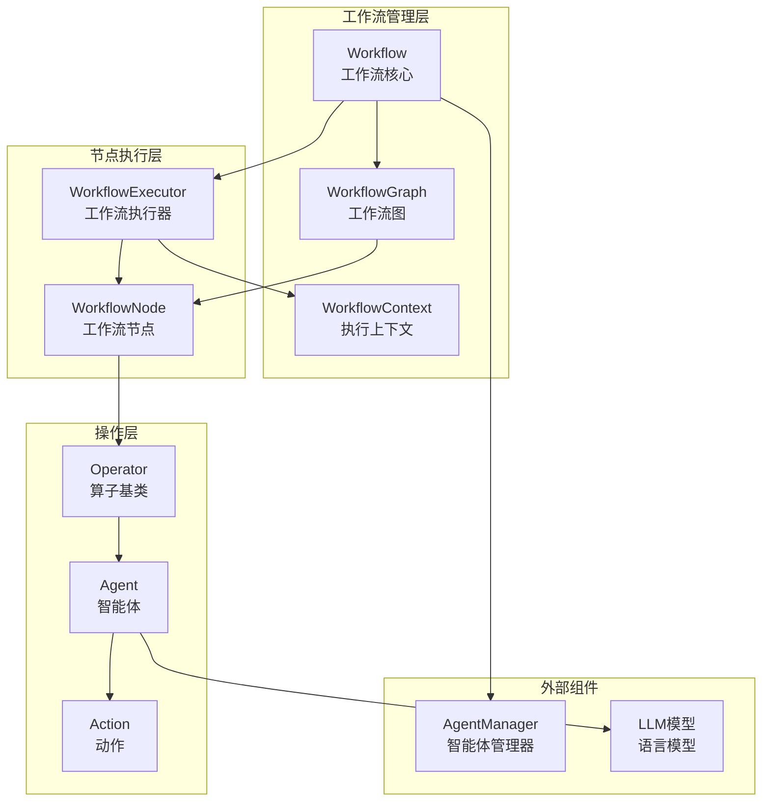

**图表来源**
- [Workflow.java](file://evox-workflow/src/main/java/io/leavesfly/evox/workflow/base/Workflow.java#L28-L87)
- [WorkflowGraph.java](file://evox-workflow/src/main/java/io/leavesfly/evox/workflow/graph/WorkflowGraph.java#L17-L51)
- [WorkflowExecutor.java](file://evox-workflow/src/main/java/io/leavesfly/evox/workflow/execution/WorkflowExecutor.java#L25-L34)

## 详细组件分析

### Workflow类 - 工作流核心

Workflow类是整个工作流系统的核心控制器，负责协调各个组件的工作。它继承自BaseModule，提供了完整的生命周期管理功能。

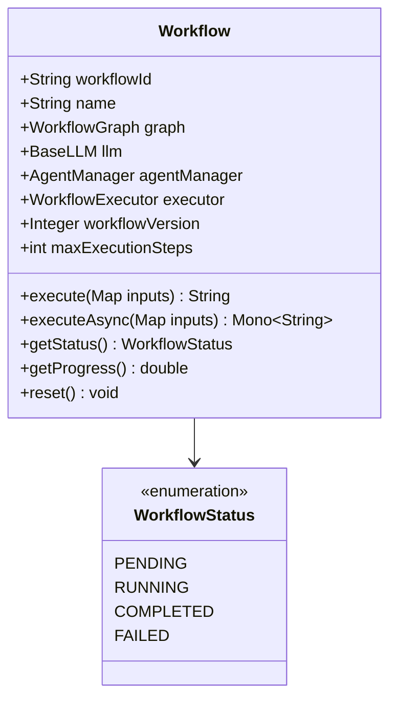

**图表来源**
- [Workflow.java](file://evox-workflow/src/main/java/io/leavesfly/evox/workflow/base/Workflow.java#L28-L205)

**章节来源**
- [Workflow.java](file://evox-workflow/src/main/java/io/leavesfly/evox/workflow/base/Workflow.java#L28-L205)

### WorkflowNode类 - 节点定义

WorkflowNode类定义了工作流中的单个任务节点，支持多种节点类型和丰富的配置选项。

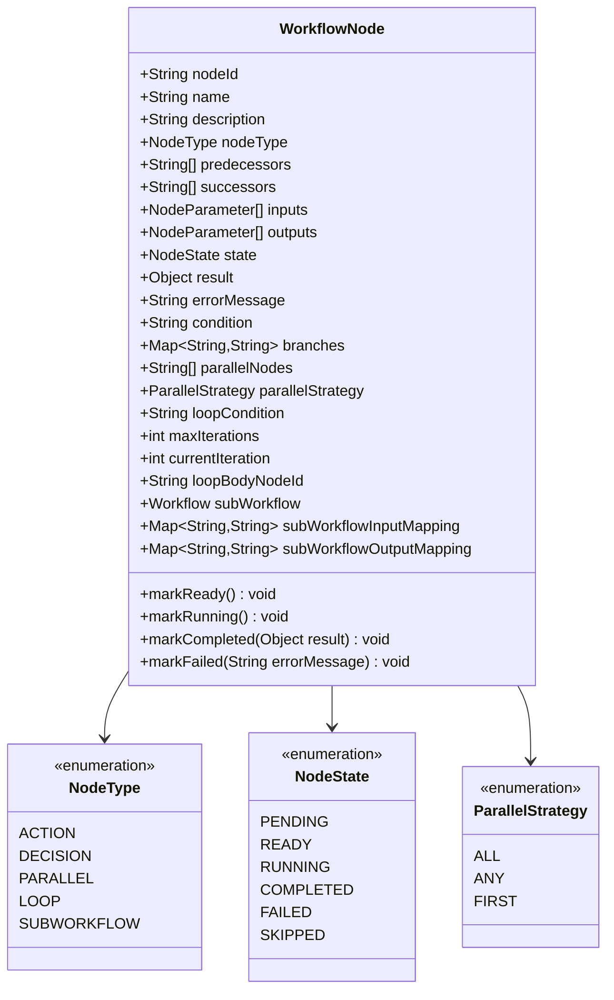

**图表来源**
- [WorkflowNode.java](file://evox-workflow/src/main/java/io/leavesfly/evox/workflow/base/WorkflowNode.java#L21-L325)

**章节来源**
- [WorkflowNode.java](file://evox-workflow/src/main/java/io/leavesfly/evox/workflow/base/WorkflowNode.java#L21-L325)

### WorkflowGraph类 - 图结构管理

WorkflowGraph类实现了DAG结构的管理功能，负责节点的添加、连接、状态跟踪和有效性验证。

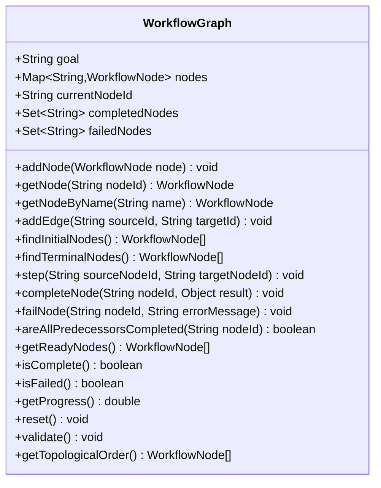

**图表来源**
- [WorkflowGraph.java](file://evox-workflow/src/main/java/io/leavesfly/evox/workflow/graph/WorkflowGraph.java#L17-L326)

**章节来源**
- [WorkflowGraph.java](file://evox-workflow/src/main/java/io/leavesfly/evox/workflow/graph/WorkflowGraph.java#L17-L326)

### WorkflowExecutor类 - 执行调度器

WorkflowExecutor类负责工作流的具体执行逻辑，包括节点调度、状态管理和异常处理。

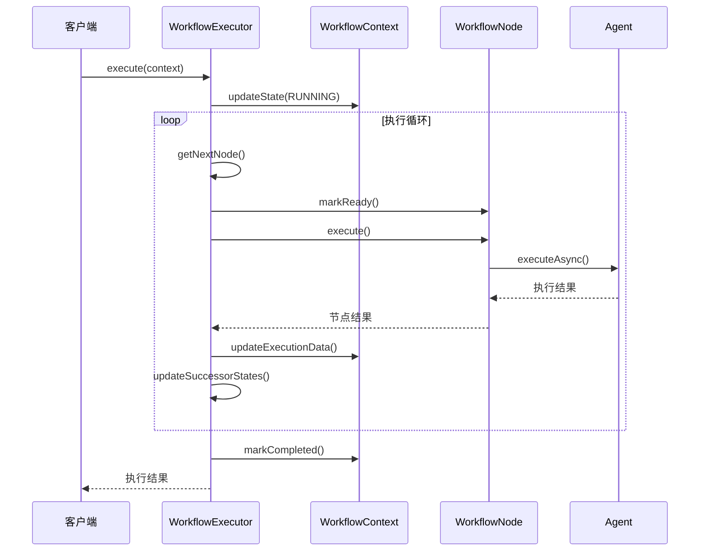

**图表来源**
- [WorkflowExecutor.java](file://evox-workflow/src/main/java/io/leavesfly/evox/workflow/execution/WorkflowExecutor.java#L39-L89)

**章节来源**
- [WorkflowExecutor.java](file://evox-workflow/src/main/java/io/leavesfly/evox/workflow/execution/WorkflowExecutor.java#L39-L89)

### WorkflowContext类 - 上下文管理

WorkflowContext类提供统一的执行环境，管理输入输出数据、执行历史和状态信息。

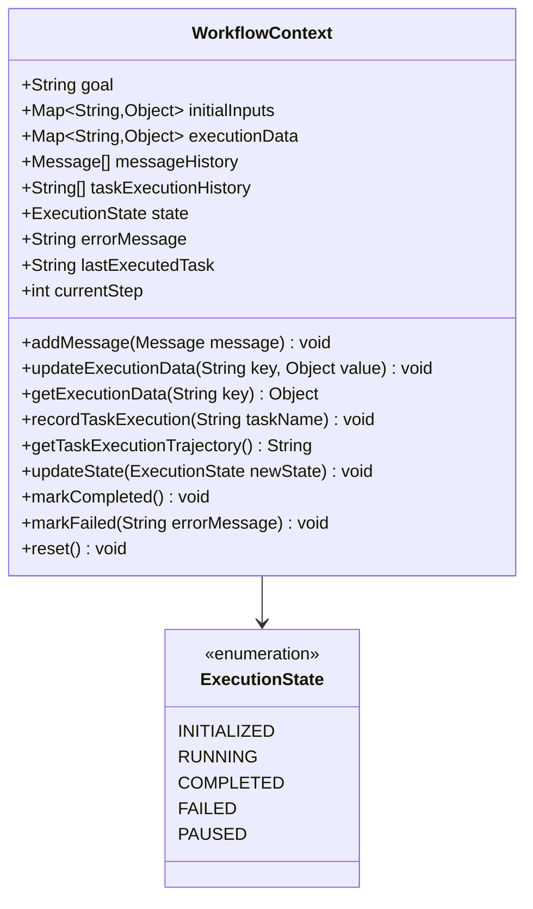

**图表来源**
- [WorkflowContext.java](file://evox-workflow/src/main/java/io/leavesfly/evox/workflow/execution/WorkflowContext.java#L15-L223)

**章节来源**
- [WorkflowContext.java](file://evox-workflow/src/main/java/io/leavesfly/evox/workflow/execution/WorkflowContext.java#L15-L223)

## 工作流构建与执行

### 工作流构建流程

工作流的构建遵循以下步骤：

1. **创建智能体管理器**：注册和管理各种智能体
2. **定义工作流图**：创建节点并建立连接关系
3. **配置工作流**：设置执行参数和约束条件
4. **初始化工作流**：完成所有组件的初始化

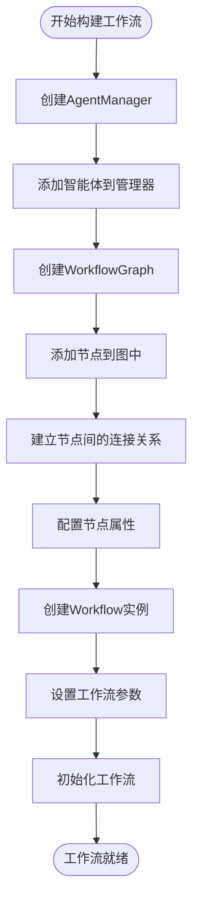

**章节来源**
- [WorkflowDemo.java](file://evox-examples/src/main/java/io/leavesfly/evox/examples/WorkflowDemo.java#L47-L95)

### 工作流执行机制

工作流的执行采用事件驱动的方式，通过状态机模式管理节点的生命周期：

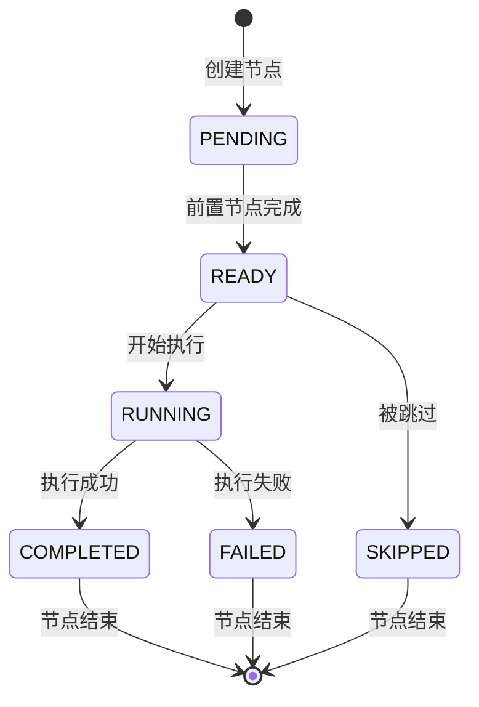

**章节来源**
- [WorkflowExecutor.java](file://evox-workflow/src/main/java/io/leavesfly/evox/workflow/execution/WorkflowExecutor.java#L123-L165)

## 节点类型详解

### 动作节点（ACTION）

动作节点是最基础的节点类型，用于执行具体的业务逻辑。它通常与智能体（Agent）配合使用，执行预定义的动作。

**特点**：
- 执行具体的业务操作
- 与智能体紧密集成
- 支持异步执行
- 提供详细的执行反馈

**章节来源**
- [WorkflowExecutor.java](file://evox-workflow/src/main/java/io/leavesfly/evox/workflow/execution/WorkflowExecutor.java#L182-L260)

### 决策节点（DECISION）

决策节点根据条件表达式选择不同的执行路径，是工作流中最重要的控制结构之一。

**条件表达式支持**：
- 布尔值判断：`true`、`false`
- 相等性比较：`==`、`!=`
- 数值比较：`>`、`<`、`>=`、`<=`
- 上下文变量访问：`context.variableName`

**分支处理策略**：
- 显式分支映射
- 默认分支处理
- 条件结果匹配

**章节来源**
- [WorkflowExecutor.java](file://evox-workflow/src/main/java/io/leavesfly/evox/workflow/execution/WorkflowExecutor.java#L263-L480)
- [DecisionNodeTest.java](file://evox-workflow/src/test/java/io/leavesfly/evox/workflow/DecisionNodeTest.java#L33-L347)

### 并行节点（PARALLEL）

并行节点允许同时执行多个子节点，支持不同的并发策略。

**并发策略**：
- **ALL**：等待所有子节点完成
- **ANY**：任意一个子节点完成即可
- **FIRST**：第一个完成的子节点

**实现特点**：
- 使用Reactor框架进行异步处理
- 支持嵌套并行结构
- 提供灵活的错误处理机制

**章节来源**
- [WorkflowExecutor.java](file://evox-workflow/src/main/java/io/leavesfly/evox/workflow/execution/WorkflowExecutor.java#L513-L631)
- [ParallelNodeTest.java](file://evox-workflow/src/test/java/io/leavesfly/evox/workflow/ParallelNodeTest.java#L33-L274)

### 循环节点（LOOP）

循环节点提供重复执行的能力，支持条件控制和迭代限制。

**配置参数**：
- 循环条件表达式
- 最大迭代次数
- 循环体节点

**执行流程**：
1. 检查循环条件
2. 执行循环体
3. 更新迭代计数
4. 决定是否继续循环

**章节来源**
- [WorkflowExecutor.java](file://evox-workflow/src/main/java/io/leavesfly/evox/workflow/execution/WorkflowExecutor.java#L672-L791)

### 子工作流节点（SUBWORKFLOW）

子工作流节点允许在一个工作流中嵌套另一个完整的工作流，实现复杂流程的模块化。

**映射机制**：
- 输入映射：父工作流数据传递给子工作流
- 输出映射：子工作流结果返回给父工作流

**章节来源**
- [WorkflowExecutor.java](file://evox-workflow/src/main/java/io/leavesfly/evox/workflow/execution/WorkflowExecutor.java#L792-L800)
- [SubWorkflowNodeTest.java](file://evox-workflow/src/test/java/io/leavesfly/evox/workflow/SubWorkflowNodeTest.java#L33-L266)

## Operator操作定义

### Operator基类

Operator类是工作流中可重用操作单元的基础抽象，提供了统一的操作接口和工具方法。

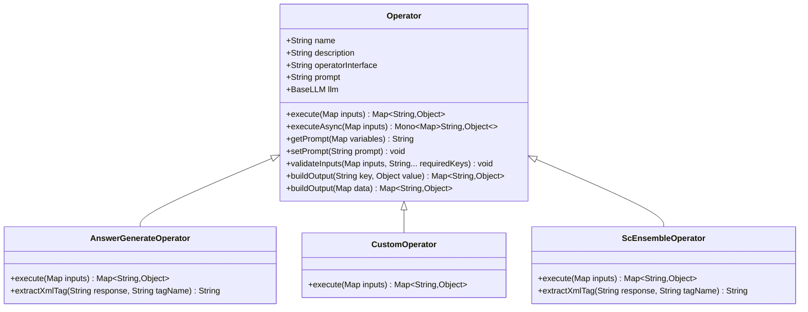

**图表来源**
- [Operator.java](file://evox-workflow/src/main/java/io/leavesfly/evox/workflow/operator/Operator.java#L18-L130)
- [AnswerGenerateOperator.java](file://evox-workflow/src/main/java/io/leavesfly/evox/workflow/operator/AnswerGenerateOperator.java#L18-L83)
- [CustomOperator.java](file://evox-workflow/src/main/java/io/leavesfly/evox/workflow/operator/CustomOperator.java#L15-L40)
- [ScEnsembleOperator.java](file://evox-workflow/src/main/java/io/leavesfly/evox/workflow/operator/ScEnsembleOperator.java#L19-L112)

**章节来源**
- [Operator.java](file://evox-workflow/src/main/java/io/leavesfly/evox/workflow/operator/Operator.java#L18-L130)

### AnswerGenerateOperator - 答案生成算子

答案生成算子专门用于生成逐步推理的过程和最终答案，支持XML格式的结构化输出。

**主要功能**：
- 生成详细的思考过程
- 提供最终答案
- 支持自定义提示词模板
- XML格式解析

**章节来源**
- [AnswerGenerateOperator.java](file://evox-workflow/src/main/java/io/leavesfly/evox/workflow/operator/AnswerGenerateOperator.java#L18-L83)

### CustomOperator - 自定义算子

自定义算子提供通用的文本生成能力，基于用户提供的指令和输入生成响应。

**特点**：
- 灵活的指令定制
- 支持多种输入格式
- 简洁的输出结构

**章节来源**
- [CustomOperator.java](file://evox-workflow/src/main/java/io/leavesfly/evox/workflow/operator/CustomOperator.java#L15-L40)

### ScEnsembleOperator - 自洽性集成算子

自洽性集成算子使用自洽性原则从多个解决方案中选择最一致的方案，提高决策质量。

**算法特点**：
- 多方案对比分析
- 自一致性评估
- XML格式的结构化输出

**章节来源**
- [ScEnsembleOperator.java](file://evox-workflow/src/main/java/io/leavesfly/evox/workflow/operator/ScEnsembleOperator.java#L19-L112)

## 执行上下文管理

### 上下文数据流转

WorkflowContext在整个工作流执行过程中负责数据的传递和状态管理：

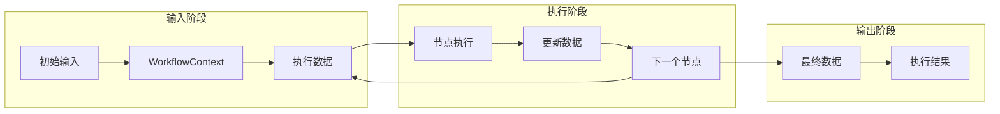

### 状态跟踪机制

系统提供了完整的状态跟踪功能，包括：

- **节点状态监控**：实时跟踪每个节点的执行状态
- **执行历史记录**：保存完整的执行轨迹
- **错误信息捕获**：详细的错误诊断信息
- **进度统计**：工作流执行进度的可视化

**章节来源**
- [WorkflowContext.java](file://evox-workflow/src/main/java/io/leavesfly/evox/workflow/execution/WorkflowContext.java#L15-L223)

## 完整示例

### 顺序工作流示例

以下是一个典型的顺序工作流示例，展示了数据处理的完整流程：

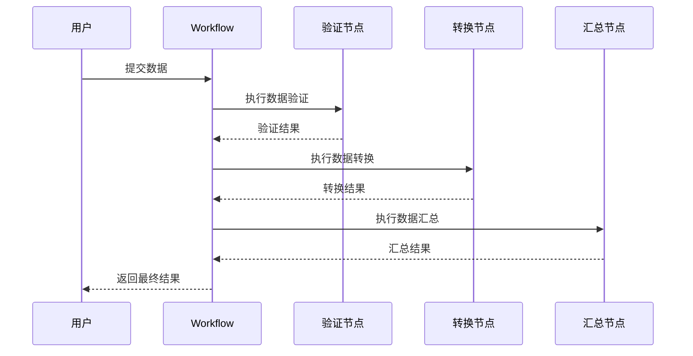

**章节来源**
- [WorkflowDemo.java](file://evox-examples/src/main/java/io/leavesfly/evox/examples/WorkflowDemo.java#L44-L106)

### 决策工作流示例

决策工作流根据输入数据的特征自动选择不同的处理路径：

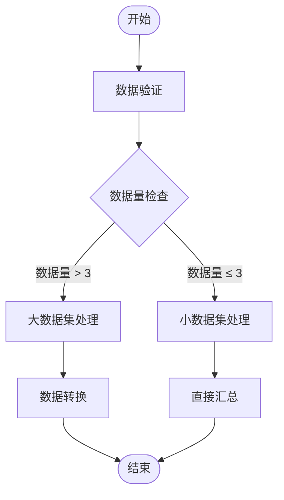

**章节来源**
- [WorkflowDemo.java](file://evox-examples/src/main/java/io/leavesfly/evox/examples/WorkflowDemo.java#L109-L193)

### 并行工作流示例

并行工作流同时执行多个独立的任务，提高整体效率：

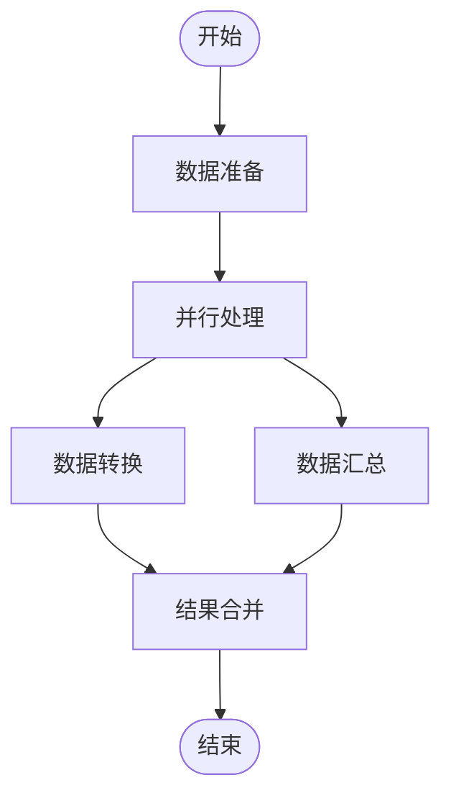

**章节来源**
- [WorkflowDemo.java](file://evox-examples/src/main/java/io/leavesfly/evox/examples/WorkflowDemo.java#L196-L263)

### 循环工作流示例

循环工作流适用于需要重复处理的场景：

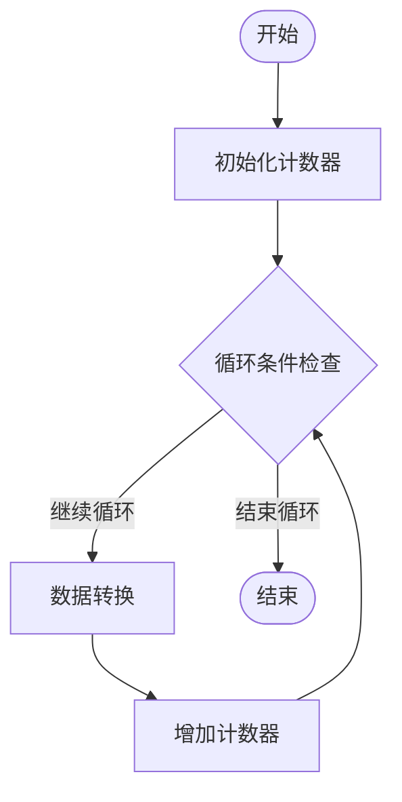

**章节来源**
- [WorkflowDemo.java](file://evox-examples/src/main/java/io/leavesfly/evox/examples/WorkflowDemo.java#L266-L324)

## 错误处理与性能优化

### 错误处理策略

系统提供了多层次的错误处理机制：

1. **节点级错误处理**：单个节点执行失败时的处理
2. **工作流级错误处理**：整个工作流执行失败时的恢复
3. **异常传播机制**：错误信息的逐层传递
4. **状态回滚功能**：执行失败时的状态恢复

### 性能优化策略

1. **异步执行**：使用Reactor框架实现非阻塞执行
2. **并行处理**：充分利用多核CPU资源
3. **内存管理**：合理的对象生命周期管理
4. **缓存机制**：重复计算结果的缓存利用

### 监控与调试

系统提供了丰富的监控和调试功能：

- **执行状态监控**：实时查看工作流执行状态
- **性能指标收集**：执行时间、资源使用情况
- **日志记录**：详细的执行日志和错误信息
- **可视化界面**：工作流结构和执行轨迹的图形化展示

## 总结

EvoX的工作流系统是一个功能强大、设计精良的任务编排引擎。它通过DAG结构实现了灵活的流程控制，支持多种节点类型和复杂的业务逻辑组合。系统的核心优势包括：

1. **模块化设计**：清晰的组件分离和职责划分
2. **高度可配置**：丰富的配置选项和扩展机制
3. **强类型安全**：完善的类型检查和错误处理
4. **高性能执行**：基于Reactor的异步执行框架
5. **易于调试**：完整的状态跟踪和日志记录

该系统特别适合构建复杂的业务流程自动化场景，能够有效简化开发工作，提高系统的可维护性和可扩展性。通过合理的设计和配置，可以满足从简单顺序流程到复杂分布式系统的各种需求。