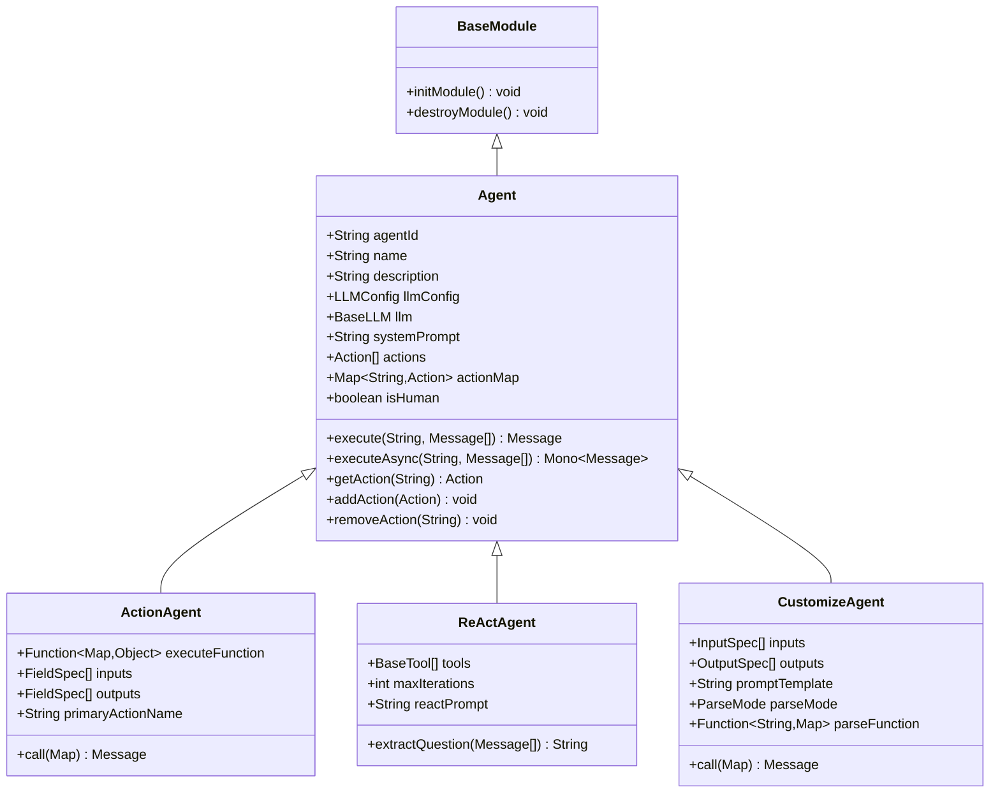
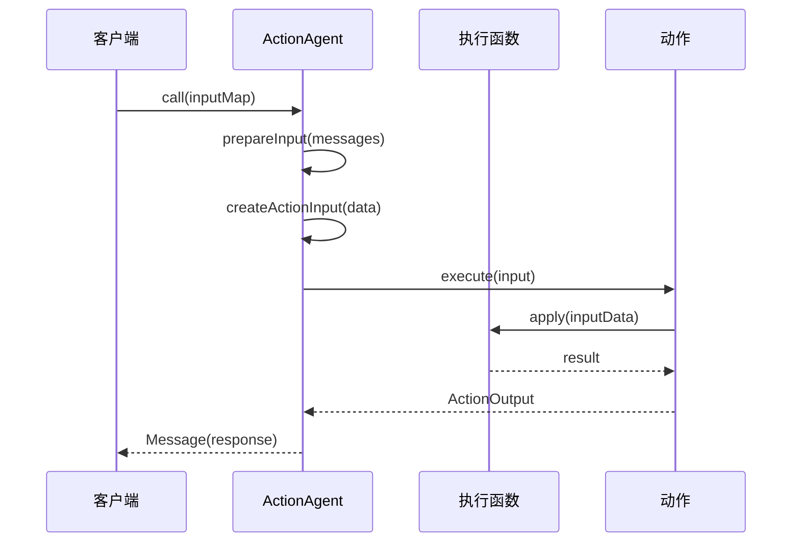
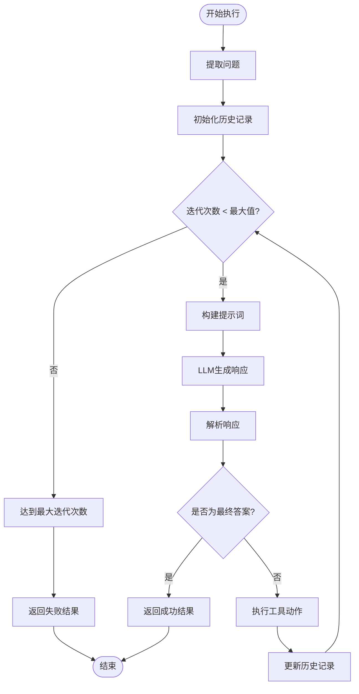
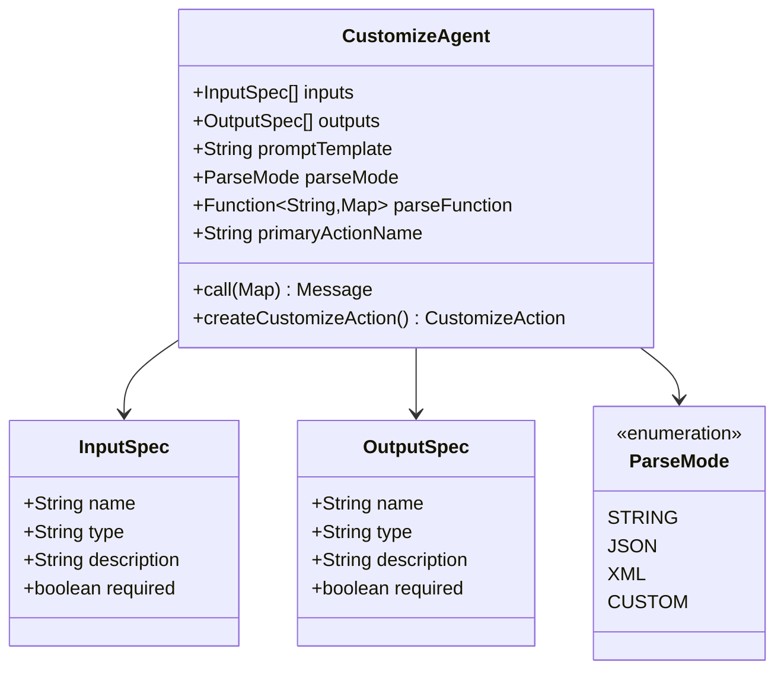
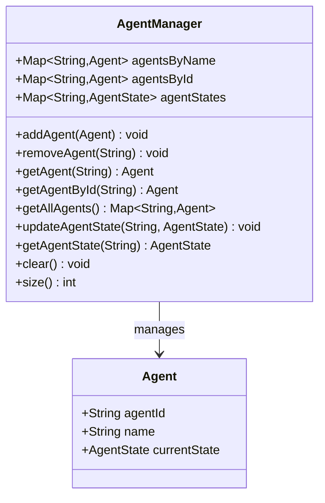
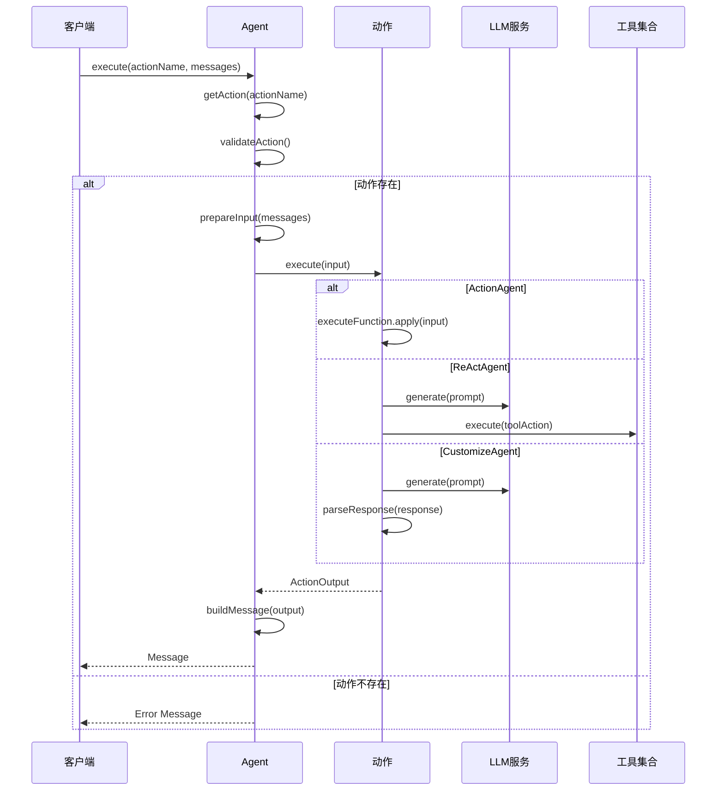
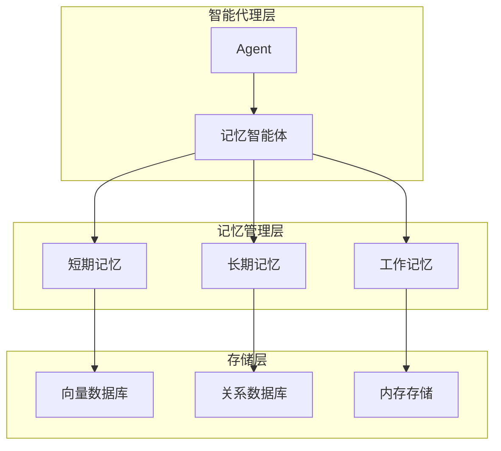
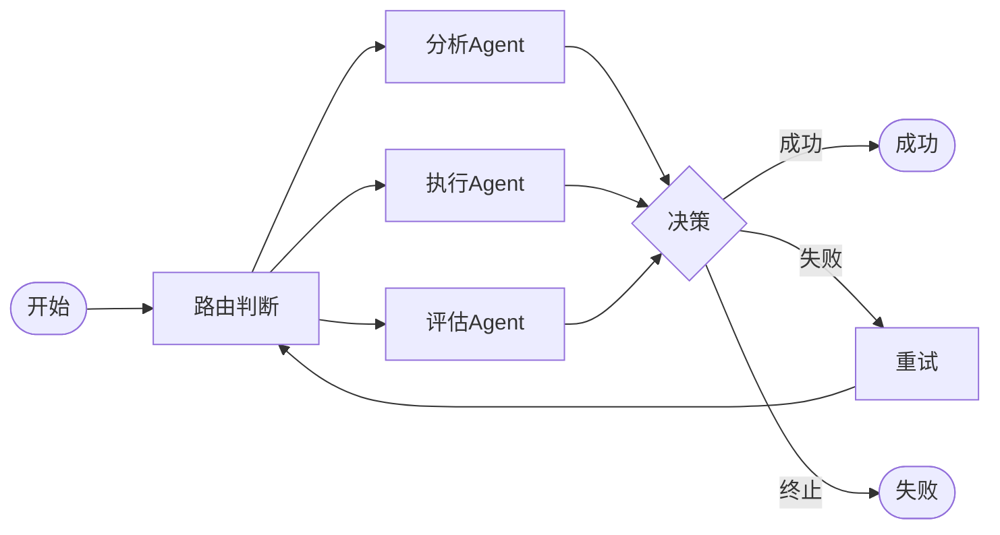
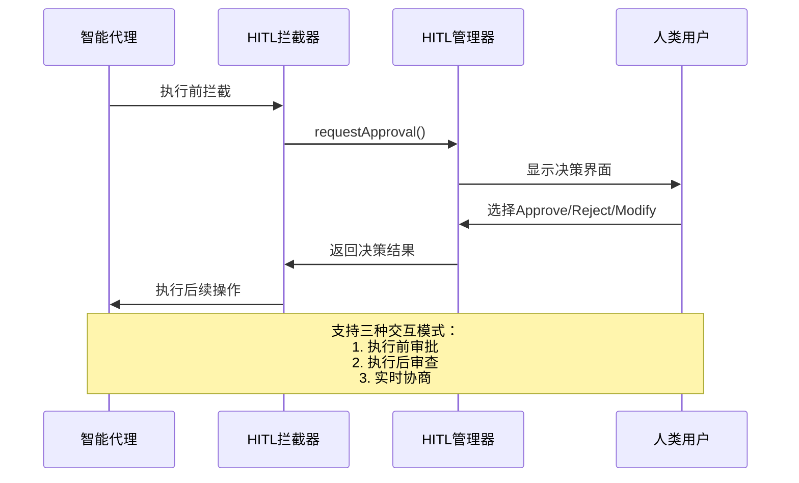

# 智能代理（Agent）

<cite>
**本文档中引用的文件**
- [Agent.java](file://evox-agents/src/main/java/io/leavesfly/evox/agents/base/Agent.java)
- [ActionAgent.java](file://evox-agents/src/main/java/io/leavesfly/evox/agents/action/ActionAgent.java)
- [ReActAgent.java](file://evox-agents/src/main/java/io/leavesfly/evox/agents/react/ReActAgent.java)
- [CustomizeAgent.java](file://evox-agents/src/main/java/io/leavesfly/evox/agents/customize/CustomizeAgent.java)
- [AgentState.java](file://evox-agents/src/main/java/io/leavesfly/evox/agents/manager/AgentState.java)
- [AgentManager.java](file://evox-agents/src/main/java/io/leavesfly/evox/agents/manager/AgentManager.java)
- [SpecializedAgentsTest.java](file://evox-agents/src/test/java/io/leavesfly/evox/agents/SpecializedAgentsTest.java)
- [CustomizeAgentExample.java](file://evox-examples/src/main/java/io/leavesfly/evox/examples/CustomizeAgentExample.java)
- [SpecializedAgentsExample.java](file://evox-examples/src/main/java/io/leavesfly/evox/examples/SpecializedAgentsExample.java)
- [HITLInterceptorAgent.java](file://evox-hitl/src/main/java/io/leavesfly/evox/hitl/HITLInterceptorAgent.java)
- [MemoryAgentExample.java](file://evox-examples/src/main/java/io/leavesfly/evox/examples/MemoryAgentExample.java)
- [ToolsExample.java](file://evox-examples/src/main/java/io/leavesfly/evox/examples/ToolsExample.java)
</cite>

## 目录
1. [简介](#简介)
2. [Agent基础架构](#agent基础架构)
3. [智能代理类型](#智能代理类型)
4. [Agent生命周期与状态管理](#agent生命周期与状态管理)
5. [智能代理的执行流程](#智能代理的执行流程)
6. [自定义代理开发](#自定义代理开发)
7. [与其他组件的集成](#与其他组件的集成)
8. [HITL人机协同机制](#hitl人机协同机制)
9. [最佳实践与扩展方式](#最佳实践与扩展方式)
10. [总结](#总结)

## 简介

EvoX智能代理（Agent）是系统的核心执行单元，负责接收Message输入、调用Action执行任务，并与大型语言模型（LLM）进行交互。Agent作为系统架构中的关键组件，提供了灵活的扩展机制和丰富的功能特性，支持多种应用场景和工作模式。

智能代理的设计理念基于模块化和可扩展性原则，通过统一的接口规范和标准化的执行流程，实现了不同类型的智能体之间的无缝协作。每个Agent都具备独立的状态管理、任务执行和结果反馈能力，同时能够与其他系统组件（如Memory、Tools、Workflow）进行深度集成。

## Agent基础架构

### Agent基类设计

Agent基类采用抽象类设计，提供了所有智能体共有的核心功能和接口规范。基类继承自BaseModule，确保了模块化的架构设计和生命周期管理。



**图表来源**
- [Agent.java](file://evox-agents/src/main/java/io/leavesfly/evox/agents/base/Agent.java#L28-L152)
- [ActionAgent.java](file://evox-agents/src/main/java/io/leavesfly/evox/agents/action/ActionAgent.java#L28-L230)
- [ReActAgent.java](file://evox-agents/src/main/java/io/leavesfly/evox/agents/react/ReActAgent.java#L31-L312)
- [CustomizeAgent.java](file://evox-agents/src/main/java/io/leavesfly/evox/agents/customize/CustomizeAgent.java#L31-L331)

### 核心属性与功能

Agent基类包含了智能体运行所需的核心属性：

- **唯一标识**：每个Agent都有唯一的agentId，用于系统内部识别和管理
- **配置信息**：包括名称、描述、系统提示词等元数据
- **LLM集成**：内置对大型语言模型的支持，可配置不同的LLM提供商
- **动作管理**：维护可用动作列表和动作映射表，支持动态添加和移除动作
- **人类标记**：区分智能体和人类用户的标识位

**章节来源**
- [Agent.java](file://evox-agents/src/main/java/io/leavesfly/evox/agents/base/Agent.java#L35-L76)

## 智能代理类型

EvoX提供了四种主要的智能代理类型，每种类型针对特定的应用场景进行了优化设计。

### ActionAgent：函数执行智能体

ActionAgent是最简单直接的智能代理类型，专门用于执行预定义的函数或逻辑，不依赖于LLM推理过程。



**图表来源**
- [ActionAgent.java](file://evox-agents/src/main/java/io/leavesfly/evox/agents/action/ActionAgent.java#L74-L113)

ActionAgent的核心特点：
- **直接函数执行**：通过executeFunction属性直接执行预定义的业务逻辑
- **字段规格验证**：支持输入输出字段的类型检查和必填验证
- **类型安全**：使用泛型确保输入输出数据的类型安全
- **快速响应**：无需LLM推理，执行效率高

**章节来源**
- [ActionAgent.java](file://evox-agents/src/main/java/io/leavesfly/evox/agents/action/ActionAgent.java#L28-L230)

### ReActAgent：推理行动智能体

ReActAgent实现了ReAct（Reasoning + Acting）模式，通过思考-行动-观察的循环来解决复杂问题。



**图表来源**
- [ReActAgent.java](file://evox-agents/src/main/java/io/leavesfly/evox/agents/react/ReActAgent.java#L159-L196)

ReActAgent的关键特性：
- **工具集成**：支持多种外部工具的调用和集成
- **迭代控制**：通过maxIterations参数控制推理深度
- **状态跟踪**：维护完整的思考-行动-观察历史
- **灵活提示**：可配置的ReAct提示模板

**章节来源**
- [ReActAgent.java](file://evox-agents/src/main/java/io/leavesfly/evox/agents/react/ReActAgent.java#L31-L312)

### CustomizeAgent：自定义智能体

CustomizeAgent提供了最大的灵活性，允许通过配置而非编程来创建专用的LLM驱动智能体。



**图表来源**
- [CustomizeAgent.java](file://evox-agents/src/main/java/io/leavesfly/evox/agents/customize/CustomizeAgent.java#L31-L331)

CustomizeAgent的优势：
- **零代码配置**：通过配置文件即可创建复杂的智能体
- **灵活解析**：支持多种输出解析模式（JSON、XML、字符串等）
- **输入输出规范**：提供严格的输入输出类型检查
- **模板化提示**：支持占位符替换的动态提示词

**章节来源**
- [CustomizeAgent.java](file://evox-agents/src/main/java/io/leavesfly/evox/agents/customize/CustomizeAgent.java#L31-L331)

## Agent生命周期与状态管理

### AgentState状态枚举

Agent系统通过AgentState枚举来管理智能体的生命周期状态，确保系统的稳定性和可预测性。

| 状态 | 描述 | 进入条件 | 离开条件 |
|------|------|----------|----------|
| IDLE | 空闲状态 | Agent初始化完成 | 开始执行任务 |
| BUSY | 忙碌状态 | 开始执行动作 | 动作执行完成 |
| WAITING | 等待状态 | 需要外部资源 | 资源可用 |
| COMPLETED | 完成状态 | 成功执行所有任务 | 重置Agent |
| FAILED | 失败状态 | 执行过程中发生错误 | 重试或修复 |

**章节来源**
- [AgentState.java](file://evox-agents/src/main/java/io/leavesfly/evox/agents/manager/AgentState.java#L8-L34)

### AgentManager管理器

AgentManager负责全局的智能体生命周期管理和状态监控，提供了完整的智能体管理功能。



**图表来源**
- [AgentManager.java](file://evox-agents/src/main/java/io/leavesfly/evox/agents/manager/AgentManager.java#L18-L136)

AgentManager的核心功能：
- **智能体注册**：支持智能体的动态添加和移除
- **状态同步**：实时更新和查询智能体状态
- **并发安全**：使用ConcurrentHashMap确保线程安全
- **批量操作**：支持批量获取和管理多个智能体

**章节来源**
- [AgentManager.java](file://evox-agents/src/main/java/io/leavesfly/evox/agents/manager/AgentManager.java#L18-L136)

## 智能代理的执行流程

### execute方法的核心机制

所有Agent都必须实现execute方法，这是智能体执行任务的核心入口点。



**图表来源**
- [Agent.java](file://evox-agents/src/main/java/io/leavesfly/evox/agents/base/Agent.java#L103-L151)

### 异步执行支持

Agent提供了异步执行能力，通过executeAsync方法支持非阻塞的任务处理。

**章节来源**
- [Agent.java](file://evox-agents/src/main/java/io/leavesfly/evox/agents/base/Agent.java#L112-L114)

## 自定义代理开发

### CustomizeAgent开发指南

CustomizeAgent提供了最灵活的开发方式，通过配置而非编程来创建智能体。以下是开发CustomizeAgent的最佳实践：

#### 基本配置步骤

1. **定义智能体基本信息**
   - 设置名称和描述
   - 配置LLM参数
   - 设定系统提示词

2. **定义输入输出规格**
   - 明确输入字段类型和约束
   - 规范输出结构和格式
   - 设置字段的必填属性

3. **配置提示模板**
   - 使用占位符动态替换参数
   - 设计清晰的问题引导
   - 考虑上下文信息的利用

#### 高级配置选项

- **解析模式选择**：根据输出格式选择合适的解析模式（JSON、XML、字符串）
- **自定义解析函数**：对于复杂输出格式，可以提供自定义解析逻辑
- **工具集成**：在ReActAgent中集成外部工具

**章节来源**
- [CustomizeAgentExample.java](file://evox-examples/src/main/java/io/leavesfly/evox/examples/CustomizeAgentExample.java#L18-L202)
- [SpecializedAgentsExample.java](file://evox-examples/src/main/java/io/leavesfly/evox/examples/SpecializedAgentsExample.java#L108-L141)

### ActionAgent开发示例

ActionAgent适合需要直接执行业务逻辑的场景，开发时需要注意：

- **函数设计**：确保执行函数的纯函数性质
- **输入验证**：在函数内部进行必要的参数验证
- **异常处理**：妥善处理可能的异常情况
- **性能考虑**：避免在函数中执行耗时操作

**章节来源**
- [SpecializedAgentsExample.java](file://evox-examples/src/main/java/io/leavesfly/evox/examples/SpecializedAgentsExample.java#L48-L103)

## 与其他组件的集成

### Memory记忆系统集成

智能代理可以与Memory系统深度集成，实现上下文感知和长期记忆管理。



**图表来源**
- [MemoryAgentExample.java](file://evox-examples/src/main/java/io/leavesfly/evox/examples/MemoryAgentExample.java#L48-L94)

### Tools工具系统集成

智能代理可以无缝集成各种工具，扩展其功能边界。

| 工具类型 | 应用场景 | 集成方式 | 注意事项 |
|----------|----------|----------|----------|
| 文件系统工具 | 文档处理、数据存储 | 直接调用 | 权限控制 |
| HTTP客户端工具 | API调用、数据获取 | 异步执行 | 错误处理 |
| 搜索工具 | 信息检索 | 工具链组合 | 结果过滤 |
| 计算器工具 | 数值计算 | 内置函数 | 精度控制 |
| 浏览器工具 | 网页抓取 | 外部进程 | 超时处理 |

**章节来源**
- [ToolsExample.java](file://evox-examples/src/main/java/io/leavesfly/evox/examples/ToolsExample.java#L1-L287)

### Workflow工作流集成

智能代理可以作为工作流中的节点，参与复杂的任务编排。



**图表来源**
- [SpecializedAgentsExample.java](file://evox-examples/src/main/java/io/leavesfly/evox/examples/SpecializedAgentsExample.java#L144-L231)

## HITL人机协同机制

### HITLInterceptorAgent拦截器

HITL（Human-in-the-Loop）机制为智能代理提供了人工干预的能力，在关键决策点引入人类监督。



**图表来源**
- [HITLInterceptorAgent.java](file://evox-hitl/src/main/java/io/leavesfly/evox/hitl/HITLInterceptorAgent.java#L48-L133)

### HITL决策机制

HITL系统提供了完整的决策流程，支持多种交互模式：

| 决策类型 | 描述 | 应用场景 | 安全级别 |
|----------|------|----------|----------|
| APPROVE | 直接批准 | 常规操作 | 低风险 |
| REJECT | 拒绝执行 | 风险操作 | 中风险 |
| MODIFY | 修改内容 | 需要调整 | 高风险 |
| CONTINUE | 继续执行 | 等待确认 | 低风险 |

### 集成配置示例

```java
// 配置HITL拦截器
HITLInterceptorAgent interceptor = HITLInterceptorAgent.builder()
    .name("SafetyChecker")
    .targetAgentName("ContentGenerator")
    .targetActionName("generate_content")
    .interactionType(HITLInteractionType.APPROVE_REJECT)
    .mode(HITLMode.PRE_EXECUTION)
    .hitlManager(hitlManager)
    .build();
```

**章节来源**
- [HITLInterceptorAgent.java](file://evox-hitl/src/main/java/io/leavesfly/evox/hitl/HITLInterceptorAgent.java#L48-L133)

## 最佳实践与扩展方式

### 性能优化建议

1. **缓存策略**：合理使用LLM响应缓存，减少重复计算
2. **并发控制**：限制同时执行的智能体数量，避免资源竞争
3. **内存管理**：及时清理不再需要的记忆和中间结果
4. **超时设置**：为长时间运行的操作设置合理的超时时间

### 扩展开发指南

1. **继承Agent基类**：遵循统一的接口规范
2. **实现execute方法**：提供具体的执行逻辑
3. **状态管理**：正确更新Agent状态
4. **异常处理**：完善的错误处理机制
5. **测试覆盖**：编写全面的单元测试

### 监控与调试

- **日志记录**：详细的执行日志和错误信息
- **性能指标**：响应时间和成功率统计
- **状态监控**：实时查看智能体状态
- **调试工具**：提供调试和诊断功能

## 总结

EvoX智能代理系统通过精心设计的架构和丰富的功能特性，为开发者提供了强大而灵活的智能体开发平台。系统支持多种类型的智能代理，从简单的函数执行到复杂的推理行动，满足不同应用场景的需求。

Agent的模块化设计确保了系统的可扩展性和可维护性，而完善的生命周期管理和状态控制机制保证了系统的稳定性。与Memory、Tools、Workflow等组件的深度集成，使得智能代理能够参与复杂的业务流程和任务编排。

HITL人机协同机制的引入，为人机混合智能提供了可行的解决方案，在保证自动化效率的同时，确保了系统的安全性和可控性。

通过CustomizeAgent提供的零代码配置能力，降低了智能体开发的门槛，使业务人员也能够快速创建符合需求的专用智能体。这种设计理念体现了EvoX系统"让智能更易用"的核心价值主张。