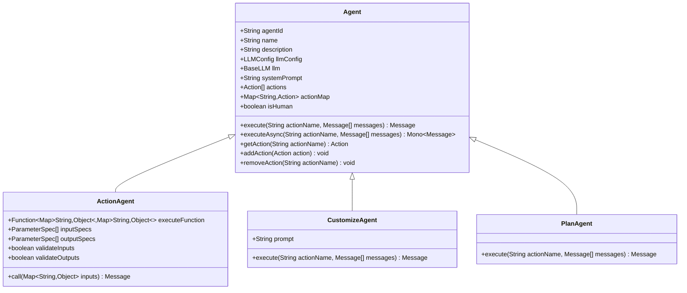
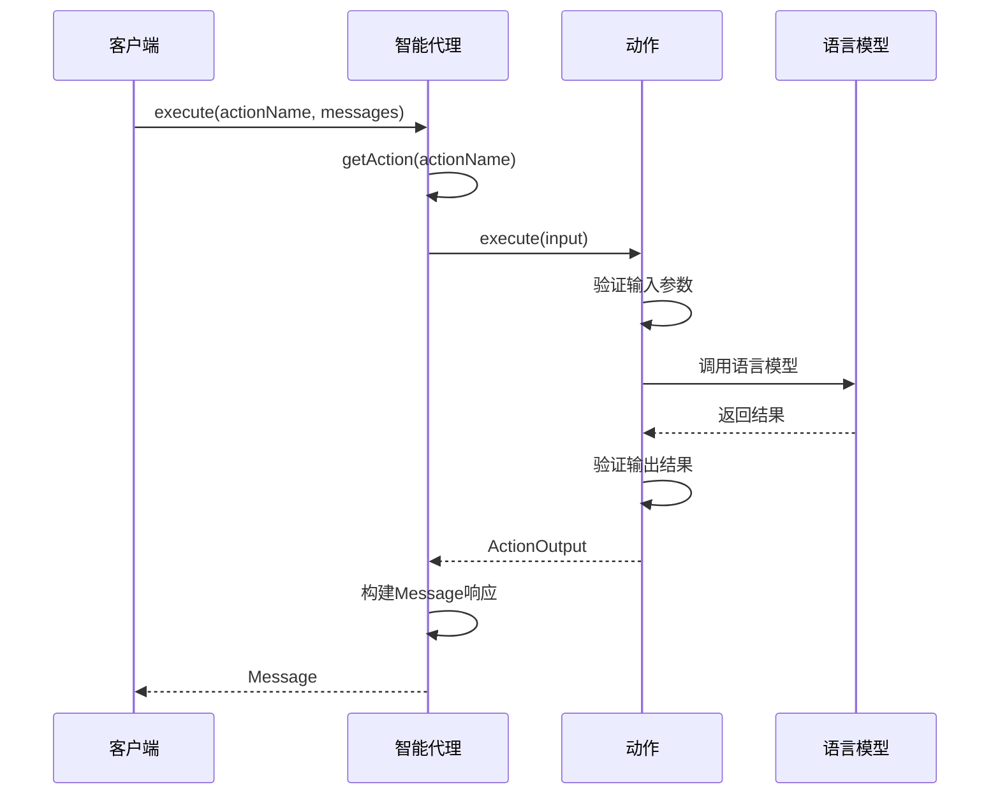
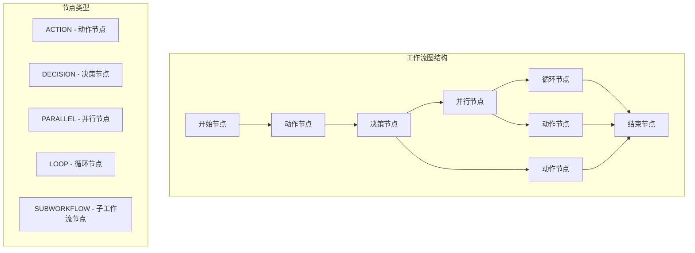
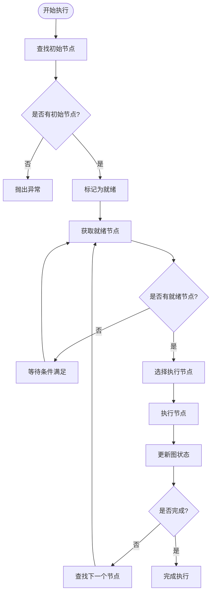
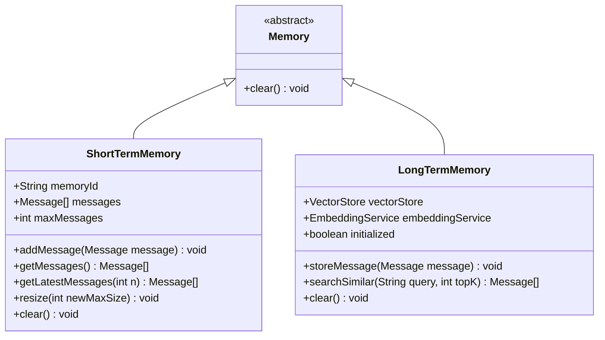
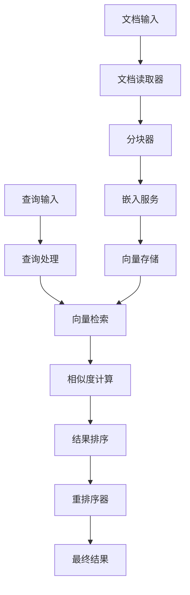
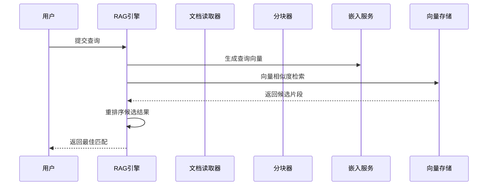
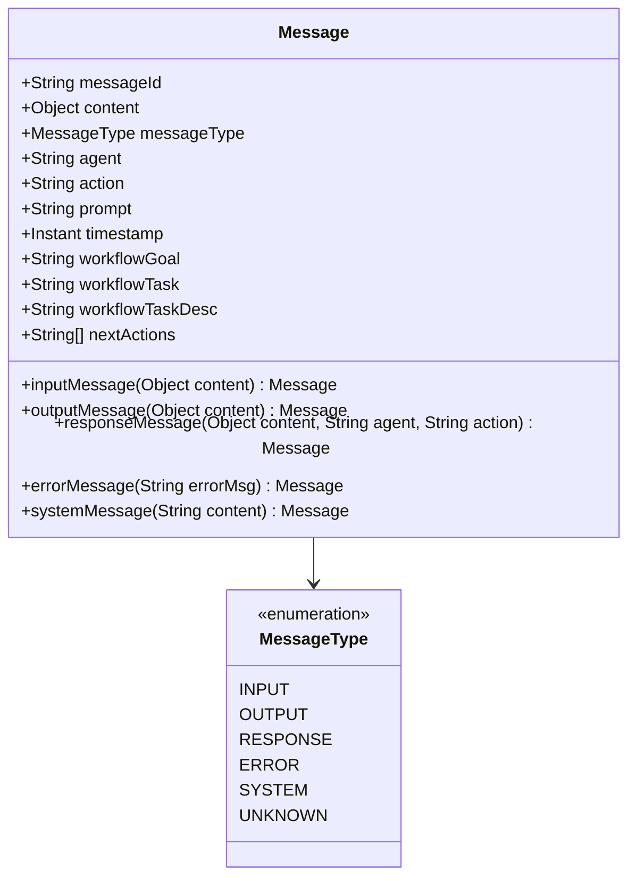
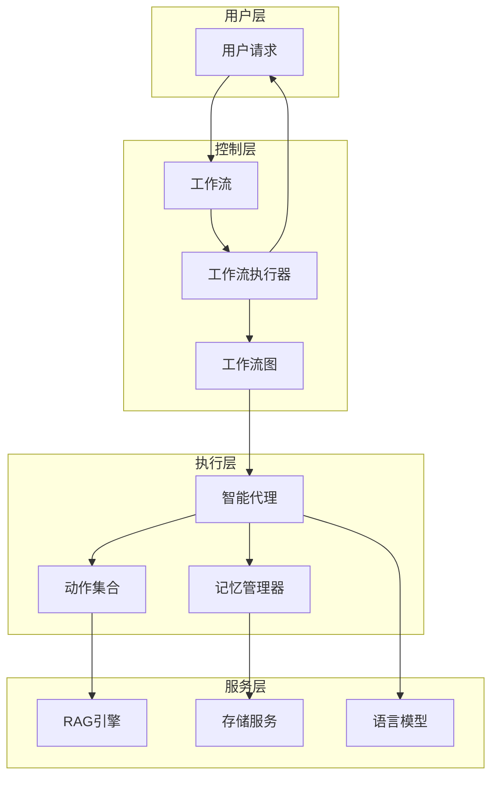
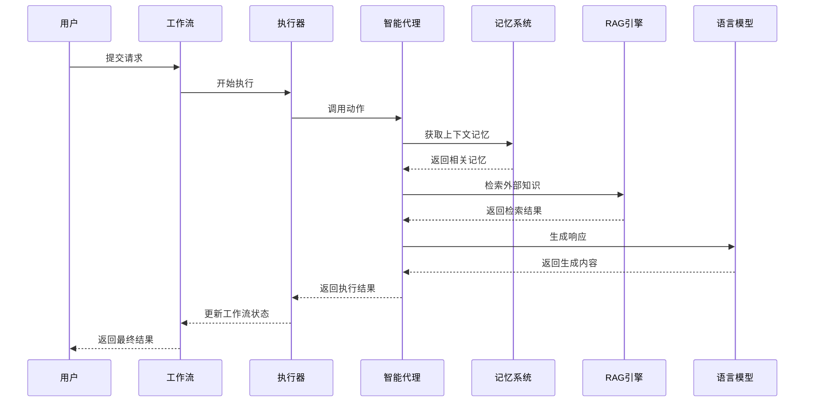

# 核心概念

<cite>
**本文档引用的文件**
- [Agent.java](file://evox-agents/src/main/java/io/leavesfly/evox/agents/base/Agent.java)
- [Workflow.java](file://evox-workflow/src/main/java/io/leavesfly/evox/workflow/base/Workflow.java)
- [WorkflowGraph.java](file://evox-workflow/src/main/java/io/leavesfly/evox/workflow/graph/WorkflowGraph.java)
- [WorkflowExecutor.java](file://evox-workflow/src/main/java/io/leavesfly/evox/workflow/execution/WorkflowExecutor.java)
- [Memory.java](file://evox-memory/src/main/java/io/leavesfly/evox/memory/base/Memory.java)
- [ShortTermMemory.java](file://evox-memory/src/main/java/io/leavesfly/evox/memory/shortterm/ShortTermMemory.java)
- [LongTermMemory.java](file://evox-memory/src/main/java/io/leavesfly/evox/memory/longterm/LongTermMemory.java)
- [RAGEngine.java](file://evox-rag/src/main/java/io/leavesfly/evox/rag/RAGEngine.java)
- [Message.java](file://evox-core/src/main/java/io/leavesfly/evox/core/message/Message.java)
- [Action.java](file://evox-actions/src/main/java/io/leavesfly/evox/actions/base/Action.java)
- [ActionAgentExample.java](file://evox-examples/src/main/java/io/leavesfly/evox/examples/ActionAgentExample.java)
- [WorkflowDemo.java](file://evox-examples/src/main/java/io/leavesfly/evox/examples/WorkflowDemo.java)
- [MemoryAgentExample.java](file://evox-examples/src/main/java/io/leavesfly/evox/examples/MemoryAgentExample.java)
</cite>

## 目录
1. [简介](#简介)
2. [智能代理（Agent）架构](#智能代理agent架构)
3. [工作流（Workflow）编排](#工作流workflow编排)
4. [记忆管理系统](#记忆管理系统)
5. [RAG检索增强生成引擎](#rag检索增强生成引擎)
6. [消息传递机制](#消息传递机制)
7. [组件协作](#组件协作)
8. [总结](#总结)

## 简介

EvoX是一个强大的AI应用框架，提供了完整的智能代理、工作流编排、记忆管理和检索增强生成能力。本文档深入解析EvoX的核心概念，展示各个组件如何协同工作以构建复杂的AI应用程序。

## 智能代理（Agent）架构

### Agent基类设计

智能代理是EvoX框架的核心组件，负责执行特定的任务和动作。Agent基类提供了统一的接口和基础设施。

**图表来源**
- [Agent.java](file://evox-agents/src/main/java/io/leavesfly/evox/agents/base/Agent.java#L26-L152)
- [ActionAgentExample.java](file://evox-examples/src/main/java/io/leavesfly/evox/examples/ActionAgentExample.java#L47-L258)

### 动作（Action）执行机制

动作是Agent执行的具体操作单元，每个动作都有明确的输入和输出规范。

**图表来源**
- [Agent.java](file://evox-agents/src/main/java/io/leavesfly/evox/agents/base/Agent.java#L96-L103)
- [Action.java](file://evox-actions/src/main/java/io/leavesfly/evox/actions/base/Action.java#L40-L71)

### 与LLM的集成

Agent可以与各种语言模型集成，提供强大的自然语言处理能力：

- **配置灵活性**：支持多种LLM提供商（OpenAI、阿里云、LiteLLM等）
- **提示词管理**：可配置系统提示词和动态上下文
- **异步执行**：支持异步动作执行，提高并发性能

**节来源**
- [Agent.java](file://evox-agents/src/main/java/io/leavesfly/evox/agents/base/Agent.java#L47-L60)
- [Action.java](file://evox-actions/src/main/java/io/leavesfly/evox/actions/base/Action.java#L36-L38)

## 工作流（Workflow）编排

### DAG（有向无环图）架构

工作流通过有向无环图（DAG）来组织和编排复杂的业务流程，支持多种节点类型和执行策略。

**图表来源**
- [WorkflowGraph.java](file://evox-workflow/src/main/java/io/leavesfly/evox/workflow/graph/WorkflowGraph.java#L1-L326)
- [WorkflowDemo.java](file://evox-examples/src/main/java/io/leavesfly/evox/examples/WorkflowDemo.java#L57-L324)

### 节点和边的关系管理

工作流图维护节点之间的依赖关系，确保正确的执行顺序：

**图表来源**
- [WorkflowExecutor.java](file://evox-workflow/src/main/java/io/leavesfly/evox/workflow/execution/WorkflowExecutor.java#L54-L89)
- [WorkflowGraph.java](file://evox-workflow/src/main/java/io/leavesfly/evox/workflow/graph/WorkflowGraph.java#L116-L131)

### 执行上下文管理

工作流执行过程中维护详细的执行上下文，包括：

- **状态跟踪**：记录每个节点的执行状态（PENDING、READY、RUNNING、COMPLETED、FAILED）
- **进度监控**：实时计算工作流执行进度
- **错误处理**：捕获和报告执行过程中的错误
- **资源管理**：管理Agent和Action的生命周期

**节来源**
- [Workflow.java](file://evox-workflow/src/main/java/io/leavesfly/evox/workflow/base/Workflow.java#L66-L88)
- [WorkflowExecutor.java](file://evox-workflow/src/main/java/io/leavesfly/evox/workflow/execution/WorkflowExecutor.java#L36-L49)

## 记忆管理系统

### 短期和长期记忆架构

EvoX提供了完整的记忆管理解决方案，支持短期和长期记忆的分离存储和访问。

**图表来源**
- [Memory.java](file://evox-memory/src/main/java/io/leavesfly/evox/memory/base/Memory.java#L1-L18)
- [ShortTermMemory.java](file://evox-memory/src/main/java/io/leavesfly/evox/memory/shortterm/ShortTermMemory.java#L1-L237)
- [LongTermMemory.java](file://evox-memory/src/main/java/io/leavesfly/evox/memory/longterm/LongTermMemory.java#L1-L155)

### 短期记忆实现

短期记忆用于存储工作流执行过程中的临时消息，具有以下特点：

- **容量限制**：可配置最大消息数量，超出时自动移除最旧的消息
- **快速访问**：支持高效的最新消息检索
- **分类查询**：可根据智能体或动作名称过滤消息
- **动态调整**：支持运行时调整存储容量

### 长期记忆实现

长期记忆使用向量存储技术，提供语义化的记忆检索能力：

- **向量化存储**：将消息内容转换为高维向量进行存储
- **语义检索**：基于向量相似度进行语义匹配
- **持久化**：支持多种向量数据库后端（FAISS、Chroma、Qdrant等）
- **元数据管理**：存储消息的完整元数据用于精确检索

**节来源**
- [ShortTermMemory.java](file://evox-memory/src/main/java/io/leavesfly/evox/memory/shortterm/ShortTermMemory.java#L44-L88)
- [LongTermMemory.java](file://evox-memory/src/main/java/io/leavesfly/evox/memory/longterm/LongTermMemory.java#L53-L121)

## RAG检索增强生成引擎

### 文档处理和向量化

RAG引擎提供了完整的检索增强生成解决方案，支持多种文档格式和检索策略。

**图表来源**
- [RAGEngine.java](file://evox-rag/src/main/java/io/leavesfly/evox/rag/RAGEngine.java#L66-L146)

### 检索策略

RAG引擎支持多种检索策略以适应不同的应用场景：

- **固定大小分块**：按固定字节数分割文档
- **语义分块**：基于语义相似度智能分割
- **混合检索**：结合多种检索策略提高准确性
- **重排序**：使用更精确的算法优化检索结果

### 语义检索机制

**图表来源**
- [RAGEngine.java](file://evox-rag/src/main/java/io/leavesfly/evox/rag/RAGEngine.java#L127-L156)

**节来源**
- [RAGEngine.java](file://evox-rag/src/main/java/io/leavesfly/evox/rag/RAGEngine.java#L1-L269)

## 消息传递机制

### 消息类型和结构

EvoX使用统一的消息格式在各个组件间传递信息，支持多种消息类型和丰富的元数据。

**图表来源**
- [Message.java](file://evox-core/src/main/java/io/leavesfly/evox/core/message/Message.java#L1-L136)

### 消息流转模式

消息在EvoX框架中按照特定的模式流转，确保信息的准确传递和状态同步：

- **输入消息**：工作流输入或用户请求
- **响应消息**：Agent或Action的执行结果
- **系统消息**：框架内部状态通知
- **错误消息**：异常情况的错误报告

**节来源**
- [Message.java](file://evox-core/src/main/java/io/leavesfly/evox/core/message/Message.java#L86-L134)

## 组件协作

### 整体架构协同

EvoX的各个组件通过精心设计的接口和消息传递机制实现无缝协作：

### 协作流程示例

以下是一个典型的EvoX应用执行流程：

**图表来源**
- [WorkflowDemo.java](file://evox-examples/src/main/java/io/leavesfly/evox/examples/WorkflowDemo.java#L42-L324)
- [WorkflowExecutor.java](file://evox-workflow/src/main/java/io/leavesfly/evox/workflow/execution/WorkflowExecutor.java#L213-L237)

### 性能优化策略

EvoX在设计时考虑了多种性能优化策略：

- **异步执行**：支持异步动作执行，提高并发性能
- **缓存机制**：智能缓存频繁访问的数据和计算结果
- **资源池化**：复用LLM连接和计算资源
- **流式处理**：支持流式数据处理，减少延迟

## 总结

EvoX框架通过其核心概念的有机结合，为构建复杂的AI应用程序提供了强大而灵活的基础设施：

1. **智能代理**提供了统一的任务执行接口，支持多种类型的智能体
2. **工作流编排**通过DAG架构实现了复杂业务流程的自动化
3. **记忆管理**确保了上下文的连续性和知识的持久化
4. **RAG引擎**增强了系统的知识获取和推理能力
5. **消息传递**保证了组件间的可靠通信

这些核心概念相互协作，形成了一个完整的AI应用开发生态系统，使开发者能够专注于业务逻辑的实现，而不必担心底层的技术细节。通过这种模块化的设计，EvoX既保持了高度的灵活性，又确保了系统的稳定性和可扩展性。