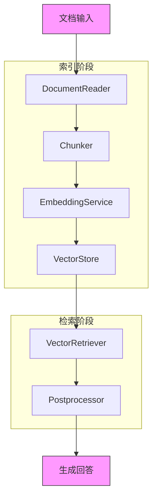
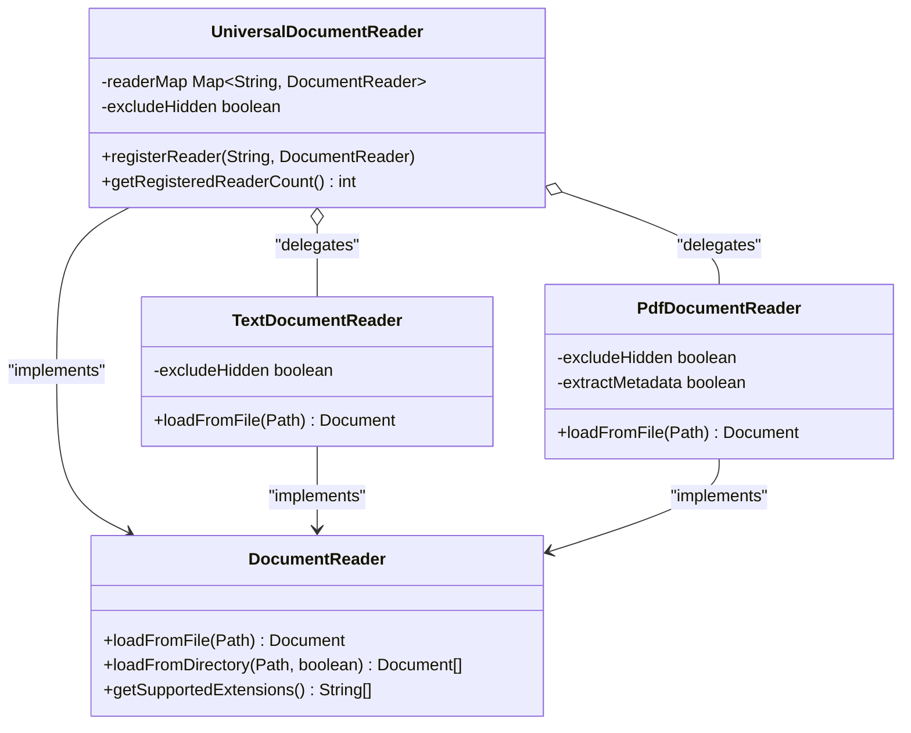
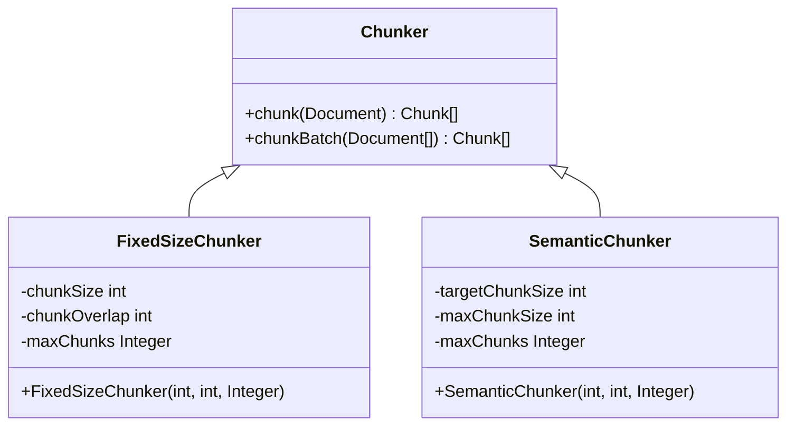
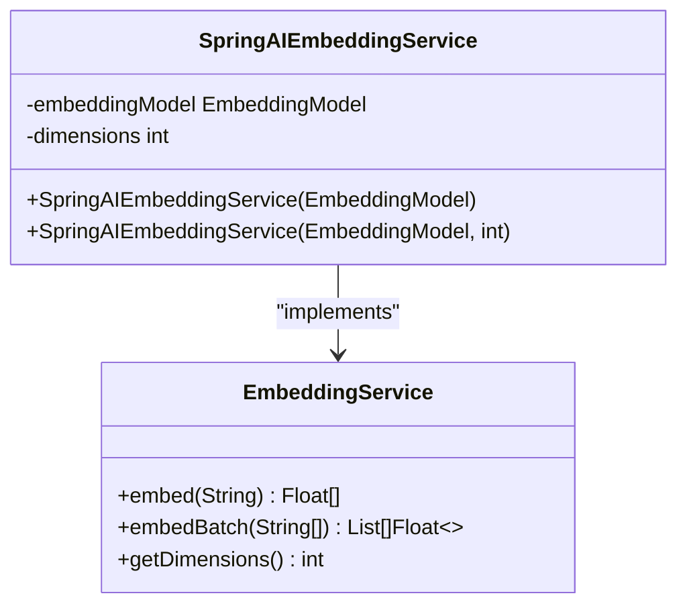
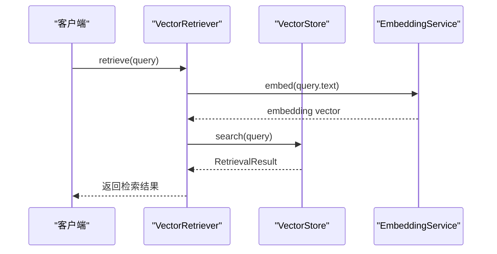
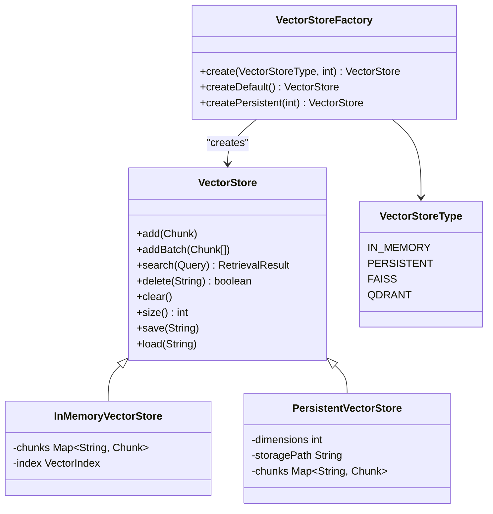
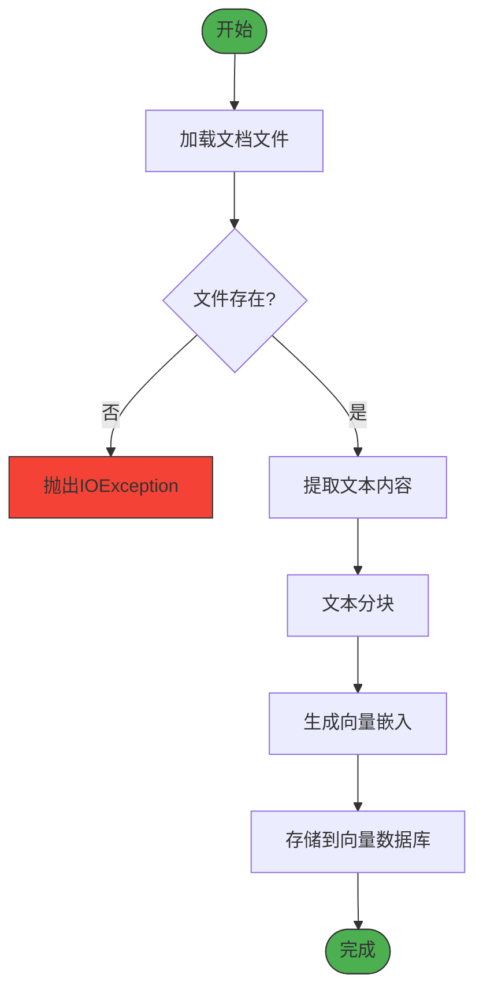
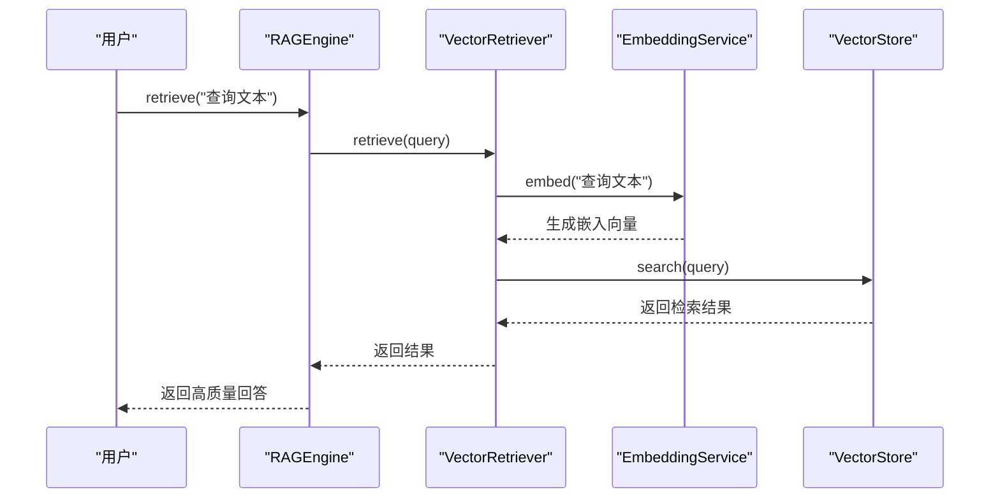
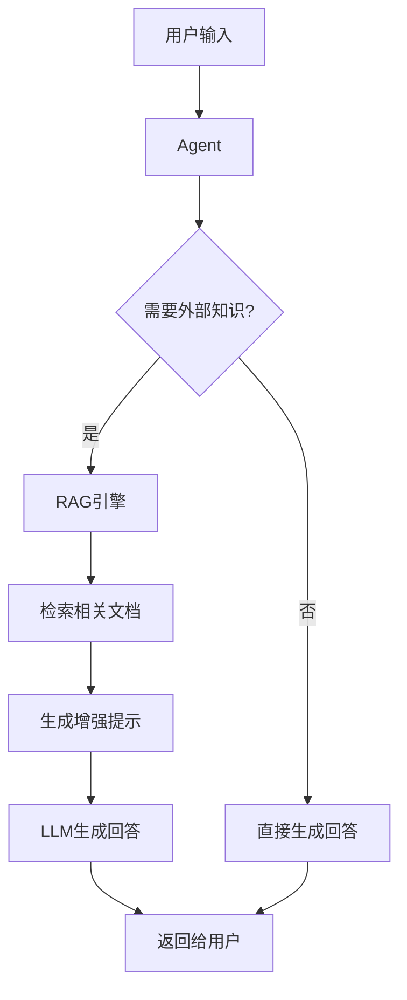

# 检索增强生成（RAG）

<cite>
**本文档引用的文件**   
- [RAGEngine.java](file://evox-rag/src/main/java/io/leavesfly/evox/rag/RAGEngine.java)
- [RAGConfig.java](file://evox-rag/src/main/java/io/leavesfly/evox/rag/config/RAGConfig.java)
- [Chunker.java](file://evox-rag/src/main/java/io/leavesfly/evox/rag/chunker/Chunker.java)
- [SemanticChunker.java](file://evox-rag/src/main/java/io/leavesfly/evox/rag/chunker/SemanticChunker.java)
- [FixedSizeChunker.java](file://evox-rag/src/main/java/io/leavesfly/evox/rag/chunker/FixedSizeChunker.java)
- [EmbeddingService.java](file://evox-rag/src/main/java/io/leavesfly/evox/rag/embedding/EmbeddingService.java)
- [SpringAIEmbeddingService.java](file://evox-rag/src/main/java/io/leavesfly/evox/rag/embedding/SpringAIEmbeddingService.java)
- [VectorRetriever.java](file://evox-rag/src/main/java/io/leavesfly/evox/rag/retriever/VectorRetriever.java)
- [VectorStore.java](file://evox-rag/src/main/java/io/leavesfly/evox/rag/vectorstore/VectorStore.java)
- [VectorStoreFactory.java](file://evox-rag/src/main/java/io/leavesfly/evox/rag/vectorstore/VectorStoreFactory.java)
- [Document.java](file://evox-rag/src/main/java/io/leavesfly/evox/rag/schema/Document.java)
- [Chunk.java](file://evox-rag/src/main/java/io/leavesfly/evox/rag/schema/Chunk.java)
- [UniversalDocumentReader.java](file://evox-rag/src/main/java/io/leavesfly/evox/rag/reader/UniversalDocumentReader.java)
- [Postprocessor.java](file://evox-rag/src/main/java/io/leavesfly/evox/rag/postprocessor/Postprocessor.java)
</cite>

## 目录
1. [引言](#引言)
2. [RAG引擎架构](#rag引擎架构)
3. [核心组件详解](#核心组件详解)
4. [语义分块策略](#语义分块策略)
5. [向量存储实现](#向量存储实现)
6. [知识库构建与查询](#知识库构建与查询)
7. [RAG与Agent集成](#rag与agent集成)
8. [性能调优建议](#性能调优建议)
9. [结论](#结论)

## 引言
检索增强生成（Retrieval-Augmented Generation, RAG）是EvoX框架中的核心功能之一，它通过将外部知识库与大语言模型相结合，显著提升了生成内容的准确性和相关性。本文档详细介绍了EvoX中RAG引擎的工作原理与实现细节，涵盖从文档读取、文本分块、向量嵌入到检索和重排序的完整流水线。通过理解这些组件的协同工作方式，开发者可以更好地利用RAG技术构建智能对话系统和知识密集型应用。

## RAG引擎架构
EvoX的RAG引擎采用模块化设计，由多个协同工作的组件构成，形成了一个完整的检索增强生成流水线。该架构的核心是`RAGEngine`类，它协调文档读取、文本分块、向量嵌入、向量检索和结果重排序等关键步骤。



**图示来源**
- [RAGEngine.java](file://evox-rag/src/main/java/io/leavesfly/evox/rag/RAGEngine.java#L30-L268)
- [DocumentReader.java](file://evox-rag/src/main/java/io/leavesfly/evox/rag/reader/DocumentReader.java#L13-L21)
- [Chunker.java](file://evox-rag/src/main/java/io/leavesfly/evox/rag/chunker/Chunker.java#L13-L21)

**本节来源**
- [RAGEngine.java](file://evox-rag/src/main/java/io/leavesfly/evox/rag/RAGEngine.java#L29-L268)

## 核心组件详解

### 文档读取器（DocumentReader）
文档读取器负责从各种文件格式中提取文本内容，是RAG流水线的入口点。EvoX提供了`UniversalDocumentReader`作为通用读取器，能够根据文件扩展名自动选择合适的读取策略。



**图示来源**
- [UniversalDocumentReader.java](file://evox-rag/src/main/java/io/leavesfly/evox/rag/reader/UniversalDocumentReader.java#L18-L156)
- [DocumentReader.java](file://evox-rag/src/main/java/io/leavesfly/evox/rag/reader/DocumentReader.java#L13-L21)

**本节来源**
- [UniversalDocumentReader.java](file://evox-rag/src/main/java/io/leavesfly/evox/rag/reader/UniversalDocumentReader.java#L18-L156)

### 文本分块器（Chunker）
文本分块器将文档分割成较小的语义单元，以便进行高效的向量化和检索。EvoX提供了两种主要的分块策略：固定大小分块和语义分块。



**图示来源**
- [Chunker.java](file://evox-rag/src/main/java/io/leavesfly/evox/rag/chunker/Chunker.java#L13-L21)
- [FixedSizeChunker.java](file://evox-rag/src/main/java/io/leavesfly/evox/rag/chunker/FixedSizeChunker.java#L16-L81)
- [SemanticChunker.java](file://evox-rag/src/main/java/io/leavesfly/evox/rag/chunker/SemanticChunker.java#L19-L139)

**本节来源**
- [Chunker.java](file://evox-rag/src/main/java/io/leavesfly/evox/rag/chunker/Chunker.java#L13-L21)
- [FixedSizeChunker.java](file://evox-rag/src/main/java/io/leavesfly/evox/rag/chunker/FixedSizeChunker.java#L16-L81)

### 向量嵌入服务（EmbeddingService）
向量嵌入服务负责将文本转换为高维向量表示，这是实现语义检索的关键步骤。EvoX通过`EmbeddingService`接口抽象了不同的嵌入模型实现。



**图示来源**
- [EmbeddingService.java](file://evox-rag/src/main/java/io/leavesfly/evox/rag/embedding/EmbeddingService.java#L10-L21)
- [SpringAIEmbeddingService.java](file://evox-rag/src/main/java/io/leavesfly/evox/rag/embedding/SpringAIEmbeddingService.java#L18-L102)

**本节来源**
- [EmbeddingService.java](file://evox-rag/src/main/java/io/leavesfly/evox/rag/embedding/EmbeddingService.java#L10-L21)
- [SpringAIEmbeddingService.java](file://evox-rag/src/main/java/io/leavesfly/evox/rag/embedding/SpringAIEmbeddingService.java#L18-L102)

### 向量检索器（VectorRetriever）
向量检索器执行基于相似度的语义搜索，从向量存储中检索与查询最相关的文档分块。



**图示来源**
- [VectorRetriever.java](file://evox-rag/src/main/java/io/leavesfly/evox/rag/retriever/VectorRetriever.java#L18-L98)
- [VectorStore.java](file://evox-rag/src/main/java/io/leavesfly/evox/rag/vectorstore/VectorStore.java#L14-L71)

**本节来源**
- [VectorRetriever.java](file://evox-rag/src/main/java/io/leavesfly/evox/rag/retriever/VectorRetriever.java#L18-L98)

## 语义分块策略
EvoX提供了两种主要的文本分块策略，以适应不同的应用场景和文档类型。

### 固定大小分块
固定大小分块器（`FixedSizeChunker`）将文档按指定的字符数进行分割，每个分块之间有重叠部分以保持上下文连贯性。这种策略简单高效，适用于结构化程度较高的文档。

**配置参数：**
- **chunkSize**: 分块大小（默认512字符）
- **chunkOverlap**: 分块重叠大小（默认50字符）
- **maxChunks**: 最大分块数量限制

### 语义分块
语义分块器（`SemanticChunker`）基于句子边界进行智能分块，保持语义完整性。它使用Java的`BreakIterator`来识别中英文句子边界，确保每个分块都是一个完整的语义单元。

**工作原理：**
1. 使用`BreakIterator.getSentenceInstance(Locale.CHINESE)`将文本分割为句子
2. 按目标大小（targetChunkSize）和最大大小（maxChunkSize）组合句子
3. 当添加下一个句子会超过最大大小时，创建新的分块
4. 确保每个分块尽可能接近目标大小，同时保持句子完整性

**优势：**
- 保持语义完整性，避免在句子中间切断
- 更适合长文档和复杂内容的处理
- 提高检索结果的相关性和可读性

**本节来源**
- [SemanticChunker.java](file://evox-rag/src/main/java/io/leavesfly/evox/rag/chunker/SemanticChunker.java#L19-L139)
- [FixedSizeChunker.java](file://evox-rag/src/main/java/io/leavesfly/evox/rag/chunker/FixedSizeChunker.java#L16-L81)

## 向量存储实现
EvoX提供了多种向量存储实现，以满足不同场景下的性能和持久化需求。

### 存储类型
EvoX通过`VectorStoreFactory`工厂类管理不同类型的向量存储：



**图示来源**
- [VectorStore.java](file://evox-rag/src/main/java/io/leavesfly/evox/rag/vectorstore/VectorStore.java#L14-L71)
- [VectorStoreFactory.java](file://evox-rag/src/main/java/io/leavesfly/evox/rag/vectorstore/VectorStoreFactory.java#L11-L60)
- [InMemoryVectorStore.java](file://evox-storage/src/main/java/io/leavesfly/evox/storage/vector/InMemoryVectorStore.java)
- [PersistentVectorStore.java](file://evox-rag/src/main/java/io/leavesfly/evox/rag/vectorstore/PersistentVectorStore.java)

**本节来源**
- [VectorStore.java](file://evox-rag/src/main/java/io/leavesfly/evox/rag/vectorstore/VectorStore.java#L14-L71)
- [VectorStoreFactory.java](file://evox-rag/src/main/java/io/leavesfly/evox/rag/vectorstore/VectorStoreFactory.java#L11-L60)

### 配置方式
向量存储的配置通过`RAGConfig`进行管理，支持多种存储类型：

```java
RAGConfig config = RAGConfig.builder()
    .retriever(RAGConfig.RetrieverConfig.builder()
        .vectorStoreType("faiss") // 可选: faiss, chroma, qdrant
        .build())
    .build();
```

目前EvoX支持以下存储类型：
- **IN_MEMORY**: 内存存储，适用于快速原型开发
- **PERSISTENT**: 持久化存储，支持保存和加载索引
- **FAISS**: Facebook的高效相似性搜索库（待实现）
- **QDRANT**: 高性能向量数据库（待实现）

## 知识库构建与查询

### 构建知识库
构建知识库的过程包括文档加载、分块和向量化三个主要步骤：



**代码示例：**
```java
// 创建RAG引擎
RAGEngine ragEngine = new RAGEngine(config, embeddingService, vectorStore);

// 从单个文件构建知识库
int chunks1 = ragEngine.indexFromFile(Paths.get("document.pdf"));

// 从目录批量构建知识库
int chunks2 = ragEngine.indexFromDirectory(Paths.get("documents/"), true);
```

### 执行语义查询
执行语义查询的过程包括查询向量化和相似度搜索两个步骤：



**代码示例：**
```java
// 执行语义查询
RetrievalResult result = ragEngine.retrieve("人工智能的发展趋势", 5);

// 获取检索到的文本
String combinedText = result.getCombinedText("\n\n");
```

**本节来源**
- [RAGEngine.java](file://evox-rag/src/main/java/io/leavesfly/evox/rag/RAGEngine.java#L236-L253)
- [VectorRetriever.java](file://evox-rag/src/main/java/io/leavesfly/evox/rag/retriever/VectorRetriever.java#L36-L78)

## RAG与Agent集成
RAG引擎可以与EvoX的Agent系统深度集成，为对话系统动态引入外部知识。

### 集成模式


**集成优势：**
- **动态知识注入**: 在对话过程中实时检索最新信息
- **上下文增强**: 将检索到的文档作为上下文提供给LLM
- **准确性提升**: 基于可靠来源生成回答，减少幻觉

### 实现方式
通过将RAG引擎作为Agent的工具或插件，可以在需要时调用检索功能：

```java
// 在Agent中集成RAG
public class KnowledgeAwareAgent extends Agent {
    private final RAGEngine ragEngine;
    
    public Response handleQuery(String query) {
        // 检查是否需要检索
        if (needsExternalKnowledge(query)) {
            RetrievalResult result = ragEngine.retrieve(query);
            // 将检索结果作为上下文
            String context = result.getCombinedText("\n");
            return generateResponseWithContext(query, context);
        } else {
            return generateDirectResponse(query);
        }
    }
}
```

**本节来源**
- [RAGEngine.java](file://evox-rag/src/main/java/io/leavesfly/evox/rag/RAGEngine.java#L127-L156)
- [Agent.java](file://evox-agents/src/main/java/io/leavesfly/evox/agents/base/Agent.java)

## 性能调优建议

### 索引优化
- **批量处理**: 使用`indexDocuments()`方法批量索引文档，减少I/O开销
- **合适的分块大小**: 根据文档类型选择合适的分块策略和大小
- **异步索引**: 对于大型文档集，考虑使用异步索引避免阻塞

### 缓存策略
- **嵌入缓存**: 缓存频繁查询的嵌入向量，避免重复计算
- **结果缓存**: 对常见查询的结果进行缓存，提高响应速度
- **内存管理**: 监控内存使用情况，及时清理不再需要的缓存

### 延迟控制
- **超时设置**: 为检索操作设置合理的超时时间
- **降级策略**: 当检索服务不可用时，提供降级的生成策略
- **并发控制**: 限制并发检索请求数量，避免资源耗尽

### 配置优化
```java
RAGConfig highQualityConfig = RAGConfig.createHighQuality();
// 使用高质量配置
```

**本节来源**
- [RAGConfig.java](file://evox-rag/src/main/java/io/leavesfly/evox/rag/config/RAGConfig.java#L197-L225)
- [RAGEngine.java](file://evox-rag/src/main/java/io/leavesfly/evox/rag/RAGEngine.java)

## 结论
EvoX的RAG引擎提供了一个完整且灵活的检索增强生成解决方案。通过模块化设计，它将文档读取、文本分块、向量嵌入、向量检索和结果重排序等组件有机地结合在一起，形成了一个高效的RAG流水线。开发者可以根据具体需求选择合适的分块策略、向量存储和嵌入模型，构建高质量的知识库。与Agent系统的深度集成使得RAG引擎能够为对话系统动态引入外部知识，显著提升生成内容的准确性和可靠性。通过合理的性能调优，可以进一步优化系统的响应速度和资源利用率，满足生产环境的需求。