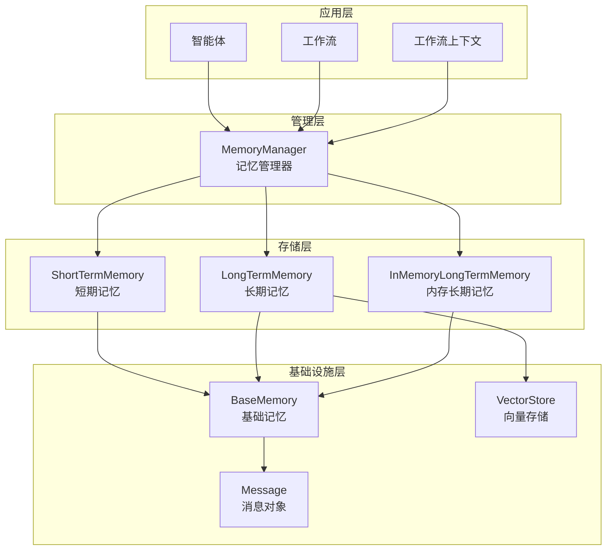
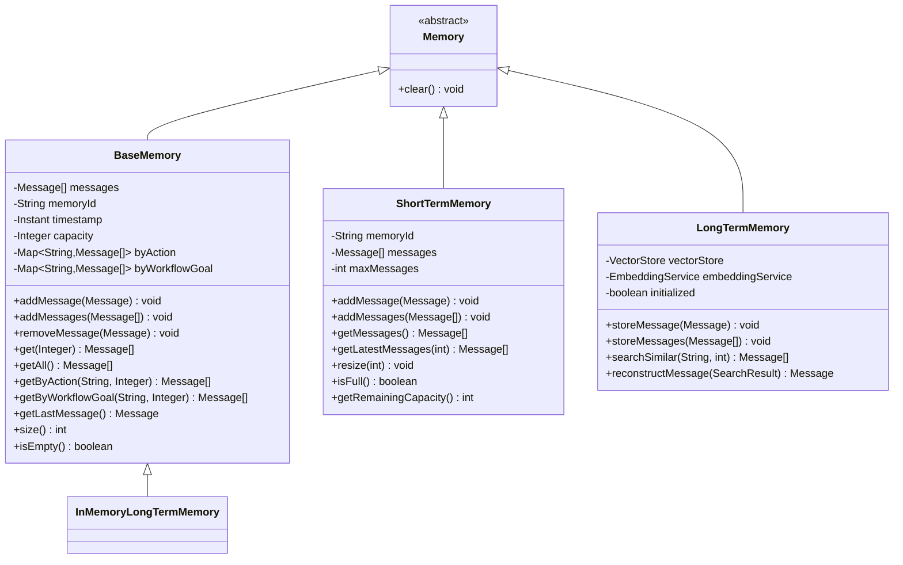
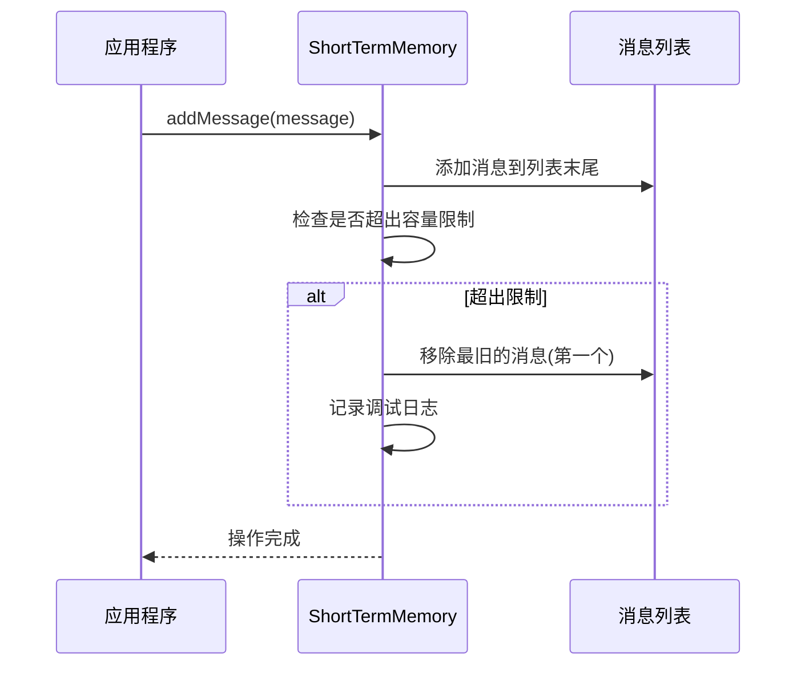
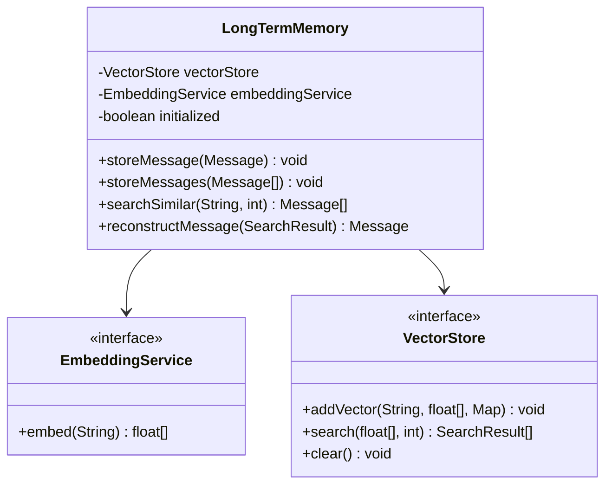
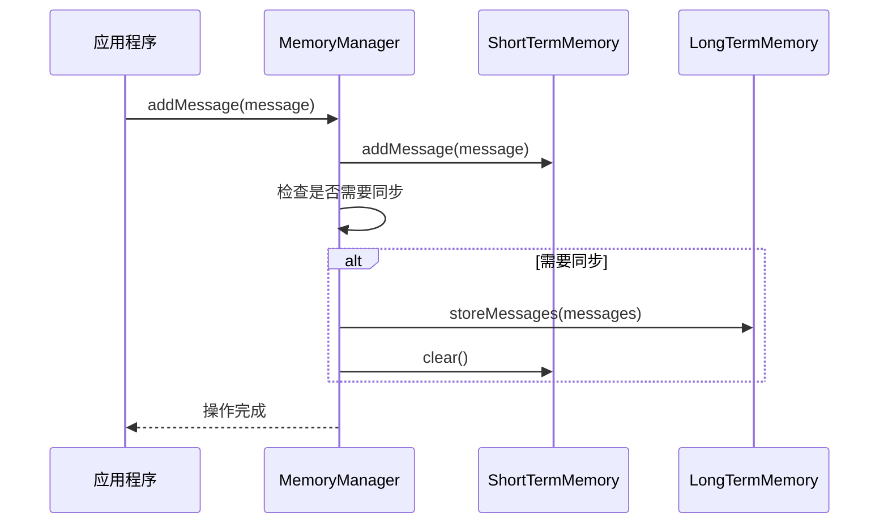
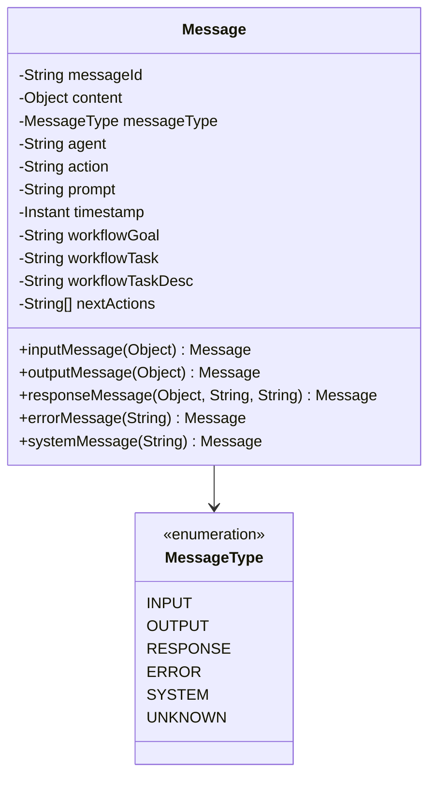
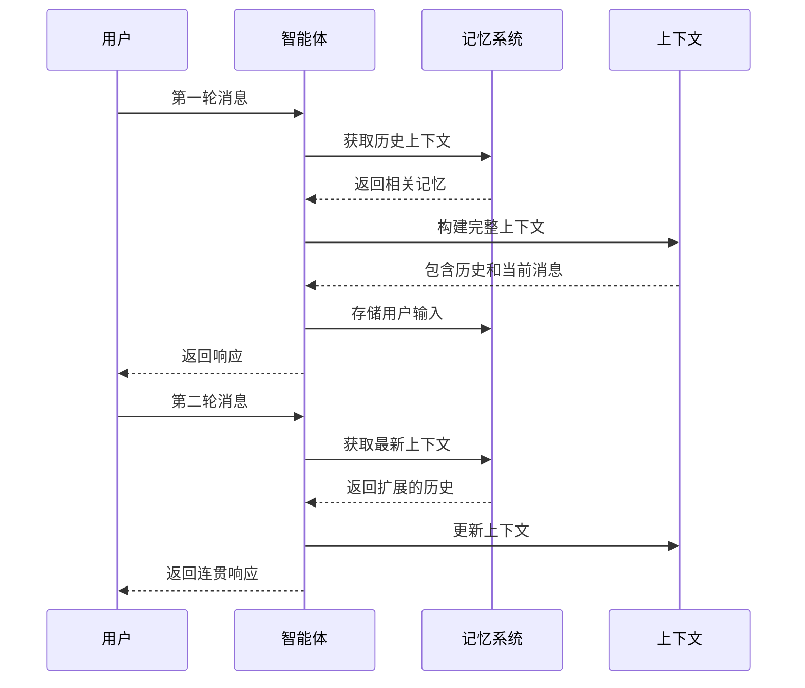
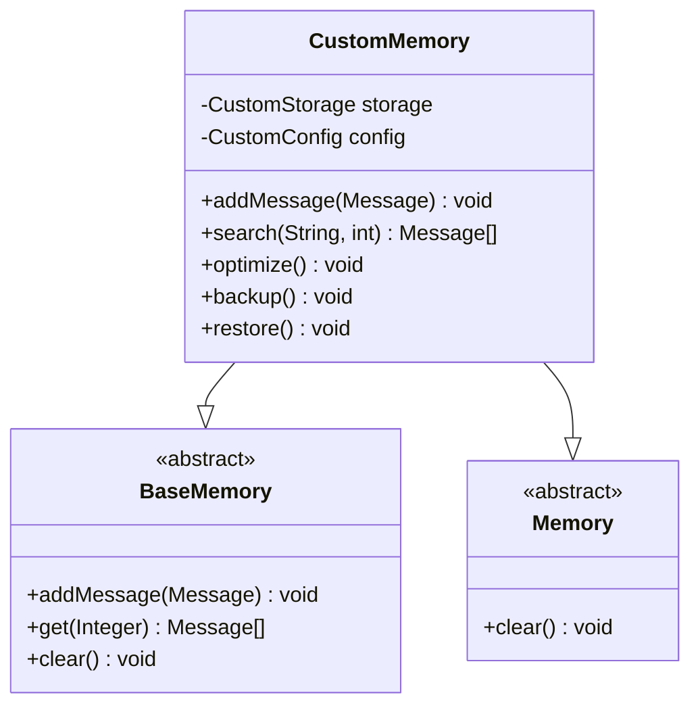

# 记忆管理（Memory）

<cite>
**本文档引用的文件**
- [Memory.java](file://evox-memory/src/main/java/io/leavesfly/evox/memory/base/Memory.java)
- [BaseMemory.java](file://evox-memory/src/main/java/io/leavesfly/evox/memory/base/BaseMemory.java)
- [MemoryManager.java](file://evox-memory/src/main/java/io/leavesfly/evox/memory/manager/MemoryManager.java)
- [ShortTermMemory.java](file://evox-memory/src/main/java/io/leavesfly/evox/memory/shortterm/ShortTermMemory.java)
- [LongTermMemory.java](file://evox-memory/src/main/java/io/leavesfly/evox/memory/longterm/LongTermMemory.java)
- [InMemoryLongTermMemory.java](file://evox-memory/src/main/java/io/leavesfly/evox/memory/longterm/InMemoryLongTermMemory.java)
- [MemoryTest.java](file://evox-memory/src/test/java/io/leavesfly/evox/memory/MemoryTest.java)
- [Message.java](file://evox-core/src/main/java/io/leavesfly/evox/core/message/Message.java)
- [WorkflowContext.java](file://evox-workflow/src/main/java/io/leavesfly/evox/workflow/execution/WorkflowContext.java)
</cite>

## 目录
1. [简介](#简介)
2. [系统架构概览](#系统架构概览)
3. [核心组件分析](#核心组件分析)
4. [短期记忆（ShortTermMemory）](#短期记忆shorttermmemory)
5. [长期记忆（LongTermMemory）](#长期记忆longtermmemory)
6. [记忆管理器（MemoryManager）](#记忆管理器memorymanager)
7. [消息存储与检索机制](#消息存储与检索机制)
8. [记忆系统与Agent集成](#记忆系统与agent集成)
9. [存储后端支持](#存储后端支持)
10. [自定义记忆策略开发指南](#自定义记忆策略开发指南)
11. [性能优化与最佳实践](#性能优化与最佳实践)
12. [总结](#总结)

## 简介

EvoX的记忆管理系统是一个多层次的记忆架构，旨在为智能体和工作流提供完整的记忆能力。该系统采用分层设计，包含短期记忆用于会话上下文维护，长期记忆用于持久化知识存储，并通过统一的管理器协调各层级的记忆操作。

记忆系统的核心设计理念是：
- **分层存储**：短期记忆处理实时交互，长期记忆保存重要知识
- **统一接口**：所有记忆实现都遵循相同的抽象接口
- **灵活扩展**：支持多种存储后端和自定义记忆策略
- **高效检索**：提供基于动作、工作流目标等多种检索方式

## 系统架构概览

EvoX记忆管理系统采用模块化架构，主要包含以下层次：

**图表来源**
- [MemoryManager.java](file://evox-memory/src/main/java/io/leavesfly/evox/memory/manager/MemoryManager.java#L1-L189)
- [ShortTermMemory.java](file://evox-memory/src/main/java/io/leavesfly/evox/memory/shortterm/ShortTermMemory.java#L1-L237)
- [LongTermMemory.java](file://evox-memory/src/main/java/io/leavesfly/evox/memory/longterm/LongTermMemory.java#L1-L155)

## 核心组件分析

### Memory接口抽象

Memory接口作为所有记忆实现的基础抽象，定义了记忆系统的核心行为：

**图表来源**
- [Memory.java](file://evox-memory/src/main/java/io/leavesfly/evox/memory/base/Memory.java#L11-L18)
- [BaseMemory.java](file://evox-memory/src/main/java/io/leavesfly/evox/memory/base/BaseMemory.java#L23-L290)
- [ShortTermMemory.java](file://evox-memory/src/main/java/io/leavesfly/evox/memory/shortterm/ShortTermMemory.java#L24-L237)
- [LongTermMemory.java](file://evox-memory/src/main/java/io/leavesfly/evox/memory/longterm/LongTermMemory.java#L21-L155)

**章节来源**
- [Memory.java](file://evox-memory/src/main/java/io/leavesfly/evox/memory/base/Memory.java#L1-L18)
- [BaseMemory.java](file://evox-memory/src/main/java/io/leavesfly/evox/memory/base/BaseMemory.java#L1-L290)

## 短期记忆（ShortTermMemory）

短期记忆专门用于维护会话上下文，存储工作流执行过程中的临时消息。它采用滑动窗口机制，确保内存使用效率。

### 设计特点

1. **滑动窗口机制**：当消息数量超过最大限制时，自动移除最旧的消息
2. **实时性**：专为实时交互设计，支持快速读写操作
3. **容量控制**：可通过配置限制最大消息数量
4. **多维度检索**：支持按智能体、动作等维度过滤消息

### 核心功能

短期记忆提供了丰富的操作接口：

- **消息添加**：支持单条和批量消息添加
- **容量管理**：自动处理容量超限时的消息清理
- **实时检索**：提供最新的N条消息获取功能
- **智能过滤**：支持按动作、智能体等条件筛选

### 实现细节

短期记忆采用简洁高效的实现策略：

**图表来源**
- [ShortTermMemory.java](file://evox-memory/src/main/java/io/leavesfly/evox/memory/shortterm/ShortTermMemory.java#L63-L74)

**章节来源**
- [ShortTermMemory.java](file://evox-memory/src/main/java/io/leavesfly/evox/memory/shortterm/ShortTermMemory.java#L1-L237)

## 长期记忆（LongTermMemory）

长期记忆负责持久化存储重要知识和历史记录，支持复杂的语义检索和知识管理。

### 设计理念

长期记忆采用向量存储技术，将消息内容转换为高维向量进行存储和检索：

1. **向量嵌入**：使用嵌入服务将文本内容转换为向量表示
2. **语义检索**：基于向量相似度进行语义匹配
3. **元数据管理**：保存完整的消息元数据用于重建
4. **持久化存储**：支持多种向量数据库后端

### 核心组件

**图表来源**
- [LongTermMemory.java](file://evox-memory/src/main/java/io/leavesfly/evox/memory/longterm/LongTermMemory.java#L21-L155)

### 检索机制

长期记忆支持两种检索模式：

1. **精确检索**：基于记忆ID的直接查找
2. **语义检索**：基于查询内容的相似度搜索

**章节来源**
- [LongTermMemory.java](file://evox-memory/src/main/java/io/leavesfly/evox/memory/longterm/LongTermMemory.java#L1-L155)

## 记忆管理器（MemoryManager）

MemoryManager是记忆系统的统一入口，负责协调短期记忆和长期记忆的操作。

### 协调机制

**图表来源**
- [MemoryManager.java](file://evox-memory/src/main/java/io/leavesfly/evox/memory/manager/MemoryManager.java#L73-L84)

### 主要功能

1. **统一接口**：为上层应用提供一致的记忆访问接口
2. **自动同步**：根据配置自动将短期记忆同步到长期记忆
3. **混合检索**：结合短期和长期记忆的结果
4. **容量管理**：监控和管理各层记忆的容量使用

### 配置选项

MemoryManager提供了灵活的配置选项：

- **自动同步阈值**：控制短期记忆达到多少消息时触发同步
- **长期记忆开关**：可选择是否启用长期记忆功能
- **容量限制**：为短期记忆设置最大容量

**章节来源**
- [MemoryManager.java](file://evox-memory/src/main/java/io/leavesfly/evox/memory/manager/MemoryManager.java#L1-L189)

## 消息存储与检索机制

### 消息结构

消息是记忆系统的基本单元，包含丰富的元数据：

**图表来源**
- [Message.java](file://evox-core/src/main/java/io/leavesfly/evox/core/message/Message.java#L25-L135)

### 检索策略

记忆系统提供了多种检索策略：

1. **时间序列检索**：按时间顺序获取最近的消息
2. **动作过滤**：根据执行的动作筛选消息
3. **工作流目标**：按工作流目标过滤相关消息
4. **语义搜索**：基于向量相似度的语义检索

### 过期策略

系统实现了多种过期策略：

- **容量限制**：当消息数量超过设定上限时，移除最旧的消息
- **时间过期**：支持基于时间的消息过期机制
- **手动清理**：提供显式的清理接口

**章节来源**
- [Message.java](file://evox-core/src/main/java/io/leavesfly/evox/core/message/Message.java#L1-L136)
- [BaseMemory.java](file://evox-memory/src/main/java/io/leavesfly/evox/memory/base/BaseMemory.java#L166-L288)

## 记忆系统与Agent集成

### 集成模式

记忆系统与Agent的集成主要体现在以下几个方面：

1. **上下文传递**：在Agent执行过程中传递记忆上下文
2. **状态维护**：保持Agent的执行状态和历史记录
3. **决策支持**：利用记忆信息辅助Agent决策

### 多轮对话保持

在多轮对话中，记忆系统确保上下文的一致性：

**图表来源**
- [WorkflowContext.java](file://evox-workflow/src/main/java/io/leavesfly/evox/workflow/execution/WorkflowContext.java#L79-L81)

### 工作流集成

记忆系统与工作流的集成体现在：

1. **执行历史**：记录工作流的执行步骤和状态
2. **中间结果**：保存工作流过程中的中间结果
3. **错误恢复**：基于历史记录进行错误恢复

**章节来源**
- [WorkflowContext.java](file://evox-workflow/src/main/java/io/leavesfly/evox/workflow/execution/WorkflowContext.java#L53-L222)

## 存储后端支持

### 向量数据库支持

长期记忆支持多种向量数据库后端：

| 存储类型 | 描述 | 适用场景 |
|---------|------|----------|
| InMemory | 内存存储 | 开发测试环境 |
| Persistent | 持久化存储 | 生产环境，需要数据持久化 |
| FAISS | Facebook AI相似度搜索库 | 高性能向量检索 |
| Qdrant | 分布式向量数据库 | 大规模向量存储和检索 |

### 数据库存储

系统还支持传统数据库作为存储后端：

- **PostgreSQL**：支持全文搜索和复杂查询
- **SQLite**：轻量级本地存储
- **MongoDB**：文档型数据库，适合非结构化数据

### 内存优化

对于高频访问的数据，系统提供了内存优化策略：

- **缓存机制**：热点数据缓存在内存中
- **预加载**：关键数据预先加载到内存
- **懒加载**：按需加载大型数据集

**章节来源**
- [InMemoryLongTermMemory.java](file://evox-memory/src/main/java/io/leavesfly/evox/memory/longterm/InMemoryLongTermMemory.java#L1-L331)

## 自定义记忆策略开发指南

### 实现自定义记忆类

开发者可以通过继承BaseMemory或实现Memory接口来自定义记忆策略：

### 开发最佳实践

1. **接口一致性**：确保自定义实现遵循标准接口规范
2. **性能优化**：针对特定场景优化存储和检索算法
3. **错误处理**：完善的异常处理和恢复机制
4. **测试覆盖**：提供全面的单元测试和集成测试

### 扩展点

系统提供了多个扩展点：

- **存储适配器**：自定义存储后端
- **检索算法**：自定义检索策略
- **索引策略**：自定义数据索引方式
- **压缩算法**：自定义数据压缩方案

## 性能优化与最佳实践

### 性能优化策略

1. **批量操作**：使用批量添加和检索提高效率
2. **异步处理**：将耗时的存储操作异步化
3. **连接池**：对数据库连接进行池化管理
4. **缓存策略**：合理使用缓存减少重复计算

### 内存管理

- **容量监控**：实时监控内存使用情况
- **垃圾回收**：及时释放不再使用的内存
- **分页加载**：大数据集采用分页加载策略

### 可扩展性设计

系统采用模块化设计，支持水平扩展：

- **分布式存储**：支持分布式向量数据库
- **负载均衡**：多实例负载均衡
- **读写分离**：分离读写操作提高性能

## 总结

EvoX的记忆管理系统通过分层架构实现了完整的记忆能力，从短期记忆的实时交互到长期记忆的知识持久化，再到统一的管理器协调，形成了一个完整而灵活的记忆生态系统。

### 核心优势

1. **分层设计**：清晰的职责分离，便于维护和扩展
2. **统一接口**：一致的API设计降低学习成本
3. **灵活配置**：丰富的配置选项适应不同场景需求
4. **高性能**：优化的存储和检索算法保证系统性能
5. **可扩展**：模块化设计支持自定义扩展

### 应用场景

- **智能客服**：维护对话上下文，提供连贯的服务体验
- **知识管理**：构建企业知识库，支持智能检索
- **个性化推荐**：基于用户历史记录提供个性化服务
- **教育培训**：记录学习过程，提供个性化指导

记忆系统作为EvoX平台的核心组件，为智能体和工作流提供了强大的记忆能力，是构建真正智能应用的重要基础。