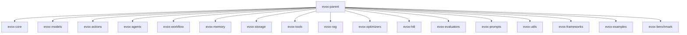
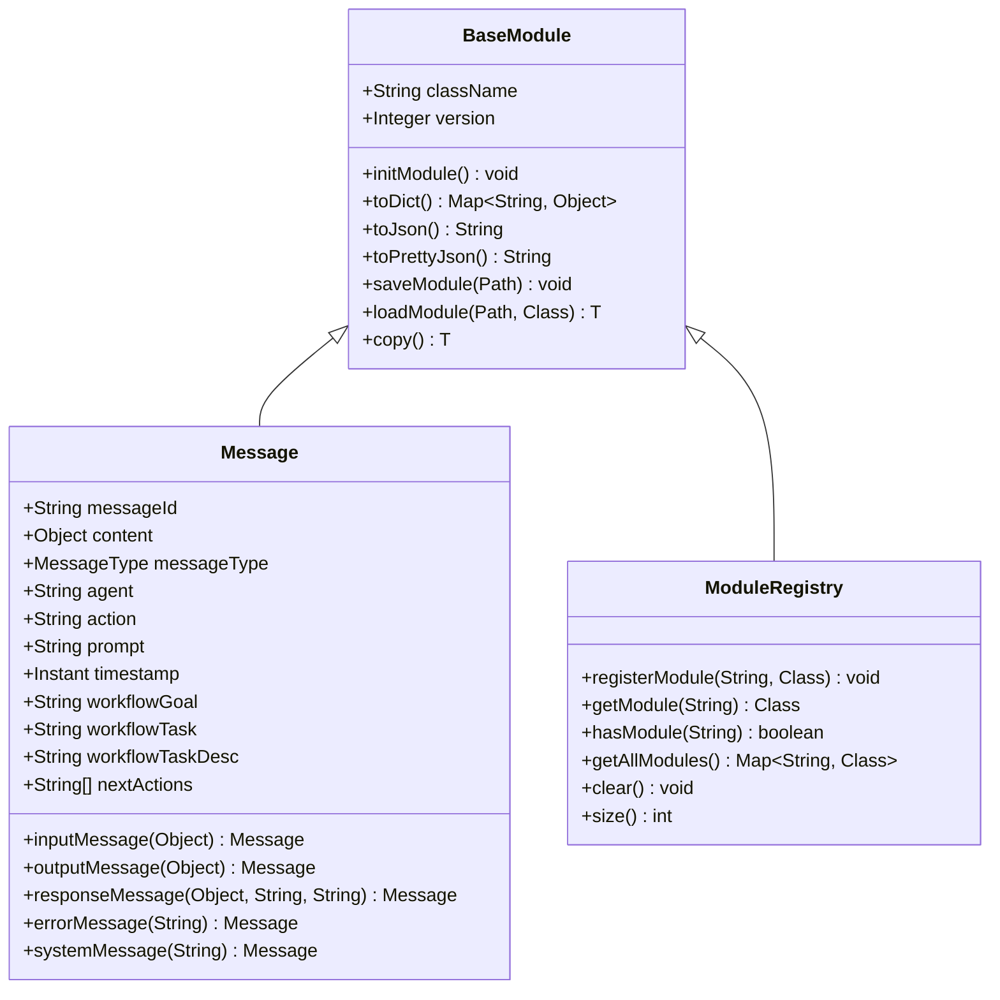
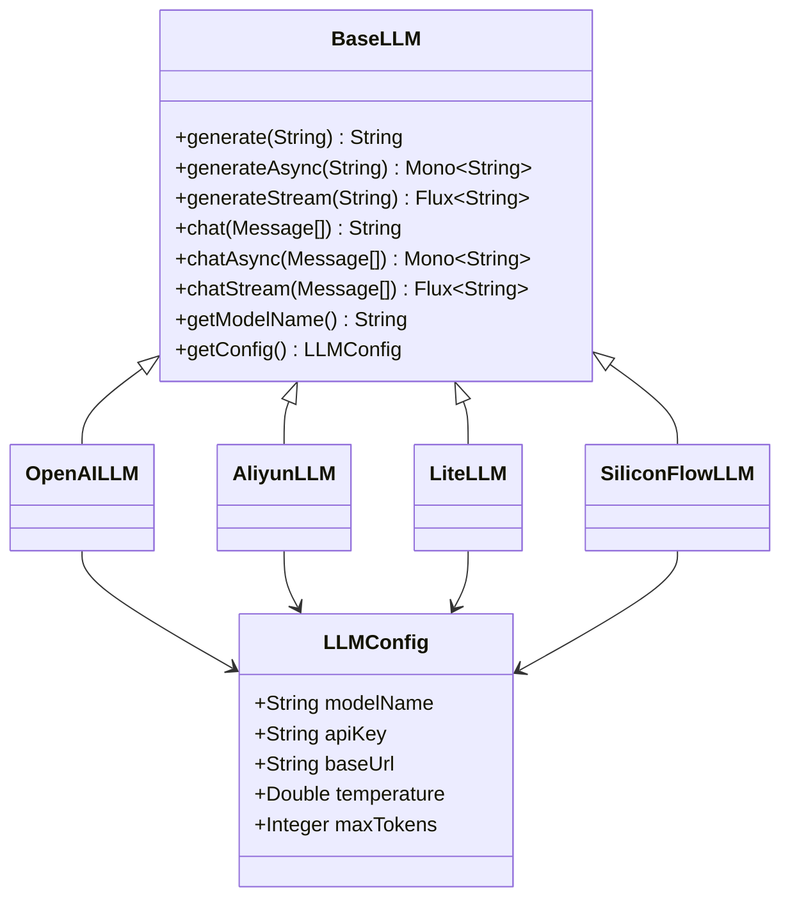
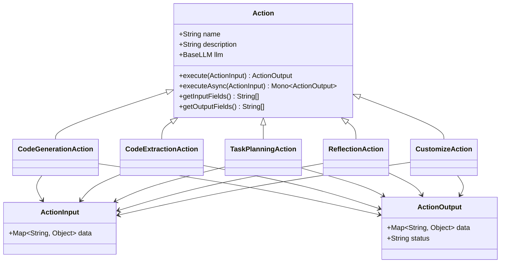
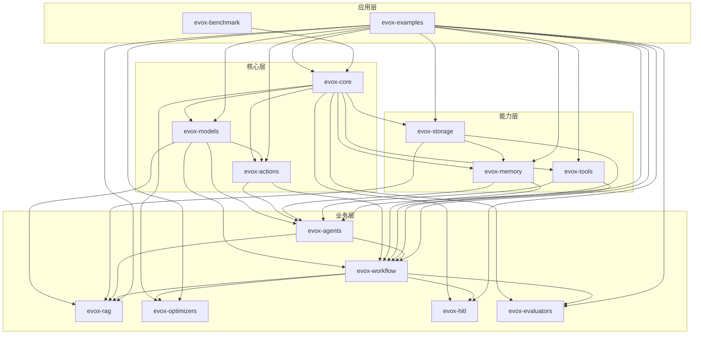

# 模块架构

<cite>
**本文档中引用的文件**  
- [pom.xml](file://pom.xml)
- [evox-core/pom.xml](file://evox-core/pom.xml)
- [evox-models/pom.xml](file://evox-models/pom.xml)
- [evox-actions/pom.xml](file://evox-actions/pom.xml)
- [evox-agents/pom.xml](file://evox-agents/pom.xml)
- [evox-workflow/pom.xml](file://evox-workflow/pom.xml)
- [evox-memory/pom.xml](file://evox-memory/pom.xml)
- [evox-storage/pom.xml](file://evox-storage/pom.xml)
- [evox-tools/pom.xml](file://evox-tools/pom.xml)
- [evox-rag/pom.xml](file://evox-rag/pom.xml)
- [evox-optimizers/pom.xml](file://evox-optimizers/pom.xml)
- [evox-hitl/pom.xml](file://evox-hitl/pom.xml)
- [evox-evaluators/pom.xml](file://evox-evaluators/pom.xml)
- [evox-core/src/main/java/io/leavesfly/evox/core/module/BaseModule.java](file://evox-core/src/main/java/io/leavesfly/evox/core/module/BaseModule.java)
- [evox-core/src/main/java/io/leavesfly/evox/core/message/Message.java](file://evox-core/src/main/java/io/leavesfly/evox/core/message/Message.java)
- [evox-core/src/main/java/io/leavesfly/evox/core/registry/ModuleRegistry.java](file://evox-core/src/main/java/io/leavesfly/evox/core/registry/ModuleRegistry.java)
- [evox-models/src/main/java/io/leavesfly/evox/models/base/BaseLLM.java](file://evox-models/src/main/java/io/leavesfly/evox/models/base/BaseLLM.java)
- [evox-actions/src/main/java/io/leavesfly/evox/actions/base/Action.java](file://evox-actions/src/main/java/io/leavesfly/evox/actions/base/Action.java)
</cite>

## 目录
1. [简介](#简介)
2. [项目结构](#项目结构)
3. [核心层模块](#核心层模块)
4. [能力层模块](#能力层模块)
5. [业务层模块](#业务层模块)
6. [应用层模块](#应用层模块)
7. [模块依赖关系图](#模块依赖关系图)
8. [架构优势](#架构优势)

## 简介
EvoX是一个基于Java Spring生态的模块化智能体系统，采用Maven多模块架构设计。该架构将系统划分为多个层次，包括核心层、能力层、业务层和应用层，每个层次的模块都有明确的职责和依赖关系。这种分层设计不仅提高了系统的可维护性和可扩展性，还支持灵活的模块组合和功能扩展。

## 项目结构
EvoX项目采用标准的Maven多模块结构，以`evox-parent`作为父POM，管理所有子模块的依赖和构建配置。项目结构清晰地反映了系统的分层架构，从核心基础组件到高级业务功能，再到具体的应用示例，形成了一个完整的生态系统。

**模块依赖关系图来源**
- [pom.xml](file://pom.xml#L55-L72)

**项目结构来源**
- [pom.xml](file://pom.xml#L1-L374)

## 核心层模块
核心层是EvoX架构的基础，包含`evox-core`、`evox-models`和`evox-actions`三个核心模块，为上层模块提供基础服务和通用能力。

### evox-core模块
`evox-core`模块是整个系统的基础，提供了核心类、消息系统和模块注册表等基础组件。该模块定义了所有其他模块继承的基类`BaseModule`，并实现了统一的序列化、反序列化和持久化机制。

**核心组件：**
- `BaseModule`：所有模块的基类，提供通用的序列化/反序列化、持久化等能力
- `Message`：消息类，用于在智能体、工作流和动作之间传递信息
- `ModuleRegistry`：模块注册表，用于注册和管理所有模块类

**核心组件来源**
- [evox-core/src/main/java/io/leavesfly/evox/core/module/BaseModule.java](file://evox-core/src/main/java/io/leavesfly/evox/core/module/BaseModule.java)
- [evox-core/src/main/java/io/leavesfly/evox/core/message/Message.java](file://evox-core/src/main/java/io/leavesfly/evox/core/message/Message.java)
- [evox-core/src/main/java/io/leavesfly/evox/core/registry/ModuleRegistry.java](file://evox-core/src/main/java/io/leavesfly/evox/core/registry/ModuleRegistry.java)

### evox-models模块
`evox-models`模块负责与各种大语言模型（LLM）的集成，提供了统一的接口和适配器。该模块依赖于`evox-core`，并为上层模块提供语言模型服务。

**主要特性：**
- 支持多种LLM提供商（OpenAI、阿里云、LiteLLM等）
- 提供同步、异步和流式三种调用模式
- 统一的配置管理机制

**模型层来源**
- [evox-models/pom.xml](file://evox-models/pom.xml#L1-L84)
- [evox-models/src/main/java/io/leavesfly/evox/models/base/BaseLLM.java](file://evox-models/src/main/java/io/leavesfly/evox/models/base/BaseLLM.java)

### evox-actions模块
`evox-actions`模块定义了动作系统的基础结构，所有具体动作都继承自`Action`基类。该模块依赖于`evox-core`和`evox-models`，为智能体提供可执行的动作能力。

**核心设计：**
- `Action`基类定义了动作的通用接口
- 支持同步和异步执行模式
- 提供输入输出字段的元数据描述

**动作层来源**
- [evox-actions/pom.xml](file://evox-actions/pom.xml#L1-L59)
- [evox-actions/src/main/java/io/leavesfly/evox/actions/base/Action.java](file://evox-actions/src/main/java/io/leavesfly/evox/actions/base/Action.java)

## 能力层模块
能力层模块在核心层的基础上提供了更高级的功能能力，包括记忆、工具、存储等，为业务层模块提供支持。

### evox-memory模块
`evox-memory`模块实现了智能体的记忆系统，支持短期记忆和长期记忆。该模块依赖于`evox-core`和`evox-storage`，为智能体提供状态保持和上下文管理能力。

**记忆类型：**
- `ShortTermMemory`：短期记忆，用于保存当前会话的上下文
- `LongTermMemory`：长期记忆，用于持久化存储重要信息
- `MemoryManager`：记忆管理器，统一管理各种记忆类型

**依赖关系：**
- 依赖`evox-core`：使用基础模块和消息系统
- 依赖`evox-storage`：实现记忆的持久化存储

### evox-tools模块
`evox-tools`模块提供了一系列工具，扩展了智能体的能力边界。该模块依赖于`evox-core`，并集成了多种外部服务和功能。

**工具分类：**
- **浏览器工具**：`BrowserTool` - 支持网页浏览和内容提取
- **计算器工具**：`CalculatorTool` - 执行数学计算
- **数据库工具**：`DatabaseTool`、`MongoDBTool`、`PostgreSQLTool` - 访问各种数据库
- **文件系统工具**：`FileSystemTool` - 文件操作
- **HTTP工具**：`HttpTool`、`HttpClientTool` - 网络请求
- **图像生成工具**：`ImageGenerationTool`、`OpenAIImageGenerationTool` - 生成图像
- **代码解释器工具**：`CodeInterpreterTool` - 执行代码
- **搜索工具**：`WebSearchTool`、`ArxivSearchTool`、`WikipediaSearchTool` - 信息检索

**依赖关系：**
- 依赖`evox-core`：使用基础模块功能
- 可选依赖各种数据库驱动和外部服务SDK

### evox-storage模块
`evox-storage`模块提供了多种存储适配器，支持不同的数据存储需求。该模块依赖于`evox-core`，为其他模块提供统一的存储接口。

**存储类型：**
- **内存存储**：`InMemoryStorageHandler` - 临时数据存储
- **数据库存储**：`PostgreSQLStore`、`SQLiteStore` - 关系型数据库
- **图存储**：`GraphStore`、`InMemoryGraphStore` - 图形数据存储
- **向量存储**：`ChromaVectorStore`、`FAISSVectorStore`、`QdrantVectorStore` - 向量数据库

**依赖关系：**
- 依赖`evox-core`：使用基础模块功能
- 依赖各种数据库驱动（H2、PostgreSQL等）

## 业务层模块
业务层模块基于核心层和能力层构建，实现了具体的业务功能和智能体系统。

### evox-agents模块
`evox-agents`模块实现了智能体系统，是EvoX的核心业务组件之一。该模块依赖于`evox-core`、`evox-models`、`evox-actions`和`evox-tools`，提供了多种类型的智能体。

**智能体类型：**
- `Agent`：智能体基类
- `ActionAgent`：动作智能体
- `PlanAgent`：规划智能体
- `ReActAgent`：反应式智能体
- `CustomizeAgent`：自定义智能体
- `TaskPlannerAgent`：任务规划智能体
- `ToolAwareAgent`：工具感知智能体

**管理组件：**
- `AgentManager`：智能体管理器
- `AgentState`：智能体状态管理

### evox-workflow模块
`evox-workflow`模块实现了工作流引擎，支持复杂的任务编排和流程控制。该模块依赖于`evox-core`、`evox-models`、`evox-agents`、`evox-memory`和`evox-storage`，提供了强大的流程自动化能力。

**核心组件：**
- `Workflow`：工作流基类
- `WorkflowNode`：工作流节点
- `WorkflowExecutor`：工作流执行器
- `WorkflowGraph`：工作流图
- `Operator`：操作符接口
- `AnswerGenerateOperator`：答案生成操作符
- `CustomOperator`：自定义操作符
- `ScEnsembleOperator`：集成操作符

### evox-rag模块
`evox-rag`模块实现了检索增强生成（Retrieval Augmented Generation）系统，结合了信息检索和语言生成的能力。该模块依赖于`evox-core`、`evox-models`和`evox-storage`，为智能体提供知识增强功能。

**核心组件：**
- `RAGEngine`：RAG引擎
- `DocumentReader`：文档读取器
- `Chunker`：文本分块器
- `EmbeddingService`：嵌入服务
- `Retriever`：检索器
- `VectorStore`：向量存储
- `Postprocessor`：后处理器

### evox-optimizers模块
`evox-optimizers`模块提供了多种优化器，用于提升智能体的性能和效果。该模块依赖于`evox-core`，实现了先进的优化算法。

**优化器类型：**
- `AFlowOptimizer`：AFlow优化器
- `EvoPromptOptimizer`：提示词优化器
- `MIPROOptimizer`：MIPRO优化器
- `SEWOptimizer`：SEW优化器
- `TextGradOptimizer`：TextGrad优化器

### evox-hitl模块
`evox-hitl`模块实现了人机交互（Human-in-the-Loop）功能，支持人工干预和反馈。该模块依赖于`evox-core`，为智能体系统提供人机协作能力。

**核心组件：**
- `HITLManager`：HITL管理器
- `HITLInterceptorAgent`：HITL拦截智能体
- `HITLUserInputCollectorAgent`：HITL用户输入收集智能体
- `HITLContext`：HITL上下文
- `HITLRequest`：HITL请求
- `HITLResponse`：HITL响应

### evox-evaluators模块
`evox-evaluators`模块提供了评估器，用于衡量智能体的性能和效果。该模块依赖于`evox-core`，实现了多种评估指标。

**评估器类型：**
- `Evaluator`：评估器基类
- `AFlowEvaluator`：AFlow评估器

**评估指标：**
- `AccuracyMetric`：准确率指标
- `F1ScoreMetric`：F1分数指标
- `EvaluationMetric`：评估指标基类

## 应用层模块
应用层模块展示了EvoX系统的实际应用场景，包括示例和基准测试。

### evox-examples模块
`evox-examples`模块提供了丰富的使用示例，帮助开发者快速理解和使用EvoX系统。该模块依赖于所有其他模块，展示了各种功能的组合使用。

**示例类型：**
- `ActionAgentExample`：动作智能体示例
- `CustomizeAgentExample`：自定义智能体示例
- `MemoryAgentExample`：记忆智能体示例
- `ToolsExample`：工具使用示例
- `SequentialWorkflowExample`：顺序工作流示例
- `WorkflowDemo`：工作流演示
- `BenchmarkExample`：基准测试示例
- `SimpleChatBot`：简单聊天机器人
- `ComprehensiveChatBot`：综合聊天机器人
- `MultiModelExample`：多模型示例
- `SpecializedAgentsExample`：专用智能体示例

### evox-benchmark模块
`evox-benchmark`模块提供了基准测试功能，用于评估和比较不同配置下的系统性能。该模块依赖于`evox-core`，实现了多种标准测试。

**基准测试类型：**
- `GSM8K`：数学问题解决能力测试
- `HotpotQA`：多跳问答能力测试
- `HumanEval`：代码生成能力测试
- `MBPP`：面向编程的基准测试
- `MessageBenchmark`：消息处理性能测试

## 模块依赖关系图
EvoX的模块化架构通过清晰的依赖关系实现了良好的分层和解耦。以下是各模块之间的依赖关系图：

**模块依赖关系图来源**
- [pom.xml](file://pom.xml#L55-L72)
- [evox-core/pom.xml](file://evox-core/pom.xml#L1-L80)
- [evox-models/pom.xml](file://evox-models/pom.xml#L1-L84)
- [evox-actions/pom.xml](file://evox-actions/pom.xml#L1-L59)
- [evox-agents/pom.xml](file://evox-agents/pom.xml#L1-L65)
- [evox-workflow/pom.xml](file://evox-workflow/pom.xml#L1-L64)
- [evox-memory/pom.xml](file://evox-memory/pom.xml#L1-L48)
- [evox-storage/pom.xml](file://evox-storage/pom.xml#L1-L49)
- [evox-tools/pom.xml](file://evox-tools/pom.xml#L1-L106)
- [evox-rag/pom.xml](file://evox-rag/pom.xml#L1-L101)
- [evox-optimizers/pom.xml](file://evox-optimizers/pom.xml#L1-L84)
- [evox-hitl/pom.xml](file://evox-hitl/pom.xml#L1-L84)
- [evox-evaluators/pom.xml](file://evox-evaluators/pom.xml#L1-L84)

## 架构优势
EvoX的模块化架构设计带来了诸多优势，使其成为一个高度可维护和可扩展的系统。

### 可维护性
分层架构使得每个模块都有明确的职责和边界，降低了模块间的耦合度。当需要修改某个功能时，开发者可以快速定位到相关模块，而不会影响到其他部分。例如，如果需要添加新的LLM支持，只需在`evox-models`模块中添加新的适配器，而不需要修改其他模块的代码。

### 可扩展性
模块化设计使得系统具有良好的可扩展性。新的功能可以通过添加新模块的方式实现，而不需要修改现有代码。例如，如果需要添加新的工具，可以创建一个新的`evox-new-tool`模块，实现`BaseTool`接口，并在`evox-tools`模块中注册即可。

### 灵活性
EvoX的架构支持灵活的模块组合。开发者可以根据具体需求选择需要的模块进行集成，而不需要引入整个系统。例如，如果只需要基本的智能体功能，可以只引入`evox-core`、`evox-models`和`evox-agents`三个模块，而不需要引入`evox-rag`或`evox-workflow`等高级功能模块。

### 易于测试
每个模块都是独立的Maven模块，可以独立进行单元测试和集成测试。这种设计使得测试更加简单和高效。例如，`evox-core`模块的测试只需要依赖核心库，而不需要启动整个应用。

### 技术栈统一
所有模块都基于Java Spring生态，使用统一的技术栈和开发规范。这种一致性降低了学习成本，提高了开发效率。同时，通过父POM统一管理依赖版本，避免了版本冲突问题。

### 渐进式演进
分层架构支持系统的渐进式演进。可以从核心功能开始，逐步添加更高级的功能模块。这种演进方式降低了项目启动的复杂度，使得团队可以快速验证核心概念，然后逐步完善系统功能。