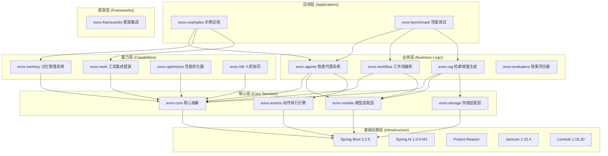

# EvoX项目概述

<cite>
**本文档引用的文件**
- [README.md](file://README.md)
- [pom.xml](file://pom.xml)
- [EvoXCoreConfig.java](file://evox-core/src/main/java/io/leavesfly/evox/core/config/EvoXCoreConfig.java)
- [Agent.java](file://evox-agents/src/main/java/io/leavesfly/evox/agents/base/Agent.java)
- [Action.java](file://evox-actions/src/main/java/io/leavesfly/evox/actions/base/Action.java)
- [BaseMemory.java](file://evox-memory/src/main/java/io/leavesfly/evox/memory/base/BaseMemory.java)
- [BaseTool.java](file://evox-tools/src/main/java/io/leavesfly/evox/tools/base/BaseTool.java)
- [Workflow.java](file://evox-workflow/src/main/java/io/leavesfly/evox/workflow/base/Workflow.java)
- [RAGEngine.java](file://evox-rag/src/main/java/io/leavesfly/evox/rag/RAGEngine.java)
- [SimpleChatBot.java](file://evox-examples/src/main/java/io/leavesfly/evox/examples/SimpleChatBot.java)
- [ComprehensiveChatBot.java](file://evox-examples/src/main/java/io/leavesfly/evox/examples/ComprehensiveChatBot.java)
- [PROGRESS_TRACKING.md](file://doc/PROGRESS_TRACKING.md)
</cite>

## 目录
1. [项目简介](#项目简介)
2. [核心特性](#核心特性)
3. [架构设计](#架构设计)
4. [模块说明](#模块说明)
5. [技术栈](#技术栈)
6. [应用场景](#应用场景)
7. [项目状态与路线图](#项目状态与路线图)
8. [许可证信息](#许可证信息)
9. [总结](#总结)

## 项目简介

EvoX是一个基于Java 17、Spring Boot 3.2+和Spring AI的企业级智能代理框架。该项目是EvoAgentX的Java生态系统重构版本，采用现代化的Maven多模块架构，为企业级AI应用开发提供了完整的解决方案。

### 设计理念

- **模块化设计**: 采用Maven多模块架构，每个模块职责清晰，可独立使用
- **Spring生态集成**: 深度集成Spring Boot、Spring AI，充分利用Spring生态优势
- **企业级标准**: 遵循Java企业级开发规范，代码质量高，可维护性强
- **灵活扩展**: 提供丰富的抽象和接口，支持自定义扩展

### 适用场景

- 🤖 **智能对话系统**: 构建具备上下文理解和记忆能力的聊天机器人
- 📊 **企业知识库与问答系统**: 集成RAG技术实现智能知识检索
- 🔄 **复杂业务流程自动化**: 通过工作流编排实现业务流程的智能化管理
- 🎯 **多智能体协同任务处理**: 支持多个智能体间的协作与通信
- 📈 **数据分析与决策支持**: 基于LLM的智能数据分析和决策辅助
- 🛠️ **工具集成与API调用**: 提供丰富的工具集成能力

## 核心特性

### 1. 多模型支持

EvoX支持多种主流LLM模型，提供统一的抽象接口：

- ✅ **OpenAI**: GPT-3.5、GPT-4、GPT-4o系列
- ✅ **阿里云通义千问**: 支持通义千问系列模型
- ✅ **百度文心一言**: 支持ERNIE系列模型
- 🔄 **支持自定义模型适配**: 提供灵活的模型扩展机制

### 2. 智能代理系统

框架提供了完整的智能代理解决方案：

- **基础代理**: 提供`Agent`基类，支持自定义扩展
- **专业代理**: 内置多种专业代理（路由、工具、聊天等）
- **代理管理**: 统一的代理注册、发现和生命周期管理
- **协同机制**: 支持多代理协同工作

### 3. 记忆管理

提供多层次的记忆管理能力：

- **短期记忆**: 基于滑动窗口的对话历史管理
- **长期记忆**: 支持向量存储的持久化记忆
- **记忆检索**: 基于语义的智能记忆检索
- **记忆去重**: 基于SHA-256哈希的自动去重

### 4. 工作流编排

强大的工作流编排引擎：

- **图结构工作流**: 支持DAG（有向无环图）工作流定义
- **条件分支**: 支持基于条件的动态路由
- **循环控制**: 支持循环节点和迭代控制
- **错误处理**: 完善的异常处理和重试机制

### 5. 工具集成

丰富的工具集成框架：

- **文件操作**: 文件读写、目录管理
- **HTTP请求**: RESTful API调用
- **网络搜索**: 集成搜索引擎
- **数据库访问**: SQL查询和操作
- **自定义工具**: 简单的工具扩展接口

### 6. RAG支持

完整的检索增强生成系统：

- **文档处理**: 支持多种文档格式解析
- **向量化**: 文档向量化和索引
- **语义检索**: 基于向量相似度的检索
- **知识增强**: 将检索结果注入到LLM上下文

### 7. 优化与评估

完善的性能优化和效果评估体系：

- **性能优化**: 内置优化器支持性能调优
- **效果评估**: 多维度的评估指标体系
- **人机协同**: HITL（Human-in-the-Loop）支持
- **基准测试**: 完整的性能基准测试框架

## 架构设计

EvoX采用分层架构设计，从底层基础设施到上层应用形成清晰的层次结构：

**架构图来源**
- [README.md](file://README.md#L103-L136)

### 层次说明

1. **应用层**: 包含示例应用和性能测试模块
2. **框架层**: 提供框架集成支持
3. **业务层**: 核心业务逻辑模块
4. **能力层**: 提供各种专业能力
5. **核心层**: 提供基础抽象和服务
6. **基础设施层**: 基于Spring生态的技术栈

## 模块说明

EvoX采用模块化设计，每个模块都有明确的职责和功能边界：

### 核心模块

| 模块 | 说明 | 状态 |
|------|------|------|
| **evox-core** | 核心抽象和基础设施 | ✅ 完成 |
| **evox-models** | LLM模型适配层 | ✅ 完成 |
| **evox-actions** | 动作执行引擎 | ✅ 完成 |
| **evox-agents** | 智能代理系统 | ✅ 完成 |

### 能力模块

| 模块 | 说明 | 状态 |
|------|------|------|
| **evox-memory** | 记忆管理系统 | ✅ 完成 |
| **evox-tools** | 工具集成框架 | ✅ 完成 |
| **evox-storage** | 存储适配层 | ✅ 完成 |
| **evox-prompts** | 提示词管理 | ✅ 完成 |

### 业务模块

| 模块 | 说明 | 状态 |
|------|------|------|
| **evox-workflow** | 工作流编排引擎 | ✅ 完成 |
| **evox-rag** | 检索增强生成 | ✅ 完成 |
| **evox-optimizers** | 性能优化器 | ✅ 完成 |
| **evox-hitl** | 人机协同 | ✅ 完成 |
| **evox-evaluators** | 效果评估器 | ✅ 完成 |

### 应用模块

| 模块 | 说明 | 状态 |
|------|------|------|
| **evox-frameworks** | 框架集成 | ✅ 完成 |
| **evox-examples** | 示例应用 | ✅ 完成 |
| **evox-benchmark** | 性能基准测试 | ✅ 完成 |
| **evox-utils** | 工具类库 | ✅ 完成 |

**节来源**
- [README.md](file://README.md#L164-L202)

## 技术栈

### 核心框架

- **Java 17**: 主要编程语言，利用最新语言特性
- **Spring Boot 3.2.5**: 应用框架，提供依赖注入和配置管理
- **Spring AI 1.0.0-M1**: AI集成框架，简化LLM集成
- **Project Reactor**: 响应式编程支持

### 数据处理

- **Jackson 2.15.4**: JSON序列化和反序列化
- **Lombok 1.18.30**: 代码生成，减少样板代码
- **MapStruct 1.5.5**: 对象映射
- **Hutool 5.8.25**: 工具库，提供常用工具方法

### 存储支持

- **H2 Database**: 内存数据库，用于测试和开发
- **HSQLDB**: 嵌入式数据库
- **向量数据库支持**: 支持FAISS、Milvus等向量数据库

### 测试框架

- **JUnit 5**: 单元测试框架
- **Mockito**: Mock框架
- **Spring Test**: 集成测试支持

**节来源**
- [README.md](file://README.md#L138-L162)
- [pom.xml](file://pom.xml#L16-L53)

## 应用场景

### 智能对话系统

基于EvoX框架可以构建具备上下文理解和记忆能力的智能对话系统。框架提供了完整的Agent、Memory、Tool集成解决方案，支持多轮对话和工具调用。

**核心组件**:
- **Agent**: 智能对话代理，负责处理用户输入
- **Memory**: 记忆管理系统，保存对话历史
- **Tool**: 工具集成，支持文件操作、网络搜索等功能

### 企业知识库与问答系统

通过RAG（检索增强生成）技术，EvoX可以构建智能的企业知识库系统，支持语义检索和智能问答。

**核心特性**:
- **文档处理**: 支持PDF、TXT等多种格式
- **向量化**: 文档向量化和索引
- **语义检索**: 基于向量相似度的智能检索
- **知识增强**: 将检索结果注入LLM上下文

### 复杂业务流程自动化

工作流编排引擎支持复杂的业务流程自动化，可以实现多步骤的业务处理流程。

**核心功能**:
- **DAG工作流**: 支持有向无环图的工作流定义
- **条件分支**: 基于条件的动态路由
- **循环控制**: 支持循环和迭代
- **错误处理**: 完善的异常处理机制

### 多智能体协同任务处理

框架支持多个智能体间的协作，可以实现复杂的分布式任务处理。

**协作机制**:
- **路由智能体**: 负责分析用户输入并选择合适的处理智能体
- **工具智能体**: 处理需要工具调用的任务
- **聊天智能体**: 处理普通的对话任务

**节来源**
- [README.md](file://README.md#L42-L50)
- [SimpleChatBot.java](file://evox-examples/src/main/java/io/leavesfly/evox/examples/SimpleChatBot.java#L23-L31)
- [ComprehensiveChatBot.java](file://evox-examples/src/main/java/io/leavesfly/evox/examples/ComprehensiveChatBot.java#L21-L23)

## 项目状态与路线图

### 当前状态

根据项目进展跟踪文档，EvoX项目已经完成了第一阶段的所有目标：

- **核心框架搭建**: 已完成（100%）
- **业务模块实现**: 已完成（100%）
- **高级功能扩展**: 已完成（100%）

### 版本信息

- **当前版本**: 1.0.0-SNAPSHOT
- **Java版本**: 17+
- **Spring Boot版本**: 3.2.5
- **Spring AI版本**: 1.0.0-M1

### 路线图

#### v1.0.0 (已完成)
- ✅ 核心框架搭建
- ✅ 基础Agent实现
- ✅ LLM模型适配（OpenAI）
- ✅ 短期记忆管理
- ✅ 基础工具集成
- ✅ 工作流引擎
- ✅ 示例应用

#### v1.1.0 (开发中)
- 🚧 更多LLM模型支持（Claude, Gemini）
- 🚧 向量数据库集成（Milvus, Pinecone）
- 🚧 流式响应优化
- 🚧 分布式工作流支持
- 🚧 Web UI控制台

#### v2.0.0 (规划中)
- 📋 多模态支持（图像、音频）
- 📋 自主学习能力
- 📋 知识图谱集成
- 📋 联邦学习支持
- 📋 云原生部署方案

**节来源**
- [PROGRESS_TRACKING.md](file://doc/PROGRESS_TRACKING.md#L24-L32)
- [README.md](file://README.md#L697-L724)

## 许可证信息

EvoX项目采用MIT许可证开源，允许自由使用、修改和分发。

**许可证特点**:
- **自由使用**: 可以在商业和非商业项目中使用
- **修改权限**: 可以修改源代码
- **分发权利**: 可以重新分发原始或修改版本
- **责任限制**: 不承担任何担保责任

**节来源**
- [README.md](file://README.md#L773-L776)

## 总结

EvoX作为一个基于Spring生态的企业级智能代理框架，具有以下核心优势：

### 技术优势

1. **现代化技术栈**: 基于Java 17和Spring Boot 3.2+，充分利用现代Java特性和Spring生态优势
2. **模块化架构**: 清晰的分层设计和模块划分，便于维护和扩展
3. **响应式编程**: 基于Project Reactor，提供高性能的异步处理能力
4. **企业级标准**: 遵循Java企业级开发规范，代码质量和可维护性高

### 功能特色

1. **完整的AI能力**: 从基础的LLM调用到复杂的RAG系统，提供全方位的AI能力
2. **灵活的扩展性**: 丰富的抽象接口和扩展点，支持定制化开发
3. **生产就绪**: 完善的测试覆盖和性能基准测试，适合生产环境使用
4. **多场景支持**: 涵盖智能对话、知识库、业务流程自动化等多个应用场景

### 适用人群

- **初学者**: 提供丰富的示例和详细的文档，易于上手
- **经验开发者**: 提供灵活的扩展机制和完整的API，满足复杂需求
- **企业用户**: 提供稳定可靠的企业级解决方案

EvoX框架为Java开发者提供了一个完整的企业级智能代理解决方案，无论是构建简单的聊天机器人还是复杂的AI驱动应用，都能找到合适的组件和工具。随着项目的持续发展，未来将支持更多的AI模型和应用场景，成为Java生态系统中重要的AI基础设施。