# EvoX 技术架构文档

<div align="center">

**EvoX：自进化的多智能体框架 - 技术架构详解**

版本：1.0.0  
更新时间：2026-02-16

</div>

---

## 📖 文档概述

本文档系统阐述 EvoX 框架的整体技术架构，包括分层设计、模块职责、依赖关系、核心抽象、设计原则等内容，帮助开发者全面理解框架的架构设计思想与实现细节。

### 目标读者

- 架构师：理解框架整体设计与技术选型
- 开发者：掌握模块职责与依赖关系，便于扩展开发
- 技术决策者：评估框架能力与适用场景

### 文档结构

1. [架构总览](#-架构总览) - 整体架构与分层设计
2. [核心层设计](#-核心层设计) - 基础抽象与模型适配
3. [运行时层设计](#-运行时层设计) - 智能体、工作流、能力系统
4. [扩展层设计](#-扩展层设计) - 优化、评估、人机协同
5. [应用层设计](#-应用层设计) - 示例应用与集成方案
6. [依赖关系管理](#-依赖关系管理) - 依赖原则与依赖矩阵
7. [核心抽象详解](#-核心抽象详解) - 关键接口与实现
8. [设计原则与约束](#-设计原则与约束) - 架构原则与权衡
9. [技术栈与选型](#-技术栈与选型) - 技术选型理由
10. [架构演进规划](#-架构演进规划) - 未来演进方向

---

## 🏗️ 架构总览

### 1.1 整体架构

EvoX 采用经典的**五层架构**设计，从下至上依次为：**基础设施层** → **核心层** → **运行时层** → **扩展层** → **应用层**。各层职责清晰，依赖关系单向，遵循"向下依赖、禁止向上依赖、禁止跨层依赖"的原则。

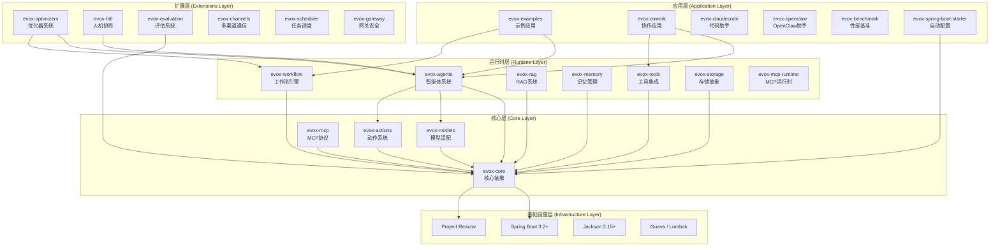

### 1.2 分层职责

| 层级 | 职责 | 核心模块 | 依赖方向 |
|-----|------|---------|---------|
| **应用层** | 提供开箱即用的应用、示例、集成方案 | evox-examples, evox-cowork, evox-starter | ↓ 所有下层 |
| **扩展层** | 提供高级能力：优化、评估、人机协同 | evox-optimizers, evox-hitl, evox-evaluation | ↓ 核心层 + 运行时层 |
| **运行时层** | 实现核心业务：智能体、工作流、RAG | evox-agents, evox-workflow, evox-rag | ↓ 核心层 |
| **核心层** | 提供基础抽象、模型适配、动作系统 | evox-core, evox-models, evox-actions | ↓ 基础设施层 |
| **基础设施层** | 提供运行时环境与基础库 | Spring Boot, Reactor, Jackson | - |

### 1.3 架构特点

✅ **清晰的层次边界**：每层职责单一，边界清晰  
✅ **单向依赖关系**：上层依赖下层，避免循环依赖  
✅ **高内聚低耦合**：模块职责明确，接口稳定  
✅ **可扩展性强**：提供丰富的扩展点，支持自定义  
✅ **生产就绪**：完善的异常处理、日志、监控  
✅ **响应式设计**：基于 Reactor，支持异步非阻塞

---

## 🔷 核心层设计

核心层是整个框架的基石，提供最底层的抽象、基础设施和模型适配能力。

### 2.1 模块列表

| 模块 | 说明 | 依赖 | 关键抽象 |
|------|------|------|---------|
| **evox-core** | 核心抽象与基础设施 | Spring Boot, Reactor | BaseModule, Message, IAgent, ModuleRegistry |
| **evox-models** | LLM 多模型适配器 | evox-core | BaseLLM, OpenAILLM, DashScopeLLM |
| **evox-actions** | 动作系统 | evox-core, evox-models | Action, ActionInput, ActionOutput |
| **evox-mcp** | MCP 协议核心 | evox-core | MCP 接口定义 |

### 2.2 核心抽象

#### 2.2.1 BaseModule - 模块基类

所有 EvoX 模块的基类，提供统一的能力：

```java
public abstract class BaseModule {
    // 序列化
    public String toJson();
    public String toPrettyJson();
    public Map<String, Object> toDict();
    
    // 反序列化
    public static <T> T fromJson(String json, Class<T> clazz);
    public static <T> T fromDict(Map<String, Object> dict, Class<T> clazz);
    
    // 持久化
    public void saveModule(Path path);
    public static <T extends BaseModule> T loadModule(Path path, Class<T> clazz);
    
    // 深拷贝
    public <T extends BaseModule> T copy();
    
    // 初始化钩子
    public void initModule();
}
```

**设计意图**：
- 提供统一的序列化/反序列化能力
- 支持模块的持久化与加载
- 提供生命周期管理钩子

#### 2.2.2 Message - 消息模型

统一的消息载体，支持智能体间、工作流节点间的通信：

```java
@Data
@Builder
public class Message {
    private String messageId;           // 消息唯一标识
    private MessageType messageType;    // 消息类型
    private String content;             // 消息内容
    private String sender;              // 发送者
    private String receiver;            // 接收者
    private Map<String, Object> context; // 上下文数据
    private Long timestamp;             // 时间戳
}
```

**消息类型**：
- `INPUT` - 用户输入
- `OUTPUT` - AI 输出
- `SYSTEM` - 系统消息
- `TOOL_CALL` - 工具调用
- `TOOL_RESULT` - 工具结果
- `ERROR` - 错误消息

#### 2.2.3 IAgent - 智能体接口

核心智能体接口，打破模块间循环依赖：

```java
public interface IAgent {
    String getAgentId();
    String getName();
    Message execute(String actionName, List<Message> messages);
    CompletableFuture<Message> executeAsync(String actionName, List<Message> messages);
    boolean isHuman();
}
```

#### 2.2.4 BaseLLM - LLM 统一接口

统一的 LLM 抽象，支持多种模型：

```java
public interface BaseLLM {
    Message generate(List<Message> messages);
    Flux<Message> generateStream(List<Message> messages);
    boolean supportsStreaming();
    String getModelName();
}
```

**支持的模型**：
- OpenAI (GPT-3.5, GPT-4, GPT-4o)
- 阿里云通义千问 (DashScope)
- LiteLLM (统一网关)
- 自定义模型

### 2.3 配置管理

EvoX 使用 Spring Boot 的配置体系，支持多种配置方式：

```yaml
evox:
  llm:
    provider: openai  # openai, dashscope, litellm
    temperature: 0.7
    max-tokens: 2000
    timeout: 30000
  agents:
    default-timeout: 60000
    max-concurrent: 10
  memory:
    short-term:
      capacity: 100
      window-size: 10
```

### 2.4 设计原则

- ✅ **最小依赖**：核心层仅依赖基础设施层
- ✅ **稳定接口**：提供稳定的 API，避免频繁变更
- ✅ **高内聚**：每个模块职责单一
- ✅ **可扩展**：通过接口和抽象类提供扩展点

---

## ⚙️ 运行时层设计

运行时层实现核心业务逻辑，提供智能体、工作流、RAG、记忆、工具等能力。

### 3.1 模块列表

| 模块 | 说明 | 依赖 | 关键类 |
|------|------|------|--------|
| **evox-agents** | 智能体系统与多智能体协作框架 | evox-core, evox-models, evox-actions | Agent, AgentBuilder, DebateFramework |
| **evox-workflow** | DAG 工作流编排引擎 | evox-core, evox-memory | Workflow, WorkflowBuilder, WorkflowGraph |
| **evox-rag** | RAG 检索增强生成 | evox-core, evox-storage | RAGEngine, RAGConfig, RetrievalResult |
| **evox-memory** | 记忆管理系统 | evox-core | ShortTermMemory, LongTermMemory, MemoryManager |
| **evox-tools** | 工具集成系统 | evox-core | BaseTool, FileSystemTool, HttpTool |
| **evox-storage** | 存储抽象层 | evox-core | VectorStore, GraphStore |
| **evox-mcp-runtime** | MCP 协议运行时 | evox-core, evox-mcp | MCPServer, MCPClient |

### 3.2 智能体系统（evox-agents）

#### 3.2.1 Agent 基类

所有智能体的基类，提供核心能力：

```java
public abstract class Agent extends BaseModule implements IAgent {
    protected String agentId;
    protected String name;
    protected BaseLLM llm;
    protected List<Action> actions;
    protected Memory memory;
    
    public abstract Message execute(String actionName, List<Message> messages);
    
    public CompletableFuture<Message> executeAsync(String actionName, List<Message> messages) {
        return CompletableFuture.supplyAsync(() -> execute(actionName, messages));
    }
}
```

#### 3.2.2 专用智能体类型

| Agent 类型 | 说明 | 适用场景 |
|-----------|------|---------|
| **ChatBotAgent** | 聊天机器人 | 对话交互、问答系统 |
| **ActionAgent** | 函数执行代理 | 工具封装、确定性任务 |
| **ReActAgent** | 推理-行动代理 | 复杂推理、多步骤任务 |
| **ToolAgent** | 工具代理 | 工具调用、API 集成 |
| **TaskPlannerAgent** | 任务规划代理 | 任务分解、计划制定 |
| **CustomizeAgent** | 自定义代理 | 灵活定制、特殊需求 |

#### 3.2.3 多智能体协作框架

EvoX 提供 5 种协作框架：

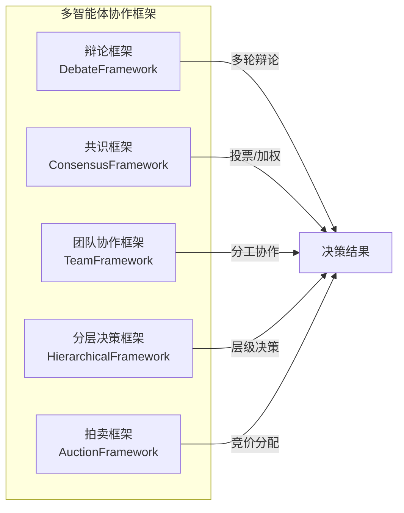

**辩论框架示例**：

```java
DebateFramework framework = new DebateFramework();
framework.addAgent(agent1); // 正方
framework.addAgent(agent2); // 反方
Message result = framework.debate("主题", 3); // 3轮辩论
```

### 3.3 工作流引擎（evox-workflow）

#### 3.3.1 工作流架构

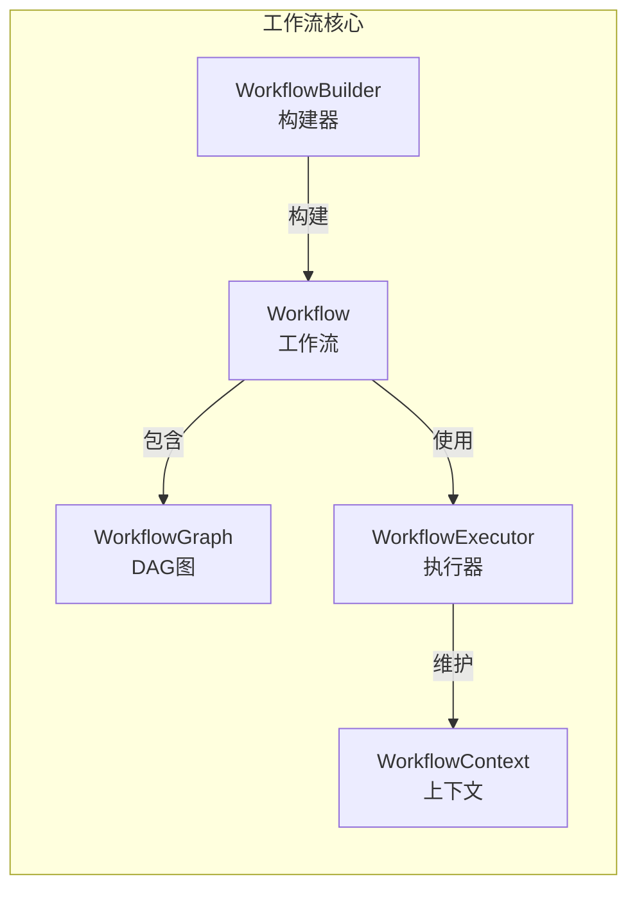

#### 3.3.2 工作流特性

- ✅ **顺序执行**：按定义顺序执行节点
- ✅ **条件分支**：基于条件选择执行路径
- ✅ **并行执行**：多个节点同时执行
- ✅ **循环控制**：支持循环执行节点
- ✅ **错误处理**：异常捕获与重试机制
- ✅ **状态持久化**：工作流状态保存与恢复
- ✅ **可视化监控**：实时监控执行状态

**工作流示例**：

```java
Workflow workflow = WorkflowBuilder.sequential()
    .name("用户注册流程")
    .goal("完成新用户注册")
    .step("验证信息", validationAgent)
    .step("创建账户", createAccountAgent)
    .step("发送邮件", emailAgent)
    .maxSteps(100)
    .build();

WorkflowResult result = workflow.execute(initialInput);
```

### 3.4 RAG 系统（evox-rag）

#### 3.4.1 RAG 管道

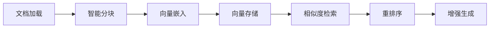

#### 3.4.2 RAG 配置

```java
RAGConfig config = RAGConfig.builder()
    .embedding(RAGConfig.EmbeddingConfig.builder()
        .dimension(1536)
        .build())
    .chunker(RAGConfig.ChunkerConfig.builder()
        .strategy("fixed")  // fixed, semantic, recursive
        .chunkSize(500)
        .chunkOverlap(50)
        .build())
    .retriever(RAGConfig.RetrieverConfig.builder()
        .topK(3)
        .similarityThreshold(0.7)
        .build())
    .build();
```

### 3.5 记忆管理（evox-memory）

#### 3.5.1 双层记忆架构

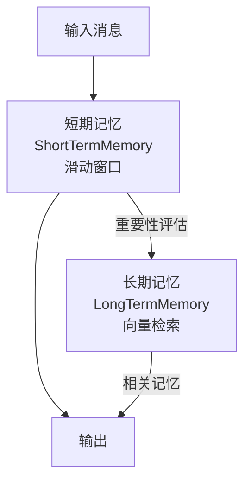

#### 3.5.2 记忆类型

- **短期记忆**：滑动窗口，保留最近的对话历史
- **长期记忆**：向量存储，检索历史相关信息
- **记忆管理器**：自动协调短期与长期记忆

### 3.6 工具系统（evox-tools）

#### 3.6.1 内置工具

| 工具类型 | 说明 | 示例操作 |
|---------|------|---------|
| **FileSystemTool** | 文件系统操作 | 读写文件、目录遍历 |
| **HttpTool** | HTTP 请求 | GET/POST/PUT/DELETE |
| **DatabaseTool** | 数据库操作 | SQL 查询、CRUD |
| **CalculatorTool** | 计算器 | 数学运算、表达式求值 |
| **SearchTool** | 搜索引擎 | 网页搜索、信息检索 |
| **BrowserTool** | 浏览器自动化 | 网页抓取、表单填写 |

#### 3.6.2 工具接口

```java
public interface BaseTool {
    String getName();
    String getDescription();
    Object execute(Map<String, Object> parameters);
}
```

---

## 🔸 扩展层设计

扩展层提供高级能力，包括优化器、评估系统、人机协同等。

### 4.1 模块列表

| 模块 | 说明 | 依赖 | 关键类 |
|------|------|------|--------|
| **evox-optimizers** | 优化器系统 | evox-core, evox-agents, evox-workflow | TextGrad, MIPRO, AFlow |
| **evox-hitl** | 人机协同系统 | evox-core, evox-agents | HITLManager, HITLInterceptor |
| **evox-evaluation** | 评估系统 | evox-core | Evaluator, Metrics |
| **evox-channels** | 多渠道通信 | evox-core | ChannelAdapter |
| **evox-scheduler** | 任务调度 | evox-core | TaskScheduler |
| **evox-gateway** | 网关与安全 | evox-core | Gateway, SecurityFilter |

### 4.2 优化器系统（evox-optimizers）

#### 4.2.1 优化器类型

- **TextGrad**：基于梯度的提示词优化
- **MIPRO**：多指标联合优化
- **AFlow**：自动化工作流优化
- **PromptOptimizer**：通用提示词优化器
- **MemoryOptimizer**：记忆管理优化

#### 4.2.2 优化流程

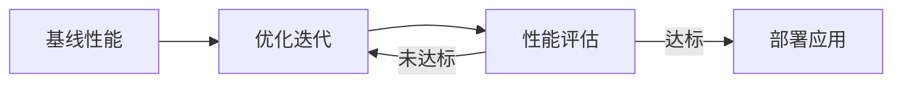

### 4.3 人机协同（evox-hitl）

#### 4.3.1 介入模式

| 模式 | 说明 | 触发时机 |
|-----|------|---------|
| **前置介入** | 执行前审批 | 关键决策前 |
| **后置介入** | 执行后审查 | 任务完成后 |
| **异常介入** | 错误时修正 | 异常发生时 |
| **持续介入** | 全程监控 | 整个流程中 |

#### 4.3.2 HITL 示例

```java
HITLManager hitlManager = new HITLManager();

// 注册审批介入点
hitlManager.registerInterceptor("approval", (context) -> {
    System.out.println("待审批: " + context.getData());
    return getUserApproval();
});

// 在工作流中触发
workflow.addHITLPoint("approval");
```

---

## 🔹 应用层设计

应用层提供开箱即用的应用、示例代码和集成方案。

### 5.1 模块列表

| 模块 | 说明 | 类型 |
|------|------|------|
| **evox-examples** | 15+ 完整示例 | 教程 |
| **evox-cowork** | 多智能体协作应用 | 应用 |
| **evox-claudecode** | 代码助手应用 | 应用 |
| **evox-openclaw** | OpenClaw 助手 | 应用 |
| **evox-benchmark** | 性能基准测试 | 测试 |
| **evox-spring-boot-starter** | 自动配置 | 集成 |

### 5.2 示例应用

#### 5.2.1 基础示例

- QuickStart.java - 4 行代码快速开始
- SimpleChatBot.java - 完整聊天机器人
- MemoryAgentExample.java - 带记忆的对话

#### 5.2.2 高级示例

- WorkflowDemo.java - 复杂工作流
- DebateFrameworkExample.java - 辩论框架
- RagQuickStartExample.java - RAG 系统
- OptimizerExample.java - 优化器使用

### 5.3 Spring Boot 集成

```java
@SpringBootApplication
public class EvoXApplication {
    
    @Autowired
    private AgentManager agentManager;
    
    public static void main(String[] args) {
        SpringApplication.run(EvoXApplication.class, args);
    }
}
```

---

## 🔗 依赖关系管理

### 6.1 依赖原则

#### 6.1.1 四大原则

1. **向下依赖** ✅：上层可以依赖下层
2. **禁止向上依赖** ❌：下层不能依赖上层
3. **禁止跨层依赖** ❌：不能跨越中间层直接依赖
4. **同层依赖** ✅：同层模块可相互依赖，但避免循环

#### 6.1.2 依赖示意图

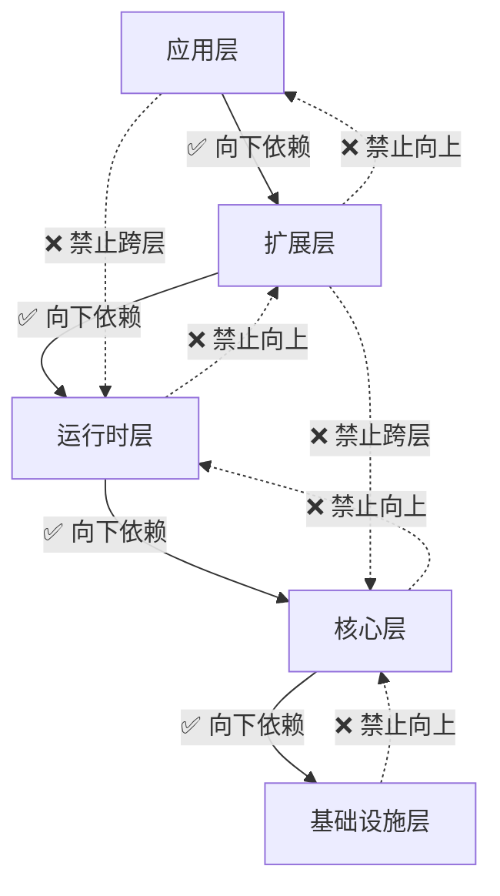

### 6.2 模块依赖矩阵

| 模块 | 依赖的模块 | 层级 |
|------|-----------|------|
| evox-examples | evox-agents, evox-workflow, evox-rag, evox-tools, evox-memory | 应用层 |
| evox-cowork | evox-agents, evox-workflow, evox-tools, evox-memory, evox-rag | 应用层 |
| evox-optimizers | evox-core, evox-models, evox-agents, evox-workflow | 扩展层 |
| evox-hitl | evox-core, evox-agents | 扩展层 |
| evox-agents | evox-core, evox-models, evox-actions, evox-memory, evox-tools | 运行时层 |
| evox-workflow | evox-core, evox-memory | 运行时层 |
| evox-rag | evox-core, evox-models, evox-storage | 运行时层 |
| evox-memory | evox-core | 运行时层 |
| evox-tools | evox-core | 运行时层 |
| evox-storage | evox-core | 运行时层 |
| evox-models | evox-core | 核心层 |
| evox-actions | evox-core, evox-models | 核心层 |
| evox-mcp | evox-core | 核心层 |
| evox-core | Spring Boot, Reactor, Jackson | 核心层 |

### 6.3 循环依赖处理

EvoX 通过以下方式避免循环依赖：

1. **接口抽象**：在 evox-core 中定义 IAgent 接口，打破循环
2. **依赖倒置**：上层依赖下层的抽象，而非具体实现
3. **事件驱动**：使用事件总线解耦模块间通信
4. **延迟加载**：使用懒加载避免初始化时的循环依赖

---

## 🧩 核心抽象详解

### 7.1 BaseModule - 模块基类

#### 7.1.1 能力矩阵

| 能力 | 方法 | 说明 |
|-----|------|------|
| 序列化 | toJson() | 转为 JSON 字符串 |
| 反序列化 | fromJson() | 从 JSON 创建对象 |
| 持久化 | saveModule() | 保存到文件 |
| 加载 | loadModule() | 从文件加载 |
| 深拷贝 | copy() | 创建副本 |
| 初始化 | initModule() | 初始化钩子 |

#### 7.1.2 使用示例

```java
// 创建并序列化
MyAgent agent = new MyAgent();
String json = agent.toJson();

// 反序列化
MyAgent loaded = BaseModule.fromJson(json, MyAgent.class);

// 持久化
agent.saveModule(Paths.get("agent.json"));

// 加载
MyAgent restored = BaseModule.loadModule(Paths.get("agent.json"), MyAgent.class);
```

### 7.2 Message - 消息模型

#### 7.2.1 消息流转

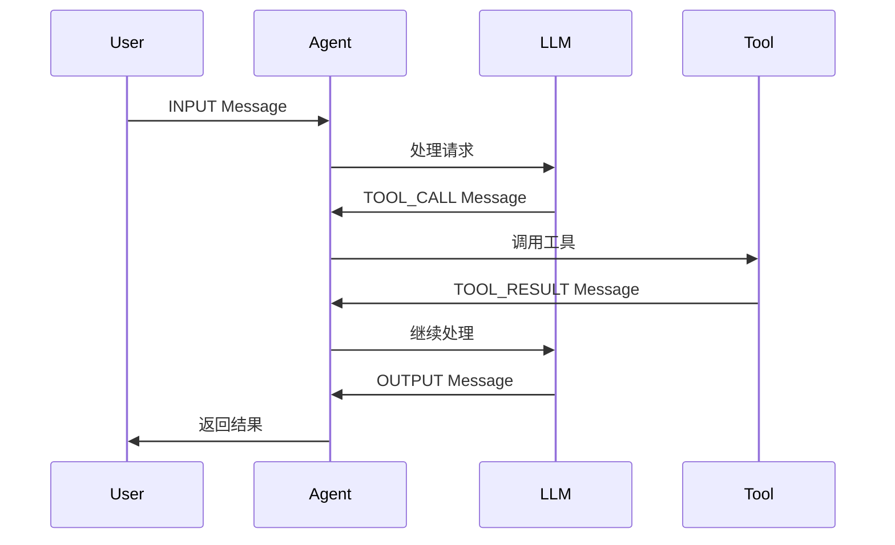

#### 7.2.2 消息上下文

Message 的 context 字段可存储任意上下文数据：

```java
Message msg = Message.builder()
    .content("查询天气")
    .messageType(MessageType.INPUT)
    .context(Map.of(
        "location", "北京",
        "date", "2026-02-16",
        "user_id", "12345"
    ))
    .build();
```

### 7.3 Agent - 智能体基类

#### 7.3.1 执行流程

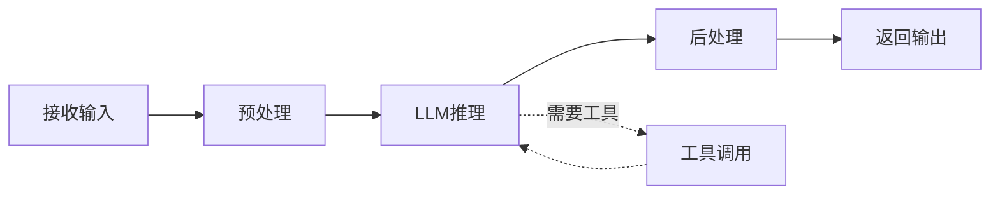

#### 7.3.2 生命周期

```java
public class MyAgent extends Agent {
    
    @Override
    public void initModule() {
        // 1. 初始化 LLM
        // 2. 注册 Actions
        // 3. 配置 Memory
        // 4. 设置 Tools
    }
    
    @Override
    public Message execute(String actionName, List<Message> messages) {
        // 1. 验证输入
        // 2. 查询记忆
        // 3. 执行动作
        // 4. 更新记忆
        // 5. 返回结果
    }
}
```

### 7.4 Workflow - 工作流

#### 7.4.1 构建模式

**流式构建**：

```java
Workflow workflow = WorkflowBuilder.sequential()
    .name("订单处理")
    .step("验证订单", validateAgent)
    .step("扣减库存", inventoryAgent)
    .step("生成订单", orderAgent)
    .build();
```

**图结构构建**：

```java
WorkflowGraph graph = new WorkflowGraph("数据处理");
graph.addNode(extractNode);
graph.addNode(transformNode);
graph.addNode(loadNode);
graph.addEdge(extractNode.getId(), transformNode.getId());
graph.addEdge(transformNode.getId(), loadNode.getId());
```

#### 7.4.2 执行模型

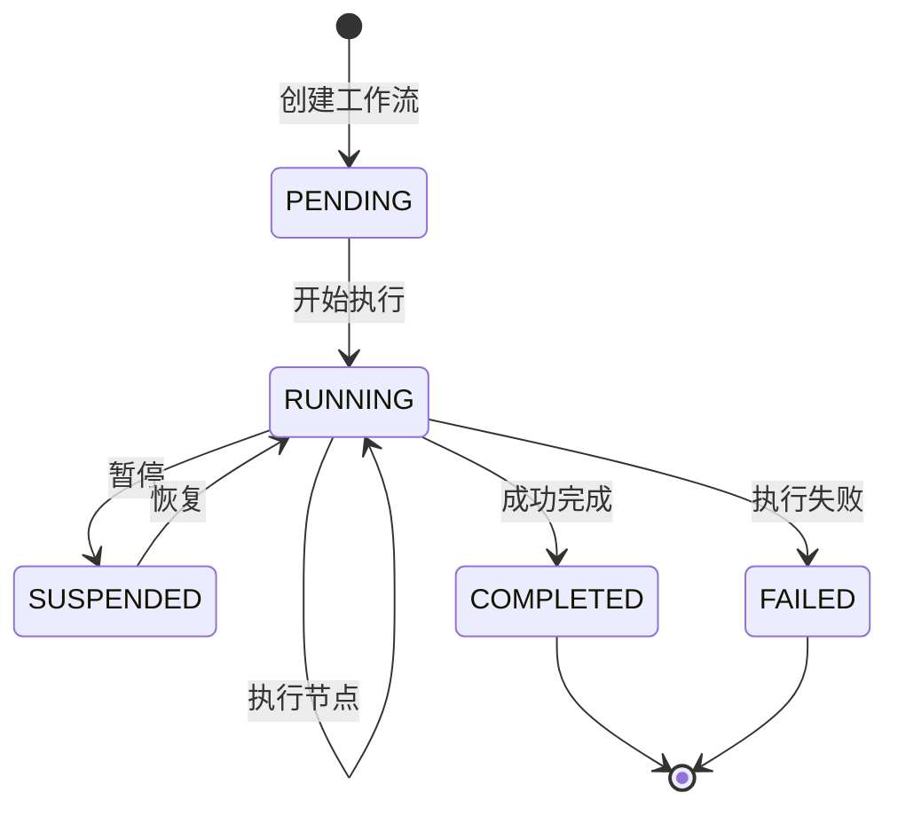

---

## 📐 设计原则与约束

### 8.1 架构原则

#### 8.1.1 SOLID 原则

- **单一职责（SRP）**：每个模块职责单一
- **开闭原则（OCP）**：对扩展开放，对修改关闭
- **里氏替换（LSP）**：子类可替换父类
- **接口隔离（ISP）**：接口细粒度，避免臃肿
- **依赖倒置（DIP）**：依赖抽象而非具体实现

#### 8.1.2 DDD 原则

- **限界上下文**：每层定义明确的边界
- **聚合根**：Agent、Workflow 作为聚合根
- **领域事件**：使用事件解耦模块
- **仓储模式**：Storage 提供统一的存储抽象

### 8.2 设计约束

#### 8.2.1 性能约束

- LLM 调用超时：30 秒
- Agent 执行超时：60 秒
- Workflow 执行超时：300 秒
- 最大并发 Agent：10 个
- 短期记忆容量：100 条
- 工作流最大深度：10 层

#### 8.2.2 安全约束

- API Key 必须通过环境变量或加密配置传递
- 禁止在日志中打印敏感信息
- 工具调用需权限验证
- HITL 介入需身份认证

### 8.3 设计权衡

| 权衡点 | 选择 | 理由 |
|-------|------|------|
| 性能 vs 可维护性 | **可维护性优先** | 企业级框架，长期维护成本更重要 |
| 灵活性 vs 复杂性 | **平衡** | 提供扩展点，但避免过度设计 |
| 功能完整性 vs 精简 | **功能完整** | 提供丰富的开箱即用能力 |
| 同步 vs 异步 | **同时支持** | 同步便于调试，异步提升性能 |

---

## 🛠️ 技术栈与选型

### 9.1 技术栈总览

| 类型 | 技术 | 版本 | 选型理由 |
|-----|------|------|---------|
| 语言 | Java | 17+ | 企业级首选，生态成熟 |
| 框架 | Spring Boot | 3.2.5 | 快速开发，自动配置 |
| 响应式 | Project Reactor | - | 异步非阻塞，高性能 |
| JSON | Jackson | 2.15.4 | 性能优异，功能强大 |
| 构建 | Maven | 3.8+ | 依赖管理，多模块支持 |
| 工具库 | Lombok | 1.18.30 | 减少样板代码 |
| 工具库 | Guava | 32.1.3 | 丰富的工具类 |
| 工具库 | MapStruct | 1.5.5 | 对象映射 |
| 数据库 | H2/HSQLDB | - | 内存数据库，快速测试 |
| 脚本 | Groovy | 4.0.18 | 动态脚本支持 |
| 测试 | JUnit 5 | 5.10.2 | 标准测试框架 |
| 测试 | Mockito | 5.8.0 | Mock 框架 |

### 9.2 关键选型说明

#### 9.2.1 为什么选择 Java？

- ✅ 企业级应用的首选语言
- ✅ 强类型系统，代码可靠性高
- ✅ 成熟的生态系统与工具链
- ✅ 丰富的框架和库
- ✅ 优秀的并发支持

#### 9.2.2 为什么选择 Spring Boot？

- ✅ 自动配置，开箱即用
- ✅ 依赖注入，解耦组件
- ✅ 丰富的生态系统
- ✅ 生产就绪特性（监控、日志、健康检查）
- ✅ Spring AI 集成，简化 LLM 接入

#### 9.2.3 为什么选择 Project Reactor？

- ✅ 响应式编程模型
- ✅ 异步非阻塞，高性能
- ✅ 背压支持，流控优雅
- ✅ 与 Spring Boot 深度集成
- ✅ 适合 IO 密集型场景（LLM 调用）

---

## 🚀 架构演进规划

### 10.1 已完成

- ✅ 核心抽象层设计
- ✅ 多模型适配器（OpenAI、通义千问）
- ✅ 智能体系统与多智能体协作框架
- ✅ DAG 工作流引擎
- ✅ RAG 检索增强生成
- ✅ 双层记忆管理
- ✅ 工具系统（6+ 种工具）
- ✅ 优化器系统（TextGrad、MIPRO、AFlow）
- ✅ 人机协同（HITL）
- ✅ MCP 协议支持
- ✅ Spring Boot 自动配置

### 10.2 进行中

- 🚧 更多 LLM 模型支持（Claude、Gemini）
- 🚧 增强工作流可视化
- 🚧 分布式智能体调度
- 🚧 向量数据库集成（Qdrant、Milvus）
- 🚧 更多工具集成（邮件、云服务）
- 🚧 性能优化（缓存、批处理）

### 10.3 未来规划

#### 10.3.1 短期规划（3-6 个月）

- 🎯 完善文档与示例
- 🎯 增强测试覆盖率（目标 > 70%）
- 🎯 性能基准测试与优化
- 🎯 安全加固（API Key 管理、权限控制）
- 🎯 监控与可观测性（Metrics、Tracing）

#### 10.3.2 中期规划（6-12 个月）

- 🎯 分布式部署支持
- 🎯 集群管理与负载均衡
- 🎯 更多 AI 模型集成（图像、语音）
- 🎯 知识图谱集成
- 🎯 智能体市场（Agent Marketplace）

#### 10.3.3 长期规划（12+ 个月）

- 🎯 自适应学习与优化
- 🎯 联邦学习支持
- 🎯 边缘计算部署
- 🎯 低代码可视化编排
- 🎯 行业垂直解决方案

### 10.4 演进原则

1. **向后兼容**：避免破坏性变更
2. **渐进式增强**：逐步添加新特性
3. **社区驱动**：根据用户反馈调整方向
4. **性能优先**：持续优化性能瓶颈
5. **生态建设**：构建丰富的工具与插件生态

---

## 📚 参考资料

### 相关文档

- [项目 README](../README.md) - 项目概览与快速开始
- [快速开始指南](../evox-application/evox-examples/QUICKSTART.md) - 5 分钟快速上手
- [示例代码说明](../evox-application/evox-examples/README.md) - 完整示例列表

### 模块文档

- [evox-core 核心抽象](../evox-core/evox-core/README.md)
- [evox-models LLM 适配](../evox-core/evox-models/README.md)
- [evox-agents 智能体系统](../evox-runtime/evox-agents/README.md)
- [evox-workflow 工作流引擎](../evox-runtime/evox-workflow/README.md)
- [evox-rag RAG 系统](../evox-runtime/evox-rag/README.md)

### 外部参考

- [Spring Boot 官方文档](https://spring.io/projects/spring-boot)
- [Spring AI 文档](https://docs.spring.io/spring-ai/reference/)
- [Project Reactor 文档](https://projectreactor.io/docs)
- [LangChain 架构](https://docs.langchain.com/docs/)
- [AutoGen 框架](https://microsoft.github.io/autogen/)

---

## 📝 附录

### A. 术语表

| 术语 | 说明 |
|-----|------|
| **Agent** | 智能体，具有自主决策能力的 AI 实体 |
| **LLM** | Large Language Model，大语言模型 |
| **RAG** | Retrieval-Augmented Generation，检索增强生成 |
| **DAG** | Directed Acyclic Graph，有向无环图 |
| **HITL** | Human-In-The-Loop，人机协同 |
| **MCP** | Model Context Protocol，模型上下文协议 |
| **Action** | 动作，智能体执行的最小单元 |
| **Tool** | 工具，智能体可调用的外部能力 |
| **Memory** | 记忆，智能体的历史信息存储 |
| **Workflow** | 工作流，多步骤任务的编排 |

### B. 架构决策记录（ADR）

#### ADR-001: 选择分层架构

**决策**：采用五层架构设计  
**理由**：清晰的职责划分，便于维护和扩展  
**影响**：需要严格遵守依赖原则  
**日期**：2025-01-15

#### ADR-002: 选择 Spring Boot 作为基础框架

**决策**：基于 Spring Boot 3.2+ 构建  
**理由**：企业级生态成熟，自动配置便捷  
**影响**：依赖 Spring 体系  
**日期**：2025-01-15

#### ADR-003: 使用 Project Reactor 实现响应式

**决策**：采用响应式编程模型  
**理由**：LLM 调用是 IO 密集型，异步提升性能  
**影响**：学习曲线较陡  
**日期**：2025-01-20

#### ADR-004: 接口抽象打破循环依赖

**决策**：在 evox-core 定义 IAgent 接口  
**理由**：避免 evox-agents 与其他模块循环依赖  
**影响**：增加一层抽象  
**日期**：2025-02-01

### C. 架构图例说明

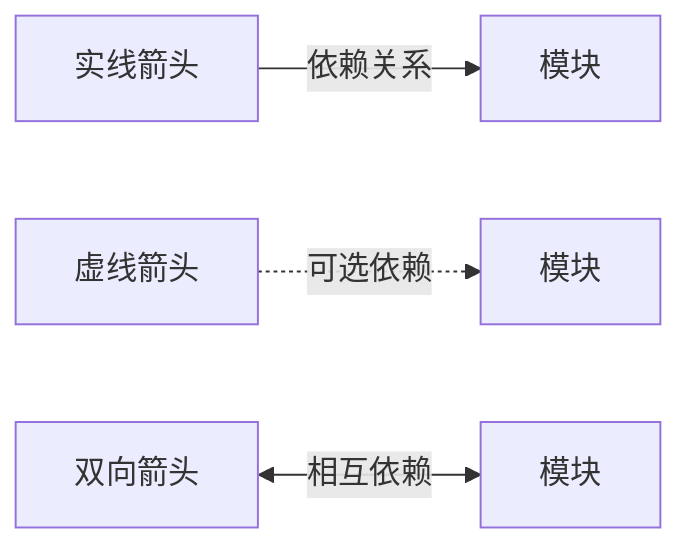

---

<div align="center">

**📖 文档版本**：v1.0.0  
**📅 最后更新**：2026-02-16  
**✍️ 维护团队**：EvoX Team

如有问题或建议，欢迎提交 [Issue](https://github.com/your-org/evox/issues)

</div>
