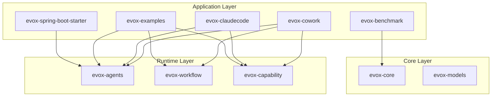

# 应用层 (Application Layer)

应用层是 EvoX 框架的顶层，提供了开箱即用的应用程序、开发工具、集成组件以及丰富的示例代码。这些模块展示了如何利用 EvoX 的核心能力（Core）和运行时（Runtime）构建复杂的智能体应用。

## 📦 模块概览

本目录包含以下核心子模块：

| 模块名称 | 目录 | 说明 | 核心特性 |
|:--------|:-----|:-----|:---------|
| **EvoX Cowork** | [evox-cowork](./evox-cowork) | 智能知识工作桌面应用 | JavaFX 桌面客户端、Spring Boot 后端、SSE 实时流、插件系统、多 Agent 协作 |
| **EvoX ClaudeCode** | [evox-claudecode](./evox-claudecode) | 交互式编码 CLI 工具 | 终端 REPL、文件/Shell/Git 操作、代码搜索、项目感知、类似 Claude Code 体验 |
| **EvoX Benchmark** | [evox-benchmark](./evox-benchmark) | 标准化性能基准测试集 | GSM8K (数学), HumanEval (代码), MBPP (Python), HotpotQA (多跳问答) |
| **EvoX Examples** | [evox-examples](./evox-examples) | 全面的功能示例库 | 基础 ChatBot、RAG 检索增强、工具调用、工作流编排、记忆机制演示 |
| **Spring Boot Starter** | [evox-spring-boot-starter](./evox-spring-boot-starter) | Spring Boot 快速集成 | 零配置启动、自动装配 LLM/Agent/Memory、YAML 配置支持 |

## 🚀 快速指引

### 1. 想要集成到 Spring Boot 项目?

直接引入 Starter 依赖，快速获得 LLM 和 Agent 能力：

```xml
<dependency>
    <groupId>io.leavesfly</groupId>
    <artifactId>evox-spring-boot-starter</artifactId>
    <version>${evox.version}</version>
</dependency>
```

### 2. 想要体验完整的 Agent 应用?

- **桌面端**: 尝试 [evox-cowork](./evox-cowork)，体验类似 OpenWork 的桌面智能助手。
- **命令行**: 尝试 [evox-claudecode](./evox-claudecode)，体验终端里的结对编程助手。

### 3. 想要学习如何使用框架?

查看 [evox-examples](./evox-examples) 中的代码：
- **入门**: `SimpleChatBot`, `MemoryBasicsExample`
- **进阶**: `ToolsExample`, `RagQuickStartExample`
- **高阶**: `WorkflowDemo`, `ComprehensiveChatBot`

### 4. 想要评估模型能力?

使用 [evox-benchmark](./evox-benchmark) 运行标准化测试：

```bash
cd evox-benchmark
mvn test -Dtest=GSM8KTest
```

## 🏗️ 依赖关系

应用层模块主要依赖于 `evox-core` (核心抽象) 和 `evox-runtime` (Agent/Workflow/Capability 实现)。



---
*更多详细文档请点击上方表格中的模块链接查看。*